# ICE24 OS — App Flow Specification

> **Confidencial.** Información propiedad intelectual de ICE24 MX. Su reproducción total o parcial requiere autorización escrita.

## Control del documento

| Campo | Valor |
|---|---|
| Proyecto | ICE24 OS |
| Documento | AppFlow.md — Especificación de navegación y flujos de aplicación |
| Versión | 1.0 |
| Fecha | Agosto de 2026 |
| Propietario | ICE24 MX |
| Estado | Propuesta funcional para validación de producto, UX/UI, arquitectura, ingeniería y calidad |
| Fuentes principales | ICE24 OS — PRD v1.0 e ICE24 OS — UI/UX Specification v1.0 |
| Mercado inicial | México |
| Idioma inicial | Español |
| Plataformas | PWA privada, portal público responsivo y experiencias de campo con offline controlado |

## 1. Propósito

Este documento define cómo navegan los usuarios por ICE24 OS y cómo avanzan los procesos entre pantallas, estados, decisiones, validaciones y resultados. Su objetivo es convertir los requisitos del PRD y la arquitectura de información de UI/UX en una especificación navegable que pueda utilizarse para:

- diseñar prototipos de alta fidelidad;
- definir rutas y jerarquías de interfaz;
- alinear frontend, backend y control de permisos;
- derivar pruebas funcionales y de navegación;
- identificar variantes, bloqueos, errores y recuperación;
- mantener consistencia entre escritorio, tableta, móvil y modo offline;
- evitar transiciones de estado implícitas o no auditables.

El documento no amplía el alcance funcional del PRD. Las decisiones de interacción no definidas expresamente por la fuente se presentan como **propuesta de flujo** y deberán validarse durante la Etapa 0.

## 2. Alcance del App Flow

### 2.1 Superficies cubiertas

1. **Aplicación privada ICE24 OS** para personal ICE24, propietarios, administradores, encargados, operadores, técnicos, responsables sanitarios, negocios y repartidores.
2. **PWA de campo** con operación offline controlada para técnicos, operadores y repartidores.
3. **Portal público por equipo** accesible mediante QR, limitado a información publicada.
4. **Modo demo** con datos ficticios y vigencia temporal.
5. **Modo lectura** derivado del estado de suscripción.

### 2.2 Procesos cubiertos

- autenticación, recuperación, 2FA, sesiones y cambio de contexto;
- alertas y priorización del trabajo;
- cuentas, sucursales, usuarios, permisos y asociaciones;
- alta, validación, traslado, transferencia y expediente de máquina;
- modelos, plantillas, sistemas y componentes;
- mantenimiento, tickets y órdenes de trabajo;
- bitácoras sanitarias, laboratorio, no conformidades y restricciones;
- inventario, refacciones y componentes instalados o retirados;
- documentos, versiones, reportes, exportaciones y publicación;
- portal público y QR;
- ventas importadas, tarjetas y movimientos administrativos;
- negocios, productos, pedidos, repartidores y entregas;
- suscripción, demo, pago rechazado y reactivación;
- auditoría, tareas asíncronas, offline, sincronización y conflictos.

### 2.3 Fuera de alcance

- interacción física con la máquina vending;
- control remoto de hardware;
- plataforma Brain;
- plataforma externa de capacitación;
- timbrado fiscal;
- pago de pedidos de hielo dentro de ICE24 OS;
- automatización inicial de alertas por WhatsApp;
- integración API automática con la aplicación original de la máquina.

## 3. Principios rectores del flujo

| ID | Principio | Aplicación en navegación y estados |
|---|---|---|
| FL-01 | Contexto explícito | Cuenta, rol, sucursal y máquina activas deben ser visibles antes de ejecutar acciones. |
| FL-02 | Permisos antes que visibilidad | La navegación solo muestra destinos autorizados y no revela recursos de otras cuentas. |
| FL-03 | Transiciones críticas explícitas | Aprobar, restringir, reactivar, publicar, tomar, cerrar, anular y transferir requieren comandos y confirmaciones específicas. |
| FL-04 | Estado y publicación separados | Completar o corregir un registro no lo hace público automáticamente. |
| FL-05 | Trazabilidad permanente | Correcciones, anulaciones y cambios sensibles solicitan motivo y conservan historial. |
| FL-06 | Offline limitado | Solo se ejecutan offline actividades descargadas y previamente asignadas. |
| FL-07 | No sobrescritura silenciosa | Los conflictos conservan ambas versiones y se envían a resolución. |
| FL-08 | Reanudación segura | Los borradores, tareas asíncronas y pendientes de sincronización pueden retomarse. |
| FL-09 | Sin datos no equivale a cumplimiento | Estados vacíos, no evaluables, pendientes y no conformes se distinguen. |
| FL-10 | Riesgo primero | Alertas críticas y restricciones aparecen antes que indicadores favorables. |
| FL-11 | Navegación por rol | Cada perfil recibe destinos prioritarios sin perder acceso autorizado al resto. |
| FL-12 | Acciones idempotentes | Reintentos no deben duplicar pedidos, cierres, cargas, pagos ni sincronizaciones. |

## 4. Actores y contextos de navegación

| Actor | Inicio predeterminado | Contexto requerido | Flujos prioritarios |
|---|---|---|---|
| Superadministrador ICE24 | Panel global | Organización ICE24 | Cuentas, demos, suscripciones, seguridad, auditoría. |
| Administrador técnico ICE24 | Validaciones técnicas | Organización ICE24 / cuenta / máquina | Equipos, plantillas, mantenimiento, restricciones técnicas. |
| Administrador sanitario ICE24 | Alertas sanitarias | Organización ICE24 / cuenta / máquina | Plantillas sanitarias, laboratorio, restricciones, publicación. |
| Personal ICE24 | Bandeja de soporte | Organización ICE24 | Búsqueda, cuentas, solicitudes y seguimiento autorizado. |
| Propietario principal | Resumen de cuenta | Cuenta titular | Máquinas, alertas, usuarios, inventario, reportes, comercial. |
| Administrador del cliente | Resumen delegado | Cuenta y ámbitos asignados | Operación permitida por rol y permisos. |
| Encargado de sucursal | Resumen de sucursal | Cuenta y sucursal | Pendientes, máquinas, incidencias y actividades locales. |
| Operador | Tareas del día | Cuenta, sucursal o máquina | Bitácoras, mediciones, incidencias, evidencias y sincronización. |
| Técnico | Órdenes asignadas | Cuenta y máquinas autorizadas | Órdenes, checklist, componentes, evidencia y offline. |
| Responsable sanitario | Resumen sanitario | Cuenta y máquinas autorizadas | Bitácoras, laboratorio, no conformidades y acciones correctivas. |
| Repartidor | Pedidos disponibles | Relación repartidor–máquina | Disponibilidad, toma, recolección, entrega y sincronización. |
| Administrador de negocio | Inicio del negocio | Negocio consumidor | Sucursales, usuarios, máquinas asociadas y pedidos. |
| Usuario de restaurante | Nuevo pedido / pedidos | Negocio y sucursal consumidora | Crear pedido y consultar seguimiento. |
| Auditor interno | Auditoría / reportes | Ámbito autorizado | Consulta de registros, documentos y reportes. |
| Público | Portal del equipo | Código ICE24 OS | Consulta de contenido publicado y descargas públicas. |

## 5. Arquitectura general de navegación

### 5.1 Jerarquía de información

```text
Cuenta titular
├── Sucursales
│   ├── Máquinas
│   │   ├── Expediente
│   │   ├── Sistemas y componentes
│   │   ├── Mantenimiento
│   │   ├── Sanidad y laboratorio
│   │   ├── Inventario instalado
│   │   ├── Documentos y publicaciones
│   │   ├── Ventas y tarjetas
│   │   ├── Pedidos y reparto
│   │   ├── Reportes
│   │   └── Auditoría
│   └── Inventario local
├── Usuarios y permisos
├── Inventario general
├── Negocios asociados
├── Repartidores
├── Reportes globales
├── Suscripción
└── Configuración
```

### 5.2 Mapa global de navegación privada

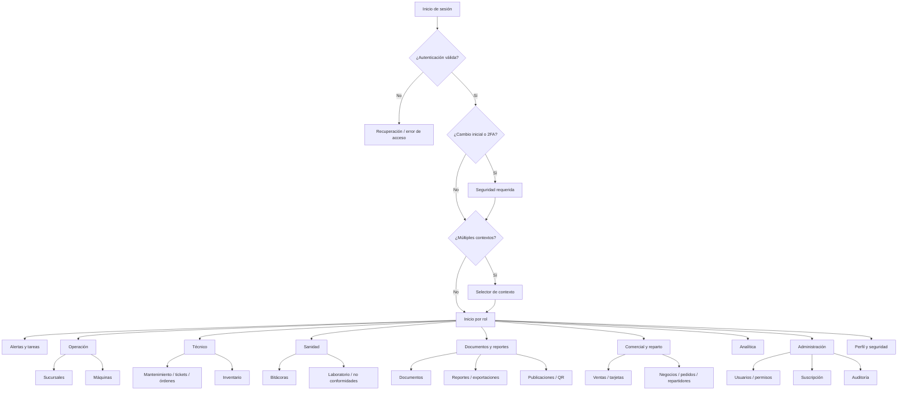
```mermaid
flowchart TD
    LOGIN[Inicio de sesión] --> AUTH{¿Autenticación válida?}
    AUTH -- No --> REC[Recuperación / error de acceso]
    AUTH -- Sí --> FIRST{¿Cambio inicial o 2FA?}
    FIRST -- Sí --> SEC[Seguridad requerida]
    FIRST -- No --> CTX{¿Múltiples contextos?}
    SEC --> CTX
    CTX -- Sí --> SELECT[Selector de contexto]
    CTX -- No --> HOME[Inicio por rol]
    SELECT --> HOME

    HOME --> ALERTS[Alertas y tareas]
    HOME --> OPS[Operación]
    HOME --> TECH[Técnico]
    HOME --> SAN[Sanidad]
    HOME --> DOCS[Documentos y reportes]
    HOME --> COM[Comercial y reparto]
    HOME --> ANA[Analítica]
    HOME --> ADMIN[Administración]
    HOME --> PROFILE[Perfil y seguridad]

    OPS --> BRANCH[Sucursales]
    OPS --> MACHINE[Máquinas]
    TECH --> MAINT[Mantenimiento / tickets / órdenes]
    TECH --> INV[Inventario]
    SAN --> LOGS[Bitácoras]
    SAN --> LAB[Laboratorio / no conformidades]
    DOCS --> FILES[Documentos]
    DOCS --> REPORTS[Reportes / exportaciones]
    DOCS --> PUBLIC[Publicaciones / QR]
    COM --> SALES[Ventas / tarjetas]
    COM --> ORDERS[Negocios / pedidos / repartidores]
    ADMIN --> USERS[Usuarios / permisos]
    ADMIN --> SUB[Suscripción]
    ADMIN --> AUDIT[Auditoría]
```

### 5.3 Navegación por dispositivo

| Elemento | Escritorio | Tableta | Móvil |
|---|---|---|---|
| Navegación global | Barra lateral persistente o colapsable. | Barra lateral superpuesta o compacta. | Barra inferior con máximo cinco destinos y menú “Más”. |
| Contexto | Selector visible en encabezado. | Selector compacto. | Selector desplegable desde encabezado. |
| Breadcrumbs | Ruta completa. | Ruta reducida. | Botón regresar + título; ruta completa en menú. |
| Acciones de página | Encabezado y menú secundario. | Encabezado compacto. | Acción primaria fija cuando el flujo lo requiere. |
| Detalle | Tabs o secciones laterales. | Tabs desplazables. | Secciones apiladas y navegación local. |
| Tablas | Tabla completa con filtros. | Columnas prioritarias. | Tarjetas o filas expandibles. |
| Formularios | Una o dos columnas. | Una columna o panel lateral. | Una columna, guardado progresivo. |

### 5.4 Navegación especializada por rol

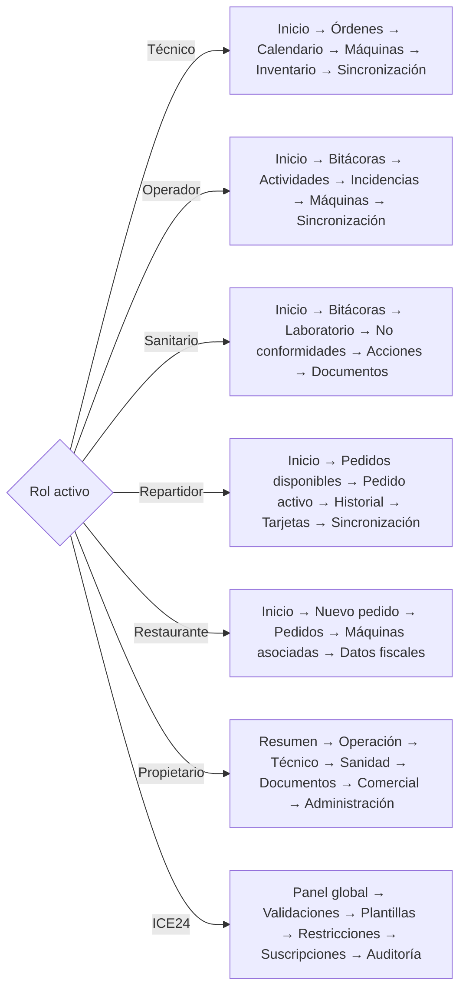
```mermaid
flowchart LR
    ROLE{Rol activo}
    ROLE -->|Técnico| T[Inicio → Órdenes → Calendario → Máquinas → Inventario → Sincronización]
    ROLE -->|Operador| O[Inicio → Bitácoras → Actividades → Incidencias → Máquinas → Sincronización]
    ROLE -->|Sanitario| S[Inicio → Bitácoras → Laboratorio → No conformidades → Acciones → Documentos]
    ROLE -->|Repartidor| D[Inicio → Pedidos disponibles → Pedido activo → Historial → Tarjetas → Sincronización]
    ROLE -->|Restaurante| R[Inicio → Nuevo pedido → Pedidos → Máquinas asociadas → Datos fiscales]
    ROLE -->|Propietario| P[Resumen → Operación → Técnico → Sanidad → Documentos → Comercial → Administración]
    ROLE -->|ICE24| I[Panel global → Validaciones → Plantillas → Restricciones → Suscripciones → Auditoría]
```

## 6. Reglas globales de navegación

### 6.1 Selector de contexto

El selector aparece cuando una identidad tiene más de una relación autorizada. Debe mostrar:

- cuenta activa;
- rol o relación activa;
- sucursal o máquina fijada, cuando exista;
- estado de suscripción del contexto;
- pendientes offline asociados con el contexto actual.

Al cambiar de contexto:

1. se valida si existen cambios locales sin sincronizar;
2. se bloquea el cambio o se solicita una decisión segura cuando los datos locales podrían perderse;
3. se recalculan permisos y navegación;
4. se descartan filtros que no sean válidos;
5. se conserva la identidad sin volver a iniciar sesión;
6. se registra el cambio cuando sea un evento de seguridad o auditoría requerido.

### 6.2 Acceso directo y deep links

- Un enlace privado debe validar sesión, contexto y permiso antes de abrir el recurso.
- Si la sesión es válida pero el contexto no coincide, el sistema puede solicitar cambiar de contexto.
- Si el usuario no tiene permiso, se muestra un estado 403 sin revelar metadatos protegidos.
- Un enlace público por QR no debe redirigir a la aplicación privada.
- Un recurso retirado o sustituido debe mostrar su estado actual y, cuando corresponda, enlazar la versión vigente autorizada.

### 6.3 Regreso, cancelación y abandono

- “Regresar” conserva filtros, posición y contexto cuando sea seguro.
- “Cancelar” en un formulario no elimina automáticamente un borrador ya guardado.
- Salir con cambios no guardados presenta confirmación.
- Salir con cambios guardados localmente y no sincronizados muestra su impacto.
- Las tareas asíncronas continúan al abandonar la pantalla y permanecen visibles en historial o centro de tareas.

### 6.4 Acciones sensibles

Las siguientes acciones requieren pantalla o modal de confirmación con impacto, motivo y resumen:

- aprobar o rechazar una máquina;
- transferir o retirar una máquina;
- corregir o anular un registro;
- aplicar o levantar una restricción;
- reactivar después de una no conformidad;
- publicar, retirar o sustituir contenido;
- ajustar inventario;
- anular una importación;
- cancelar una suscripción;
- cerrar sesiones;
- resolver un conflicto offline;
- exportar información completa.

## 7. Inventario maestro de pantallas

### 7.1 Acceso, inicio y alertas

| ID | Pantalla | Entrada principal | Salidas principales |
|---|---|---|---|
| UI-AUTH-01 | Inicio de sesión | Acceso privado | Cambio de contraseña, 2FA, contexto o inicio. |
| UI-AUTH-02 | Cambio obligatorio de contraseña | Credencial temporal | 2FA/contexto/inicio. |
| UI-AUTH-03 | Recuperar contraseña | “Olvidé mi contraseña” | Confirmación de correo o soporte manual. |
| UI-AUTH-04 | Verificación 2FA | Usuario con 2FA | Contexto o inicio. |
| UI-AUTH-05 | Selector de contexto | Login o encabezado | Inicio del contexto. |
| UI-AUTH-06 | Sesiones y seguridad | Perfil | Cerrar sesión individual/global autorizada. |
| UI-AUTH-07 | Acceso revocado o sesión expirada | Error de sesión | Reingresar o contactar ICE24. |
| UI-HOME-01 | Resumen de propietario | Inicio por rol | Alertas, máquinas, pendientes, reportes. |
| UI-HOME-02 | Resumen ICE24 global | Inicio por rol | Cuentas, validaciones, restricciones, suscripciones. |
| UI-HOME-03 | Inicio técnico | Inicio por rol | Órdenes, calendario, sincronización. |
| UI-HOME-04 | Inicio operador | Inicio por rol | Bitácoras, actividades, incidencias. |
| UI-HOME-05 | Inicio sanitario | Inicio por rol | Bitácoras, análisis, no conformidades. |
| UI-HOME-06 | Inicio repartidor | Inicio por rol | Pedidos disponibles/activo. |
| UI-HOME-07 | Inicio restaurante | Inicio por rol | Nuevo pedido, historial, máquinas asociadas. |
| UI-ALT-01 | Centro de alertas | Campana / resumen | Detalle de alerta. |
| UI-ALT-02 | Detalle de alerta | Centro / enlace de correo | Enterado, actividad relacionada, resolución. |
| UI-ALT-03 | Configuración de avisos | Administración | Guardar preferencias permitidas. |

### 7.2 Organización, equipos y configuración maestra

| ID | Pantalla | Función |
|---|---|---|
| UI-ACC-01 | Datos de cuenta | Identidad, contacto, fiscal, zona horaria y módulos. |
| UI-BRA-01 | Lista de sucursales | Consultar y filtrar ubicaciones. |
| UI-BRA-02 | Detalle de sucursal | Máquinas, almacén, usuarios y actividad. |
| UI-BRA-03 | Crear/editar sucursal | Captura de campos autorizados. |
| UI-MAC-01 | Lista de máquinas | Estados operativo, técnico y sanitario. |
| UI-MAC-02 | Expediente de máquina | Hub de todos los dominios del equipo. |
| UI-MAC-03 | Solicitud de alta | Flujo por pasos. |
| UI-MAC-04 | Validación ICE24 | Revisión, faltantes, aprobación o rechazo. |
| UI-MAC-05 | Historial de ubicaciones | Línea de tiempo de traslados. |
| UI-MAC-06 | Transferencia | Propiedad e información comercial opcional. |
| UI-MAC-07 | Etiquetas y QR | Generación y vista previa. |
| UI-TPL-01 | Catálogo de modelos | Modelos y versiones. |
| UI-TPL-02 | Detalle de plantilla | Sistemas, componentes y actividades. |
| UI-TPL-03 | Editor de plantilla | Configuración maestra ICE24. |
| UI-TPL-04 | Comparar versiones | Cambios y máquinas afectadas. |
| UI-CMP-01 | Catálogo de componentes | Compatibilidad, vida útil y mantenimiento. |

### 7.3 Control técnico, sanitario y documental

| ID | Pantalla | Función |
|---|---|---|
| UI-MNT-01 | Calendario de mantenimiento | Programado, próximo, vencido y crítico. |
| UI-MNT-02 | Lista de actividades | Filtros por estado, máquina y responsable. |
| UI-TKT-01 | Crear ticket | Reportar incidencia. |
| UI-TKT-02 | Detalle de ticket | Diagnóstico, asignación y seguimiento. |
| UI-WO-01 | Lista de órdenes | Asignadas, descargadas y pendientes. |
| UI-WO-02 | Ejecutar orden | Checklist, diagnóstico, piezas y evidencia. |
| UI-WO-03 | Cierre de orden | Resumen, confirmación y resultado. |
| UI-WO-04 | Corrección/anulación | Motivo y comparación de versiones. |
| UI-SAN-01 | Resumen sanitario | Estado, controles y vencimientos. |
| UI-SAN-02 | Lista de bitácoras | Pendientes, vencidas y completas. |
| UI-SAN-03 | Capturar bitácora dinámica | Campos, límites y evidencia. |
| UI-LAB-01 | Lista de análisis | Vigencia y resultado. |
| UI-LAB-02 | Registrar análisis | Identificación, parámetros y PDF. |
| UI-LAB-03 | Detalle de análisis | Parámetros, documento y seguimiento. |
| UI-NC-01 | No conformidades | Riesgo, responsables y estado. |
| UI-NC-02 | Acción correctiva | Actividades, evidencia y cierre. |
| UI-RES-01 | Restricción | Aplicación, impacto y condiciones. |
| UI-REA-01 | Reactivación | Formulario, evidencia y aceptación. |
| UI-INV-01 | Resumen de inventario | Existencias, mínimos y caducidad. |
| UI-INV-02 | Producto de inventario | Lotes, compatibilidad y movimientos. |
| UI-INV-03 | Registrar movimiento | Entrada, salida, transferencia o ajuste. |
| UI-INV-04 | Pieza instalada/retirada | Ciclo de vida del componente. |
| UI-INV-05 | Solicitud de refacciones | Carrito y mensaje de WhatsApp. |
| UI-DOC-01 | Repositorio de documentos | Búsqueda, filtros y visibilidad. |
| UI-DOC-02 | Cargar documento | Archivo, metadatos y relaciones. |
| UI-DOC-03 | Detalle y versiones | Original, pública, historial y descargas. |
| UI-DOC-04 | Publicar/retirar | Protección, vista previa y confirmación. |

### 7.4 Resultados, comercial y gobierno

| ID | Pantalla | Función |
|---|---|---|
| UI-RPT-01 | Catálogo de reportes | Predeterminados y personalizados. |
| UI-RPT-02 | Constructor de reporte | Periodo, ámbito, secciones y privacidad. |
| UI-RPT-03 | Vista previa | Validación antes de generar. |
| UI-RPT-04 | Historial de generaciones | Estado, archivo y descarga. |
| UI-RPT-05 | Programaciones | Frecuencia y destinatarios. |
| UI-EXP-01 | Exportación completa | Solicitud, preparación, descarga y expiración. |
| UI-PUB-01 | Gestión de publicación | Contenido visible por equipo. |
| UI-ANA-01 | Panel de indicadores | Técnico, sanitario, operativo y comercial. |
| UI-SAL-01 | Importaciones de ventas | Historial y estado de archivos. |
| UI-SAL-02 | Cargar Excel | Selección de máquina y archivo. |
| UI-SAL-03 | Vista previa de importación | Nuevos, duplicados y errores. |
| UI-SAL-04 | Panel de ventas | Análisis por fecha, hora, producto y pago. |
| UI-CARD-01 | Tarjetas | Folio, máquina y titular. |
| UI-CARD-02 | Detalle de tarjeta | Movimientos administrativos. |
| UI-CARD-03 | Registrar movimiento | Recarga, retiro, transferencia o reasignación. |
| UI-BIZ-01 | Negocios consumidores | Lista y asociaciones. |
| UI-BIZ-02 | Detalle de negocio | Sucursales, usuarios y máquinas. |
| UI-PROD-01 | Productos y precios | Catálogo y disponibilidad por máquina. |
| UI-ORD-01 | Pedidos | Lista, estados y responsables. |
| UI-ORD-02 | Crear pedido | Máquina, producto, tarifa y total. |
| UI-DRV-01 | Repartidores | Estado y asociaciones. |
| UI-DRV-02 | Pedido disponible | Evaluación y toma atómica. |
| UI-DRV-03 | Ejecución de entrega | Recolección, ruta, entrega y evidencia. |
| UI-ADM-01 | Panel global ICE24 | Gobierno de cuentas y riesgos. |
| UI-ADM-02 | Validaciones | Solicitudes y faltantes. |
| UI-ADM-03 | Restricciones globales | Técnicas y sanitarias. |
| UI-ADM-04 | Suscripciones | Stripe, rechazos y reactivaciones. |
| UI-USR-01 | Usuarios | Asociaciones, roles, sesiones y estado. |
| UI-PER-01 | Matriz de permisos | Ámbito, módulo, acción y sensibilidad. |
| UI-AUD-01 | Auditoría | Filtros y detalle inmutable. |
| UI-SYNC-01 | Conflictos offline | Comparación y resolución. |

## 8. Catálogo de estados

### 8.1 Estados de negocio

| Entidad | Estados principales | Regla de navegación |
|---|---|---|
| Solicitud de equipo | Borrador → Enviada → En revisión → Información faltante → Validada/Rechazada → Activa | Cada estado habilita acciones específicas y bloquea edición total después de envío, salvo atención de faltantes. |
| Mantenimiento | Programado → Próximo → En atención → Completado/Con observaciones → Vencido/No conforme → Corregido/Anulado | Vencido no desaparece por reprogramar; cierre exige datos y evidencia requeridos. |
| Documento | Borrador → Pendiente de revisión → Completado/No conforme → Corregido/Anulado | La versión operativa no controla automáticamente la visibilidad pública. |
| Publicación | Privado → Pendiente → Publicado → Retirado/Sustituido | Publicar y retirar son acciones deliberadas y auditadas. |
| Pedido | Creado → Disponible → Tomado → Recogiendo → Recogido → En ruta → Entregado → Cerrado | La toma requiere conexión y es atómica; ejecución posterior puede continuar offline. |
| Pedido alterno | Cancelado, Liberado, Parcial, No entregado, Con incidencia | Requiere motivo y reglas según el punto de avance. |
| Alerta | No leída → Leída → Enterado → En atención → Resuelta | “Enterado” no resuelve la condición. |
| Suscripción | Demo → Pendiente → Activa → Pago rechazado → Modo lectura → Cancelación programada/Cancelada → Reactivada | Pago rechazado bloquea escritura inmediatamente. |
| Exportación | Solicitada → Preparando → Disponible → Descargada → Expirada/Error | Disponible por siete días; error no debe bloquear el resto del sistema. |
| Sincronización | Pendiente → Sincronizando → Cargada → Error → Conflicto → Resuelta | Conflicto requiere revisión autorizada. |

### 8.2 Estados independientes de máquina

| Dimensión | Estados | Efecto en flujos |
|---|---|---|
| Operativo | Disponible, Apagada, En mantenimiento, Fuera de servicio, Suspendida, Retirada | Determina disponibilidad general y elegibilidad para pedidos. |
| Técnico | Óptimo, Atención preventiva, Atención requerida, Crítico | Prioriza mantenimiento, tickets y restricciones técnicas. |
| Sanitario | Al día, Próximo a vencer, Atención requerida, Acción correctiva, Restringido | Prioriza controles sanitarios y puede bloquear pedidos. |
| Publicación | Privado, Pendiente, Publicado, Retirado, Sustituido | Controla únicamente lo que ve el público. |

### 8.3 Estados transversales de interfaz

| Estado UI | Comportamiento |
|---|---|
| Cargando | Skeleton o progreso sin bloquear módulos no relacionados. |
| Sin cambios | No se muestra acción de guardado activa. |
| Cambios sin guardar | Advertencia al abandonar. |
| Guardando | Acción temporalmente protegida contra doble envío. |
| Guardado | Confirmación con hora local. |
| Guardado localmente | Disponible offline, pendiente de sincronización. |
| Pendiente asíncrono | Puede abandonarse la pantalla y consultar progreso posteriormente. |
| Modo lectura | Consulta y descarga permitidas; creación y edición bloqueadas. |
| Sin permiso | No se revela contenido protegido. |
| Recurso archivado/retirado | Solo lectura con explicación y acceso a historial autorizado. |
| Conflicto | Comparación obligatoria antes de continuar. |
| Sin conexión | Solo funciones previamente descargadas y permitidas. |

## 9. Flujo 1 — Autenticación, seguridad y cambio de contexto

### 9.1 Objetivo

Permitir que una identidad única ingrese, complete requisitos de seguridad y acceda al contexto correcto conforme a sus asociaciones y permisos.

### 9.2 Pantallas

`UI-AUTH-01` → `UI-AUTH-02` o `UI-AUTH-04` → `UI-AUTH-05` → inicio por rol.

### 9.3 Precondiciones

- La cuenta y el usuario fueron creados o asociados por ICE24 o por un propietario autorizado.
- El usuario tiene correo o nombre de usuario único.
- La cuenta no fue eliminada; puede estar activa, demo, modo lectura o cancelada.

### 9.4 Flujo principal

1. El usuario abre la aplicación privada.
2. Captura correo o nombre de usuario y contraseña.
3. El sistema valida credenciales y estado del usuario.
4. Si utiliza contraseña temporal, dirige a cambio obligatorio.
5. Si activó 2FA, solicita el segundo factor.
6. El sistema determina asociaciones y contextos autorizados.
7. Si existe un contexto, abre el inicio correspondiente.
8. Si existen varios, muestra el selector de contexto.
9. El usuario elige cuenta, relación y ámbito.
10. Se carga navegación, permisos, alertas y estado de suscripción.

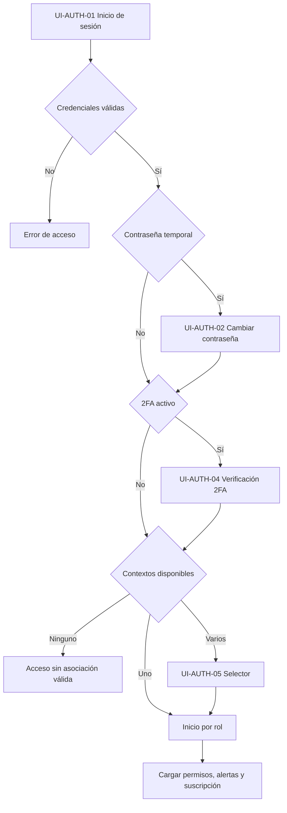
```mermaid
flowchart TD
    A[UI-AUTH-01 Inicio de sesión] --> B{Credenciales válidas}
    B -- No --> E1[Error de acceso]
    B -- Sí --> C{Contraseña temporal}
    C -- Sí --> D[UI-AUTH-02 Cambiar contraseña]
    C -- No --> F{2FA activo}
    D --> F
    F -- Sí --> G[UI-AUTH-04 Verificación 2FA]
    F -- No --> H{Contextos disponibles}
    G --> H
    H -- Ninguno --> E2[Acceso sin asociación válida]
    H -- Uno --> I[Inicio por rol]
    H -- Varios --> J[UI-AUTH-05 Selector]
    J --> I
    I --> K[Cargar permisos, alertas y suscripción]
```

### 9.5 Flujos alternativos

- **Recuperación por correo:** desde `UI-AUTH-01` se abre `UI-AUTH-03`, se envía enlace temporal y se regresa al acceso.
- **Pérdida de acceso al correo:** se informa que ICE24 realizará verificación manual; no se restablece automáticamente.
- **Cuenta demo:** se muestra vigencia y datos ficticios antes de entrar.
- **Cuenta en modo lectura:** se permite el ingreso y se presenta barra persistente.
- **Cambio de contexto desde la sesión:** abre `UI-AUTH-05` sin cerrar sesión.
- **Sesión ya abierta:** el sistema puede reanudar el último contexto válido si no existen cambios de permisos o seguridad.

### 9.6 Casos de error

| Caso | Resultado |
|---|---|
| Credenciales incorrectas | Mensaje genérico sin revelar qué dato falló. |
| Usuario desactivado | Acceso bloqueado y canal de soporte. |
| Sesión expirada | Reingreso; se conserva borrador local seguro cuando corresponda. |
| 2FA inválido o vencido | Permitir nuevo intento controlado. |
| Contexto revocado | Regresar al selector y retirar el destino de navegación. |
| Demasiados intentos | Bloqueo temporal conforme a seguridad, sin exponer reglas internas. |
| Cambios offline pendientes al cambiar contexto | Advertir, sincronizar o cancelar el cambio. |

## 10. Flujo 2 — Inicio, alertas y priorización

### 10.1 Objetivo

Mostrar al usuario el trabajo relevante de su contexto y permitir que atienda primero riesgos críticos, vencimientos y tareas asignadas.

### 10.2 Pantallas

Inicio por rol (`UI-HOME-01` a `UI-HOME-07`) → `UI-ALT-01` → `UI-ALT-02` → actividad relacionada.

### 10.3 Flujo principal

1. El sistema carga el contexto y sus permisos.
2. Muestra alertas críticas fijadas antes de indicadores favorables.
3. Presenta tareas, vencimientos, máquinas y actividad reciente aplicable al rol.
4. El usuario abre una alerta.
5. La alerta pasa de No leída a Leída.
6. El usuario puede marcar Enterado.
7. Desde el detalle navega a orden, ticket, análisis, restricción, pago u otra entidad relacionada.
8. La alerta pasa a En atención cuando existe actividad vinculada.
9. Solo cambia a Resuelta cuando la condición subyacente se cierra con evidencia.

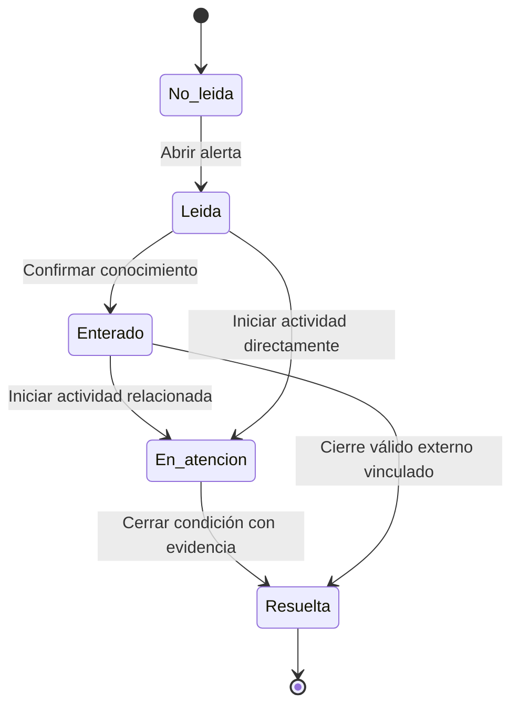
```mermaid
stateDiagram-v2
    [*] --> No_leida
    No_leida --> Leida: Abrir alerta
    Leida --> Enterado: Confirmar conocimiento
    Enterado --> En_atencion: Iniciar actividad relacionada
    Leida --> En_atencion: Iniciar actividad directamente
    En_atencion --> Resuelta: Cerrar condición con evidencia
    Enterado --> Resuelta: Cierre válido externo vinculado
    Resuelta --> [*]
```

### 10.4 Flujos alternativos

- El usuario abre directamente la entidad desde correo; el sistema valida contexto y permiso.
- Un propietario agrega avisos adicionales sin eliminar escalamientos mínimos de ICE24.
- Una alerta informativa puede resolverse automáticamente si la condición deja de existir y la regla lo permite; las críticas conservan trazabilidad.
- Una alerta puede corresponder a múltiples destinatarios con estados de lectura independientes.

### 10.5 Casos de error

- Entidad relacionada retirada: mostrar alerta y estado actual sin enlace roto.
- Usuario sin permiso sobre la entidad: mostrar información mínima de la alerta y escalar al responsable correcto.
- Fallo de correo: mantener la alerta interna y marcar entrega de correo como pendiente o fallida.
- Doble confirmación de Enterado: operación idempotente.
- Condición resuelta mientras la pantalla está abierta: actualizar estado y evitar acciones obsoletas.

## 11. Flujo 3 — Cuenta, sucursal, usuarios y permisos

### 11.1 Objetivo

Configurar la estructura organizacional, asociar identidades existentes y controlar acceso por cuenta, sucursal, máquina, módulo, acción y sensibilidad.

### 11.2 Flujo de sucursal

1. Propietario abre `UI-BRA-01`.
2. Selecciona “Crear sucursal”.
3. Captura nombre, dirección, coordenadas, zona horaria, horario y teléfono público.
4. Configura información opcional autorizada.
5. Revisa resumen y guarda.
6. El sistema crea la sucursal y abre `UI-BRA-02`.

### 11.3 Flujo de usuario y asociación

1. Propietario abre `UI-USR-01`.
2. Captura correo o nombre de usuario.
3. El sistema verifica unicidad global.
4. Si la identidad existe, genera solicitud de asociación.
5. Si no existe, crea perfil con credencial temporal conforme a permisos.
6. Se asigna rol base, ámbitos y acciones en `UI-PER-01`.
7. Se revisa el resumen de acceso.
8. Se guarda y audita.

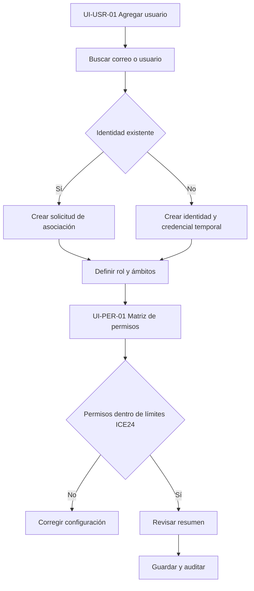
```mermaid
flowchart TD
    A[UI-USR-01 Agregar usuario] --> B[Buscar correo o usuario]
    B --> C{Identidad existente}
    C -- Sí --> D[Crear solicitud de asociación]
    C -- No --> E[Crear identidad y credencial temporal]
    D --> F[Definir rol y ámbitos]
    E --> F
    F --> G[UI-PER-01 Matriz de permisos]
    G --> H{Permisos dentro de límites ICE24}
    H -- No --> I[Corregir configuración]
    H -- Sí --> J[Revisar resumen]
    J --> K[Guardar y auditar]
```

### 11.4 Flujos alternativos

- Limitar al usuario a una o varias sucursales.
- Limitar acceso técnico o sanitario a máquinas específicas.
- Otorgar permiso especial de reactivación a un administrador.
- Desactivar una asociación sin eliminar la identidad global.
- Cerrar sesiones de usuarios de la cuenta.

### 11.5 Casos de error

- Correo o nombre de usuario duplicado: utilizar asociación, no crear duplicado.
- Propietario intenta cambiar el correo de otro usuario: bloquear y dirigir a proceso autorizado.
- Permiso fuera de los límites del rol: mostrar conflicto antes de guardar.
- Usuario intenta eliminar su propio acceso principal sin sustituto: bloquear conforme a regla de negocio pendiente de validación.
- Cambio de permisos concurrente: mostrar versión actual y solicitar recarga.

## 12. Flujo 4 — Alta, validación y activación de máquina

### 12.1 Objetivo

Crear el expediente permanente del equipo mediante solicitud del propietario y validación deliberada de ICE24.

### 12.2 Pantallas

`UI-MAC-01` → `UI-MAC-03` → `UI-ADM-02`/`UI-MAC-04` → `UI-MAC-02` → `UI-MAC-07`.

### 12.3 Flujo principal

1. Propietario inicia solicitud desde la lista de máquinas.
2. El flujo por pasos captura identidad, modelo declarado, serie, ubicación y capacidad.
3. Captura configuración, componentes, fotografías, manuales y mantenimiento previo.
4. Guarda borradores progresivamente.
5. Revisa datos y envía la solicitud.
6. La solicitud queda Enviada y bloquea edición estructural.
7. ICE24 abre la bandeja de validaciones.
8. Revisa documentos y decide el tipo de validación requerida.
9. Si cumple, asigna plantilla oficial.
10. Aprueba la solicitud.
11. El sistema genera Código ICE24 OS, expediente, sistemas, componentes, calendarios y etiquetas.
12. La máquina queda Activa y abre su expediente.

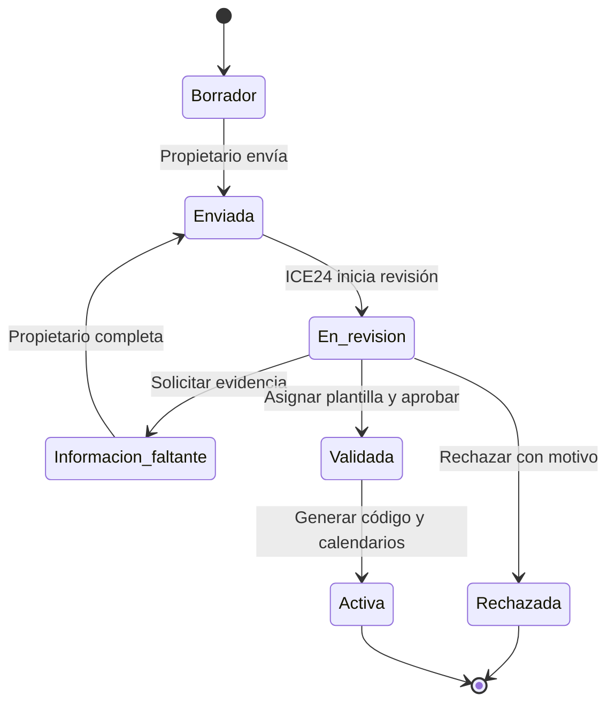
```mermaid
stateDiagram-v2
    [*] --> Borrador
    Borrador --> Enviada: Propietario envía
    Enviada --> En_revision: ICE24 inicia revisión
    En_revision --> Informacion_faltante: Solicitar evidencia
    Informacion_faltante --> Enviada: Propietario completa
    En_revision --> Rechazada: Rechazar con motivo
    En_revision --> Validada: Asignar plantilla y aprobar
    Validada --> Activa: Generar código y calendarios
    Rechazada --> [*]
    Activa --> [*]
```

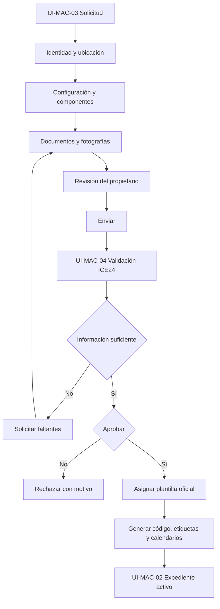
```mermaid
flowchart TD
    A[UI-MAC-03 Solicitud] --> B[Identidad y ubicación]
    B --> C[Configuración y componentes]
    C --> D[Documentos y fotografías]
    D --> E[Revisión del propietario]
    E --> F[Enviar]
    F --> G[UI-MAC-04 Validación ICE24]
    G --> H{Información suficiente}
    H -- No --> I[Solicitar faltantes]
    I --> D
    H -- Sí --> J{Aprobar}
    J -- No --> K[Rechazar con motivo]
    J -- Sí --> L[Asignar plantilla oficial]
    L --> M[Generar código, etiquetas y calendarios]
    M --> N[UI-MAC-02 Expediente activo]
```

### 12.4 Flujos alternativos

- ICE24 solicita fotografías adicionales.
- ICE24 solicita videollamada o visita técnica.
- Equipo externo se asocia con plantilla compatible validada.
- Equipo ICE24 utiliza marca comercial del cliente sin cambiar identidad técnica.
- Solicitud rechazada puede conservarse como historial y requerir una nueva solicitud o reapertura según decisión de producto.

### 12.5 Casos de error

- Serie duplicada o código ya existente: bloquear aprobación y escalar revisión.
- Archivo obligatorio faltante: impedir envío o marcar faltante según plantilla.
- Sucursal archivada durante la revisión: solicitar nueva ubicación válida.
- Plantilla eliminada o sustituida antes de aprobar: obligar a seleccionar versión vigente.
- Fallo parcial al generar calendarios: mantener estado de activación pendiente y permitir reintento idempotente.

## 13. Flujo 5 — Expediente, traslado y transferencia de máquina

### 13.1 Expediente de máquina

`UI-MAC-02` funciona como hub con navegación local a:

- resumen y tríada de estados;
- ubicación e historial;
- sistemas y componentes;
- mantenimiento;
- sanidad y laboratorio;
- inventario instalado;
- documentos y publicaciones;
- ventas, tarjetas y pedidos;
- reportes y auditoría.

### 13.2 Traslado

1. Usuario autorizado abre historial de ubicaciones.
2. Selecciona “Registrar traslado”.
3. Captura nueva sucursal, fecha efectiva y motivo.
4. Revisa impacto en zona horaria, responsables, inventario local, pedidos y actividades.
5. Confirma.
6. El sistema cierra el periodo anterior y abre el nuevo sin cambiar el Código ICE24 OS.

### 13.3 Transferencia

1. ICE24 abre `UI-MAC-06`.
2. Selecciona cuenta receptora y fecha efectiva.
3. El sistema separa historial técnico/sanitario obligatorio e información comercial opcional.
4. Se adjunta autorización documentada del propietario anterior cuando aplique.
5. Se revisan usuarios, publicaciones, tarjetas, clientes, recargas y pedidos afectados.
6. ICE24 confirma transferencia.
7. Se conserva código, serie, historial técnico y sanitario.
8. Se actualizan propiedad, permisos y contexto.

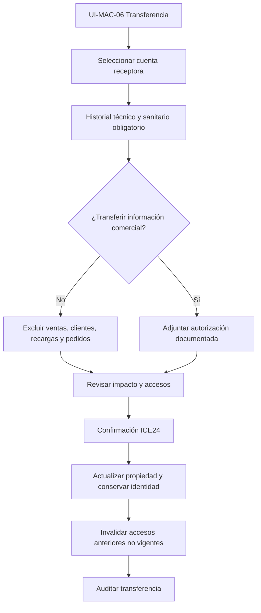
```mermaid
flowchart TD
    A[UI-MAC-06 Transferencia] --> B[Seleccionar cuenta receptora]
    B --> C[Historial técnico y sanitario obligatorio]
    C --> D{¿Transferir información comercial?}
    D -- No --> E[Excluir ventas, clientes, recargas y pedidos]
    D -- Sí --> F[Adjuntar autorización documentada]
    E --> G[Revisar impacto y accesos]
    F --> G
    G --> H[Confirmación ICE24]
    H --> I[Actualizar propiedad y conservar identidad]
    I --> J[Invalidar accesos anteriores no vigentes]
    J --> K[Auditar transferencia]
```

### 13.4 Casos de error

- Transferencia sin autorización comercial: permitir solo historial obligatorio.
- Cuenta receptora en estado no elegible: bloquear y explicar.
- Pedidos activos: requerir resolución antes de completar o aplicar regla pendiente.
- Componentes/inventario local inconsistentes: crear tareas de conciliación.
- Cambio concurrente de ubicación: bloquear mediante control de versión.

## 14. Flujo 6 — Plantillas, versiones y actividades futuras

### 14.1 Objetivo

Permitir que ICE24 administre modelos y plantillas oficiales versionadas sin modificar actividades históricas.

### 14.2 Flujo principal

1. ICE24 abre `UI-TPL-01` y selecciona una plantilla.
2. Crea una nueva versión en `UI-TPL-03`.
3. Configura sistemas, componentes, actividades, frecuencias, evidencias, límites y escalamiento.
4. Compara contra la versión vigente en `UI-TPL-04`.
5. El sistema muestra máquinas afectadas y actividades futuras a recalcular.
6. ICE24 revisa impacto y publica la versión.
7. Las actividades históricas conservan su versión original.
8. Las actividades futuras se recalculan con la nueva versión.

### 14.3 Casos de error

- Plantilla incompleta: impedir publicación.
- Frecuencia o límite inválido: marcar campo y dependencias afectadas.
- Recalculo parcial: dejar tarea asíncrona en error reintentable sin cambiar históricos.
- Máquina con excepción no permitida: bloquear personalización del propietario.

## 15. Flujo 7 — Ticket, orden de trabajo y mantenimiento offline

### 15.1 Objetivo

Transformar una incidencia o actividad programada en una orden verificable con diagnóstico, checklist, piezas y evidencia.

### 15.2 Flujo principal en línea

1. Usuario crea ticket en `UI-TKT-01` o abre mantenimiento programado.
2. Selecciona máquina, sistema, descripción y prioridad.
3. Propietario o administrador asigna técnico.
4. Se genera orden en `UI-WO-01`.
5. Técnico abre `UI-WO-02` y revisa procedimiento, evidencia y refacciones.
6. Inicia la orden; estado En atención.
7. Completa checklist, diagnóstico, actividades, piezas y pruebas.
8. Adjunta fotografías, lecturas, lotes o firma según plantilla.
9. Abre `UI-WO-03`, revisa resumen y confirma.
10. La orden queda Completada, Con observaciones o No conforme.
11. Los consumos se descuentan y los componentes instalados inician historial.

### 15.3 Flujo offline

1. Con conexión, técnico descarga la orden y sus datos requeridos.
2. La orden queda asignada/En atención y disponible localmente.
3. Sin conexión, captura checklist, diagnóstico, piezas, fotografías y firma.
4. Cada cambio queda guardado localmente.
5. Al recuperar conexión, se inicia sincronización.
6. Si no hay conflicto, la orden se carga.
7. Si existe modificación concurrente, se crea conflicto y no se sobrescribe.

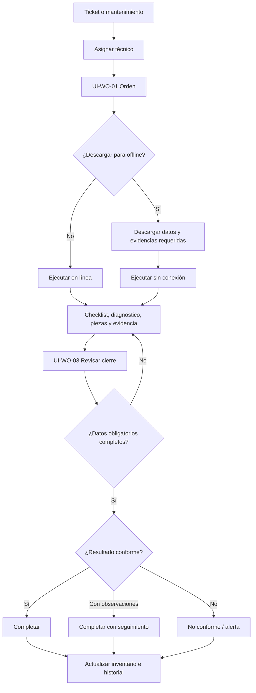
```mermaid
flowchart TD
    A[Ticket o mantenimiento] --> B[Asignar técnico]
    B --> C[UI-WO-01 Orden]
    C --> D{¿Descargar para offline?}
    D -- No --> E[Ejecutar en línea]
    D -- Sí --> F[Descargar datos y evidencias requeridas]
    F --> G[Ejecutar sin conexión]
    E --> H[Checklist, diagnóstico, piezas y evidencia]
    G --> H
    H --> I[UI-WO-03 Revisar cierre]
    I --> J{¿Datos obligatorios completos?}
    J -- No --> H
    J -- Sí --> K{¿Resultado conforme?}
    K -- Sí --> L[Completar]
    K -- Con observaciones --> M[Completar con seguimiento]
    K -- No --> N[No conforme / alerta]
    L --> O[Actualizar inventario e historial]
    M --> O
    N --> O
```

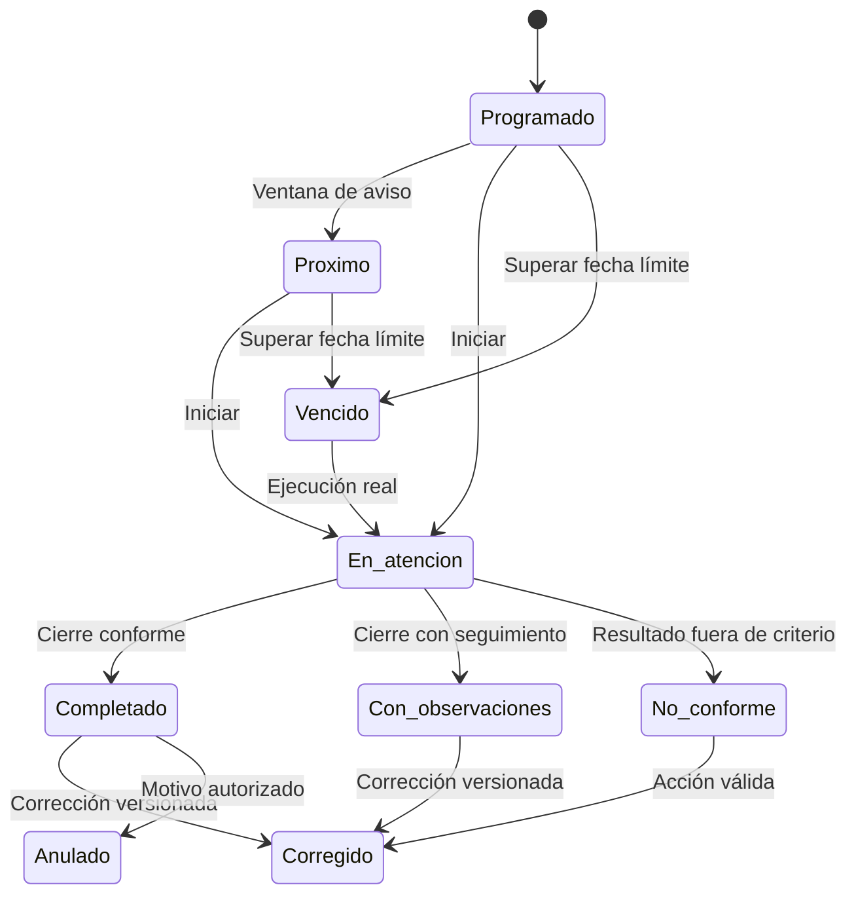
```mermaid
stateDiagram-v2
    [*] --> Programado
    Programado --> Proximo: Ventana de aviso
    Programado --> En_atencion: Iniciar
    Proximo --> En_atencion: Iniciar
    Programado --> Vencido: Superar fecha límite
    Proximo --> Vencido: Superar fecha límite
    En_atencion --> Completado: Cierre conforme
    En_atencion --> Con_observaciones: Cierre con seguimiento
    En_atencion --> No_conforme: Resultado fuera de criterio
    Vencido --> En_atencion: Ejecución real
    Completado --> Corregido: Corrección versionada
    Con_observaciones --> Corregido: Corrección versionada
    No_conforme --> Corregido: Acción válida
    Completado --> Anulado: Motivo autorizado
```

### 15.4 Flujos alternativos

- Crear orden directamente desde una alerta crítica.
- Registrar mantenimiento preventivo sin ticket previo.
- Cambiar técnico antes de iniciar.
- Marcar Con observaciones y generar seguimiento.
- Corregir o anular mediante `UI-WO-04` conservando versión anterior.

### 15.5 Casos de error

| Caso | Comportamiento |
|---|---|
| Evidencia obligatoria faltante | No permitir cierre. |
| Componente sin existencia | Permitir diagnóstico, pero bloquear consumo o solicitar ajuste autorizado. |
| Archivo individual falla | Conservar el resto y reintentar solo el archivo. |
| Orden modificada en servidor | Crear conflicto; no sobrescribir. |
| Usuario desactivado con datos locales | Bloquear nuevas acciones y proteger proceso de sincronización/entrega a revisión. |
| Cierre duplicado por reintento | Respuesta idempotente con el mismo resultado. |

## 16. Flujo 8 — Bitácora sanitaria dinámica

### 16.1 Objetivo

Capturar controles sanitarios generados por plantillas oficiales, con límites, evidencia y correcciones versionadas.

### 16.2 Flujo principal

1. Operador o responsable abre `UI-SAN-02`.
2. Selecciona bitácora pendiente o vencida.
3. `UI-SAN-03` carga campos dinámicos, unidades, límites y evidencia.
4. Captura lecturas y confirma responsable, fecha y contexto.
5. El sistema evalúa criterios sin impedir registrar un valor real fuera de rango.
6. Si los datos cumplen, completa la bitácora.
7. Si están fuera de criterio, marca No conforme y genera el seguimiento correspondiente.
8. El registro se guarda con la versión de plantilla que lo originó.

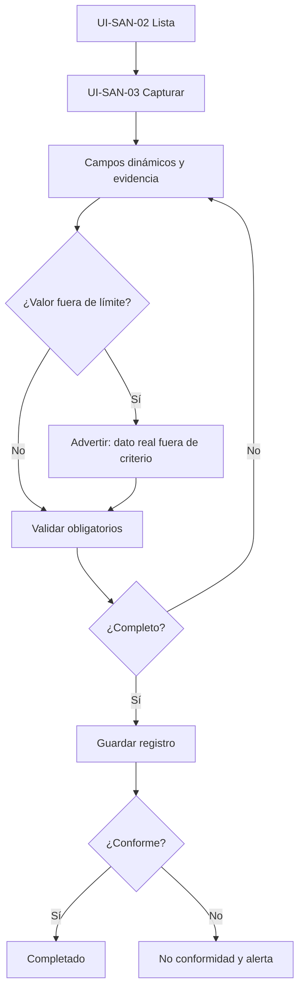
```mermaid
flowchart TD
    A[UI-SAN-02 Lista] --> B[UI-SAN-03 Capturar]
    B --> C[Campos dinámicos y evidencia]
    C --> D{¿Valor fuera de límite?}
    D -- No --> E[Validar obligatorios]
    D -- Sí --> F[Advertir: dato real fuera de criterio]
    F --> E
    E --> G{¿Completo?}
    G -- No --> C
    G -- Sí --> H[Guardar registro]
    H --> I{¿Conforme?}
    I -- Sí --> J[Completado]
    I -- No --> K[No conformidad y alerta]
```

### 16.3 Flujos alternativos

- Captura offline de bitácora descargada previamente.
- Corrección posterior con motivo y comparación de valores.
- Anulación con permiso, motivo y auditoría.
- Campo no aplicable permitido solo cuando la plantilla lo defina.

### 16.4 Casos de error

- Unidad incompatible: bloquear guardado del campo.
- Límite actualizado después de descargar: conservar versión original y evaluar conflicto al sincronizar.
- Evidencia dañada: guardar formulario localmente y reintentar archivo.
- Fecha fuera de periodo permitido: solicitar justificación o bloquear según plantilla.

## 17. Flujo 9 — Laboratorio, no conformidad, restricción y reactivación

### 17.1 Registro de análisis

1. Responsable abre `UI-LAB-02`.
2. Selecciona máquina, producto, punto de toma, laboratorio y tipo de análisis.
3. Captura fechas y folio.
4. Carga PDF original.
5. Captura parámetros, unidades, resultados y límites.
6. Revisa resultado general.
7. Guarda y abre `UI-LAB-03`.

### 17.2 No conformidad

Si uno o más parámetros no cumplen:

1. el análisis queda No conforme;
2. no se publica automáticamente;
3. se crea alerta crítica;
4. se genera ticket y acción correctiva;
5. ICE24 puede aplicar restricción sanitaria;
6. se asignan responsables y escalamiento.

### 17.3 Acción correctiva y reactivación

1. Responsable abre `UI-NC-02`.
2. Registra actividades, evidencia, responsable y verificación.
3. Si corresponde, captura nuevo análisis.
4. Propietario o administrador autorizado abre `UI-REA-01`.
5. Captura acción realizada, motivo, evidencia, fecha, próximo análisis y aceptación.
6. Envía reactivación.
7. El sistema levanta provisionalmente conforme a la regla definida y notifica a ICE24.
8. ICE24 puede revisar y volver a restringir.

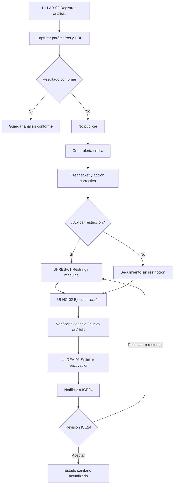
```mermaid
flowchart TD
    A[UI-LAB-02 Registrar análisis] --> B[Capturar parámetros y PDF]
    B --> C{Resultado conforme}
    C -- Sí --> D[Guardar análisis conforme]
    C -- No --> E[No publicar]
    E --> F[Crear alerta crítica]
    F --> G[Crear ticket y acción correctiva]
    G --> H{¿Aplicar restricción?}
    H -- Sí --> I[UI-RES-01 Restringir máquina]
    H -- No --> J[Seguimiento sin restricción]
    I --> K[UI-NC-02 Ejecutar acción]
    J --> K
    K --> L[Verificar evidencia / nuevo análisis]
    L --> M[UI-REA-01 Solicitar reactivación]
    M --> N[Notificar a ICE24]
    N --> O{Revisión ICE24}
    O -- Aceptar --> P[Estado sanitario actualizado]
    O -- Rechazar o restringir --> I
```

### 17.4 Casos de error

- PDF cargado sin parámetros estructurados: mantener borrador o impedir completar según plantilla.
- Parámetro sin límite configurado: resultado No evaluable, no asumir conforme.
- Reactivación sin evidencia: impedir envío.
- Restricción aplicada durante un pedido: bloquear nuevos pedidos y gestionar pedido activo como incidencia según reglas pendientes.
- Error de correo: conservar alerta y estado interno.

## 18. Flujo 10 — Inventario y ciclo de vida de componentes

### 18.1 Entrada y movimiento

1. Propietario abre `UI-INV-01` y selecciona almacén.
2. Abre `UI-INV-03`.
3. Elige entrada, salida, transferencia o ajuste.
4. Captura producto, lote, cantidad, costo, proveedor, ubicación, evidencia y motivo aplicable.
5. Revisa impacto en existencias.
6. Confirma y audita.

### 18.2 Instalación y retiro

1. Desde una orden, técnico selecciona pieza consumida.
2. La pieza sale del inventario.
3. Se registra como componente activo de la máquina.
4. Se inicia historial y próximo mantenimiento.
5. Si retira una pieza, captura condición, fotografía, motivo, costo y disposición.
6. La pieza retirada permanece consultable.

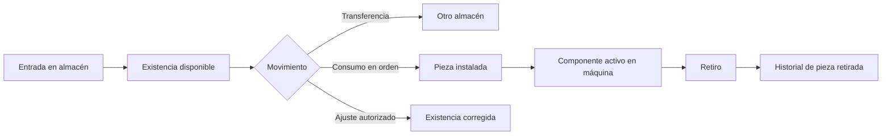
```mermaid
flowchart LR
    A[Entrada en almacén] --> B[Existencia disponible]
    B --> C{Movimiento}
    C -->|Transferencia| D[Otro almacén]
    C -->|Consumo en orden| E[Pieza instalada]
    C -->|Ajuste autorizado| F[Existencia corregida]
    E --> G[Componente activo en máquina]
    G --> H[Retiro]
    H --> I[Historial de pieza retirada]
```

### 18.3 Solicitud de refacciones

1. Propietario agrega productos y cantidades en `UI-INV-05`.
2. Selecciona máquina destino.
3. El sistema genera folio y mensaje de WhatsApp prellenado.
4. Cotización y pago continúan fuera de ICE24 OS.
5. El folio permanece para seguimiento.

### 18.4 Casos de error

- Existencia insuficiente: impedir salida o solicitar ajuste por propietario.
- Lote caducado: advertir o bloquear según regla futura.
- Transferencia entre cuentas: no permitida.
- Técnico intenta modificar costo: bloquear por permiso.
- Consumo duplicado por sincronización: idempotencia por orden y movimiento.

## 19. Flujo 11 — Documentos, versiones y publicación

### 19.1 Carga y versionado

1. Usuario abre `UI-DOC-02`.
2. Selecciona archivo y captura metadatos.
3. Relaciona cuenta, sucursal, máquina y registro.
4. El sistema valida tamaño, tipo e integridad.
5. Se guarda original privado y metadatos.
6. Si corrige, crea una nueva versión; no reemplaza la anterior.
7. `UI-DOC-03` muestra historial y descargas autorizadas.

### 19.2 Publicación

1. Usuario autorizado abre `UI-DOC-04` o `UI-PUB-01`.
2. Selecciona contenido y versión.
3. El sistema genera o muestra versión pública protegida.
4. Se revisan datos personales, firmas, comentarios y fotografías sensibles.
5. Se muestra vista previa con marca de agua, folio y leyenda.
6. Usuario confirma publicar.
7. El contenido queda visible en el portal.
8. Retirar o sustituir requiere acción posterior auditada.

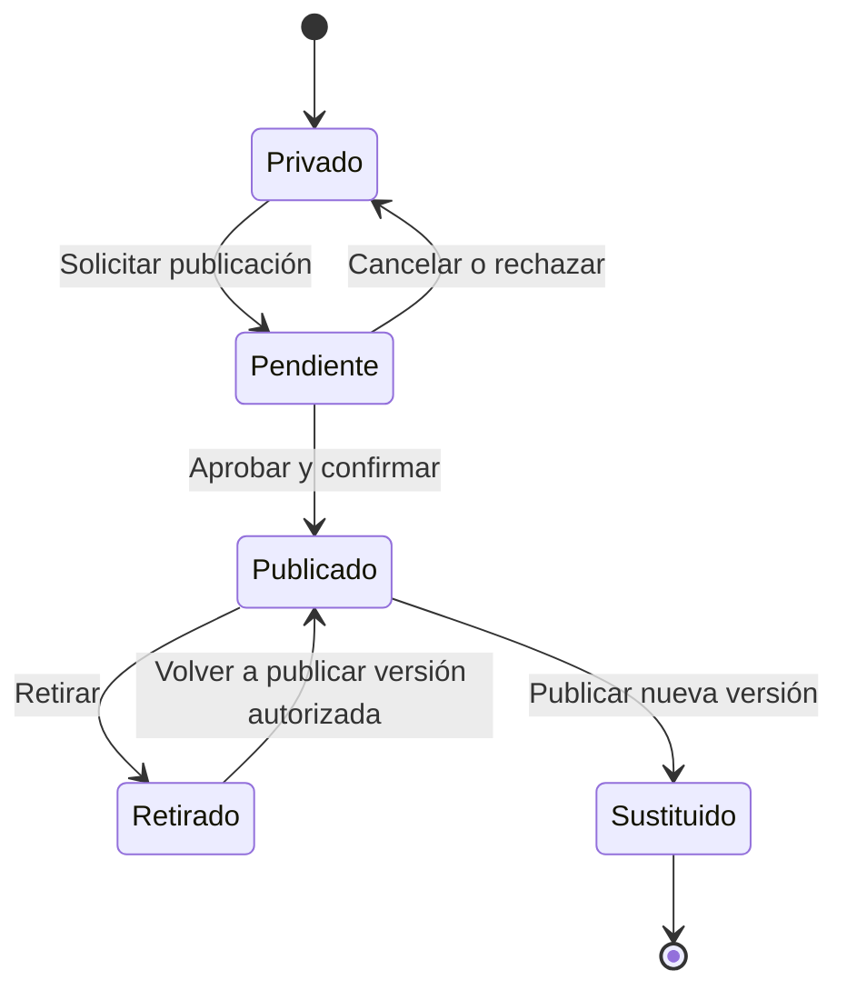
```mermaid
stateDiagram-v2
    [*] --> Privado
    Privado --> Pendiente: Solicitar publicación
    Pendiente --> Publicado: Aprobar y confirmar
    Pendiente --> Privado: Cancelar o rechazar
    Publicado --> Retirado: Retirar
    Publicado --> Sustituido: Publicar nueva versión
    Retirado --> Publicado: Volver a publicar versión autorizada
    Sustituido --> [*]
```

### 19.3 Casos de error

- Documento no conforme: bloquear publicación automática.
- Versión pública no generada: mantener privado y permitir reintento.
- Archivo excede límite: error 413 con límite visible.
- Virus o integridad inválida: rechazar archivo sin afectar metadatos ya capturados.
- Usuario sin permiso de original: mostrar solo versión pública/autorizada.

## 20. Flujo 12 — Reportes, programación y exportación completa

### 20.1 Generación de reporte

1. Usuario abre `UI-RPT-01` y elige tipo.
2. Configura periodo, cuenta, sucursales, máquinas, secciones, anexos, fotografías y privacidad en `UI-RPT-02`.
3. El sistema valida permisos y disponibilidad de datos.
4. Abre `UI-RPT-03` con vista previa.
5. Usuario confirma generar.
6. Se crea tarea asíncrona.
7. `UI-RPT-04` muestra Preparando, Disponible o Error.
8. Usuario descarga; la acción se audita.

### 20.2 Programación

1. Desde `UI-RPT-05`, usuario selecciona plantilla y frecuencia.
2. Define destinatarios registrados.
3. Revisa privacidad y secciones.
4. Guarda programación.
5. En cada ejecución se genera PDF y se envía por correo.
6. Envíos y fallos quedan en historial.

### 20.3 Exportación completa

1. Propietario principal abre `UI-EXP-01`.
2. Revisa alcance, sensibilidad y plazo de disponibilidad.
3. Confirma solicitud.
4. Exportación pasa a Preparando.
5. Cuando está Disponible, se notifica.
6. El paquete puede descargarse durante siete días.
7. Después pasa a Expirada.

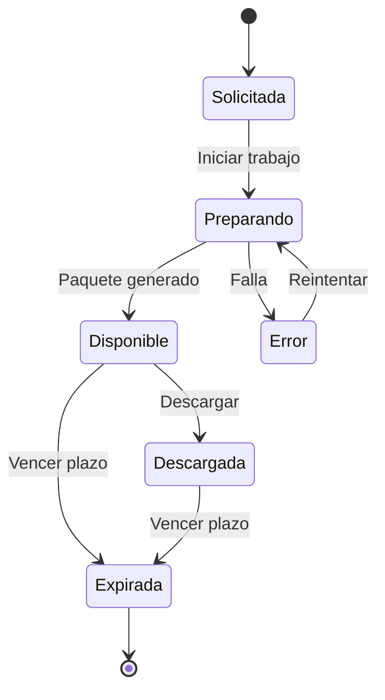
```mermaid
stateDiagram-v2
    [*] --> Solicitada
    Solicitada --> Preparando: Iniciar trabajo
    Preparando --> Disponible: Paquete generado
    Preparando --> Error: Falla
    Error --> Preparando: Reintentar
    Disponible --> Descargada: Descargar
    Disponible --> Expirada: Vencer plazo
    Descargada --> Expirada: Vencer plazo
    Expirada --> [*]
```

### 20.4 Casos de error

- Datos financieros sin permiso: ocultar sección o bloquear selección.
- Módulo activo sin datos: mostrar “Sin datos disponibles todavía”.
- Módulo deshabilitado: mostrar “Módulo no habilitado”.
- Error de PDF: mantener configuración e indicar reintento.
- Error de correo: conservar reporte y marcar entrega fallida.
- Archivo demasiado grande para adjunto: aplicar mecanismo definido por ingeniería sin perder auditoría.

## 21. Flujo 13 — Portal público y QR

### 21.1 Objetivo

Permitir consulta pública de información deliberadamente publicada sin exponer datos privados.

### 21.2 Flujo principal

1. Persona escanea QR técnico o sanitario.
2. El navegador abre la rama pública del Código ICE24 OS.
3. El sistema registra escaneo conforme a privacidad.
4. Muestra identificación general, actualización y estado visible.
5. Usuario elige sección técnica o sanitaria.
6. Consulta resúmenes y documentos publicados de los últimos 24 meses.
7. Puede descargar versiones públicas autorizadas.
8. Puede abrir contacto o WhatsApp prellenado cuando esté habilitado.

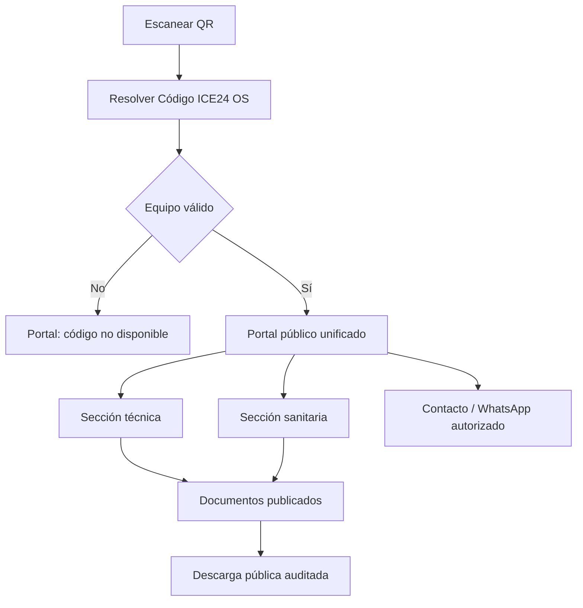
```mermaid
flowchart TD
    A[Escanear QR] --> B[Resolver Código ICE24 OS]
    B --> C{Equipo válido}
    C -- No --> D[Portal: código no disponible]
    C -- Sí --> E[Portal público unificado]
    E --> F[Sección técnica]
    E --> G[Sección sanitaria]
    F --> H[Documentos publicados]
    G --> H
    H --> I[Descarga pública auditada]
    E --> J[Contacto / WhatsApp autorizado]
```

### 21.3 Flujos alternativos

- QR sigue válido después de traslado o transferencia.
- Documento sustituido dirige a versión vigente autorizada.
- Equipo sin contenido publicado muestra estado vacío, no información privada.
- Propietario retira contenido y desaparece de la vista pública sin eliminarlo del expediente privado.

### 21.4 Casos de error

- Código inexistente o inválido: página pública segura.
- Equipo retirado: mostrar mensaje definido, sin exponer historial privado.
- Documento expirado/retirado: impedir descarga.
- Servicio temporalmente no disponible: 503 con opción de reintento.
- Analítica de ubicación no permitida: registrar únicamente datos legítimos disponibles.

## 22. Flujo 14 — Importación de ventas desde Excel

### 22.1 Objetivo

Validar un archivo descargado de la aplicación de la máquina antes de incorporar ventas deduplicadas.

### 22.2 Flujo principal

1. Usuario abre `UI-SAL-01` y selecciona “Importar”.
2. En `UI-SAL-02` elige máquina y archivo.
3. El sistema valida tamaño, formato, columnas, periodo e identificadores.
4. Se procesa como tarea asíncrona cuando corresponda.
5. `UI-SAL-03` muestra registros nuevos, duplicados, advertencias y errores.
6. Usuario revisa y confirma o cancela.
7. Al confirmar, se guarda archivo original, resumen y registros procesados.
8. `UI-SAL-04` actualiza paneles y reportes.

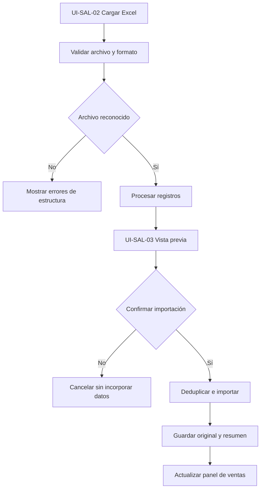
```mermaid
flowchart TD
    A[UI-SAL-02 Cargar Excel] --> B[Validar archivo y formato]
    B --> C{Archivo reconocido}
    C -- No --> D[Mostrar errores de estructura]
    C -- Sí --> E[Procesar registros]
    E --> F[UI-SAL-03 Vista previa]
    F --> G{Confirmar importación}
    G -- No --> H[Cancelar sin incorporar datos]
    G -- Sí --> I[Deduplicar e importar]
    I --> J[Guardar original y resumen]
    J --> K[Actualizar panel de ventas]
```

### 22.3 Anulación

1. Usuario autorizado abre importación confirmada.
2. Selecciona anular.
3. Captura motivo y revisa cantidad de registros afectados.
4. Confirma.
5. Los datos se retiran de paneles, pero archivo e historial permanecen.

### 22.4 Casos de error

- Formato desconocido: conservar archivo y señalar columnas/filas no interpretables.
- Periodo duplicado: mostrar coincidencia antes de confirmar.
- Sin identificador único: aplicar llave compuesta sujeta a validación.
- Fallo parcial: mostrar cantidad procesada y fallida; no duplicar al reintentar.
- Usuario abandona durante procesamiento: tarea sigue visible en historial.

## 23. Flujo 15 — Tarjetas y movimientos administrativos

### 23.1 Objetivo

Registrar movimientos administrativos de tarjetas físicas sin presentarlos como saldo real confirmado.

### 23.2 Flujo principal

1. Propietario abre `UI-CARD-01` y selecciona tarjeta.
2. `UI-CARD-02` muestra máquina exclusiva, titular actual e historial.
3. Abre `UI-CARD-03`.
4. Selecciona recarga, retiro, transferencia o reasignación.
5. Captura cantidades, dinero recibido, bonificación, responsables y evidencia.
6. Revisa advertencia de control administrativo.
7. Confirma y audita.

### 23.3 Reglas de flujo

- Una tarjeta solo puede pertenecer a una máquina.
- No se muestra “saldo real”.
- Reasignar cierra el periodo del titular anterior y abre uno nuevo.
- Movimiento entre máquinas se registra como retiro y recarga separados.
- No se permite saldo administrativo negativo.

### 23.4 Casos de error

- Tarjeta ya asociada a otra máquina: bloquear.
- Transferencia excede total administrativo: bloquear.
- Evidencia requerida faltante: mantener borrador.
- Reasignación con movimiento simultáneo: ordenar transacciones y auditar correlación.

## 24. Flujo 16 — Negocio consumidor, productos y pedido

### 24.1 Alta de negocio

1. Propietario abre `UI-BIZ-01`.
2. Crea o asocia identidad del negocio.
3. Captura empresa, sucursales, usuarios y datos fiscales.
4. Asocia máquinas autorizadas.
5. El negocio acepta o activa su acceso conforme a la regla definida.
6. Su administrador puede crear usuarios internos, pero no asociar nuevas máquinas por sí mismo.

### 24.2 Configuración de producto

1. Propietario abre `UI-PROD-01` por máquina.
2. Configura bolsa de hielo, presentación, kilogramos, precio, máximo y disponibilidad manual.
3. Puede agregar precio especial por cliente.
4. La máquina, producto y restricciones determinan elegibilidad.

### 24.3 Creación de pedido

1. Restaurante abre `UI-ORD-02`.
2. Selecciona sucursal consumidora.
3. El sistema muestra solo máquinas asociadas.
4. Ordena por cercanía, disponibilidad, producto, precio y repartidores elegibles.
5. Restaurante selecciona máquina y producto.
6. Captura cantidad y revisa tarifa y total.
7. El sistema valida nuevamente condiciones.
8. Confirma y crea pedido Disponible.
9. Se notifica a repartidores elegibles.

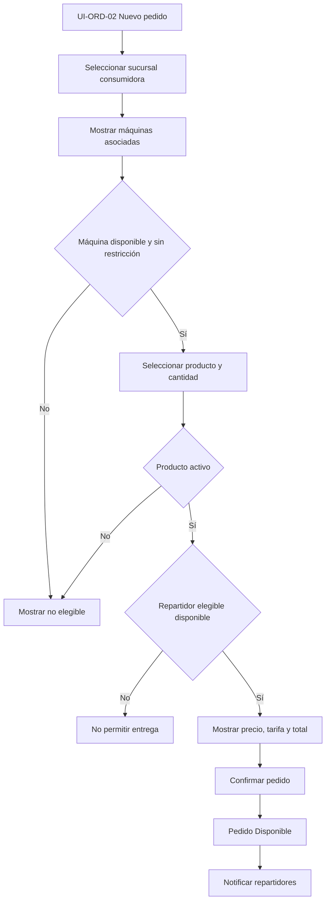
```mermaid
flowchart TD
    A[UI-ORD-02 Nuevo pedido] --> B[Seleccionar sucursal consumidora]
    B --> C[Mostrar máquinas asociadas]
    C --> D{Máquina disponible y sin restricción}
    D -- No --> E[Mostrar no elegible]
    D -- Sí --> F[Seleccionar producto y cantidad]
    F --> G{Producto activo}
    G -- No --> E
    G -- Sí --> H{Repartidor elegible disponible}
    H -- No --> I[No permitir entrega]
    H -- Sí --> J[Mostrar precio, tarifa y total]
    J --> K[Confirmar pedido]
    K --> L[Pedido Disponible]
    L --> M[Notificar repartidores]
```

### 24.4 Flujos alternativos

- Autoservicio con tarjeta: no crea pedido.
- Tarifa gratuita o cero.
- Precio especial por cliente.
- Restaurante elige una máquina distinta a la primera recomendada.
- Entrega parcial posterior con explicación y aceptación.

### 24.5 Casos de error

- Máquina se restringe antes de confirmar: invalidar selección y recalcular.
- Repartidor deja de estar disponible: impedir creación o buscar otra máquina asociada.
- Ubicación no disponible: utilizar dirección y cálculo permitido.
- Precio cambia durante el flujo: mostrar nuevo total y solicitar reconfirmación.
- Doble envío: idempotencia del pedido.

## 25. Flujo 17 — Toma, recolección y entrega por repartidor

### 25.1 Objetivo

Asignar un pedido al primer repartidor elegible conectado y permitir su ejecución verificable, incluso offline después de tomarlo.

### 25.2 Flujo principal

1. Repartidor disponible abre `UI-DRV-02`.
2. Revisa máquina, dirección, producto, cantidad, tarifa y distancia aproximada.
3. Selecciona “Tomar pedido”.
4. El sistema valida conexión, elegibilidad, tarjeta, zona y estado actual.
5. La toma atómica asigna el pedido o informa que otro repartidor lo tomó.
6. Abre `UI-DRV-03`.
7. Marca inicio de recolección.
8. Registra producto recogido, cantidad e importe de tarjeta utilizado.
9. Marca En ruta.
10. En destino captura nombre, código de entrega, hora, ubicación y evidencia.
11. Marca Entregado.
12. El pedido se cierra conforme a validaciones y queda en historial.

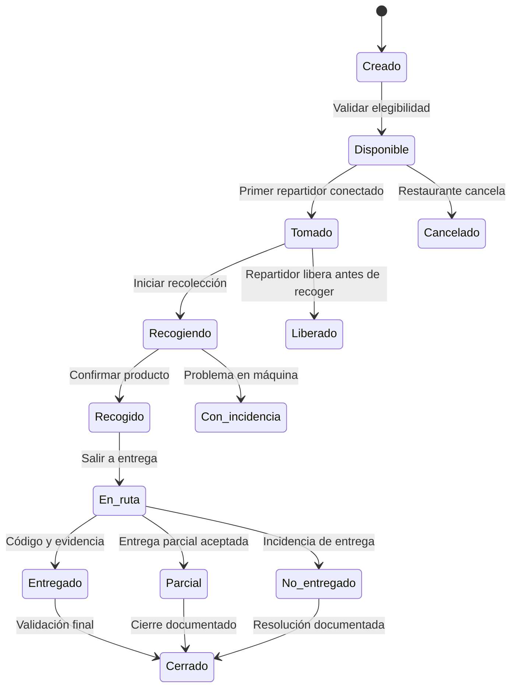
```mermaid
stateDiagram-v2
    [*] --> Creado
    Creado --> Disponible: Validar elegibilidad
    Disponible --> Tomado: Primer repartidor conectado
    Disponible --> Cancelado: Restaurante cancela
    Tomado --> Recogiendo: Iniciar recolección
    Tomado --> Liberado: Repartidor libera antes de recoger
    Recogiendo --> Recogido: Confirmar producto
    Recogiendo --> Con_incidencia: Problema en máquina
    Recogido --> En_ruta: Salir a entrega
    En_ruta --> Entregado: Código y evidencia
    En_ruta --> Parcial: Entrega parcial aceptada
    En_ruta --> No_entregado: Incidencia de entrega
    Entregado --> Cerrado: Validación final
    Parcial --> Cerrado: Cierre documentado
    No_entregado --> Cerrado: Resolución documentada
```

### 25.3 Offline

- Tomar pedido requiere conexión.
- Una vez tomado, el repartidor puede descargar/continuar los pasos permitidos.
- Confirmaciones quedan en cola local con hora y ubicación disponibles.
- Al volver la red se sincronizan en orden.
- Cambios de estado incompatibles crean conflicto o incidencia, no sobrescritura.

### 25.4 Flujos alternativos

- Restaurante cancela antes de “Producto recogido”.
- Repartidor libera pedido antes de recoger.
- Entrega parcial con explicación y aceptación.
- Después de recoger, cancelación requiere autorización o incidencia.
- Propietario funciona también como repartidor si está asociado y activo.

### 25.5 Casos de error

- Otro repartidor toma primero: volver a lista sin asignación.
- Sin conexión al tomar: no ejecutar ningún cambio.
- Tarjeta inactiva: bloquear toma.
- Fuera de zona: no elegible.
- Código de entrega incorrecto: permitir reintento o incidencia autorizada.
- GPS no disponible: usar evidencia y dirección conforme a reglas.
- Pedido modificado mientras estaba offline: conflicto al sincronizar.

## 26. Flujo 18 — Suscripción, demo y modo lectura

### 26.1 Demo

1. ICE24 crea demo desde `UI-ADM-04`.
2. Se copia plantilla maestra con datos ficticios independientes.
3. Usuario accede y ve vigencia de 14 días.
4. ICE24 puede ampliar vigencia.
5. Al contratar, se crea una cuenta productiva limpia.

### 26.2 Pago y acceso

1. Propietario abre gestión de suscripción.
2. Completa el flujo de Stripe externo/autorizado.
3. Stripe confirma el evento.
4. ICE24 OS actualiza estado de cuenta.
5. Si el pago es exitoso, acceso Activo/Reactivado.
6. Si se rechaza, cambia inmediatamente a Modo lectura y muestra banner.

### 26.3 Cancelación

1. Propietario solicita cancelación.
2. Revisa fecha de finalización del periodo pagado.
3. Confirma.
4. Estado Cancelación programada.
5. Conserva acceso hasta finalizar el periodo.
6. Después pasa a Cancelada/Modo lectura.

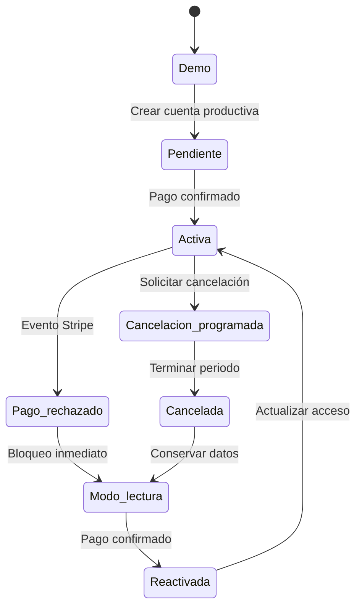
```mermaid
stateDiagram-v2
    [*] --> Demo
    Demo --> Pendiente: Crear cuenta productiva
    Pendiente --> Activa: Pago confirmado
    Activa --> Pago_rechazado: Evento Stripe
    Pago_rechazado --> Modo_lectura: Bloqueo inmediato
    Modo_lectura --> Reactivada: Pago confirmado
    Reactivada --> Activa: Actualizar acceso
    Activa --> Cancelacion_programada: Solicitar cancelación
    Cancelacion_programada --> Cancelada: Terminar periodo
    Cancelada --> Modo_lectura: Conservar datos
```

### 26.4 Modo lectura

Permitido:

- consultar información;
- descargar documentos y reportes ya generados;
- consultar auditoría autorizada;
- gestionar reactivación/pago.

Bloqueado:

- crear o modificar registros;
- completar actividades;
- generar reportes nuevos;
- importar Excel;
- tomar pedidos;
- publicar contenido nuevo.

### 26.5 Casos de error

- Webhook de Stripe repetido: operación idempotente.
- Confirmación tardía: mostrar estado pendiente y refrescar cuando llegue evento válido.
- Pago confirmado pero acceso no actualizado: crear alerta técnica y permitir reconciliación.
- Demo expirada: bloquear escritura y mostrar contratación o extensión por ICE24.

## 27. Flujo 19 — Offline, sincronización y resolución de conflictos

### 27.1 Cola local

Cada operación local muestra entidad, fecha/hora, archivos, intentos y estado:

- Pendiente;
- Sincronizando;
- Cargada;
- Error;
- Conflicto;
- Resuelta.

### 27.2 Sincronización

1. La aplicación detecta conexión.
2. Ordena operaciones según dependencia.
3. Envía cada operación con identificador idempotente.
4. El servidor valida permisos, versión y estado.
5. Si acepta, marca Cargada.
6. Si existe error recuperable, conserva Pendiente/Error.
7. Si existe modificación concurrente, crea Conflicto.
8. Usuario autorizado abre `UI-SYNC-01`.
9. Compara versión local y servidor.
10. Selecciona resolución, captura motivo y confirma.
11. Se crea una nueva versión auditada y el conflicto pasa a Resuelta.

```mermaid
flowchart TD
    A[Operación guardada localmente] --> B[Pendiente]
    B --> C{¿Hay conexión?}
    C -- No --> B
    C -- Sí --> D[Sincronizando]
    D --> E{Validación servidor}
    E -- Aceptada --> F[Cargada]
    E -- Error recuperable --> G[Error / reintentar]
    E -- Versión concurrente --> H[Conflicto]
    G --> D
    H --> I[UI-SYNC-01 Comparar versiones]
    I --> J[Elegir resolución y motivo]
    J --> K[Crear versión resuelta]
    K --> L[Resuelta]
```

### 27.3 Cierre de sesión con pendientes

- Se advierte número de cambios pendientes.
- Opción recomendada: volver y sincronizar.
- Si el usuario confirma cierre, se eliminan datos locales sensibles conforme al PRD.
- La decisión y pérdida de borradores no sincronizados debe explicarse claramente.

### 27.4 Casos de error

- Archivo grande falla después de guardar formulario: reintentar solo archivo.
- Permiso revocado: bloquear sincronización y enviar elemento a revisión.
- Estado de negocio incompatible: crear conflicto o error 409.
- Operación duplicada: reconocer idempotencia y marcar Cargada.
- Actualización de PWA pendiente: no eliminar cola local durante actualización controlada.

## 28. Flujo 20 — Administración central, restricciones y auditoría

### 28.1 Panel global ICE24

`UI-ADM-01` prioriza:

- cuentas activas, demo y modo lectura;
- solicitudes de equipo;
- restricciones técnicas y sanitarias;
- pagos rechazados;
- alertas críticas;
- salud de tareas e integraciones;
- auditoría reciente.

### 28.2 Restricción global

1. Administrador autorizado abre `UI-ADM-03` o expediente.
2. Selecciona tipo técnico o sanitario.
3. Captura motivo, evidencia, alcance y condiciones para levantarla.
4. Revisa impacto: pedidos bloqueados y funciones que permanecen disponibles.
5. Confirma.
6. Se actualiza estado, se genera alerta y se audita.

### 28.3 Consulta de auditoría

1. Usuario autorizado abre `UI-AUD-01`.
2. Filtra por cuenta, usuario, sucursal, máquina, fecha o tipo.
3. Abre evento.
4. Consulta actor, acción, entidad, valores anterior/nuevo, motivo, origen, resultado y correlación.
5. No puede editar ni eliminar.

### 28.4 Casos de error

- Administrador técnico intenta restricción sanitaria sin permiso: bloquear.
- Auditoría todavía en proceso de indexación: mostrar estado temporal sin ocultar el evento fuente.
- Integración externa falla durante acción administrativa: conservar estado transaccional y tarea de reconciliación.
- Restricción duplicada: reutilizar restricción activa o solicitar actualización explícita.

## 29. Flujos alternativos transversales

| Situación | Flujo alternativo |
|---|---|
| Usuario sin permiso para crear | Mostrar contenido en lectura y ocultar acción; no sustituir por error genérico. |
| Cuenta en modo lectura | Mantener navegación de consulta, bloquear comandos y explicar reactivación. |
| Módulo deshabilitado | Mostrar estado “Módulo no habilitado” y acceso a configuración solo con permiso. |
| Recurso archivado | Abrir detalle de solo lectura con historial. |
| Recurso corregido | Mostrar versión vigente y acceso a comparación. |
| Acción asíncrona | Permitir salir; seguimiento en historial/centro de tareas. |
| Error parcial | Mostrar completados y fallidos; reintentar solo pendientes. |
| Cambio concurrente | Mostrar conflicto y comparación; nunca sobrescribir. |
| Falta de geolocalización | Permitir dirección/coordenadas manuales cuando el flujo lo admita. |
| Datos incompletos | Mostrar Sin datos o No evaluable; no asumir cumplimiento. |
| Servicio externo indisponible | Mantener operación interna posible y dejar tarea pendiente o error reintentable. |

## 30. Catálogo de casos de error

### 30.1 Errores de acceso y navegación

| Código conceptual | Caso | Pantalla/resultado |
|---|---|---|
| 401 | Sesión no válida o expirada | `UI-AUTH-07`, reingreso seguro. |
| 403 | Sin permiso | Página de acceso no autorizado, sin datos del recurso. |
| 404 | Recurso inexistente o retirado | Estado seguro y regreso al listado. |
| 409 | Estado o versión incompatible | Comparación, recarga o conflicto. |
| 410 | Recurso público retirado, si se adopta | Mensaje público sin información privada. |

### 30.2 Errores de captura y negocio

| Caso | Tratamiento |
|---|---|
| Campo obligatorio faltante | Mensaje junto al campo y resumen al inicio del formulario. |
| Valor fuera de rango real | Permitir capturarlo, advertir y activar resultado fuera de criterio. |
| Transición no permitida | Explicar estado actual y acción previa requerida. |
| Relación entre cuentas inválida | Bloquear sin revelar datos externos. |
| Duplicado | Mostrar coincidencia o reconocer idempotencia. |
| Límite o precondición incumplida | Error 422 en lenguaje operativo. |

### 30.3 Errores de archivos y tareas

| Caso | Tratamiento |
|---|---|
| Archivo demasiado grande | Indicar límite y conservar resto del formulario. |
| Tipo no permitido | Rechazar archivo específico. |
| Integridad/seguridad inválida | No almacenar como documento utilizable. |
| PDF no generado | Estado Error reintentable. |
| Correo no enviado | Reporte disponible, envío marcado fallido. |
| Excel no reconocido | Vista de columnas/filas problemáticas. |
| Exportación fallida | Conservar solicitud y permitir reintento autorizado. |

### 30.4 Errores de conexión y externos

| Caso | Tratamiento |
|---|---|
| Sin red en acción offline permitida | Guardar localmente y mostrar pendiente. |
| Sin red en acción que requiere conexión | No realizar cambio; explicar y reintentar. |
| Stripe no disponible | Mantener estado conocido y esperar evento confirmado. |
| Mapas no disponibles | Entrada manual de dirección/coordenadas. |
| Almacenamiento no disponible | Conservar metadatos/borrador y reintentar archivo. |
| Servicio general no disponible | 503 con referencia y recuperación. |

### 30.5 Mensaje de error estándar

Todo error visible debe incluir, cuando aplique:

1. título comprensible;
2. qué ocurrió;
3. impacto;
4. acción disponible;
5. si se conservaron los datos;
6. identificador de referencia para soporte;
7. opción de reintento solo cuando sea segura e idempotente.

## 31. Estados vacíos y entradas de flujo

| Contexto vacío | Acción de entrada |
|---|---|
| Sin sucursales | Crear sucursal. |
| Sin máquinas activas | Solicitar alta de equipo. |
| Sin órdenes | Ver calendario o esperar asignación. |
| Sin bitácoras pendientes | Consultar completadas. |
| Sin análisis | Registrar análisis si tiene permiso. |
| Sin inventario | Registrar entrada. |
| Sin documentos | Cargar documento. |
| Ventas sin datos | Importar Excel. |
| Sin negocios | Crear negocio. |
| Sin pedidos | Nuevo pedido para restaurante. |
| Sin repartidores elegibles | Revisar asociaciones, zona o intentar después. |
| Sin publicaciones | Gestionar publicación. |
| Portal sin contenido | Mostrar “No hay información publicada disponible”. |
| Offline sin recurso descargado | Reconectar; no ofrecer edición. |

## 32. Matriz de navegación por rol y permiso

| Destino | ICE24 | Propietario | Técnico | Operador | Sanitario | Repartidor | Restaurante | Auditor |
|---|---:|---:|---:|---:|---:|---:|---:|---:|
| Panel global | Sí | No | No | No | Según rol ICE24 | No | No | No |
| Resumen de cuenta | Según permiso | Sí | Limitado | Limitado | Limitado | No | No | Lectura |
| Sucursales | Sí | Sí | Asignadas | Asignadas | Asignadas | No | Propias | Lectura |
| Máquinas | Sí | Sí | Asignadas | Asignadas | Asignadas | Asociadas | Asociadas | Lectura |
| Mantenimiento | Sí | Sí | Sí | Según permiso | Consulta | No | No | Lectura |
| Sanidad | Sí | Sí | Según permiso | Captura | Sí | No | No | Lectura |
| Inventario | Sí | Sí | Consulta/consumo | Limitado | No | No | No | Lectura |
| Documentos | Sí | Sí | Relacionados | Relacionados | Sí | Evidencia propia | No | Lectura |
| Reportes | Sí | Sí | Según permiso | Según permiso | Según permiso | Privados propios | Pedidos propios | Lectura |
| Ventas/tarjetas | Sí | Sí | No | Según permiso | No | Tarjetas propias | No | Lectura autorizada |
| Pedidos | Sí | Sí | No | No | No | Sí | Sí | Lectura autorizada |
| Usuarios/permisos | Sí | Sí | No | No | No | No | Admin negocio | No |
| Suscripción | Sí | Sí | No | No | No | No | No | No |
| Auditoría | Global | Cuenta | Propia/limitada | Propia/limitada | Limitada | Propia | Propia | Sí |

> La tabla expresa navegación base. El acceso definitivo depende de las cuatro dimensiones de permisos definidas en el PRD: organización, sucursal/máquina, módulo/acción y sensibilidad.

## 33. Reglas de responsive y continuidad de flujo

### 33.1 Escritorio

- Listas y detalle pueden coexistir cuando el ancho lo permita.
- Acciones sensibles se muestran en panel lateral o modal con resumen.
- Filtros persistentes y breadcrumbs completos.

### 33.2 Tableta

- Panel lateral ocupa parte del ancho y mantiene lista de fondo cuando sea útil.
- Formularios complejos usan pasos o secciones colapsables.
- Evidencia fotográfica debe ser accesible a cámara y archivos.

### 33.3 Móvil

- Prioridad a una sola tarea y acción primaria.
- Navegación inferior adaptada al rol.
- Formularios en una columna.
- Acciones de campo visibles cerca del pulgar.
- Tablas convertidas en tarjetas sin perder estados ni acciones.
- Flujos offline muestran indicador global y estado por elemento.

### 33.4 Continuidad entre dispositivos

- El servidor conserva borradores guardados en línea.
- Los borradores offline pertenecen al dispositivo hasta sincronizarse.
- Un cambio de dispositivo no asume que los datos locales existen en el nuevo.
- Cerrar sesión elimina datos offline protegidos conforme al PRD.

## 34. Diagramas de secuencia críticos

### 34.1 Toma atómica de pedido

```mermaid
sequenceDiagram
    actor R1 as Repartidor A
    actor R2 as Repartidor B
    participant UI as PWA
    participant API as ICE24 OS
    participant DB as Estado del pedido

    R1->>UI: Tomar pedido
    R2->>UI: Tomar pedido
    UI->>API: Solicitud idempotente A
    UI->>API: Solicitud idempotente B
    API->>DB: Bloquear y validar Disponible
    DB-->>API: Asignado a A
    API-->>UI: A = Tomado
    API->>DB: Validar solicitud B
    DB-->>API: Ya no disponible
    API-->>UI: B = Pedido tomado por otro repartidor
```

### 34.2 Sincronización de una orden offline

```mermaid
sequenceDiagram
    actor T as Técnico
    participant PWA as PWA local
    participant API as API ICE24 OS
    participant S as Almacenamiento
    participant DB as Datos y auditoría

    T->>PWA: Completar checklist y fotos offline
    PWA->>PWA: Guardar operación pendiente
    PWA->>API: Sincronizar al recuperar conexión
    API->>DB: Validar permiso, versión y estado
    API->>S: Cargar evidencias
    S-->>API: Referencias protegidas
    API->>DB: Guardar cambios + auditoría
    DB-->>API: Resultado
    API-->>PWA: Cargada o Conflicto
    PWA-->>T: Estado visible
```

### 34.3 Publicación de documento

```mermaid
sequenceDiagram
    actor U as Usuario autorizado
    participant UI as UI-DOC-04
    participant API as ICE24 OS
    participant PDF as Generador público
    participant PUB as Portal público
    participant AUD as Auditoría

    U->>UI: Seleccionar versión y publicar
    UI->>API: Solicitar vista pública
    API->>PDF: Generar versión protegida
    PDF-->>API: Archivo con marca y folio
    API-->>UI: Vista previa
    U->>UI: Confirmar publicación
    UI->>API: Publicar
    API->>PUB: Activar versión pública
    API->>AUD: Registrar actor, versión y fecha
    API-->>UI: Publicado
```

## 35. Criterios de aceptación del App Flow

1. Cada pantalla tiene una entrada y una salida comprensible.
2. La navegación se adapta al rol y no revela módulos no autorizados.
3. Cuenta, rol y ámbito activos permanecen visibles durante acciones sensibles.
4. Toda transición crítica valida permiso, estado y datos obligatorios.
5. Corregir o anular nunca elimina el registro original.
6. Completar un documento no lo publica automáticamente.
7. Las alertas críticas permanecen visibles hasta Enterado y no se resuelven solo por lectura.
8. Un mantenimiento vencido permanece vencido hasta su ejecución real.
9. Tomar pedido requiere conexión y evita doble asignación.
10. Las actividades offline solo pueden ejecutarse si fueron sincronizadas previamente.
11. Los conflictos conservan ambas versiones.
12. Modo lectura permite consulta y descarga existente, pero bloquea escritura.
13. Las tareas asíncronas pueden continuar al abandonar la pantalla.
14. Los errores parciales no repiten elementos ya procesados.
15. El portal público solo muestra versiones publicadas y protegidas.
16. Los estados Sin datos, No aplica, No evaluable, Pendiente y No conforme se distinguen.
17. Las rutas profundas validan sesión, contexto y permiso.
18. El regreso conserva filtros y posición cuando sea seguro.
19. Los flujos móviles mantienen la acción principal y el estado de sincronización visibles.
20. Las acciones sensibles generan auditoría antes de confirmarse como exitosas.

## 36. Preguntas abiertas de flujo

Las siguientes decisiones no quedan completamente cerradas en el PRD y deberán validarse:

1. ¿Qué módulo o pantalla constituye el primer lanzamiento comercial, dado que el PRD no define un MVP independiente?
2. ¿La asociación de un usuario existente requiere aceptación explícita del usuario o puede activarse administrativamente?
3. ¿Una solicitud de máquina rechazada puede reabrirse o debe duplicarse como nueva solicitud?
4. ¿Qué ocurre con pedidos activos cuando se aplica una restricción técnica o sanitaria inmediata?
5. ¿Qué reglas exactas permiten liberar un pedido tomado antes de recoger el producto?
6. ¿Qué perfiles pueden resolver cada tipo de conflicto offline?
7. ¿La reactivación del propietario levanta la restricción inmediatamente o queda pendiente de aprobación ICE24?
8. ¿Qué acciones permanecen disponibles en una cuenta demo expirada?
9. ¿Qué política aplica a borradores no sincronizados cuando un usuario es desactivado?
10. ¿Qué estados y acciones se muestran públicamente cuando una máquina está retirada?
11. ¿Puede volver a publicarse una versión retirada o siempre debe crearse una nueva publicación?
12. ¿Qué límites exactos de tiempo aplican a cancelación, liberación y entrega parcial de pedidos?
13. ¿Cómo se gestiona un traslado de máquina con inventario local o actividades activas?
14. ¿Qué acciones requieren doble aprobación de ICE24?
15. ¿Cuál es la política de navegación cuando una misma persona tiene varios roles dentro de la misma cuenta?
16. ¿Existirá un centro unificado de tareas asíncronas o solo historiales por módulo?
17. ¿Qué nivel de búsqueda global se habilita para cada rol?
18. ¿Qué contenido mínimo puede ver un destinatario de alerta sin permiso directo sobre la entidad?
19. ¿Qué comportamiento exacto tendrá el portal público durante indisponibilidad temporal?
20. ¿Qué eventos pueden resolverse automáticamente y cuáles exigen confirmación humana?

## 37. Entregables derivados recomendados

A partir de este documento pueden producirse:

- prototipo navegable por rol;
- mapa de rutas de frontend;
- matriz de permisos por pantalla y acción;
- catálogo de transiciones y guardas de estado;
- casos de prueba end-to-end por flujo;
- matriz de errores y microcopy;
- especificación de analítica de navegación;
- plan de pruebas offline y sincronización;
- mapa de eventos de auditoría por acción sensible.

---

**Fin de AppFlow.md — ICE24 OS v1.0**
