# ICE24 OS — Architecture

> **Confidencial.** Información propiedad intelectual de ICE24 MX. Su reproducción total o parcial requiere autorización escrita.

## Control del documento

| Campo | Valor |
|---|---|
| Proyecto | ICE24 OS |
| Documento | Architecture.md |
| Versión | 1.0 |
| Fecha | Agosto de 2026 |
| Propietario | ICE24 MX |
| Estado | Arquitectura propuesta para validación técnica |
| Fuentes | ICE24 OS — Product Requirements Document v1.0 e ICE24 OS — Technical Requirements Document v1.0 |
| Mercado inicial | México |
| Idioma inicial | Español |
| Moneda | Pesos mexicanos (MXN) |
| Formato de fecha visible | DD/MM/AAAA |

## 1. Propósito

Este documento describe la arquitectura de software propuesta para ICE24 OS a partir de los requisitos funcionales y no funcionales definidos en el PRD y de las decisiones técnicas propuestas en el TRD.

Su finalidad es proporcionar una referencia común para producto, arquitectura, frontend, backend, datos, seguridad, infraestructura, calidad y operación. Define:

- la arquitectura general del sistema;
- los límites y responsabilidades de sus componentes;
- la estructura del frontend, backend y capa de datos;
- la comunicación entre aplicaciones, módulos, procesos asíncronos y servicios externos;
- los flujos principales de información;
- las dependencias internas y externas;
- la aplicación de principios SOLID;
- las decisiones que deberán formalizarse mediante Architecture Decision Records.

Este documento no modifica el alcance funcional del PRD. Las tecnologías y patrones indicados como recomendados conservan el carácter de propuesta técnica del TRD y deberán validarse durante la Etapa 0.

## 2. Alcance arquitectónico

La arquitectura debe soportar progresivamente los siguientes dominios:

1. Administración central de ICE24.
2. Identidad, autenticación, sesiones, roles, permisos y asociaciones.
3. Cuentas titulares, sucursales y contextos multiempresa.
4. Equipos, identidad permanente, ubicaciones y transferencias.
5. Modelos, sistemas, componentes y plantillas versionadas.
6. Mantenimiento, tickets y órdenes de trabajo.
7. Control sanitario, bitácoras, laboratorio, restricciones y acciones correctivas.
8. Inventario, refacciones y consumibles.
9. Documentos, evidencias, versiones, publicaciones y descargas.
10. Reportes, PDF, exportaciones y programación.
11. Portal público, etiquetas y códigos QR.
12. Importación de ventas desde Excel.
13. Tarjetas, recargas y control administrativo.
14. Negocios, restaurantes, productos, precios, pedidos y reparto.
15. Analítica, indicadores, alertas y escalamiento.
16. Suscripción mediante Stripe y cuentas demo.
17. Auditoría de negocio, logs técnicos, PWA y operación offline.

### 2.1 Límites heredados del PRD

La arquitectura inicial no incluye:

- control físico de las máquinas;
- integración API con la aplicación original de las máquinas;
- lectura automática del saldo real de tarjetas físicas;
- cobro de pedidos de hielo;
- timbrado fiscal;
- sustitución de la plataforma externa de capacitación;
- integración con Brain o su plataforma;
- carga de video en la primera versión;
- presentación de reportes o indicadores como certificación sanitaria.

# Arquitectura general

## 3. Estilo arquitectónico

ICE24 OS se construirá inicialmente como un **monolito modular con procesamiento asíncrono**, acompañado de aplicaciones web y procesos desplegables de forma independiente.

### 3.1 Monolito modular

La API de negocio se desplegará como una unidad, pero estará dividida internamente por dominios funcionales. Cada módulo tendrá sus propias reglas, casos de uso, contratos y acceso a datos.

Este enfoque se selecciona porque:

- existen operaciones transaccionales que cruzan múltiples dominios;
- la auditoría debe confirmarse junto con el cambio de negocio;
- el producto se construirá por etapas;
- los volúmenes reales aún no están definidos;
- reduce complejidad operativa frente a microservicios prematuros;
- facilita depuración, migraciones y consistencia;
- permite extraer servicios posteriormente cuando exista una causa medible.

### 3.2 Procesamiento asíncrono

Las tareas pesadas, programadas o dependientes de terceros se ejecutarán fuera del ciclo HTTP principal mediante colas y workers:

- generación de PDF;
- importación y validación de Excel;
- envío de correo;
- preparación de exportaciones completas;
- compresión y procesamiento de imágenes;
- análisis de seguridad de archivos;
- notificaciones y escalamientos;
- cálculo de indicadores y proyecciones públicas;
- procesamiento de webhooks y reconciliaciones;
- limpieza de temporales y exportaciones expiradas.

### 3.3 Separación de superficies

El sistema tendrá dos superficies web distintas:

- **Aplicación privada PWA:** para usuarios autenticados y operación interna.
- **Portal público:** para consulta controlada mediante QR y documentos publicados.

Aunque podrán compartir contratos y componentes visuales, tendrán despliegues, políticas de seguridad, caché y rutas independientes.

## 4. Impulsores de arquitectura

| Impulsor | Decisión arquitectónica |
|---|---|
| Identidad única con acceso a varias cuentas | Identidad global separada de asociaciones y contextos de acceso. |
| Permisos por cuenta, sucursal, máquina, módulo, acción y sensibilidad | Autorización híbrida RBAC/ABAC evaluada en servidor. |
| Expediente permanente por máquina | La máquina es una entidad global con periodos de propiedad y ubicación. |
| Historial técnico y sanitario transferible | Datos técnicos y sanitarios ligados al activo físico; información comercial ligada al contexto de origen. |
| Plantillas y bitácoras dinámicas | Motor declarativo y versionado de formularios, actividades, frecuencias y límites. |
| Correcciones sin pérdida de historia | Versionado, estados de corrección/anulación y auditoría append-only. |
| PWA con trabajo offline controlado | IndexedDB, paquetes de tareas, operaciones idempotentes y resolución de conflictos. |
| Archivos pesados | Carga directa a almacenamiento de objetos mediante URLs temporales. |
| Reportes y procesos programados | Colas, scheduler y workers especializados. |
| Portal QR público | Proyección pública separada de las tablas privadas. |
| Auditoría y observabilidad | Auditoría de negocio y telemetría técnica como mecanismos distintos. |
| Construcción incremental | Límites modulares estables sin microservicios iniciales. |

## 5. Vista de contexto

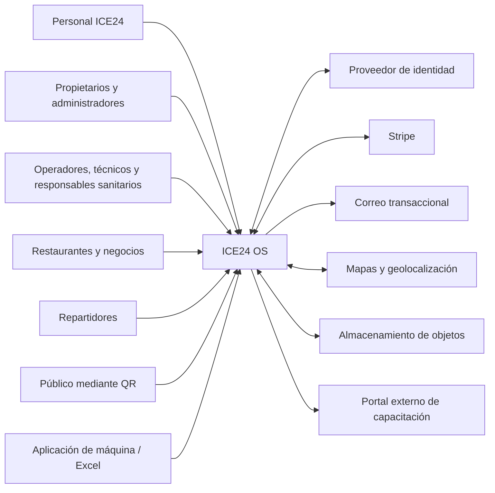

## 6. Vista de contenedores

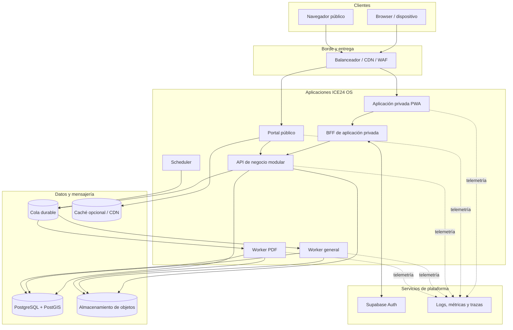

## 7. Principios arquitectónicos

1. **Denegación por defecto:** ningún acceso existe por omisión.
2. **Servidor como autoridad:** el cliente no decide permisos, tenant, propietario ni transiciones válidas.
3. **Trazabilidad antes que conveniencia:** no se destruye historial para simplificar operaciones.
4. **Datos estructurados:** los documentos complementan los datos, no los sustituyen.
5. **Archivos fuera de la base relacional:** PostgreSQL conserva metadatos y referencias.
6. **Asincronía para trabajo pesado:** las tareas prolongadas no bloquean solicitudes interactivas.
7. **Idempotencia:** reintentos no deben producir efectos duplicados.
8. **Separación público/privado:** el portal público lee proyecciones explícitas.
9. **Portabilidad razonable:** SDKs externos concentrados en adaptadores.
10. **Observabilidad desde el inicio:** correlación entre web, API, cola y worker.
11. **Evolución incremental:** primero modularidad y medición; después extracción de servicios.
12. **Configuración versionada:** plantillas, permisos, indicadores y reglas críticas conservan versión.

# Componentes

## 8. Catálogo de componentes

| Componente | Responsabilidad | Tipo de despliegue |
|---|---|---|
| Aplicación privada PWA | Operación autenticada, paneles, formularios, administración, trabajo offline y cambio de contexto. | Aplicación web independiente |
| Portal público | Consulta de información publicada, documentos públicos, QR y analítica de acceso. | Aplicación web independiente |
| BFF | Sesión segura del navegador, protección de tokens, CSRF y agregación de llamadas. | Parte del despliegue privado o servicio web asociado |
| API de negocio | Casos de uso, reglas, autorización, estados, transacciones, auditoría y contratos. | Contenedor stateless |
| Worker general | Correos, archivos, importaciones, exportaciones, notificaciones, proyecciones y reconciliaciones. | Contenedor stateless escalable |
| Worker PDF | Renderizado de reportes con Chromium y recursos aislados. | Contenedor especializado |
| Scheduler | Disparo de vencimientos, reportes, escalamientos y reconciliaciones. | Servicio administrado o proceso dedicado |
| Proveedor de identidad | Credenciales, sesiones, recuperación, contraseña temporal y 2FA. | Servicio independiente |
| PostgreSQL/PostGIS | Fuente transaccional, relaciones, estados, auditoría, geoespacial y outbox. | Base administrada |
| Almacenamiento de objetos | Originales, derivados, públicos, exportaciones, cuarentena y temporales. | Servicio de objetos |
| Cola | Desacoplamiento, reintentos y dead-letter queues. | Servicio durable |
| Observabilidad | Logs técnicos, métricas, trazas, alertas y salud. | Plataforma de monitoreo |

## 9. Módulos del backend

| Módulo | Responsabilidades |
|---|---|
| Platform Administration | Gobierno central, validaciones, restricciones y configuración global. |
| Identity Profile | Perfil local, asociaciones y sincronización con identidad externa. |
| Authorization | Roles, permisos, ámbitos y políticas. |
| Organizations | Cuentas, sucursales, contactos y datos fiscales. |
| Assets | Máquinas, códigos, series, ubicaciones, propiedad y transferencias. |
| Template Engine | Modelos, sistemas, componentes, actividades, formularios y versiones. |
| Maintenance | Calendarios, tickets, órdenes, diagnósticos y mantenimientos. |
| Sanitary Control | Bitácoras, controles, restricciones y acciones correctivas. |
| Laboratory | Análisis, parámetros, límites, resultados y vigencias. |
| Inventory | Productos, proveedores, almacenes, lotes y movimientos. |
| Files | Metadatos, cargas, integridad, derivados, versiones y acceso. |
| Reporting | Reportes, programación, generación, PDF y exportaciones. |
| Publication | Publicación, retiro, proyección pública, QR y autenticidad. |
| Sales Import | Validación de Excel, vista previa, duplicados, importación y anulación. |
| Cards | Tarjetas, asignaciones, recargas, retiros y transferencias. |
| Consumer Businesses | Negocios, sucursales consumidoras, usuarios y asociaciones. |
| Catalog and Pricing | Productos, precios, límites, disponibilidad y tarifas. |
| Orders | Creación, elegibilidad, toma atómica, estados, cancelaciones e incidencias. |
| Delivery | Repartidores, zonas, ubicación, entrega y ventas externas. |
| Analytics | Indicadores, fórmulas, versiones, proyecciones y series. |
| Notifications | Avisos, correo, navegador, confirmaciones y escalamiento. |
| Subscription | Demo, Stripe, estados de acceso, cancelación y reactivación. |
| Audit | Auditoría de negocio, consultas, filtros y retención. |
| Offline Sync | Paquetes offline, operaciones, archivos, conflictos y resolución. |
| Integration Adapters | Stripe, correo, mapas, objetos, PDF, capacitación y Excel. |

## 10. Relaciones entre módulos

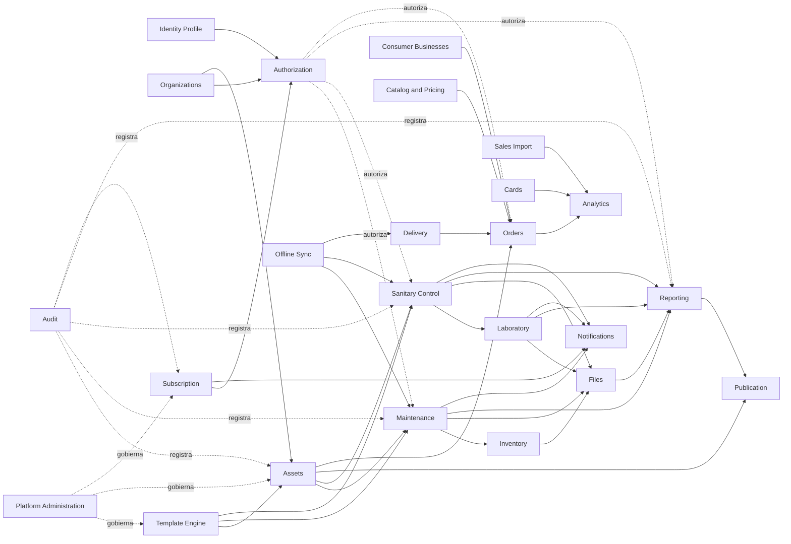

La dirección de las flechas representa dependencia funcional o consumo de contratos. No autoriza acceso directo a las tablas privadas del módulo dependiente.

# Frontend

## 11. Aplicaciones frontend

### 11.1 Aplicación privada PWA

La aplicación privada se recomienda en Next.js con React y App Router. Su comportamiento principal será el de una aplicación autenticada, responsiva e instalable.

Responsabilidades:

- inicio de sesión y cambio de contexto;
- navegación por cuenta, sucursal, máquina y función;
- paneles operativos, técnicos, sanitarios y comerciales;
- formularios dinámicos;
- administración de usuarios y permisos;
- captura de bitácoras, mantenimientos, pedidos y evidencias;
- visualización del estado de sincronización;
- operación offline limitada;
- vista previa de reportes;
- descarga autorizada de documentos;
- centro de notificaciones.

### 11.2 Portal público

El portal público se desplegará por separado y únicamente leerá proyecciones publicadas.

Responsabilidades:

- resolver identificadores QR públicos estables;
- mostrar identidad general de la máquina;
- presentar resúmenes técnico y sanitario publicados;
- ofrecer descargas públicas protegidas;
- mostrar la leyenda obligatoria de software de gestión;
- registrar escaneos y descargas públicas;
- utilizar caché y CDN sin exponer datos privados.

## 12. Arquitectura de frontend

La aplicación privada seguirá una organización por funcionalidades y dominios, evitando una separación global basada únicamente en componentes, hooks o servicios.

Capas conceptuales:

| Capa | Responsabilidad |
|---|---|
| App shell | Sesión, navegación, contexto, rutas y experiencia instalable. |
| Features | Casos de uso de usuario agrupados por dominio. |
| UI compartida | Componentes visuales, accesibilidad, tokens y patrones. |
| Client contracts | Clientes generados o tipados a partir de OpenAPI. |
| State server | Caché y estado proveniente de la API. |
| State local | Estado efímero de formularios y navegación. |
| Offline store | IndexedDB, colas locales y manifiestos sincronizados. |
| Telemetry | Errores de frontend, métricas web y correlación. |

## 13. BFF y sesión del navegador

Se recomienda un patrón Backend for Frontend para la aplicación privada:

- el navegador no conserva tokens persistentes del proveedor de identidad;
- el BFF ejecuta el flujo OIDC;
- la sesión se mantiene mediante cookies seguras, `HttpOnly` y `SameSite` apropiado;
- el BFF agrega credenciales y contexto al llamar a la API;
- las mutaciones se protegen contra CSRF;
- el BFF puede agregar varias lecturas cuando sea necesario para una pantalla;
- el BFF no sustituye las reglas ni permisos de la API.

## 14. Estado y sincronización en frontend

Se distinguirán cuatro categorías:

1. **Estado del servidor:** entidades y resultados obtenidos desde API.
2. **Estado de interfaz:** filtros, pestañas y modales.
3. **Estado de formularios:** valores aún no confirmados.
4. **Estado offline:** paquetes descargados, operaciones pendientes, archivos y errores.

No se utilizará el estado del frontend como fuente de verdad para permisos, suscripciones, estados de máquina o transiciones.

## 15. PWA y offline

El almacenamiento local recomendado es IndexedDB mediante una capa como Dexie.

Cada tarea descargada debe incluir:

- identificador de tarea;
- versión del registro base;
- acciones permitidas;
- fecha de sincronización;
- vigencia offline;
- formulario o checklist versionado;
- archivos mínimos necesarios;
- identificadores idempotentes para operaciones locales.

Funciones permitidas sin conexión:

- completar órdenes previamente sincronizadas;
- completar bitácoras descargadas;
- continuar pedidos ya tomados;
- capturar checklist, diagnósticos, mediciones, piezas, fotografías, firma y estados permitidos.

Funciones que requieren conexión:

- tomar pedidos;
- crear usuarios;
- modificar permisos o configuración;
- importar Excel;
- generar reportes;
- publicar contenido;
- modificar plantillas;
- procesar suscripciones.

## 16. Flujo de autenticación frontend

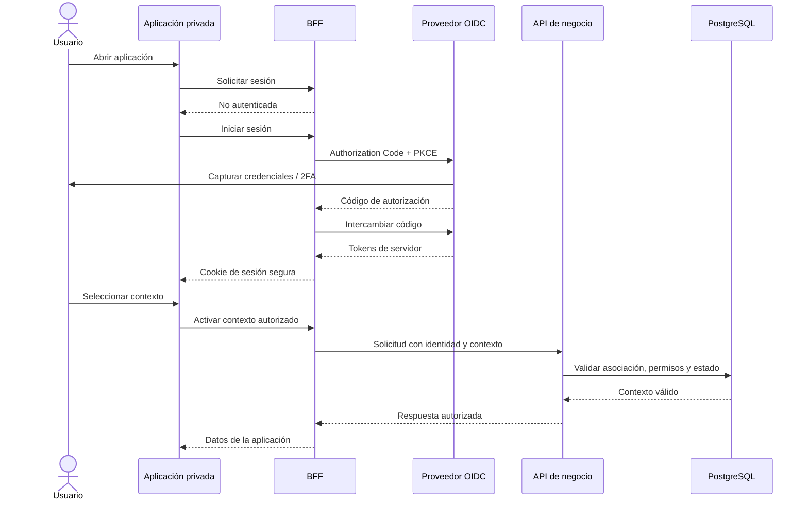

# Backend

## 17. Arquitectura interna

Cada módulo del backend seguirá una estructura inspirada en arquitectura hexagonal o clean architecture:

- **Domain:** reglas y conceptos del dominio sin dependencia del framework.
- **Application:** casos de uso, comandos, consultas y orquestación.
- **Infrastructure:** persistencia, adaptadores externos y detalles técnicos.
- **Interface:** controladores HTTP, consumidores de mensajes y contratos de entrada.

Las capas externas pueden depender de las internas; el dominio no debe depender de NestJS, Prisma, Stripe, S3, SQS ni otros SDKs.

## 18. API

La comunicación síncrona principal se realizará mediante una API REST versionada y documentada con OpenAPI.

Convenciones relevantes:

- recursos y operaciones alineados con el lenguaje del dominio;
- paginación obligatoria para colecciones;
- filtros explícitos por contexto, estado y periodo;
- claves de idempotencia en operaciones críticas;
- control optimista de concurrencia mediante versión o `ETag` cuando aplique;
- respuestas asíncronas con identificador de trabajo y estado;
- formato de errores compatible con RFC 9457;
- correlation ID en solicitudes y respuestas;
- separación entre API pública y API privada.

## 19. Operación transaccional

Una operación sensible deberá:

1. autenticar la sesión;
2. resolver el contexto activo;
3. validar estado de cuenta y asociación;
4. evaluar permisos;
5. validar precondiciones y transición;
6. ejecutar el cambio de negocio;
7. registrar auditoría;
8. registrar eventos outbox;
9. confirmar todo en una misma transacción;
10. procesar efectos externos después de la confirmación.

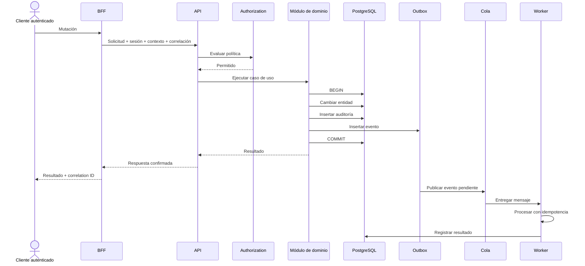

## 20. Patrón outbox y mensajería

La cola se tratará como un sistema de entrega **al menos una vez**. Por ello:

- cada mensaje tendrá identificador único;
- cada consumidor registrará mensajes procesados o efectos idempotentes;
- el outbox se confirmará junto con la transacción de negocio;
- los reintentos utilizarán backoff;
- los mensajes agotados pasarán a dead-letter queue;
- el reprocesamiento será manual o automático, pero siempre auditado;
- no se asumirán orden ni entrega inmediata en webhooks externos.

## 21. Workers

### 21.1 Worker general

Procesará:

- notificaciones y correos;
- archivos y derivados;
- importaciones de Excel;
- exportaciones;
- proyecciones públicas;
- reconciliaciones de Stripe;
- agregados analíticos;
- escalamientos y vencimientos.

### 21.2 Worker PDF

Se aislará debido al consumo de CPU y memoria de Chromium. Tendrá:

- concurrencia limitada;
- tiempo máximo por trabajo;
- límites de memoria;
- reintentos controlados;
- bloqueo de recursos externos no autorizados;
- caché de activos de marca;
- limpieza de temporales.

## 22. Motor de plantillas

Las plantillas oficiales serán versiones inmutables después de su publicación.

El motor debe soportar:

- definiciones de campos;
- obligatoriedad;
- unidades y precisión;
- límites inferiores y superiores;
- evidencia requerida;
- reglas condicionales justificadas;
- responsables;
- frecuencia;
- escalamiento;
- vigencia y versión.

Cada ejecución conservará tanto las respuestas como la versión exacta de la definición utilizada.

## 23. Manejo de errores

Los errores se clasificarán en:

- validación de entrada;
- autenticación;
- autorización;
- precondición de negocio;
- conflicto de versión;
- recurso inexistente;
- dependencia externa;
- trabajo asíncrono;
- sincronización offline;
- error técnico inesperado.

El mensaje presentado al usuario será comprensible y no expondrá secretos, SQL, rutas internas ni datos de otros contextos. Los detalles técnicos se asociarán con un correlation ID para soporte.

# Base de datos

## 24. Tecnología y rol

PostgreSQL será la fuente de verdad para datos estructurados y estados. PostGIS ampliará la base para consultas de distancia, zonas y pertenencia geográfica.

El acceso recomendado utilizará Prisma para operaciones comunes, complementado con SQL explícito para:

- PostGIS;
- Row-Level Security;
- particionamiento;
- vistas y proyecciones;
- consultas analíticas complejas;
- operaciones masivas controladas.

## 25. Modelo multiempresa

Se utilizará una base compartida con separación lógica por contexto.

### 25.1 Tipos de entidades

| Tipo | Ejemplos | Regla |
|---|---|---|
| Global | Usuario, máquina física, código ICE24 OS, modelo oficial | Existe una sola vez en la plataforma. |
| De cuenta | Sucursal, almacén, precio, inventario | Pertenece a una cuenta. |
| De asociación | Usuario-cuenta, usuario-máquina, restaurante-máquina | Define rol, ámbito, vigencia y estado. |
| Histórica por periodo | Propiedad, ubicación, titularidad de tarjeta | No se sobrescribe; utiliza inicio y fin. |
| Comercial | Venta, recarga, pedido, tarifa | Ligada al contexto que la originó. |
| Técnica/sanitaria | Mantenimiento, análisis, componente, bitácora | Ligada a la máquina física. |

### 25.2 Aislamiento

El aislamiento se aplicará mediante:

- autorización central;
- filtros obligatorios de contexto en repositorios;
- relaciones y claves foráneas;
- pruebas automatizadas de acceso cruzado;
- RLS en tablas de mayor riesgo cuando se valide su integración;
- credenciales separadas para aplicación, migraciones y operación;
- ausencia de acceso directo desde el navegador.

## 26. Modelo conceptual principal

```mermaid
erDiagram
    USER ||--o{ USER_ACCOUNT_ASSOCIATION : has
    ACCOUNT ||--o{ USER_ACCOUNT_ASSOCIATION : includes
    ACCOUNT ||--o{ BRANCH : owns
    BRANCH ||--o{ MACHINE_LOCATION_PERIOD : hosts
    MACHINE ||--o{ MACHINE_LOCATION_PERIOD : located_at
    ACCOUNT ||--o{ MACHINE_OWNERSHIP_PERIOD : owns_during
    MACHINE ||--o{ MACHINE_OWNERSHIP_PERIOD : owned_during

    MACHINE }o--|| MODEL_TEMPLATE_VERSION : uses
    MACHINE ||--o{ MACHINE_COMPONENT : contains
    MACHINE ||--o{ MAINTENANCE_ORDER : receives
    MACHINE ||--o{ SANITARY_LOG : records
    MACHINE ||--o{ LAB_ANALYSIS : has
    MACHINE ||--o{ PUBLIC_PROJECTION : publishes

    MAINTENANCE_ORDER ||--o{ FILE_RECORD : evidences
    SANITARY_LOG ||--o{ FILE_RECORD : evidences
    LAB_ANALYSIS ||--o{ FILE_RECORD : attaches

    ACCOUNT ||--o{ INVENTORY_LOCATION : has
    INVENTORY_LOCATION ||--o{ INVENTORY_MOVEMENT : records
    MACHINE_COMPONENT ||--o{ INVENTORY_MOVEMENT : originates

    CONSUMER_BUSINESS ||--o{ BUSINESS_MACHINE_ASSOCIATION : authorized_for
    MACHINE ||--o{ BUSINESS_MACHINE_ASSOCIATION : serves
    CONSUMER_BUSINESS ||--o{ ORDER : creates
    MACHINE ||--o{ ORDER : fulfills
    USER ||--o{ DRIVER_MACHINE_ASSOCIATION : assigned
    MACHINE ||--o{ DRIVER_MACHINE_ASSOCIATION : enables
    ORDER }o--o| USER : delivered_by

    ACCOUNT ||--o{ SUBSCRIPTION : subscribes
    USER ||--o{ AUDIT_EVENT : acts
    MACHINE ||--o{ AUDIT_EVENT : affected
```

El diagrama es conceptual. No representa todas las entidades ni sustituye el modelo lógico y físico de datos.

## 27. Principios de datos

- Identificadores internos no reutilizables.
- Código ICE24 OS permanente y visible.
- Fechas técnicas almacenadas en UTC.
- Conversión a zona horaria al mostrar o programar.
- Dinero almacenado en unidades enteras menores.
- Mediciones con valor, unidad, precisión y origen.
- Correcciones mediante versiones, no sobrescritura silenciosa.
- Plantillas publicadas inmutables.
- Estados controlados mediante transiciones válidas.
- Archivos binarios fuera de PostgreSQL.
- JSONB solo para estructura dinámica justificada.
- Índices alineados con contexto, estado y fecha.

## 28. Máquina como activo permanente

La identidad de la máquina se separará en:

- activo físico;
- código ICE24 OS;
- número de serie;
- periodos de propiedad;
- periodos de ubicación;
- configuración de modelo y plantilla;
- historial técnico y sanitario;
- relaciones comerciales por cuenta.

Una transferencia cerrará el periodo de propiedad anterior y abrirá uno nuevo. No cambiará el código del equipo ni su historial técnico y sanitario.

## 29. Auditoría

La auditoría de negocio será append-only e incluirá:

- identificador del evento;
- fecha UTC y fecha local;
- usuario, sesión y contexto;
- cuenta, sucursal y máquina;
- entidad y operación;
- valores anterior y nuevo o diferencia;
- motivo;
- origen, dispositivo e IP aproximada;
- resultado;
- correlation ID.

La auditoría no se mezclará con logs técnicos ni podrá editarse desde la aplicación.

# Servicios externos

## 30. Integraciones

| Servicio | Uso | Patrón de integración | Controles |
|---|---|---|---|
| Supabase Auth | Identidad, sesiones, recuperación y 2FA | Authorization Code + PKCE mediante BFF | Validación de emisor, audiencia, sesión y revocación |
| Stripe | Suscripción de ICE24 OS | API saliente, webhooks y reconciliación | Firma, idempotencia, evento original y fuente externa de verdad |
| Correo transaccional | Alertas, recuperación y reportes | Cola y proveedor intercambiable | Plantillas versionadas, reintentos y estado de entrega |
| Mapas/geolocalización | Cercanía, zonas, rutas y tarifas | Adaptador de API | Cuotas, caché permitida y manejo de permiso denegado |
| S3 o compatible | Archivos y exportaciones | URLs temporales y eventos | Cifrado, buckets privados, ciclo de vida y cuarentena |
| SQS o equivalente | Trabajos asíncronos | Mensajes durables | Idempotencia, reintentos y DLQ |
| Scheduler administrado | Vencimientos y tareas programadas | Eventos programados | Ejecución observable e idempotente |
| Playwright/Chromium | Generación de PDF | Worker dedicado | Límites, aislamiento y recursos autorizados |
| Portal de capacitación | Acceso externo | Redirección | Lista blanca y sin compartir credenciales |
| Excel de aplicación de máquina | Importación de ventas | Carga manual y adaptadores versionados | Vista previa, deduplicación y conservación del original |
| Plataforma de observabilidad | Logs, métricas y trazas | OpenTelemetry | Redacción de datos y correlación |

## 31. Principio de adaptadores

Los SDKs externos se limitarán a módulos de infraestructura. Los dominios consumirán interfaces internas, por ejemplo:

- proveedor de correo;
- almacenamiento de archivos;
- cola de trabajos;
- mapas y geocodificación;
- gateway de suscripción;
- renderizador de PDF;
- proveedor de identidad.

Esto permite sustituir un proveedor sin alterar reglas de negocio.

# Flujo de datos

## 32. Flujo autenticado general

1. El usuario inicia sesión con el proveedor OIDC.
2. El BFF conserva la sesión segura.
3. El usuario selecciona un contexto autorizado.
4. La solicitud llega a la API con identidad, sesión y correlación.
5. La API resuelve el contexto y evalúa autorización.
6. El módulo valida reglas y estados.
7. El cambio, la auditoría y el outbox se confirman transaccionalmente.
8. La respuesta se devuelve al usuario.
9. Los efectos externos se ejecutan en workers.

## 33. Flujo de archivos

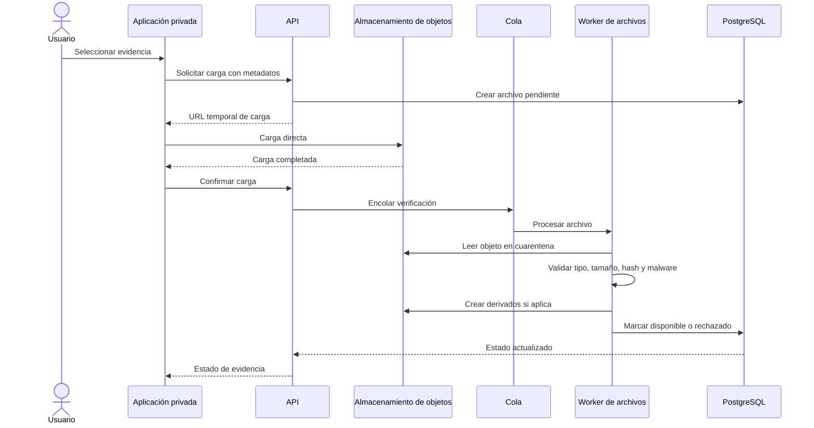

Reglas:

- los archivos no atravesarán la memoria de la API;
- los originales serán privados;
- las versiones públicas se generarán en una zona separada;
- las descargas usarán URLs temporales;
- una actividad no se completará hasta que la evidencia obligatoria esté disponible.

## 34. Flujo de reportes y PDF

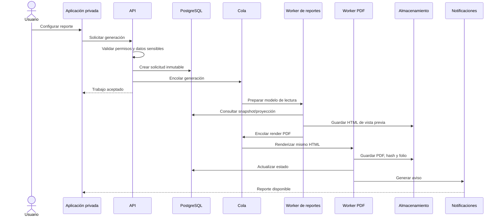

La vista previa y el PDF usarán la misma plantilla, datos y reglas de composición.

## 35. Flujo offline

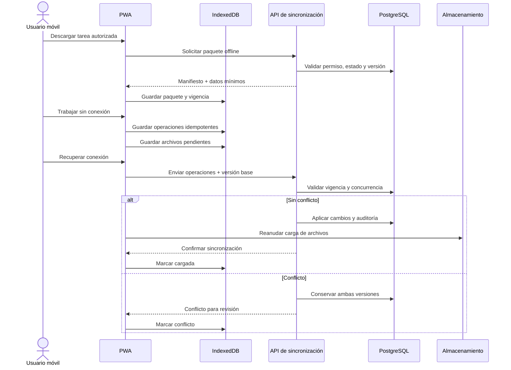

## 36. Flujo de publicación pública

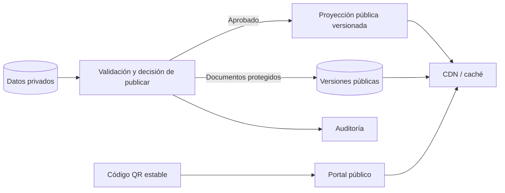

El portal no filtrará tablas privadas en tiempo real. Solo consumirá la proyección previamente aprobada y auditada.

## 37. Flujo de suscripción

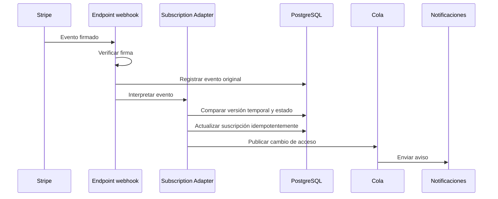

Stripe será la fuente de verdad externa de pago. Los eventos deberán reconciliarse porque pueden llegar repetidos, retrasados o fuera de orden.

# Comunicación entre componentes

## 38. Matriz de comunicación

| Origen | Destino | Protocolo/patrón | Tipo | Observaciones |
|---|---|---|---|---|
| Navegador privado | BFF | HTTPS | Síncrona | Cookie segura; protección CSRF. |
| BFF | Proveedor OIDC | OIDC/OAuth 2.0 | Síncrona | Tokens solo del lado servidor. |
| BFF | API privada | HTTPS/REST | Síncrona | Identidad, contexto y correlation ID. |
| Portal público | API pública | HTTPS/REST | Síncrona | Solo proyecciones públicas. |
| API | PostgreSQL | Protocolo PostgreSQL | Síncrona/transaccional | Fuente de verdad. |
| API | Almacenamiento | SDK/HTTPS | Síncrona breve | Generación de URLs temporales y metadatos. |
| Navegador | Almacenamiento | HTTPS firmado | Síncrona directa | Carga y descarga temporal. |
| API | Cola | Mensaje | Asíncrona | Mediante outbox/publicador. |
| Scheduler | Cola | Evento programado | Asíncrona | Vencimientos y tareas. |
| Cola | Workers | Mensaje | Asíncrona | Entrega al menos una vez. |
| Workers | PostgreSQL | Protocolo PostgreSQL | Síncrona | Estados, resultados y auditoría. |
| Workers | Servicios externos | HTTPS/SDK | Síncrona con reintentos | Aislada mediante adaptadores. |
| Componentes | Observabilidad | OTLP/telemetría | Asíncrona | Logs, trazas y métricas. |

## 39. Reglas de comunicación interna

- Un módulo no accede directamente a los repositorios internos de otro.
- La comunicación síncrona entre módulos se realiza mediante casos de uso o interfaces públicas internas.
- Los eventos internos notifican hechos confirmados, no solicitudes ambiguas.
- Los efectos externos se ejecutan después de la confirmación transaccional.
- Los contratos se versionan cuando el cambio no es compatible.
- Los módulos no comparten entidades del ORM.
- Los mensajes de cola incluyen versión de esquema.
- Las operaciones críticas aceptan claves de idempotencia.
- Las trazas conservan el mismo correlation ID a través de API, cola y worker.

## 40. Contratos

Los contratos se separarán en:

- API privada;
- API pública;
- eventos internos;
- mensajes de cola;
- errores;
- sincronización offline;
- formatos Excel;
- formularios dinámicos.

OpenAPI será el contrato principal de las APIs HTTP. Los eventos y mensajes tendrán esquemas versionados y pruebas de compatibilidad.

# Dependencias

## 41. Dependencias internas

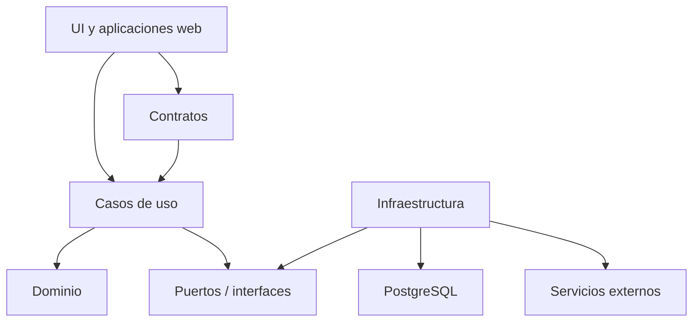

La dirección de dependencia se orienta hacia el dominio. Infraestructura implementa interfaces definidas por capas internas.

### 41.1 Reglas

- Domain no depende de framework, ORM, HTTP o SDK externo.
- Application depende del dominio y de interfaces.
- Infrastructure implementa persistencia e integraciones.
- Interface adapta HTTP, mensajes y tareas a casos de uso.
- Frontend consume contratos, no entidades de persistencia.
- Paquetes compartidos no deben convertirse en un módulo global sin límites.

## 42. Dependencias externas de software

| Dependencia | Uso | Riesgo principal | Mitigación |
|---|---|---|---|
| Next.js/React | Aplicaciones web | Cambios en renderizado y caché | Versiones estables y E2E. |
| NestJS | API y workers | Acoplamiento al framework | Dominio independiente. |
| PostgreSQL/PostGIS | Persistencia y geoespacial | Consultas o crecimiento | Índices, medición y evolución por etapas. |
| Prisma | Acceso a datos | Límites con SQL avanzado | SQL explícito y repositorios especializados. |
| Supabase Auth | Identidad | Disponibilidad, límites y cambios del proveedor | Proyectos separados, monitoreo, exportación y pruebas en staging. |
| Dexie/IndexedDB | Offline | Diferencias entre navegadores | Matriz de soporte y pruebas reales. |
| Chromium/Playwright | PDF | Consumo de recursos | Worker separado y límites. |
| S3/SQS/AWS o equivalentes | Archivos y colas | Acoplamiento al proveedor | Adaptadores y contratos internos. |
| OpenTelemetry | Observabilidad | Configuración y volumen | Muestreo, redacción y políticas de retención. |

## 43. Dependencias funcionales críticas

| Capacidad | Depende de |
|---|---|
| Mantenimiento | Equipos, plantillas, componentes, usuarios, permisos, archivos y alertas. |
| Sanidad | Plantillas, documentos, laboratorio, estados, alertas y publicación. |
| Reportes | Datos fuente, permisos, archivos, PDF, cola y correo. |
| Portal público | Publicación, proyección, documentos públicos y QR. |
| Pedidos | Negocios, máquinas, productos, precios, repartidores, tarjetas y mapas. |
| Ganancia estimada | Recargas, pedidos o ventas externas y reglas de costo. |
| Predicción | Historial consistente y georreferenciado. |
| Offline | Identidad, permisos, tareas versionadas, archivos y sincronización. |

# Principios SOLID aplicados

## 44. Single Responsibility Principle — Responsabilidad única

Cada componente y módulo tendrá una responsabilidad claramente delimitada.

Aplicación:

- Identity autentica y representa identidades; Authorization decide acceso.
- Files gestiona archivos; los módulos de negocio solo referencian evidencia.
- Reporting prepara reportes; PDF Worker renderiza documentos.
- Subscription administra acceso comercial; Stripe Adapter traduce eventos externos.
- Audit registra trazabilidad de negocio; Observability registra comportamiento técnico.

Beneficios:

- cambios localizados;
- pruebas más específicas;
- menor riesgo de efectos secundarios;
- propiedad de módulo más clara.

## 45. Open/Closed Principle — Abierto a extensión, cerrado a modificación

La arquitectura permitirá extender comportamientos mediante contratos, adaptadores y definiciones versionadas sin alterar el núcleo de negocio.

Aplicación:

- nuevos proveedores de correo implementan el mismo puerto;
- nuevos formatos Excel se agregan como adaptadores versionados;
- nuevas plantillas sanitarias se publican como configuraciones versionadas;
- nuevos tipos de notificación se conectan al sistema de eventos;
- nuevos proveedores de objetos o colas pueden sustituirse detrás de interfaces.

No significa evitar todo cambio; significa impedir que cada nueva integración obligue a reescribir los módulos centrales.

## 46. Liskov Substitution Principle — Sustitución de Liskov

Toda implementación de una interfaz debe respetar el mismo contrato observable.

Aplicación:

- un proveedor de almacenamiento alternativo debe preservar privacidad, URLs temporales, integridad y estados;
- un proveedor de correo debe devolver estados y errores normalizados;
- un adaptador de mapas debe entregar coordenadas y distancias en el formato acordado;
- un procesador de Excel debe producir vista previa, errores y deduplicación consistentes.

Las implementaciones no podrán debilitar garantías, por ejemplo, devolver URLs permanentes donde el contrato exige accesos temporales.

## 47. Interface Segregation Principle — Segregación de interfaces

Los módulos consumirán interfaces pequeñas y específicas, no servicios genéricos con responsabilidades excesivas.

Aplicación:

- lectura de archivos, creación de URL de carga y publicación pública pueden ser contratos separados;
- envío de correo no debe incluir configuración de suscripciones;
- consulta geográfica no debe exponer toda la API del proveedor de mapas;
- autorización de lectura y autorización de publicación se modelan como acciones distintas;
- workers consumen contratos específicos por tipo de trabajo.

Esto reduce acoplamiento y evita que un componente dependa de operaciones que no utiliza.

## 48. Dependency Inversion Principle — Inversión de dependencias

Los módulos de negocio dependerán de abstracciones definidas internamente. Los detalles externos dependerán de esas abstracciones.

Aplicación:

- Subscription depende de un `SubscriptionGateway`, no directamente de Stripe;
- Files depende de un `ObjectStorage`, no del SDK de S3;
- Notifications depende de un `MailProvider`, no de SES u otro proveedor;
- Reporting depende de un `DocumentRenderer`, no de Playwright;
- Application depende de repositorios, no de Prisma;
- Offline Sync depende de contratos de persistencia y archivos, no de implementaciones concretas.

## 49. SOLID en la organización del repositorio

| Principio | Manifestación estructural |
|---|---|
| SRP | Paquetes y módulos con una función definida. |
| OCP | Adaptadores, eventos y configuraciones versionadas. |
| LSP | Pruebas de contrato para implementaciones intercambiables. |
| ISP | Puertos pequeños por capacidad. |
| DIP | Dominio y aplicación sin dependencia directa de infraestructura. |

# Despliegue y operación

## 50. Topología propuesta

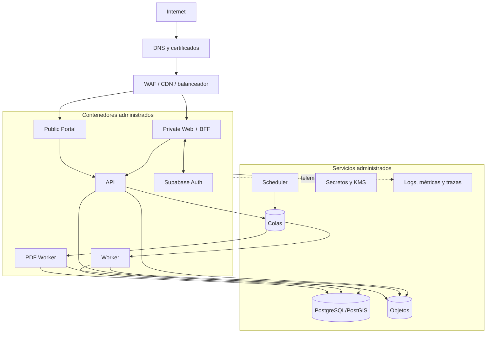

El TRD utiliza AWS administrado como arquitectura de referencia, pero el proveedor definitivo permanece pendiente.

## 51. Escalabilidad

La evolución recomendada es:

1. consultas e índices correctos;
2. paginación y límites;
3. pool de conexiones;
4. escalado horizontal de web, API y workers;
5. separación de colas por tipo de trabajo;
6. proyecciones y tablas agregadas;
7. particionamiento selectivo;
8. réplica de lectura;
9. almacén analítico si el volumen lo justifica;
10. extracción de servicios solo con evidencia.

No se recomienda sharding en las primeras etapas.

Posibles candidatos futuros a servicio independiente:

- PDF;
- importaciones;
- notificaciones;
- portal público;
- analítica.

## 52. Rendimiento

Principios:

- no ejecutar tareas pesadas dentro del request interactivo;
- paginar listas e historiales;
- evitar consultas N+1;
- utilizar carga directa de archivos;
- servir imágenes optimizadas;
- cachear el portal público;
- procesar Excel de forma asíncrona;
- medir experiencia real y trazas de servidor.

Objetivos iniciales propuestos por el TRD, sujetos a validación:

| Operación | Objetivo inicial |
|---|---|
| Lectura API común | p95 ≤ 500 ms, sin red del usuario. |
| Escritura API común | p95 ≤ 800 ms, sin efectos asíncronos. |
| Autorización de carga | p95 ≤ 1 s. |
| Portal público cacheado | p95 de origen ≤ 300 ms. |
| Página privada principal | LCP ≤ 2.5 s en dispositivo y red acordados. |
| Encolado de alerta crítica | ≤ 60 s desde confirmación. |
| Inicio de trabajo en cola | p95 ≤ 30 s en operación normal. |
| Reporte estándar | Objetivo ≤ 2 min. |
| Sincronización sin archivo | Objetivo ≤ 2 s con conectividad estable. |

## 53. Seguridad

La arquitectura deberá considerar como mínimo:

- autenticación OIDC;
- BFF y cookies seguras;
- 2FA opcional, con capacidad futura de obligatoriedad;
- autorización RBAC/ABAC;
- validación en servidor;
- aislamiento multiempresa;
- cifrado en tránsito y reposo;
- secretos fuera del código;
- URLs temporales;
- cuarentena y análisis de archivos;
- WAF y cabeceras de seguridad;
- protección CSRF;
- rate limiting;
- auditoría inmutable;
- minimización de datos offline;
- borrado local al cerrar sesión dentro de las capacidades del navegador;
- pruebas de acceso cruzado;
- backups y restauraciones probadas.

## 54. Logging y observabilidad

Se mantendrán dos mecanismos separados:

### 54.1 Auditoría de negocio

Registra acciones y decisiones funcionales que deben conservarse durante la vida del expediente o según la política vigente.

### 54.2 Telemetría técnica

Registra:

- errores;
- latencia;
- trazas;
- uso de recursos;
- colas;
- webhooks;
- tareas programadas;
- dependencias externas;
- salud de servicios.

Todos los componentes utilizarán logging estructurado y correlation ID. No se incluirán contraseñas, tokens, secretos, archivos completos ni datos personales innecesarios.

# Organización del proyecto

## 55. Estructura recomendada

```text
/apps
  /private-web
  /public-portal
  /api
  /worker
  /pdf-worker
/packages
  /contracts
  /ui
  /domain
  /authorization
  /database
  /offline
  /config
  /observability
  /testing
/infra
  /terraform
  /containers
/docs
  /adr
  /diagrams
  /runbooks
  /security
```

## 56. Estructura conceptual de un módulo backend

```text
/module-name
  /domain
  /application
  /infrastructure
  /interface
  /tests
  README.md
```

No se utilizarán carpetas globales que mezclen controladores, servicios o repositorios de todos los dominios.

## 57. Convenciones de dependencia

- Las aplicaciones pueden consumir paquetes compartidos.
- Los paquetes compartidos no deben depender de las aplicaciones.
- Domain no depende de infrastructure.
- Contracts no exponen entidades Prisma.
- Authorization se consume como política central, pero las reglas específicas permanecen en el dominio correspondiente.
- Integration Adapters concentran SDKs de terceros.
- Observability no contiene lógica de negocio.

# Riesgos y decisiones pendientes

## 58. Riesgos arquitectónicos

| Riesgo | Impacto | Mitigación |
|---|---|---|
| Alcance amplio | Entregas tardías y acoplamiento | Construcción por etapas y límites modulares. |
| Permisos complejos | Exposición entre cuentas | Autorización central, denegación por defecto y pruebas cruzadas. |
| Offline web limitado | Datos locales persistentes o conflictos | Minimización, vigencia, cifrado selectivo e idempotencia. |
| Dependencia de Supabase Auth | Fallas de acceso, límites o cambios del proveedor | Monitoreo, staging, exportación y plan de contingencia. |
| Prisma con PostGIS/RLS | Consultas frágiles | SQL explícito y repositorios especializados. |
| PDF intensivo | Caída o lentitud | Worker aislado y concurrencia limitada. |
| Archivos maliciosos | Compromiso de plataforma | Cuarentena, escaneo y dominios separados. |
| Crecimiento de archivos y auditoría | Costos y rendimiento | Ciclos de vida, derivados y particionamiento selectivo. |
| Mensajes duplicados | Efectos repetidos | Outbox e idempotencia. |
| Webhooks fuera de orden | Estado de suscripción incorrecto | Registro original, versión temporal y reconciliación. |
| Fuga en portal público | Riesgo legal y reputacional | Proyección pública separada y pruebas. |
| Cambios de Excel | Importaciones incorrectas | Adaptadores versionados y vista previa. |
| Transferencia de máquina | Mezcla de historia y propiedad | Periodos y separación técnica/comercial. |
| Plantillas dinámicas | Registros incompatibles | Versiones inmutables. |
| Analítica pesada | Degradación transaccional | Agregaciones y réplica futura. |
| Dependencia cloud | Costos o dificultad de migración | Adaptadores y tecnologías portables. |

## 59. Decisiones abiertas para Etapa 0

1. Proveedor cloud y región.
2. Disponibilidad, RPO y RTO definitivos.
3. Volúmenes de cuentas, máquinas, usuarios y archivos.
4. Navegadores y versiones mínimas.
5. Límites exactos del modo offline.
6. Política de 2FA para roles críticos.
7. Proveedor de correo.
8. Proveedor de mapas.
9. Servicio antimalware.
10. Retención de logs, auditoría, archivos y cuentas canceladas.
11. Dominios de aplicación, portal y archivos.
12. Formato y longitud del código ICE24 OS.
13. Matriz completa de roles y permisos.
14. Formatos reales de Excel.
15. Plantillas finales de mantenimiento y sanidad.
16. Límites y parámetros normativos validados.
17. Reglas de publicación y anonimización.
18. Recuperación manual de identidad.
19. Resolución de conflictos offline.
20. Modelo de soporte e incidentes.
21. Definición formal del MVP o primera liberación.

# Criterios de validación arquitectónica

## 60. Modularidad

- Los módulos pueden probarse de forma aislada.
- Ningún controlador accede directamente a datos de otro módulo.
- Los SDKs externos se limitan a adaptadores.
- Los contratos entre módulos son explícitos.

## 61. Seguridad e identidad

- Existe una identidad global por persona.
- El usuario puede cambiar de contexto autorizado sin autenticarse otra vez.
- La API rechaza manipulación de IDs y acceso cruzado.
- Los tokens persistentes no se exponen al JavaScript del navegador.
- Los archivos privados no tienen URLs públicas permanentes.

## 62. Datos y consistencia

- El código ICE24 OS permanece estable.
- Las correcciones conservan historia.
- Las plantillas publicadas son inmutables.
- La toma de pedido es atómica.
- Los trabajos repetidos no duplican efectos.
- La información pública proviene de una proyección publicada.

## 63. Offline

- Solo se descargan tareas autorizadas.
- Cada operación local tiene estado visible.
- Los conflictos conservan ambas versiones.
- La sincronización tolera reintentos.
- Las cargas de archivos pueden reanudarse sin duplicar la actividad.

## 64. Observabilidad y continuidad

- Toda solicitud tiene correlation ID.
- La traza continúa a través de API, cola y worker.
- Existen alertas para colas, backups, errores y webhooks.
- La restauración se prueba antes del lanzamiento.
- Las descargas públicas y privadas pueden distinguirse.

# Trazabilidad con PRD y TRD

## 65. Mapeo resumido

| Dominio del PRD | Componentes de arquitectura |
|---|---|
| Administración | Private Web, Platform Administration, Authorization, Audit. |
| Identidad | BFF, Supabase Auth, Identity Profile, Authorization. |
| Cuentas y equipos | Organizations, Assets, PostgreSQL. |
| Plantillas | Template Engine y formularios versionados. |
| Mantenimiento | Maintenance, Offline Sync, Inventory, Files y Notifications. |
| Sanidad/laboratorio | Sanitary Control, Laboratory, Files, Restrictions y Publication. |
| Inventario | Inventory, Maintenance y Audit. |
| Documentos | Files, almacenamiento privado, procesamiento y Audit. |
| Reportes | Reporting, colas, PDF Worker, almacenamiento y correo. |
| Portal QR | Public Portal, Publication, proyección pública y CDN. |
| Ventas Excel | Sales Import, adaptadores y workers. |
| Tarjetas | Cards, transacciones e idempotencia. |
| Negocios y pedidos | Consumer Businesses, Catalog, Orders, Delivery y PostGIS. |
| Analítica | Analytics, agregaciones y fórmulas versionadas. |
| Alertas | Notifications, scheduler, cola y correo. |
| Suscripción | Subscription, Stripe Adapter y webhooks. |
| Auditoría | Audit, OpenTelemetry y almacenamiento. |
| PWA | Next.js, IndexedDB/Dexie y Offline Sync. |

# Architecture Decision Records requeridos

## 66. ADR iniciales

| ADR | Decisión |
|---|---|
| ADR-001 | Monolito modular con workers asíncronos. |
| ADR-002 | Aplicación privada y portal público separados. |
| ADR-003 | API REST versionada con OpenAPI. |
| ADR-004 | PostgreSQL/PostGIS como fuente transaccional. |
| ADR-005 | Multiempresa con esquema compartido y aislamiento lógico. |
| ADR-006 | Supabase Auth como proveedor de identidad, conforme a ADR-017. |
| ADR-007 | Autorización de negocio dentro de ICE24 OS. |
| ADR-008 | Almacenamiento de objetos privado. |
| ADR-009 | Transactional outbox y cola administrada. |
| ADR-010 | Vista previa y PDF desde la misma plantilla. |
| ADR-011 | IndexedDB para offline controlado. |
| ADR-012 | OpenTelemetry para observabilidad. |
| ADR-013 | Contenedores e infraestructura como código. |
| ADR-014 | No iniciar con microservicios. |

---

**ICE24 OS — Architecture — Versión 1.0**
