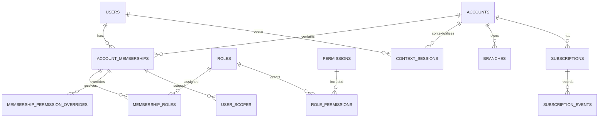
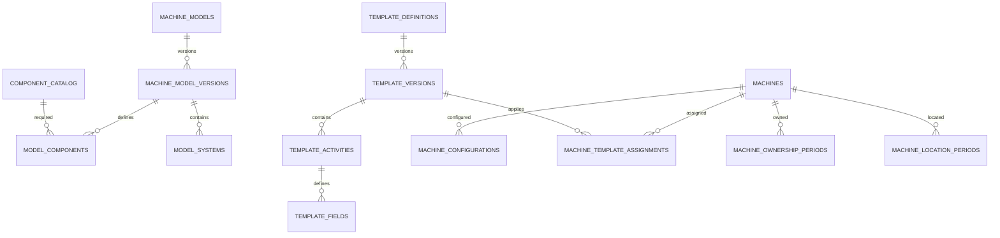
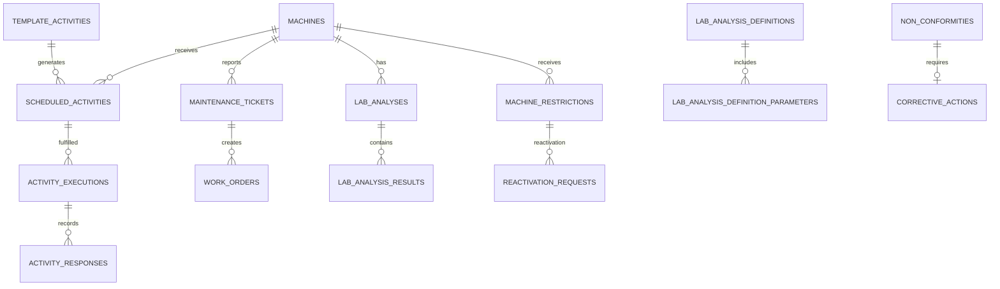
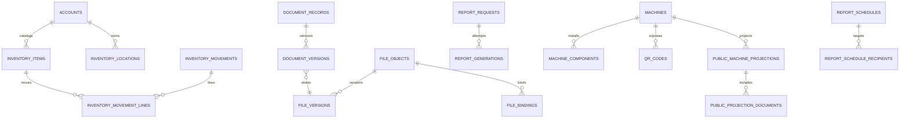
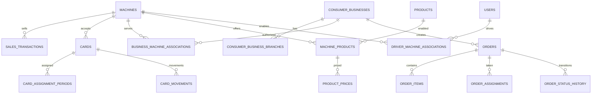
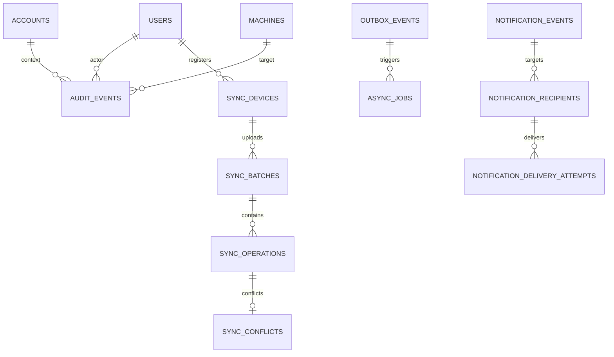

# ICE24 OS — Database Design

## Control del documento

| Campo | Valor |
|---|---|
| Documento | `Database.md` — Diseño lógico y físico propuesto de base de datos |
| Producto | ICE24 OS |
| Versión | 1.0 |
| Fecha | Agosto de 2026 |
| Fuentes | PRD v1.0 y TRD v1.0 de ICE24 OS |
| Estado | Propuesta para validación de producto, arquitectura, seguridad y desarrollo |
| Motor objetivo | PostgreSQL con PostGIS |
| Alcance | Modelo relacional completo; no contiene SQL ni migraciones ejecutables |

## 1. Propósito

Este documento convierte los requerimientos del PRD y las decisiones del TRD en un modelo lógico de datos implementable. Define entidades, campos, tipos, llaves, índices, restricciones, relaciones y reglas de integridad para una plataforma multiempresa con historial permanente por máquina, formularios versionados, operación offline, documentos protegidos, comercio, reparto, auditoría y procesamiento asíncrono.

Las decisiones físicas que no están cerradas en el PRD/TRD se identifican como **propuestas técnicas** o **preguntas abiertas**. No se incluyen integraciones ni módulos expresamente fuera de alcance, como control físico de la máquina, telemetría Brain, pago de pedidos, timbrado fiscal o saldo real de tarjetas.

## 2. Decisiones estructurales

- Una sola base PostgreSQL con esquema compartido y separación lógica por contexto.
- Entidades privadas incluyen `account_id` o una relación inequívoca para derivarlo.
- La máquina es un activo global permanente; propiedad y ubicación se modelan por periodos.
- PostgreSQL es la fuente de verdad de estados y datos estructurados; los binarios viven en almacenamiento de objetos.
- Identidad y credenciales pertenecen al proveedor OIDC; la base local conserva perfil, membresías, ámbitos y sesiones de contexto.
- Fechas técnicas se almacenan en UTC; las programaciones conservan hora local y zona IANA.
- Dinero se almacena en unidades menores enteras (`bigint`) y nunca en punto flotante.
- Las mediciones usan `numeric`, unidad y precisión explícitas.
- Las plantillas publicadas y documentos versionados son inmutables.
- Las correcciones, anulaciones y reversos generan nuevas filas o eventos; no sobrescriben silenciosamente.
- Las operaciones críticas usan versión esperada e idempotency key.
- La auditoría es append-only y está separada de los logs técnicos.
- El portal público lee una proyección explícita; no filtra tablas privadas en tiempo real.

## 3. Convenciones de nombres y tipos

| Elemento | Convención |
|---|---|
| Tablas y columnas | `snake_case`, nombres técnicos en inglés. |
| Llaves primarias | `uuid`; nunca folios o códigos visibles. |
| Folios | `varchar`, únicos por dominio; no son PK. |
| Fechas técnicas | `timestamptz` en UTC. |
| Fecha/hora local programada | `timestamp` o `time` más zona IANA. |
| Dinero | `bigint` en centavos + `char(3)` de moneda. |
| Cantidades/mediciones | `numeric(p,s)` + unidad catalogada. |
| Coordenadas | `geography(Point,4326)`; zonas con `geography(MultiPolygon,4326)`. |
| Datos dinámicos | `jsonb` solo para configuración declarativa, snapshots o payloads no relacionales. |
| Estado | `varchar` con `CHECK` y máquina de estados en la aplicación; no enum de PostgreSQL para facilitar evolución controlada. |
| Soft delete | `archived_at`; entidades históricas no permiten hard delete. |
| Concurrencia | `row_version bigint`. |

## 4. Campos de auditoría comunes

Salvo que se indique **append-only**, toda tabla mutable incorpora estos campos adicionales:

| Campo | Tipo | Nulo | Relación | Uso |
|---|---|---:|---|---|
| `created_at` | `timestamptz` | NO | — | Fecha técnica UTC de creación. |
| `created_by_user_id` | `uuid` | SÍ | FK → users.id | Actor que creó el registro; nulo para procesos del sistema. |
| `updated_at` | `timestamptz` | NO | — | Fecha técnica UTC de última modificación. |
| `updated_by_user_id` | `uuid` | SÍ | FK → users.id | Actor de la última modificación. |
| `row_version` | `bigint` | NO | — | Versión monotónica para control optimista de concurrencia. |
| `archived_at` | `timestamptz` | SÍ | — | Archivado lógico; nunca implica borrado físico. |

Las tablas append-only incorporan `created_at`, `correlation_id` cuando aplique y no exponen operaciones de actualización o eliminación desde la aplicación. Si un campo común ya aparece expresamente en una tabla, se utiliza una sola columna y prevalece la definición más específica. Los cambios sensibles también producen una fila en `audit_events`.

## 5. Modelo ER general

```mermaid
erDiagram
    USERS ||--o{ ACCOUNT_MEMBERSHIPS : belongs
    ACCOUNTS ||--o{ ACCOUNT_MEMBERSHIPS : includes
    ACCOUNTS ||--o{ BRANCHES : owns
    BRANCHES ||--o{ BRANCH_ENVIRONMENT_READINGS : measures
    ACCOUNTS ||--o{ SUBSCRIPTIONS : subscribes

    MACHINES ||--o{ MACHINE_OWNERSHIP_PERIODS : ownership_history
    ACCOUNTS ||--o{ MACHINE_OWNERSHIP_PERIODS : owns_during
    MACHINES ||--o{ MACHINE_LOCATION_PERIODS : location_history
    BRANCHES ||--o{ MACHINE_LOCATION_PERIODS : hosts_during
    MACHINES }o--|| MACHINE_MODELS : model
    MACHINES ||--o{ MACHINE_TEMPLATE_ASSIGNMENTS : template_history

    MACHINES ||--o{ SCHEDULED_ACTIVITIES : schedules
    SCHEDULED_ACTIVITIES ||--o{ ACTIVITY_EXECUTIONS : executed_as
    ACTIVITY_EXECUTIONS ||--o{ ACTIVITY_RESPONSES : answers
    MACHINES ||--o{ LAB_ANALYSES : analyzed
    LAB_ANALYSES ||--o{ LAB_ANALYSIS_RESULTS : results
    MACHINES ||--o{ MACHINE_RESTRICTIONS : restricted

    ACCOUNTS ||--o{ INVENTORY_LOCATIONS : has
    INVENTORY_MOVEMENTS ||--o{ INVENTORY_MOVEMENT_LINES : contains
    MACHINES ||--o{ MACHINE_COMPONENTS : contains

    DOCUMENT_RECORDS ||--o{ DOCUMENT_VERSIONS : versions
    FILE_OBJECTS ||--o{ FILE_VERSIONS : versions
    DOCUMENT_VERSIONS }o--|| FILE_VERSIONS : binary
    MACHINES ||--o{ PUBLIC_MACHINE_PROJECTIONS : publishes

    CONSUMER_BUSINESSES ||--o{ BUSINESS_MACHINE_ASSOCIATIONS : authorized
    MACHINES ||--o{ BUSINESS_MACHINE_ASSOCIATIONS : serves
    CONSUMER_BUSINESSES ||--o{ ORDERS : creates
    MACHINES ||--o{ ORDERS : fulfills
    ORDERS ||--o{ ORDER_ITEMS : contains
    ORDERS ||--o{ ORDER_ASSIGNMENTS : assigned

    USERS ||--o{ AUDIT_EVENTS : acts
    MACHINES ||--o{ AUDIT_EVENTS : affected
```

## 6. Diagramas ER por dominio

### 6.1 Identidad y cuentas

### 6.2 Máquinas y plantillas

### 6.3 Operación y sanidad

### 6.4 Inventario, documentos y reportes

### 6.5 Comercio y reparto

### 6.6 Auditoría, eventos y offline

## 7. Diccionario de datos

El siguiente diccionario contiene las columnas específicas. Deben añadirse los campos de auditoría comunes de la sección 4, salvo en tablas marcadas como append-only.

# Identidad, autorización y organizaciones

## `users`

**Propósito:** Perfil local de la identidad global autenticada por el proveedor OIDC.  
**Ámbito:** Global  
**Mutabilidad:** Mutable con versionado y archivado lógico

| Campo | Tipo | Nulo | Llave / relación | Descripción |
|---|---|---:|---|---|
| `id` | `uuid` | NO | PK | Identificador técnico no reutilizable. |
| `identity_subject` | `varchar(255)` | NO | UNIQUE | Subject estable del proveedor de identidad. |
| `username` | `varchar(100)` | NO | UNIQUE | Nombre de usuario global normalizado. |
| `email` | `varchar(320)` | NO | UNIQUE | Correo principal global normalizado. |
| `display_name` | `varchar(200)` | NO | — | Nombre visible. |
| `locale` | `varchar(20)` | NO | — | Idioma preferido; inicial es-MX. |
| `time_zone` | `varchar(64)` | NO | — | Zona IANA preferida. |
| `status` | `varchar(30)` | NO | — | INVITED, ACTIVE, SUSPENDED o DEACTIVATED. |
| `last_identity_sync_at` | `timestamptz` | SÍ | — | Última sincronización con el proveedor OIDC. |

**Índices recomendados**
- UNIQUE lower(username).
- UNIQUE lower(email).
- INDEX status.

**Restricciones y relaciones**
- ICE24 OS no almacena contraseñas, secretos TOTP ni refresh tokens.
- El correo y nombre de usuario son únicos a nivel global.

## `roles`

**Propósito:** Catálogo versionable de roles base.  
**Ámbito:** Global  
**Mutabilidad:** Mutable con versionado y archivado lógico

| Campo | Tipo | Nulo | Llave / relación | Descripción |
|---|---|---:|---|---|
| `id` | `uuid` | NO | PK | Identificador del rol. |
| `code` | `varchar(80)` | NO | UNIQUE | Código técnico estable. |
| `name` | `varchar(150)` | NO | — | Nombre de negocio. |
| `role_scope` | `varchar(30)` | NO | — | PLATFORM, ACCOUNT, BRANCH, MACHINE o BUSINESS. |
| `is_system` | `boolean` | NO | — | Indica rol administrado por ICE24. |
| `status` | `varchar(20)` | NO | — | ACTIVE o INACTIVE. |

**Índices recomendados**
- UNIQUE code.
- INDEX role_scope, status.

**Restricciones y relaciones**
- Los roles no sustituyen los permisos; solo proporcionan una base RBAC.

## `permissions`

**Propósito:** Catálogo de acciones autorizables por módulo y sensibilidad.  
**Ámbito:** Global  
**Mutabilidad:** Mutable con versionado y archivado lógico

| Campo | Tipo | Nulo | Llave / relación | Descripción |
|---|---|---:|---|---|
| `id` | `uuid` | NO | PK | Identificador del permiso. |
| `code` | `varchar(120)` | NO | UNIQUE | Ej. maintenance.complete, document.publish. |
| `module_code` | `varchar(60)` | NO | — | Módulo propietario. |
| `action_code` | `varchar(60)` | NO | — | VER, CREAR, EDITAR, APROBAR, PUBLICAR, etc. |
| `data_classification` | `varchar(30)` | NO | — | PUBLIC, INTERNAL, SENSITIVE o RESTRICTED. |
| `description` | `text` | NO | — | Definición funcional. |

**Índices recomendados**
- UNIQUE code.
- INDEX module_code, action_code.

## `role_permissions`

**Propósito:** Relación muchos-a-muchos entre roles y permisos.  
**Ámbito:** Global  
**Mutabilidad:** Mutable con versionado y archivado lógico

| Campo | Tipo | Nulo | Llave / relación | Descripción |
|---|---|---:|---|---|
| `role_id` | `uuid` | NO | PK, FK → roles.id | Rol. |
| `permission_id` | `uuid` | NO | PK, FK → permissions.id | Permiso. |
| `effect` | `varchar(10)` | NO | — | ALLOW o DENY. |

**Índices recomendados**
- INDEX permission_id.

**Restricciones y relaciones**
- PK compuesta (role_id, permission_id).

## `account_memberships`

**Propósito:** Asociación vigente e histórica de una persona con una cuenta.  
**Ámbito:** De asociación  
**Mutabilidad:** Mutable con versionado y archivado lógico

| Campo | Tipo | Nulo | Llave / relación | Descripción |
|---|---|---:|---|---|
| `id` | `uuid` | NO | PK | Identificador de membresía. |
| `account_id` | `uuid` | NO | FK → accounts.id | Cuenta. |
| `user_id` | `uuid` | NO | FK → users.id | Usuario. |
| `status` | `varchar(30)` | NO | — | PENDING, ACTIVE, SUSPENDED o ENDED. |
| `valid_from` | `timestamptz` | NO | — | Inicio de vigencia. |
| `valid_to` | `timestamptz` | SÍ | — | Fin exclusivo de vigencia. |
| `is_primary_owner` | `boolean` | NO | — | Marca al propietario principal. |
| `ended_reason` | `text` | SÍ | — | Motivo de finalización. |

**Índices recomendados**
- INDEX account_id, status.
- INDEX user_id, status.
- UNIQUE parcial account_id WHERE is_primary_owner AND status=ACTIVE.

**Restricciones y relaciones**
- No puede existir más de una membresía activa del mismo usuario en la misma cuenta.
- Solo una membresía activa puede ser propietario principal por cuenta.

## `membership_roles`

**Propósito:** Roles asignados a una membresía.  
**Ámbito:** De asociación  
**Mutabilidad:** Mutable con versionado y archivado lógico

| Campo | Tipo | Nulo | Llave / relación | Descripción |
|---|---|---:|---|---|
| `membership_id` | `uuid` | NO | PK, FK → account_memberships.id | Membresía. |
| `role_id` | `uuid` | NO | PK, FK → roles.id | Rol. |
| `valid_from` | `timestamptz` | NO | — | Inicio. |
| `valid_to` | `timestamptz` | SÍ | — | Fin. |

**Índices recomendados**
- INDEX role_id.
- INDEX membership_id, valid_to.

**Restricciones y relaciones**
- PK compuesta (membership_id, role_id, valid_from).

## `membership_permission_overrides`

**Propósito:** Excepciones explícitas por membresía dentro de límites definidos por ICE24.  
**Ámbito:** De asociación  
**Mutabilidad:** Mutable con versionado y archivado lógico

| Campo | Tipo | Nulo | Llave / relación | Descripción |
|---|---|---:|---|---|
| `id` | `uuid` | NO | PK | Identificador. |
| `membership_id` | `uuid` | NO | FK → account_memberships.id | Membresía. |
| `permission_id` | `uuid` | NO | FK → permissions.id | Permiso. |
| `effect` | `varchar(10)` | NO | — | ALLOW o DENY. |
| `reason` | `text` | NO | — | Justificación. |
| `valid_from` | `timestamptz` | NO | — | Inicio. |
| `valid_to` | `timestamptz` | SÍ | — | Fin. |

**Índices recomendados**
- INDEX membership_id, valid_to.
- INDEX permission_id.

**Restricciones y relaciones**
- Una excepción no puede conceder capacidades prohibidas por política de plataforma.

## `user_scopes`

**Propósito:** Ámbitos específicos de sucursal o máquina asignados a una membresía.  
**Ámbito:** De asociación  
**Mutabilidad:** Mutable con versionado y archivado lógico

| Campo | Tipo | Nulo | Llave / relación | Descripción |
|---|---|---:|---|---|
| `id` | `uuid` | NO | PK | Identificador. |
| `membership_id` | `uuid` | NO | FK → account_memberships.id | Membresía. |
| `scope_type` | `varchar(20)` | NO | — | ACCOUNT, BRANCH o MACHINE. |
| `branch_id` | `uuid` | SÍ | FK → branches.id | Sucursal cuando scope_type=BRANCH. |
| `machine_id` | `uuid` | SÍ | FK → machines.id | Máquina cuando scope_type=MACHINE. |
| `valid_from` | `timestamptz` | NO | — | Inicio. |
| `valid_to` | `timestamptz` | SÍ | — | Fin. |

**Índices recomendados**
- INDEX membership_id, valid_to.
- INDEX branch_id.
- INDEX machine_id.

**Restricciones y relaciones**
- CHECK de exclusividad: se informa branch_id o machine_id según scope_type.
- La sucursal debe pertenecer a la cuenta de la membresía; la máquina debe tener relación vigente autorizada con esa cuenta.

## `user_invitations`

**Propósito:** Invitaciones privadas para crear o asociar identidades.  
**Ámbito:** De cuenta  
**Mutabilidad:** Mutable con versionado y archivado lógico

| Campo | Tipo | Nulo | Llave / relación | Descripción |
|---|---|---:|---|---|
| `id` | `uuid` | NO | PK | Identificador. |
| `account_id` | `uuid` | NO | FK → accounts.id | Cuenta que invita. |
| `email` | `varchar(320)` | NO | — | Destinatario normalizado. |
| `invited_role_codes` | `jsonb` | NO | — | Roles solicitados. |
| `token_hash` | `varchar(255)` | NO | UNIQUE | Hash del token; nunca el token plano. |
| `expires_at` | `timestamptz` | NO | — | Expiración. |
| `accepted_at` | `timestamptz` | SÍ | — | Aceptación. |
| `status` | `varchar(20)` | NO | — | PENDING, ACCEPTED, EXPIRED, REVOKED. |

**Índices recomendados**
- INDEX account_id, status.
- INDEX lower(email), status.

**Restricciones y relaciones**
- No existe registro público libre.

## `context_sessions`

**Propósito:** Sesión de contexto de cuenta independiente de la sesión global OIDC.  
**Ámbito:** De asociación  
**Mutabilidad:** Mutable con versionado y archivado lógico

| Campo | Tipo | Nulo | Llave / relación | Descripción |
|---|---|---:|---|---|
| `id` | `uuid` | NO | PK | Identificador. |
| `user_id` | `uuid` | NO | FK → users.id | Usuario. |
| `account_id` | `uuid` | NO | FK → accounts.id | Cuenta activa. |
| `membership_id` | `uuid` | NO | FK → account_memberships.id | Membresía validada. |
| `identity_session_id` | `varchar(255)` | SÍ | — | ID de sesión del proveedor de identidad. |
| `issued_at` | `timestamptz` | NO | — | Emisión. |
| `expires_at` | `timestamptz` | NO | — | Expiración. |
| `revoked_at` | `timestamptz` | SÍ | — | Revocación local. |
| `revocation_reason` | `text` | SÍ | — | Motivo. |
| `device_fingerprint_hash` | `varchar(255)` | SÍ | — | Huella pseudonimizada. |

**Índices recomendados**
- INDEX user_id, expires_at.
- INDEX account_id, revoked_at.

**Restricciones y relaciones**
- La API verifica en cada operación que sesión, membresía y cuenta estén vigentes.

## `accounts`

**Propósito:** Cuenta titular que contrata ICE24 OS.  
**Ámbito:** De cuenta  
**Mutabilidad:** Mutable con versionado y archivado lógico

| Campo | Tipo | Nulo | Llave / relación | Descripción |
|---|---|---:|---|---|
| `id` | `uuid` | NO | PK | Identificador. |
| `account_type` | `varchar(20)` | NO | — | INDIVIDUAL o COMPANY. |
| `legal_name` | `varchar(250)` | NO | — | Nombre o razón social. |
| `trade_name` | `varchar(200)` | SÍ | — | Nombre comercial. |
| `time_zone` | `varchar(64)` | NO | — | Zona IANA principal. |
| `currency_code` | `char(3)` | NO | — | MXN inicialmente. |
| `status` | `varchar(30)` | NO | — | PENDING, ACTIVE, READ_ONLY, CANCELLED o SUSPENDED. |
| `public_contact_phone` | `varchar(32)` | SÍ | — | Teléfono general autorizado. |
| `fiscal_data` | `jsonb` | SÍ | — | Datos fiscales estructurados; acceso restringido. |

**Índices recomendados**
- INDEX status.
- INDEX legal_name.

**Restricciones y relaciones**
- El estado comercial de cuenta no sustituye el estado de suscripción, pero debe derivarse de él de forma controlada.

## `branches`

**Propósito:** Ubicaciones operativas pertenecientes a una cuenta.  
**Ámbito:** De cuenta  
**Mutabilidad:** Mutable con versionado y archivado lógico

| Campo | Tipo | Nulo | Llave / relación | Descripción |
|---|---|---:|---|---|
| `id` | `uuid` | NO | PK | Identificador. |
| `account_id` | `uuid` | NO | FK → accounts.id | Cuenta. |
| `name` | `varchar(180)` | NO | — | Nombre. |
| `address_json` | `jsonb` | NO | — | Dirección normalizada y texto original. |
| `location` | `geography(Point,4326)` | SÍ | — | Coordenada. |
| `time_zone` | `varchar(64)` | NO | — | Zona IANA. |
| `public_phone` | `varchar(32)` | SÍ | — | Teléfono para portal público. |
| `owner_phone_public` | `boolean` | NO | — | Autoriza mostrar teléfono del propietario. |
| `operating_hours` | `jsonb` | SÍ | — | Horario semanal estructurado. |
| `status` | `varchar(20)` | NO | — | ACTIVE o ARCHIVED. |

**Índices recomendados**
- INDEX account_id, status.
- GIST location.
- UNIQUE account_id, name WHERE status=ACTIVE.

**Restricciones y relaciones**
- La sucursal se archiva; no se elimina si tiene historial.

## `subscriptions`

**Propósito:** Estado contractual vigente de una cuenta con Stripe.  
**Ámbito:** De cuenta  
**Mutabilidad:** Mutable con versionado y archivado lógico

| Campo | Tipo | Nulo | Llave / relación | Descripción |
|---|---|---:|---|---|
| `id` | `uuid` | NO | PK | Identificador. |
| `account_id` | `uuid` | NO | FK → accounts.id | Cuenta. |
| `provider` | `varchar(20)` | NO | — | STRIPE. |
| `provider_customer_id` | `varchar(255)` | NO | — | Cliente externo. |
| `provider_subscription_id` | `varchar(255)` | SÍ | UNIQUE | Suscripción externa. |
| `plan_code` | `varchar(80)` | NO | — | Plan único configurable. |
| `amount_minor` | `bigint` | NO | — | Importe mensual en centavos. |
| `currency_code` | `char(3)` | NO | — | MXN. |
| `status` | `varchar(40)` | NO | — | DEMO, PENDING, ACTIVE, PAYMENT_FAILED, READ_ONLY, CANCEL_SCHEDULED, CANCELLED. |
| `current_period_start` | `timestamptz` | SÍ | — | Inicio. |
| `current_period_end` | `timestamptz` | SÍ | — | Fin. |
| `cancel_at_period_end` | `boolean` | NO | — | Cancelación programada. |

**Índices recomendados**
- UNIQUE account_id WHERE status IN (DEMO,PENDING,ACTIVE,PAYMENT_FAILED,READ_ONLY,CANCEL_SCHEDULED).
- INDEX status, current_period_end.

**Restricciones y relaciones**
- Solo una suscripción contractual vigente por cuenta.

## `subscription_events`

**Propósito:** Historial append-only de eventos de suscripción y pago.  
**Ámbito:** De cuenta  
**Mutabilidad:** Append-only

| Campo | Tipo | Nulo | Llave / relación | Descripción |
|---|---|---:|---|---|
| `id` | `uuid` | NO | PK | Identificador. |
| `subscription_id` | `uuid` | NO | FK → subscriptions.id | Suscripción. |
| `provider_event_id` | `varchar(255)` | SÍ | UNIQUE | ID original de Stripe. |
| `event_type` | `varchar(100)` | NO | — | Tipo normalizado. |
| `occurred_at` | `timestamptz` | NO | — | Momento del proveedor. |
| `previous_status` | `varchar(40)` | SÍ | — | Estado previo. |
| `new_status` | `varchar(40)` | SÍ | — | Estado nuevo. |
| `payload_hash` | `varchar(128)` | SÍ | — | Integridad del payload almacenado de forma segura. |
| `result` | `varchar(20)` | NO | — | APPLIED, DUPLICATE, REJECTED, ERROR. |
| `created_at` | `timestamptz` | NO | — | Fecha técnica UTC de inserción. |
| `correlation_id` | `uuid` | SÍ | — | Correlación entre solicitud, evento, trabajo y logs. |

**Índices recomendados**
- INDEX subscription_id, occurred_at DESC.
- UNIQUE provider_event_id.

**Restricciones y relaciones**
- Los webhooks se procesan idempotentemente; Stripe es fuente de verdad del pago.

## `configuration_entries`

**Propósito:** Configuración versionada global o por cuenta sin mezclarla con secretos.  
**Ámbito:** Global o de cuenta  
**Mutabilidad:** Mutable con versionado y archivado lógico

| Campo | Tipo | Nulo | Llave / relación | Descripción |
|---|---|---:|---|---|
| `id` | `uuid` | NO | PK | Identificador. |
| `scope_type` | `varchar(20)` | NO | — | PLATFORM o ACCOUNT. |
| `account_id` | `uuid` | SÍ | FK → accounts.id | Cuenta cuando corresponda. |
| `key` | `varchar(160)` | NO | — | Clave estable. |
| `value_json` | `jsonb` | NO | — | Valor validado por esquema. |
| `schema_version` | `integer` | NO | — | Versión de validación. |
| `effective_from` | `timestamptz` | NO | — | Inicio. |
| `effective_to` | `timestamptz` | SÍ | — | Fin. |
| `sensitivity` | `varchar(20)` | NO | — | INTERNAL o RESTRICTED; nunca secretos planos. |

**Índices recomendados**
- INDEX scope_type, account_id, key, effective_to.
- UNIQUE scope_type, account_id, key, effective_from.

**Restricciones y relaciones**
- Las claves de integración se guardan en un gestor de secretos, no aquí.

## `account_contacts`

**Propósito:** Contactos privados, operativos, públicos y de facturación por cuenta.  
**Ámbito:** De cuenta  
**Mutabilidad:** Mutable con versionado y archivado lógico

| Campo | Tipo | Nulo | Llave / relación | Descripción |
|---|---|---:|---|---|
| `id` | `uuid` | NO | PK | Identificador. |
| `account_id` | `uuid` | NO | FK → accounts.id | Cuenta. |
| `contact_type` | `varchar(30)` | NO | — | PRIMARY, TECHNICAL, SANITARY, BILLING, PUBLIC. |
| `name` | `varchar(200)` | NO | — | Nombre. |
| `email` | `varchar(320)` | SÍ | — | Correo. |
| `phone` | `varchar(32)` | SÍ | — | Teléfono. |
| `is_public` | `boolean` | NO | — | Puede aparecer en portal. |
| `is_primary` | `boolean` | NO | — | Contacto principal del tipo. |
| `valid_from` | `timestamptz` | NO | — | Inicio. |
| `valid_to` | `timestamptz` | SÍ | — | Fin. |

**Índices recomendados**
- INDEX account_id, contact_type, valid_to.
- UNIQUE parcial account_id, contact_type WHERE is_primary AND valid_to IS NULL.

**Restricciones y relaciones**
- Al menos correo o teléfono; datos públicos requieren autorización explícita.

## `identity_recovery_cases`

**Propósito:** Flujo auditado de recuperación manual cuando el usuario perdió acceso a su correo.  
**Ámbito:** Global  
**Mutabilidad:** Mutable con versionado y archivado lógico

| Campo | Tipo | Nulo | Llave / relación | Descripción |
|---|---|---:|---|---|
| `id` | `uuid` | NO | PK | Identificador. |
| `user_id` | `uuid` | NO | FK → users.id | Usuario. |
| `requested_at` | `timestamptz` | NO | — | Solicitud. |
| `requested_channel` | `varchar(30)` | NO | — | Canal. |
| `status` | `varchar(30)` | NO | — | OPEN, VERIFYING, APPROVED, REJECTED, RESET_ISSUED, CLOSED. |
| `verification_method` | `varchar(80)` | SÍ | — | Método aprobado por política. |
| `verification_summary` | `jsonb` | SÍ | — | Resumen restringido, sin secretos. |
| `handled_by_user_id` | `uuid` | SÍ | FK → users.id | Operador ICE24. |
| `resolved_at` | `timestamptz` | SÍ | — | Resolución. |
| `resolution_reason` | `text` | SÍ | — | Motivo. |

**Índices recomendados**
- INDEX user_id, requested_at DESC.
- INDEX status, requested_at.

**Restricciones y relaciones**
- Nunca almacena contraseñas ni permite que soporte establezca una contraseña permanente.

## `branch_environment_readings`

**Propósito:** Lecturas manuales opcionales de temperatura u otras variables ambientales de sucursal.  
**Ámbito:** De cuenta  
**Mutabilidad:** Append-only

| Campo | Tipo | Nulo | Llave / relación | Descripción |
|---|---|---:|---|---|
| `id` | `uuid` | NO | PK | Identificador. |
| `branch_id` | `uuid` | NO | FK → branches.id | Sucursal. |
| `machine_id` | `uuid` | SÍ | FK → machines.id | Máquina opcional. |
| `reading_type` | `varchar(40)` | NO | — | AMBIENT_TEMPERATURE u otra aprobada. |
| `value_numeric` | `numeric(18,6)` | NO | — | Valor. |
| `unit_code` | `varchar(30)` | NO | — | Unidad. |
| `measured_at` | `timestamptz` | NO | — | Medición. |
| `measured_by_user_id` | `uuid` | NO | FK → users.id | Responsable. |
| `source` | `varchar(30)` | NO | — | MANUAL inicialmente. |
| `created_at` | `timestamptz` | NO | — | Inserción. |
| `correlation_id` | `uuid` | SÍ | — | Correlación. |

**Índices recomendados**
- INDEX branch_id, measured_at DESC.
- INDEX machine_id, measured_at DESC.

**Restricciones y relaciones**
- No se interpreta como telemetría automática ni control físico de la máquina.

# Máquinas, modelos y plantillas

## `machine_registration_requests`

**Propósito:** Solicitud privada de alta y validación de un equipo.  
**Ámbito:** De cuenta  
**Mutabilidad:** Mutable con versionado y archivado lógico

| Campo | Tipo | Nulo | Llave / relación | Descripción |
|---|---|---:|---|---|
| `id` | `uuid` | NO | PK | Identificador. |
| `folio` | `varchar(40)` | NO | UNIQUE | Folio visible. |
| `account_id` | `uuid` | NO | FK → accounts.id | Solicitante. |
| `branch_id` | `uuid` | NO | FK → branches.id | Ubicación propuesta. |
| `requested_by_user_id` | `uuid` | NO | FK → users.id | Solicitante. |
| `manufacturer_name` | `varchar(180)` | NO | — | Fabricante declarado. |
| `model_name` | `varchar(180)` | NO | — | Modelo declarado. |
| `serial_number` | `varchar(180)` | NO | — | Serie declarada. |
| `request_data` | `jsonb` | NO | — | Capacidad, componentes, fotos y antecedentes capturados. |
| `status` | `varchar(40)` | NO | — | DRAFT, SUBMITTED, IN_REVIEW, MISSING_INFO, VALIDATED, REJECTED, ACTIVATED. |
| `submitted_at` | `timestamptz` | SÍ | — | Envío. |
| `resolved_at` | `timestamptz` | SÍ | — | Resolución. |
| `resolution_reason` | `text` | SÍ | — | Motivo. |

**Índices recomendados**
- INDEX account_id, status.
- INDEX serial_number.
- INDEX requested_by_user_id.

**Restricciones y relaciones**
- No puede activarse sin modelo, plantilla y validación ICE24.

## `machines`

**Propósito:** Activo físico permanente de máquina.  
**Ámbito:** Global  
**Mutabilidad:** Mutable con versionado y archivado lógico

| Campo | Tipo | Nulo | Llave / relación | Descripción |
|---|---|---:|---|---|
| `id` | `uuid` | NO | PK | Identificador físico permanente. |
| `ice24_code` | `varchar(40)` | NO | UNIQUE | Código visible, estable e inmutable. |
| `manufacturer_serial` | `varchar(180)` | NO | — | Serie del fabricante. |
| `manufacturer_name` | `varchar(180)` | NO | — | Fabricante. |
| `model_id` | `uuid` | NO | FK → machine_models.id | Modelo oficial. |
| `brand_name` | `varchar(180)` | SÍ | — | Marca comercial del cliente si aplica. |
| `internal_name` | `varchar(180)` | SÍ | — | Nombre operativo. |
| `activated_at` | `timestamptz` | NO | — | Alta efectiva. |
| `retired_at` | `timestamptz` | SÍ | — | Retiro físico. |
| `operational_status` | `varchar(40)` | NO | — | AVAILABLE, OFF, MAINTENANCE, OUT_OF_SERVICE, SUSPENDED, RETIRED. |
| `technical_status` | `varchar(40)` | NO | — | OPTIMAL, PREVENTIVE_ATTENTION, REQUIRED_ATTENTION, CRITICAL. |
| `sanitary_status` | `varchar(40)` | NO | — | UP_TO_DATE, EXPIRING, REQUIRED_ATTENTION, CORRECTIVE_ACTION, RESTRICTED. |
| `public_visibility` | `varchar(30)` | NO | — | PRIVATE, PENDING, PUBLISHED, RETIRED. |

**Índices recomendados**
- UNIQUE ice24_code.
- INDEX manufacturer_name, manufacturer_serial.
- INDEX model_id.
- INDEX operational_status, technical_status, sanitary_status.

**Restricciones y relaciones**
- ice24_code no cambia por traslado o transferencia.
- La serie física y código no se reutilizan.

## `machine_ownership_periods`

**Propósito:** Historial de propiedad de la máquina por periodos.  
**Ámbito:** Histórica por periodo  
**Mutabilidad:** Mutable con versionado y archivado lógico

| Campo | Tipo | Nulo | Llave / relación | Descripción |
|---|---|---:|---|---|
| `id` | `uuid` | NO | PK | Identificador. |
| `machine_id` | `uuid` | NO | FK → machines.id | Máquina. |
| `account_id` | `uuid` | NO | FK → accounts.id | Propietario durante el periodo. |
| `valid_from` | `timestamptz` | NO | — | Inicio inclusivo. |
| `valid_to` | `timestamptz` | SÍ | — | Fin exclusivo. |
| `transfer_id` | `uuid` | SÍ | FK → machine_transfers.id | Transferencia que abrió/cerró el periodo. |
| `authorization_document_id` | `uuid` | SÍ | FK → document_records.id | Autorización. |

**Índices recomendados**
- INDEX machine_id, valid_from DESC.
- INDEX account_id, valid_to.
- UNIQUE parcial machine_id WHERE valid_to IS NULL.

**Restricciones y relaciones**
- Los periodos de una máquina no pueden solaparse.
- Debe existir como máximo un propietario vigente por máquina.

## `machine_location_periods`

**Propósito:** Historial de sucursal y ubicación física por periodos.  
**Ámbito:** Histórica por periodo  
**Mutabilidad:** Mutable con versionado y archivado lógico

| Campo | Tipo | Nulo | Llave / relación | Descripción |
|---|---|---:|---|---|
| `id` | `uuid` | NO | PK | Identificador. |
| `machine_id` | `uuid` | NO | FK → machines.id | Máquina. |
| `branch_id` | `uuid` | NO | FK → branches.id | Sucursal. |
| `ownership_period_id` | `uuid` | NO | FK → machine_ownership_periods.id | Contexto propietario. |
| `location` | `geography(Point,4326)` | SÍ | — | Coordenada exacta. |
| `address_snapshot` | `jsonb` | NO | — | Dirección histórica. |
| `installed_at` | `timestamptz` | NO | — | Inicio. |
| `removed_at` | `timestamptz` | SÍ | — | Fin. |
| `change_reason` | `text` | SÍ | — | Motivo. |

**Índices recomendados**
- INDEX machine_id, installed_at DESC.
- INDEX branch_id, removed_at.
- GIST location.

**Restricciones y relaciones**
- No se solapan ubicaciones activas de una misma máquina.

## `machine_configurations`

**Propósito:** Configuración técnica efectiva por versión y vigencia.  
**Ámbito:** Global ligada a máquina  
**Mutabilidad:** Mutable con versionado y archivado lógico

| Campo | Tipo | Nulo | Llave / relación | Descripción |
|---|---|---:|---|---|
| `id` | `uuid` | NO | PK | Identificador. |
| `machine_id` | `uuid` | NO | FK → machines.id | Máquina. |
| `model_version_id` | `uuid` | NO | FK → machine_model_versions.id | Versión de modelo. |
| `configuration_json` | `jsonb` | NO | — | Tamaño de cubo, pagos, accesorios y valores permitidos. |
| `effective_from` | `timestamptz` | NO | — | Inicio. |
| `effective_to` | `timestamptz` | SÍ | — | Fin. |
| `approved_by_user_id` | `uuid` | NO | FK → users.id | ICE24 aprobador. |
| `reason` | `text` | NO | — | Alta o cambio. |

**Índices recomendados**
- INDEX machine_id, effective_to.
- UNIQUE parcial machine_id WHERE effective_to IS NULL.

**Restricciones y relaciones**
- Solo ICE24 modifica capacidad, modelo y configuración oficial.

## `machine_state_history`

**Propósito:** Transiciones explícitas de estados operativo, técnico, sanitario y público.  
**Ámbito:** Global ligada a máquina  
**Mutabilidad:** Append-only

| Campo | Tipo | Nulo | Llave / relación | Descripción |
|---|---|---:|---|---|
| `id` | `uuid` | NO | PK | Evento. |
| `machine_id` | `uuid` | NO | FK → machines.id | Máquina. |
| `dimension` | `varchar(20)` | NO | — | OPERATIONAL, TECHNICAL, SANITARY, PUBLICATION. |
| `previous_state` | `varchar(50)` | SÍ | — | Estado previo. |
| `new_state` | `varchar(50)` | NO | — | Estado nuevo. |
| `reason` | `text` | NO | — | Motivo. |
| `actor_user_id` | `uuid` | SÍ | FK → users.id | Actor. |
| `source_entity_type` | `varchar(60)` | SÍ | — | Origen: restricción, mantenimiento, pago, etc. |
| `source_entity_id` | `uuid` | SÍ | — | ID lógico del origen. |
| `effective_at` | `timestamptz` | NO | — | Momento efectivo. |
| `created_at` | `timestamptz` | NO | — | Fecha técnica UTC de inserción. |
| `correlation_id` | `uuid` | SÍ | — | Correlación entre solicitud, evento, trabajo y logs. |

**Índices recomendados**
- INDEX machine_id, dimension, effective_at DESC.
- INDEX source_entity_type, source_entity_id.

**Restricciones y relaciones**
- Append-only; la fila actual de machines se actualiza en la misma transacción.

## `machine_transfers`

**Propósito:** Proceso controlado de transferencia entre cuentas.  
**Ámbito:** Global ligada a máquina  
**Mutabilidad:** Mutable con versionado y archivado lógico

| Campo | Tipo | Nulo | Llave / relación | Descripción |
|---|---|---:|---|---|
| `id` | `uuid` | NO | PK | Identificador. |
| `folio` | `varchar(40)` | NO | UNIQUE | Folio. |
| `machine_id` | `uuid` | NO | FK → machines.id | Máquina. |
| `from_account_id` | `uuid` | NO | FK → accounts.id | Cuenta anterior. |
| `to_account_id` | `uuid` | NO | FK → accounts.id | Cuenta nueva. |
| `requested_at` | `timestamptz` | NO | — | Solicitud. |
| `approved_at` | `timestamptz` | SÍ | — | Aprobación ICE24. |
| `effective_at` | `timestamptz` | SÍ | — | Efectividad. |
| `status` | `varchar(30)` | NO | — | REQUESTED, REVIEW, APPROVED, REJECTED, COMPLETED, CANCELLED. |
| `commercial_data_scope` | `jsonb` | NO | — | Ventas, clientes, recargas y pedidos transferibles autorizados. |
| `authorization_document_id` | `uuid` | SÍ | FK → document_records.id | Autorización documentada. |

**Índices recomendados**
- INDEX machine_id, status.
- INDEX from_account_id, requested_at.
- INDEX to_account_id, requested_at.

**Restricciones y relaciones**
- Historial técnico y sanitario siempre permanece con la máquina; el comercial solo según commercial_data_scope.

## `machine_models`

**Propósito:** Catálogo de modelos reconocidos por ICE24.  
**Ámbito:** Global  
**Mutabilidad:** Mutable con versionado y archivado lógico

| Campo | Tipo | Nulo | Llave / relación | Descripción |
|---|---|---:|---|---|
| `id` | `uuid` | NO | PK | Identificador. |
| `code` | `varchar(80)` | NO | UNIQUE | Código estable. |
| `manufacturer` | `varchar(180)` | NO | — | Fabricante. |
| `name` | `varchar(180)` | NO | — | Nombre. |
| `equipment_type` | `varchar(40)` | NO | — | ICE, ICE_WATER, WATER_VENDING, EXTERNAL_VALIDATED. |
| `status` | `varchar(20)` | NO | — | ACTIVE, DEPRECATED. |

**Índices recomendados**
- UNIQUE code.
- INDEX equipment_type, status.

## `machine_model_versions`

**Propósito:** Versiones inmutables publicadas de un modelo.  
**Ámbito:** Global  
**Mutabilidad:** Mutable con versionado y archivado lógico

| Campo | Tipo | Nulo | Llave / relación | Descripción |
|---|---|---:|---|---|
| `id` | `uuid` | NO | PK | Identificador. |
| `model_id` | `uuid` | NO | FK → machine_models.id | Modelo. |
| `version_number` | `integer` | NO | — | Versión. |
| `status` | `varchar(20)` | NO | — | DRAFT, PUBLISHED, SUPERSEDED. |
| `specifications` | `jsonb` | NO | — | Capacidad, dimensiones y características. |
| `published_at` | `timestamptz` | SÍ | — | Publicación. |
| `published_by_user_id` | `uuid` | SÍ | FK → users.id | Autor. |

**Índices recomendados**
- UNIQUE model_id, version_number.
- INDEX model_id, status.

**Restricciones y relaciones**
- Una versión PUBLISHED es inmutable.

## `systems`

**Propósito:** Catálogo de sistemas funcionales de máquina.  
**Ámbito:** Global  
**Mutabilidad:** Mutable con versionado y archivado lógico

| Campo | Tipo | Nulo | Llave / relación | Descripción |
|---|---|---:|---|---|
| `id` | `uuid` | NO | PK | Identificador. |
| `code` | `varchar(80)` | NO | UNIQUE | Código: ICE_PRODUCTION, PURIFICATION, PAYMENT, etc. |
| `name` | `varchar(150)` | NO | — | Nombre. |
| `criticality` | `varchar(20)` | NO | — | LOW, MEDIUM, HIGH, CRITICAL. |
| `description` | `text` | SÍ | — | Descripción. |

**Índices recomendados**
- UNIQUE code.

## `component_catalog`

**Propósito:** Catálogo global de componentes, refacciones y consumibles técnicos.  
**Ámbito:** Global  
**Mutabilidad:** Mutable con versionado y archivado lógico

| Campo | Tipo | Nulo | Llave / relación | Descripción |
|---|---|---:|---|---|
| `id` | `uuid` | NO | PK | Identificador. |
| `code` | `varchar(100)` | NO | UNIQUE | Código. |
| `name` | `varchar(180)` | NO | — | Nombre. |
| `component_type` | `varchar(30)` | NO | — | COMPONENT, SPARE_PART, CONSUMABLE. |
| `system_id` | `uuid` | NO | FK → systems.id | Sistema. |
| `unit_code` | `varchar(30)` | NO | — | Unidad catalogada. |
| `default_life_value` | `numeric(18,6)` | SÍ | — | Vida útil estimada. |
| `default_life_unit` | `varchar(30)` | SÍ | — | DAYS, HOURS, CYCLES, etc. |
| `is_lot_tracked` | `boolean` | NO | — | Requiere lote. |
| `is_expiry_tracked` | `boolean` | NO | — | Requiere caducidad. |

**Índices recomendados**
- UNIQUE code.
- INDEX system_id, component_type.

## `model_components`

**Propósito:** Componentes permitidos/obligatorios por versión de modelo.  
**Ámbito:** Global  
**Mutabilidad:** Mutable con versionado y archivado lógico

| Campo | Tipo | Nulo | Llave / relación | Descripción |
|---|---|---:|---|---|
| `id` | `uuid` | NO | PK | Identificador. |
| `model_version_id` | `uuid` | NO | FK → machine_model_versions.id | Versión. |
| `component_catalog_id` | `uuid` | NO | FK → component_catalog.id | Componente. |
| `quantity` | `numeric(18,6)` | NO | — | Cantidad nominal. |
| `is_required` | `boolean` | NO | — | Obligatorio. |
| `configuration_rules` | `jsonb` | SÍ | — | Compatibilidad y variantes. |

**Índices recomendados**
- UNIQUE model_version_id, component_catalog_id.
- INDEX component_catalog_id.

## `template_definitions`

**Propósito:** Familia lógica de plantilla oficial.  
**Ámbito:** Global  
**Mutabilidad:** Mutable con versionado y archivado lógico

| Campo | Tipo | Nulo | Llave / relación | Descripción |
|---|---|---:|---|---|
| `id` | `uuid` | NO | PK | Identificador. |
| `code` | `varchar(100)` | NO | UNIQUE | Código estable. |
| `name` | `varchar(180)` | NO | — | Nombre. |
| `template_type` | `varchar(40)` | NO | — | MACHINE, MAINTENANCE, SANITARY_LOG, LAB, INDICATOR. |
| `owner_module` | `varchar(50)` | NO | — | Módulo propietario. |
| `status` | `varchar(20)` | NO | — | ACTIVE, DEPRECATED. |

**Índices recomendados**
- UNIQUE code.
- INDEX template_type, status.

## `template_versions`

**Propósito:** Versión inmutable de una plantilla oficial.  
**Ámbito:** Global  
**Mutabilidad:** Mutable con versionado y archivado lógico

| Campo | Tipo | Nulo | Llave / relación | Descripción |
|---|---|---:|---|---|
| `id` | `uuid` | NO | PK | Identificador. |
| `template_definition_id` | `uuid` | NO | FK → template_definitions.id | Familia. |
| `version_number` | `integer` | NO | — | Versión. |
| `status` | `varchar(20)` | NO | — | DRAFT, PUBLISHED, SUPERSEDED. |
| `effective_from` | `timestamptz` | SÍ | — | Vigencia. |
| `change_summary` | `text` | NO | — | Resumen. |
| `published_at` | `timestamptz` | SÍ | — | Publicación. |
| `published_by_user_id` | `uuid` | SÍ | FK → users.id | Autor. |
| `schema_hash` | `varchar(128)` | NO | — | Integridad. |

**Índices recomendados**
- UNIQUE template_definition_id, version_number.
- INDEX template_definition_id, status.

**Restricciones y relaciones**
- Publicada = inmutable; una corrección crea nueva versión.

## `template_activities`

**Propósito:** Actividades, checklists y reglas incluidas en una versión.  
**Ámbito:** Global  
**Mutabilidad:** Mutable con versionado y archivado lógico

| Campo | Tipo | Nulo | Llave / relación | Descripción |
|---|---|---:|---|---|
| `id` | `uuid` | NO | PK | Identificador. |
| `template_version_id` | `uuid` | NO | FK → template_versions.id | Versión. |
| `code` | `varchar(100)` | NO | — | Código dentro de la versión. |
| `name` | `varchar(180)` | NO | — | Nombre. |
| `activity_type` | `varchar(40)` | NO | — | MAINTENANCE, INSPECTION, SANITIZATION, SANITARY_LOG, ANALYSIS, etc. |
| `system_id` | `uuid` | SÍ | FK → systems.id | Sistema. |
| `component_catalog_id` | `uuid` | SÍ | FK → component_catalog.id | Componente. |
| `responsible_role_code` | `varchar(80)` | NO | — | Rol responsable. |
| `criticality` | `varchar(20)` | NO | — | LOW, MEDIUM, HIGH, CRITICAL. |
| `schedule_rule` | `jsonb` | SÍ | — | Periodicidad declarativa por tiempo, uso, condición o evento. |
| `evidence_rule` | `jsonb` | SÍ | — | Tipos y cantidad requerida. |
| `escalation_rule` | `jsonb` | SÍ | — | Anticipación, repetición y escalamiento mínimo. |
| `sort_order` | `integer` | NO | — | Orden. |

**Índices recomendados**
- UNIQUE template_version_id, code.
- INDEX template_version_id, activity_type.
- INDEX system_id.
- INDEX component_catalog_id.

**Restricciones y relaciones**
- Las propiedades usadas en filtros frecuentes deben duplicarse en columnas, no quedar solo en JSONB.

## `template_fields`

**Propósito:** Definiciones versionadas de campos dinámicos por actividad.  
**Ámbito:** Global  
**Mutabilidad:** Mutable con versionado y archivado lógico

| Campo | Tipo | Nulo | Llave / relación | Descripción |
|---|---|---:|---|---|
| `id` | `uuid` | NO | PK | Identificador. |
| `template_activity_id` | `uuid` | NO | FK → template_activities.id | Actividad. |
| `code` | `varchar(100)` | NO | — | Código estable dentro de actividad. |
| `label` | `varchar(220)` | NO | — | Etiqueta. |
| `field_type` | `varchar(30)` | NO | — | TEXT, NUMBER, DATE, TIME, SELECT, MULTISELECT, BOOLEAN, COMMENT. |
| `is_required` | `boolean` | NO | — | Obligatorio. |
| `unit_code` | `varchar(30)` | SÍ | — | Unidad. |
| `precision_scale` | `smallint` | SÍ | — | Precisión decimal. |
| `min_value` | `numeric(24,8)` | SÍ | — | Límite inferior. |
| `max_value` | `numeric(24,8)` | SÍ | — | Límite superior. |
| `options_json` | `jsonb` | SÍ | — | Opciones versionadas. |
| `conditional_rule` | `jsonb` | SÍ | — | Visibilidad/obligatoriedad condicional. |
| `sort_order` | `integer` | NO | — | Orden. |

**Índices recomendados**
- UNIQUE template_activity_id, code.
- INDEX template_activity_id, sort_order.

**Restricciones y relaciones**
- Una respuesta conserva template_field_id y snapshot de definición.

## `machine_template_assignments`

**Propósito:** Asignación histórica de plantilla a máquina.  
**Ámbito:** Global ligada a máquina  
**Mutabilidad:** Mutable con versionado y archivado lógico

| Campo | Tipo | Nulo | Llave / relación | Descripción |
|---|---|---:|---|---|
| `id` | `uuid` | NO | PK | Identificador. |
| `machine_id` | `uuid` | NO | FK → machines.id | Máquina. |
| `template_version_id` | `uuid` | NO | FK → template_versions.id | Versión. |
| `valid_from` | `timestamptz` | NO | — | Inicio. |
| `valid_to` | `timestamptz` | SÍ | — | Fin. |
| `assignment_reason` | `text` | NO | — | Alta, actualización o corrección. |
| `assigned_by_user_id` | `uuid` | NO | FK → users.id | ICE24. |

**Índices recomendados**
- INDEX machine_id, valid_to.
- INDEX template_version_id.
- UNIQUE parcial machine_id, template_version_id WHERE valid_to IS NULL.

**Restricciones y relaciones**
- Las actividades históricas conservan la versión que las originó.

## `model_systems`

**Propósito:** Sistemas funcionales incluidos en una versión de modelo, incluso si no tienen componente catalogado.  
**Ámbito:** Global  
**Mutabilidad:** Mutable solo mientras la versión esté en borrador

| Campo | Tipo | Nulo | Llave / relación | Descripción |
|---|---|---:|---|---|
| `id` | `uuid` | NO | PK | Identificador. |
| `model_version_id` | `uuid` | NO | FK → machine_model_versions.id | Versión de modelo. |
| `system_id` | `uuid` | NO | FK → systems.id | Sistema. |
| `is_required` | `boolean` | NO | — | Obligatorio. |
| `configuration_rules` | `jsonb` | SÍ | — | Reglas y variantes. |
| `sort_order` | `integer` | NO | — | Orden. |

**Índices recomendados**
- UNIQUE model_version_id, system_id.
- INDEX system_id.

**Restricciones y relaciones**
- Se vuelve inmutable cuando la versión de modelo se publica.

## `template_impact_assessments`

**Propósito:** Cálculo previo de máquinas y actividades futuras afectadas por una nueva versión de plantilla.  
**Ámbito:** Global  
**Mutabilidad:** Append-only por evaluación

| Campo | Tipo | Nulo | Llave / relación | Descripción |
|---|---|---:|---|---|
| `id` | `uuid` | NO | PK | Identificador. |
| `template_version_id` | `uuid` | NO | FK → template_versions.id | Versión candidata. |
| `requested_by_user_id` | `uuid` | NO | FK → users.id | ICE24. |
| `status` | `varchar(30)` | NO | — | QUEUED, PROCESSING, COMPLETED, FAILED. |
| `affected_machine_count` | `integer` | SÍ | — | Máquinas. |
| `affected_activity_count` | `integer` | SÍ | — | Actividades futuras. |
| `impact_summary` | `jsonb` | SÍ | — | Detalle por modelo, actividad y criticidad. |
| `calculated_at` | `timestamptz` | SÍ | — | Cálculo. |
| `created_at` | `timestamptz` | NO | — | Inserción. |
| `correlation_id` | `uuid` | SÍ | — | Correlación. |

**Índices recomendados**
- INDEX template_version_id, created_at DESC.
- INDEX status, created_at.

**Restricciones y relaciones**
- No modifica actividades históricas; la publicación requiere evaluación completada o excepción auditada.

# Operación, mantenimiento y control sanitario

## `scheduled_activities`

**Propósito:** Instancias programadas generadas desde plantillas.  
**Ámbito:** Global ligada a máquina  
**Mutabilidad:** Mutable con versionado y archivado lógico

| Campo | Tipo | Nulo | Llave / relación | Descripción |
|---|---|---:|---|---|
| `id` | `uuid` | NO | PK | Identificador. |
| `machine_id` | `uuid` | NO | FK → machines.id | Máquina. |
| `ownership_period_id` | `uuid` | NO | FK → machine_ownership_periods.id | Contexto propietario al generarse. |
| `template_activity_id` | `uuid` | NO | FK → template_activities.id | Definición origen. |
| `template_version_id` | `uuid` | NO | FK → template_versions.id | Versión origen. |
| `scheduled_for_local` | `timestamp` | NO | — | Fecha/hora local planificada. |
| `scheduled_time_zone` | `varchar(64)` | NO | — | Zona IANA. |
| `due_at` | `timestamptz` | NO | — | Vencimiento UTC. |
| `warning_at` | `timestamptz` | SÍ | — | Inicio de aviso. |
| `status` | `varchar(40)` | NO | — | SCHEDULED, UPCOMING, IN_PROGRESS, COMPLETED, WITH_OBSERVATIONS, OVERDUE, NON_COMPLIANT, VOID. |
| `assigned_user_id` | `uuid` | SÍ | FK → users.id | Responsable. |
| `lock_version` | `bigint` | NO | — | Concurrencia/offline. |

**Índices recomendados**
- INDEX machine_id, status, due_at.
- INDEX assigned_user_id, status, due_at.
- INDEX ownership_period_id.

**Restricciones y relaciones**
- Reprogramar no elimina el vencimiento original; se crea ajuste auditado.

## `activity_executions`

**Propósito:** Ejecución real de mantenimiento, inspección o bitácora.  
**Ámbito:** Global ligada a máquina  
**Mutabilidad:** Mutable con versionado y archivado lógico

| Campo | Tipo | Nulo | Llave / relación | Descripción |
|---|---|---:|---|---|
| `id` | `uuid` | NO | PK | Identificador. |
| `scheduled_activity_id` | `uuid` | SÍ | FK → scheduled_activities.id | Actividad programada. |
| `machine_id` | `uuid` | NO | FK → machines.id | Máquina. |
| `ownership_period_id` | `uuid` | NO | FK → machine_ownership_periods.id | Contexto histórico. |
| `execution_type` | `varchar(40)` | NO | — | MAINTENANCE, SANITARY_LOG, INSPECTION, CLEANING, CALIBRATION, etc. |
| `started_at` | `timestamptz` | NO | — | Inicio. |
| `completed_at` | `timestamptz` | SÍ | — | Fin. |
| `performed_by_user_id` | `uuid` | NO | FK → users.id | Responsable. |
| `status` | `varchar(40)` | NO | — | IN_PROGRESS, COMPLETED, WITH_OBSERVATIONS, NON_COMPLIANT, CORRECTED, VOID. |
| `diagnosis` | `text` | SÍ | — | Diagnóstico. |
| `result_summary` | `text` | SÍ | — | Resultado. |
| `confirmation` | `boolean` | NO | — | Confirmación de veracidad. |
| `offline_origin_id` | `uuid` | SÍ | — | ID local para idempotencia. |

**Índices recomendados**
- INDEX machine_id, completed_at DESC.
- INDEX scheduled_activity_id.
- INDEX performed_by_user_id, status.

**Restricciones y relaciones**
- No se completa sin respuestas y evidencias requeridas por plantilla.

## `activity_responses`

**Propósito:** Respuestas estructuradas a campos dinámicos con definición congelada.  
**Ámbito:** Global ligada a ejecución  
**Mutabilidad:** Mutable con versionado y archivado lógico

| Campo | Tipo | Nulo | Llave / relación | Descripción |
|---|---|---:|---|---|
| `id` | `uuid` | NO | PK | Identificador. |
| `activity_execution_id` | `uuid` | NO | FK → activity_executions.id | Ejecución. |
| `template_field_id` | `uuid` | NO | FK → template_fields.id | Campo origen. |
| `field_snapshot` | `jsonb` | NO | — | Definición vigente al responder. |
| `value_text` | `text` | SÍ | — | Texto/selección serializada. |
| `value_numeric` | `numeric(24,8)` | SÍ | — | Valor numérico. |
| `value_boolean` | `boolean` | SÍ | — | Booleano. |
| `value_date` | `date` | SÍ | — | Fecha. |
| `value_time` | `time` | SÍ | — | Hora. |
| `unit_code` | `varchar(30)` | SÍ | — | Unidad capturada. |
| `is_within_limit` | `boolean` | SÍ | — | Evaluación. |
| `correction_of_id` | `uuid` | SÍ | FK → activity_responses.id | Respuesta corregida. |
| `correction_reason` | `text` | SÍ | — | Motivo. |

**Índices recomendados**
- UNIQUE activity_execution_id, template_field_id WHERE correction_of_id IS NULL.
- INDEX activity_execution_id.
- INDEX template_field_id, is_within_limit.

**Restricciones y relaciones**
- Exactamente un campo value_* debe contener el valor principal según field_type.

## `maintenance_tickets`

**Propósito:** Incidencias reportadas y su seguimiento previo a una orden.  
**Ámbito:** Global ligada a máquina  
**Mutabilidad:** Mutable con versionado y archivado lógico

| Campo | Tipo | Nulo | Llave / relación | Descripción |
|---|---|---:|---|---|
| `id` | `uuid` | NO | PK | Identificador. |
| `folio` | `varchar(40)` | NO | UNIQUE | Folio. |
| `machine_id` | `uuid` | NO | FK → machines.id | Máquina. |
| `ownership_period_id` | `uuid` | NO | FK → machine_ownership_periods.id | Contexto. |
| `system_id` | `uuid` | SÍ | FK → systems.id | Sistema. |
| `reported_by_user_id` | `uuid` | NO | FK → users.id | Reportante. |
| `priority` | `varchar(20)` | NO | — | LOW, MEDIUM, HIGH, CRITICAL. |
| `description` | `text` | NO | — | Descripción. |
| `status` | `varchar(30)` | NO | — | OPEN, TRIAGED, ASSIGNED, IN_PROGRESS, RESOLVED, CLOSED, VOID. |
| `assigned_user_id` | `uuid` | SÍ | FK → users.id | Técnico. |
| `resolved_at` | `timestamptz` | SÍ | — | Resolución. |

**Índices recomendados**
- INDEX machine_id, status, priority.
- INDEX assigned_user_id, status.
- INDEX ownership_period_id.

## `work_orders`

**Propósito:** Orden formal de trabajo técnico.  
**Ámbito:** Global ligada a máquina  
**Mutabilidad:** Mutable con versionado y archivado lógico

| Campo | Tipo | Nulo | Llave / relación | Descripción |
|---|---|---:|---|---|
| `id` | `uuid` | NO | PK | Identificador. |
| `folio` | `varchar(40)` | NO | UNIQUE | Folio. |
| `ticket_id` | `uuid` | SÍ | FK → maintenance_tickets.id | Ticket origen. |
| `scheduled_activity_id` | `uuid` | SÍ | FK → scheduled_activities.id | Actividad origen. |
| `activity_execution_id` | `uuid` | SÍ | FK → activity_executions.id | Ejecución. |
| `machine_id` | `uuid` | NO | FK → machines.id | Máquina. |
| `technician_user_id` | `uuid` | NO | FK → users.id | Técnico. |
| `status` | `varchar(30)` | NO | — | CREATED, ASSIGNED, IN_PROGRESS, COMPLETED, REVIEWED, VOID. |
| `planned_start_at` | `timestamptz` | SÍ | — | Plan. |
| `actual_start_at` | `timestamptz` | SÍ | — | Inicio. |
| `completed_at` | `timestamptz` | SÍ | — | Fin. |
| `reviewed_by_user_id` | `uuid` | SÍ | FK → users.id | Revisor. |

**Índices recomendados**
- INDEX machine_id, status.
- INDEX technician_user_id, status.
- INDEX ticket_id.
- INDEX scheduled_activity_id.

**Restricciones y relaciones**
- Debe vincular ticket, actividad programada o ambos.

## `corrective_actions`

**Propósito:** Plan correctivo asociado a no conformidad, restricción u observación.  
**Ámbito:** Global ligada a máquina  
**Mutabilidad:** Mutable con versionado y archivado lógico

| Campo | Tipo | Nulo | Llave / relación | Descripción |
|---|---|---:|---|---|
| `id` | `uuid` | NO | PK | Identificador. |
| `folio` | `varchar(40)` | NO | UNIQUE | Folio. |
| `machine_id` | `uuid` | NO | FK → machines.id | Máquina. |
| `non_conformity_id` | `uuid` | SÍ | FK → non_conformities.id | Origen sanitario. |
| `ticket_id` | `uuid` | SÍ | FK → maintenance_tickets.id | Origen técnico. |
| `responsible_user_id` | `uuid` | NO | FK → users.id | Responsable. |
| `risk_level` | `varchar(20)` | NO | — | LOW, MEDIUM, HIGH, CRITICAL. |
| `action_plan` | `jsonb` | NO | — | Actividades y fechas comprometidas. |
| `status` | `varchar(30)` | NO | — | OPEN, IN_PROGRESS, VERIFYING, CLOSED, REOPENED, VOID. |
| `due_at` | `timestamptz` | NO | — | Fecha límite. |
| `verified_by_user_id` | `uuid` | SÍ | FK → users.id | Verificador. |
| `closed_at` | `timestamptz` | SÍ | — | Cierre. |

**Índices recomendados**
- INDEX machine_id, status, due_at.
- INDEX responsible_user_id, status.

**Restricciones y relaciones**
- El cierre exige evidencia disponible y verificación.

## `reactivation_requests`

**Propósito:** Solicitud y declaración de responsabilidad para reactivar una máquina restringida.  
**Ámbito:** Global ligada a máquina  
**Mutabilidad:** Mutable con versionado y archivado lógico

| Campo | Tipo | Nulo | Llave / relación | Descripción |
|---|---|---:|---|---|
| `id` | `uuid` | NO | PK | Identificador. |
| `machine_id` | `uuid` | NO | FK → machines.id | Máquina. |
| `restriction_id` | `uuid` | NO | FK → machine_restrictions.id | Restricción. |
| `requested_by_user_id` | `uuid` | NO | FK → users.id | Propietario o administrador autorizado. |
| `action_taken` | `text` | NO | — | Acción realizada. |
| `responsible_name` | `varchar(200)` | NO | — | Responsable declarado. |
| `next_analysis_at` | `timestamptz` | SÍ | — | Próximo análisis. |
| `responsibility_accepted` | `boolean` | NO | — | Aceptación. |
| `status` | `varchar(30)` | NO | — | SUBMITTED, ACCEPTED, REJECTED, RESTRICTED_AGAIN. |
| `resolved_by_user_id` | `uuid` | SÍ | FK → users.id | ICE24. |
| `resolved_at` | `timestamptz` | SÍ | — | Resolución. |

**Índices recomendados**
- INDEX machine_id, status.
- INDEX restriction_id.

**Restricciones y relaciones**
- No elimina la restricción original; registra una transición y puede ser revertida por ICE24.

## `laboratories`

**Propósito:** Catálogo de laboratorios referenciados.  
**Ámbito:** Global  
**Mutabilidad:** Mutable con versionado y archivado lógico

| Campo | Tipo | Nulo | Llave / relación | Descripción |
|---|---|---:|---|---|
| `id` | `uuid` | NO | PK | Identificador. |
| `name` | `varchar(220)` | NO | — | Nombre. |
| `legal_name` | `varchar(250)` | SÍ | — | Razón social. |
| `license_or_accreditation` | `varchar(180)` | SÍ | — | Dato declarado. |
| `contact_data` | `jsonb` | SÍ | — | Contacto. |
| `status` | `varchar(20)` | NO | — | ACTIVE, INACTIVE. |

**Índices recomendados**
- INDEX name.
- INDEX status.

**Restricciones y relaciones**
- El registro no implica validación oficial salvo campo y proceso explícitos.

## `lab_analysis_definitions`

**Propósito:** Plantillas de tipos de análisis y puntos de muestreo.  
**Ámbito:** Global  
**Mutabilidad:** Mutable con versionado y archivado lógico

| Campo | Tipo | Nulo | Llave / relación | Descripción |
|---|---|---:|---|---|
| `id` | `uuid` | NO | PK | Identificador. |
| `code` | `varchar(100)` | NO | UNIQUE | Código. |
| `name` | `varchar(180)` | NO | — | Nombre. |
| `sample_type` | `varchar(50)` | NO | — | INPUT_WATER, TREATED_WATER, ICE, etc. |
| `version_number` | `integer` | NO | — | Versión. |
| `status` | `varchar(20)` | NO | — | DRAFT, PUBLISHED, SUPERSEDED. |
| `effective_from` | `date` | SÍ | — | Vigencia. |
| `normative_reference` | `text` | SÍ | — | Referencia validada por ICE24. |

**Índices recomendados**
- UNIQUE code, version_number.
- INDEX sample_type, status.

**Restricciones y relaciones**
- Publicada = inmutable.

## `lab_analysis_definition_parameters`

**Propósito:** Parámetros, unidades, límites y criterios de una definición.  
**Ámbito:** Global  
**Mutabilidad:** Mutable con versionado y archivado lógico

| Campo | Tipo | Nulo | Llave / relación | Descripción |
|---|---|---:|---|---|
| `id` | `uuid` | NO | PK | Identificador. |
| `analysis_definition_id` | `uuid` | NO | FK → lab_analysis_definitions.id | Definición. |
| `parameter_code` | `varchar(100)` | NO | — | Código. |
| `parameter_name` | `varchar(180)` | NO | — | Nombre. |
| `unit_code` | `varchar(30)` | NO | — | Unidad. |
| `lower_limit` | `numeric(24,8)` | SÍ | — | Límite inferior. |
| `upper_limit` | `numeric(24,8)` | SÍ | — | Límite superior. |
| `comparison_rule` | `varchar(30)` | NO | — | BETWEEN, MAX, MIN, PRESENT_ABSENT, TEXT_CRITERIA. |
| `criticality` | `varchar(20)` | NO | — | LOW, MEDIUM, HIGH, CRITICAL. |
| `sort_order` | `integer` | NO | — | Orden. |

**Índices recomendados**
- UNIQUE analysis_definition_id, parameter_code.
- INDEX analysis_definition_id, sort_order.

## `lab_analyses`

**Propósito:** Análisis de laboratorio con documento original y seguimiento.  
**Ámbito:** Global ligada a máquina  
**Mutabilidad:** Mutable con versionado y archivado lógico

| Campo | Tipo | Nulo | Llave / relación | Descripción |
|---|---|---:|---|---|
| `id` | `uuid` | NO | PK | Identificador. |
| `folio` | `varchar(60)` | NO | UNIQUE | Folio interno. |
| `machine_id` | `uuid` | NO | FK → machines.id | Máquina. |
| `ownership_period_id` | `uuid` | NO | FK → machine_ownership_periods.id | Contexto. |
| `analysis_definition_id` | `uuid` | NO | FK → lab_analysis_definitions.id | Tipo/version. |
| `laboratory_id` | `uuid` | NO | FK → laboratories.id | Laboratorio. |
| `laboratory_folio` | `varchar(120)` | SÍ | — | Folio externo. |
| `sample_point` | `varchar(180)` | NO | — | Punto de toma. |
| `sampled_at` | `timestamptz` | NO | — | Muestreo. |
| `received_at` | `timestamptz` | SÍ | — | Recepción. |
| `resulted_at` | `timestamptz` | SÍ | — | Resultado. |
| `valid_until` | `date` | SÍ | — | Vigencia. |
| `overall_result` | `varchar(30)` | NO | — | PENDING, COMPLIANT, NON_COMPLIANT, NOT_EVALUABLE. |
| `original_document_version_id` | `uuid` | SÍ | FK → document_versions.id | Documento original. |

**Índices recomendados**
- INDEX machine_id, sampled_at DESC.
- INDEX overall_result, valid_until.
- INDEX laboratory_id, laboratory_folio.

**Restricciones y relaciones**
- No se publica automáticamente un resultado no conforme.

## `lab_analysis_results`

**Propósito:** Resultado estructurado por parámetro.  
**Ámbito:** Global ligada a análisis  
**Mutabilidad:** Mutable con versionado y archivado lógico

| Campo | Tipo | Nulo | Llave / relación | Descripción |
|---|---|---:|---|---|
| `id` | `uuid` | NO | PK | Identificador. |
| `lab_analysis_id` | `uuid` | NO | FK → lab_analyses.id | Análisis. |
| `definition_parameter_id` | `uuid` | NO | FK → lab_analysis_definition_parameters.id | Parámetro. |
| `result_numeric` | `numeric(24,8)` | SÍ | — | Valor numérico. |
| `result_text` | `varchar(500)` | SÍ | — | Valor textual. |
| `unit_code` | `varchar(30)` | NO | — | Unidad. |
| `evaluation` | `varchar(30)` | NO | — | COMPLIANT, NON_COMPLIANT, PENDING, NOT_EVALUABLE. |
| `observations` | `text` | SÍ | — | Observaciones. |

**Índices recomendados**
- UNIQUE lab_analysis_id, definition_parameter_id.
- INDEX lab_analysis_id, evaluation.

**Restricciones y relaciones**
- El resultado se evalúa con la versión del parámetro congelada en el análisis.

## `non_conformities`

**Propósito:** Evento técnico o sanitario fuera de criterio.  
**Ámbito:** Global ligada a máquina  
**Mutabilidad:** Mutable con versionado y archivado lógico

| Campo | Tipo | Nulo | Llave / relación | Descripción |
|---|---|---:|---|---|
| `id` | `uuid` | NO | PK | Identificador. |
| `folio` | `varchar(40)` | NO | UNIQUE | Folio. |
| `machine_id` | `uuid` | NO | FK → machines.id | Máquina. |
| `source_type` | `varchar(40)` | NO | — | LAB_RESULT, ACTIVITY_RESPONSE, WORK_ORDER, DOCUMENT. |
| `source_id` | `uuid` | NO | — | Entidad origen. |
| `category` | `varchar(30)` | NO | — | TECHNICAL o SANITARY. |
| `criticality` | `varchar(20)` | NO | — | LOW, MEDIUM, HIGH, CRITICAL. |
| `description` | `text` | NO | — | Descripción. |
| `detected_at` | `timestamptz` | NO | — | Detección. |
| `status` | `varchar(30)` | NO | — | OPEN, ACTION_REQUIRED, IN_CORRECTION, VERIFIED, CLOSED, VOID. |

**Índices recomendados**
- INDEX machine_id, status, criticality.
- INDEX source_type, source_id.

**Restricciones y relaciones**
- La referencia polimórfica source_type/source_id se valida en la transacción de dominio y se audita.

## `machine_restrictions`

**Propósito:** Restricciones técnicas o sanitarias aplicadas por ICE24.  
**Ámbito:** Global ligada a máquina  
**Mutabilidad:** Mutable con versionado y archivado lógico

| Campo | Tipo | Nulo | Llave / relación | Descripción |
|---|---|---:|---|---|
| `id` | `uuid` | NO | PK | Identificador. |
| `machine_id` | `uuid` | NO | FK → machines.id | Máquina. |
| `restriction_type` | `varchar(20)` | NO | — | TECHNICAL o SANITARY. |
| `reason` | `text` | NO | — | Motivo. |
| `non_conformity_id` | `uuid` | SÍ | FK → non_conformities.id | Origen. |
| `applied_by_user_id` | `uuid` | NO | FK → users.id | ICE24. |
| `applied_at` | `timestamptz` | NO | — | Aplicación. |
| `lifted_at` | `timestamptz` | SÍ | — | Levantamiento. |
| `lifted_by_user_id` | `uuid` | SÍ | FK → users.id | Actor. |
| `lift_reason` | `text` | SÍ | — | Motivo. |
| `status` | `varchar(20)` | NO | — | ACTIVE, LIFTED, SUPERSEDED. |

**Índices recomendados**
- INDEX machine_id, status, restriction_type.
- UNIQUE parcial machine_id, restriction_type WHERE status=ACTIVE.

**Restricciones y relaciones**
- Restricción activa bloquea pedidos; el mantenimiento y documentación continúan.

# Inventario, documentos, reportes y publicación

## `suppliers`

**Propósito:** Proveedores de refacciones y consumibles por cuenta.  
**Ámbito:** De cuenta  
**Mutabilidad:** Mutable con versionado y archivado lógico

| Campo | Tipo | Nulo | Llave / relación | Descripción |
|---|---|---:|---|---|
| `id` | `uuid` | NO | PK | Identificador. |
| `account_id` | `uuid` | NO | FK → accounts.id | Cuenta. |
| `name` | `varchar(220)` | NO | — | Nombre. |
| `contact_data` | `jsonb` | SÍ | — | Contacto. |
| `fiscal_data` | `jsonb` | SÍ | — | Datos fiscales restringidos. |
| `status` | `varchar(20)` | NO | — | ACTIVE, INACTIVE. |

**Índices recomendados**
- INDEX account_id, status.
- UNIQUE account_id, name.

## `inventory_items`

**Propósito:** Catálogo de materiales administrados por una cuenta.  
**Ámbito:** De cuenta  
**Mutabilidad:** Mutable con versionado y archivado lógico

| Campo | Tipo | Nulo | Llave / relación | Descripción |
|---|---|---:|---|---|
| `id` | `uuid` | NO | PK | Identificador. |
| `account_id` | `uuid` | NO | FK → accounts.id | Cuenta. |
| `component_catalog_id` | `uuid` | SÍ | FK → component_catalog.id | Componente global asociado. |
| `sku` | `varchar(100)` | NO | — | Código interno. |
| `name` | `varchar(220)` | NO | — | Nombre. |
| `category` | `varchar(40)` | NO | — | SPARE_PART, FILTER, CHEMICAL, CONSUMABLE, OTHER. |
| `unit_code` | `varchar(30)` | NO | — | Unidad. |
| `default_cost_minor` | `bigint` | SÍ | — | Costo por unidad en centavos. |
| `currency_code` | `char(3)` | NO | — | Moneda. |
| `minimum_stock` | `numeric(18,6)` | SÍ | — | Mínimo. |
| `maximum_stock` | `numeric(18,6)` | SÍ | — | Máximo. |
| `status` | `varchar(20)` | NO | — | ACTIVE, INACTIVE. |

**Índices recomendados**
- UNIQUE account_id, sku.
- INDEX account_id, category, status.
- INDEX component_catalog_id.

## `inventory_locations`

**Propósito:** Almacenes generales, de sucursal o ubicaciones autorizadas.  
**Ámbito:** De cuenta  
**Mutabilidad:** Mutable con versionado y archivado lógico

| Campo | Tipo | Nulo | Llave / relación | Descripción |
|---|---|---:|---|---|
| `id` | `uuid` | NO | PK | Identificador. |
| `account_id` | `uuid` | NO | FK → accounts.id | Cuenta. |
| `branch_id` | `uuid` | SÍ | FK → branches.id | Sucursal. |
| `location_type` | `varchar(30)` | NO | — | GENERAL, BRANCH, MACHINE, TECHNICIAN_FUTURE. |
| `machine_id` | `uuid` | SÍ | FK → machines.id | Máquina si aplica. |
| `name` | `varchar(180)` | NO | — | Nombre. |
| `status` | `varchar(20)` | NO | — | ACTIVE, ARCHIVED. |

**Índices recomendados**
- INDEX account_id, status.
- INDEX branch_id.
- INDEX machine_id.

**Restricciones y relaciones**
- CHECK de columnas según location_type.

## `inventory_lots`

**Propósito:** Existencia identificable por lote, proveedor y caducidad.  
**Ámbito:** De cuenta  
**Mutabilidad:** Mutable con versionado y archivado lógico

| Campo | Tipo | Nulo | Llave / relación | Descripción |
|---|---|---:|---|---|
| `id` | `uuid` | NO | PK | Identificador. |
| `inventory_item_id` | `uuid` | NO | FK → inventory_items.id | Artículo. |
| `supplier_id` | `uuid` | SÍ | FK → suppliers.id | Proveedor. |
| `lot_code` | `varchar(120)` | SÍ | — | Lote. |
| `manufactured_on` | `date` | SÍ | — | Fabricación. |
| `expires_on` | `date` | SÍ | — | Caducidad. |
| `unit_cost_minor` | `bigint` | SÍ | — | Costo histórico por unidad. |
| `currency_code` | `char(3)` | NO | — | Moneda. |

**Índices recomendados**
- INDEX inventory_item_id, expires_on.
- INDEX supplier_id.
- UNIQUE inventory_item_id, lot_code WHERE lot_code IS NOT NULL.

## `inventory_movements`

**Propósito:** Cabecera append-only de movimiento de inventario.  
**Ámbito:** De cuenta  
**Mutabilidad:** Append-only

| Campo | Tipo | Nulo | Llave / relación | Descripción |
|---|---|---:|---|---|
| `id` | `uuid` | NO | PK | Identificador. |
| `folio` | `varchar(40)` | NO | UNIQUE | Folio. |
| `account_id` | `uuid` | NO | FK → accounts.id | Cuenta. |
| `movement_type` | `varchar(30)` | NO | — | ENTRY, CONSUMPTION, TRANSFER, ADJUSTMENT, INSTALL, REMOVE. |
| `source_location_id` | `uuid` | SÍ | FK → inventory_locations.id | Origen. |
| `target_location_id` | `uuid` | SÍ | FK → inventory_locations.id | Destino. |
| `work_order_id` | `uuid` | SÍ | FK → work_orders.id | Orden relacionada. |
| `machine_id` | `uuid` | SÍ | FK → machines.id | Máquina relacionada. |
| `performed_by_user_id` | `uuid` | NO | FK → users.id | Actor. |
| `occurred_at` | `timestamptz` | NO | — | Momento. |
| `reason` | `text` | SÍ | — | Motivo. |
| `status` | `varchar(20)` | NO | — | POSTED, REVERSED. |
| `reversal_of_id` | `uuid` | SÍ | FK → inventory_movements.id | Movimiento revertido. |
| `created_at` | `timestamptz` | NO | — | Fecha técnica UTC de inserción. |
| `correlation_id` | `uuid` | SÍ | — | Correlación entre solicitud, evento, trabajo y logs. |

**Índices recomendados**
- INDEX account_id, occurred_at DESC.
- INDEX machine_id, occurred_at DESC.
- INDEX work_order_id.

**Restricciones y relaciones**
- No se edita después de POSTED; la corrección usa movimiento inverso.

## `inventory_movement_lines`

**Propósito:** Partidas de cantidad, lote y costo de un movimiento.  
**Ámbito:** De cuenta  
**Mutabilidad:** Mutable con versionado y archivado lógico

| Campo | Tipo | Nulo | Llave / relación | Descripción |
|---|---|---:|---|---|
| `id` | `uuid` | NO | PK | Identificador. |
| `movement_id` | `uuid` | NO | FK → inventory_movements.id | Cabecera. |
| `inventory_item_id` | `uuid` | NO | FK → inventory_items.id | Artículo. |
| `lot_id` | `uuid` | SÍ | FK → inventory_lots.id | Lote. |
| `quantity` | `numeric(18,6)` | NO | — | Cantidad positiva; el tipo define dirección. |
| `unit_cost_minor` | `bigint` | SÍ | — | Costo histórico. |
| `currency_code` | `char(3)` | NO | — | Moneda. |
| `machine_component_id` | `uuid` | SÍ | FK → machine_components.id | Componente instalado/retirado. |

**Índices recomendados**
- INDEX movement_id.
- INDEX inventory_item_id, lot_id.

**Restricciones y relaciones**
- quantity > 0; cuenta y artículo deben coincidir con la cabecera.

## `machine_components`

**Propósito:** Instancias físicas instaladas o retiradas en una máquina.  
**Ámbito:** Global ligada a máquina  
**Mutabilidad:** Mutable con versionado y archivado lógico

| Campo | Tipo | Nulo | Llave / relación | Descripción |
|---|---|---:|---|---|
| `id` | `uuid` | NO | PK | Identificador. |
| `machine_id` | `uuid` | NO | FK → machines.id | Máquina. |
| `component_catalog_id` | `uuid` | NO | FK → component_catalog.id | Tipo. |
| `inventory_item_id` | `uuid` | SÍ | FK → inventory_items.id | Artículo origen. |
| `lot_id` | `uuid` | SÍ | FK → inventory_lots.id | Lote. |
| `serial_number` | `varchar(180)` | SÍ | — | Serie de pieza. |
| `installed_at` | `timestamptz` | NO | — | Instalación. |
| `installed_by_user_id` | `uuid` | NO | FK → users.id | Técnico. |
| `removed_at` | `timestamptz` | SÍ | — | Retiro. |
| `removed_by_user_id` | `uuid` | SÍ | FK → users.id | Técnico. |
| `removal_reason` | `text` | SÍ | — | Motivo. |
| `condition_at_removal` | `varchar(40)` | SÍ | — | Estado. |
| `status` | `varchar(20)` | NO | — | INSTALLED, REMOVED, DISPOSED. |

**Índices recomendados**
- INDEX machine_id, status.
- INDEX component_catalog_id, installed_at.

**Restricciones y relaciones**
- Como máximo una instalación activa para una pieza con serial único.

## `parts_requests`

**Propósito:** Solicitud de refacciones cuyo cierre comercial ocurre fuera de ICE24 OS.  
**Ámbito:** De cuenta  
**Mutabilidad:** Mutable con versionado y archivado lógico

| Campo | Tipo | Nulo | Llave / relación | Descripción |
|---|---|---:|---|---|
| `id` | `uuid` | NO | PK | Identificador. |
| `folio` | `varchar(40)` | NO | UNIQUE | Folio. |
| `account_id` | `uuid` | NO | FK → accounts.id | Cuenta. |
| `machine_id` | `uuid` | SÍ | FK → machines.id | Destino. |
| `requested_by_user_id` | `uuid` | NO | FK → users.id | Propietario. |
| `status` | `varchar(30)` | NO | — | DRAFT, READY_TO_SEND, SENT_EXTERNALLY, FOLLOW_UP, CLOSED, CANCELLED. |
| `whatsapp_message` | `text` | SÍ | — | Mensaje prellenado. |
| `sent_at` | `timestamptz` | SÍ | — | Envío manual declarado. |

**Índices recomendados**
- INDEX account_id, status.
- INDEX machine_id.

## `parts_request_items`

**Propósito:** Partidas solicitadas.  
**Ámbito:** De cuenta  
**Mutabilidad:** Mutable con versionado y archivado lógico

| Campo | Tipo | Nulo | Llave / relación | Descripción |
|---|---|---:|---|---|
| `id` | `uuid` | NO | PK | Identificador. |
| `parts_request_id` | `uuid` | NO | FK → parts_requests.id | Solicitud. |
| `inventory_item_id` | `uuid` | SÍ | FK → inventory_items.id | Artículo conocido. |
| `component_catalog_id` | `uuid` | SÍ | FK → component_catalog.id | Componente global. |
| `description` | `varchar(250)` | NO | — | Descripción. |
| `quantity` | `numeric(18,6)` | NO | — | Cantidad. |
| `unit_code` | `varchar(30)` | NO | — | Unidad. |

**Índices recomendados**
- INDEX parts_request_id.

**Restricciones y relaciones**
- Debe existir inventory_item_id o component_catalog_id.

## `file_objects`

**Propósito:** Objeto lógico de archivo independiente del binario físico.  
**Ámbito:** Global o de cuenta  
**Mutabilidad:** Mutable con versionado y archivado lógico

| Campo | Tipo | Nulo | Llave / relación | Descripción |
|---|---|---:|---|---|
| `id` | `uuid` | NO | PK | Identificador. |
| `account_id` | `uuid` | SÍ | FK → accounts.id | Cuenta cuando es privado. |
| `category` | `varchar(40)` | NO | — | PHOTO, PDF, EXCEL, EXPORT, PUBLIC_DERIVATIVE, QUARANTINE. |
| `title` | `varchar(250)` | SÍ | — | Título. |
| `status` | `varchar(30)` | NO | — | PENDING_UPLOAD, VERIFYING, AVAILABLE, REJECTED, QUARANTINED, EXPIRED. |
| `sensitivity` | `varchar(20)` | NO | — | PUBLIC, INTERNAL, SENSITIVE, RESTRICTED. |
| `current_version_id` | `uuid` | SÍ | FK → file_versions.id | Versión vigente. |

**Índices recomendados**
- INDEX account_id, category, status.
- INDEX status, created_at.

**Restricciones y relaciones**
- El binario reside en almacenamiento de objetos privado.

## `file_versions`

**Propósito:** Versión física e inmutable de un archivo.  
**Ámbito:** Global o de cuenta  
**Mutabilidad:** Append-only

| Campo | Tipo | Nulo | Llave / relación | Descripción |
|---|---|---:|---|---|
| `id` | `uuid` | NO | PK | Identificador. |
| `file_object_id` | `uuid` | NO | FK → file_objects.id | Objeto. |
| `version_number` | `integer` | NO | — | Versión. |
| `storage_zone` | `varchar(30)` | NO | — | PRIVATE_ORIGINAL, OPTIMIZED, PUBLIC, EXPORT, QUARANTINE. |
| `object_key` | `varchar(1024)` | NO | UNIQUE | Clave opaca en almacenamiento. |
| `original_filename` | `varchar(500)` | SÍ | — | Nombre original sanitizado. |
| `media_type` | `varchar(150)` | NO | — | MIME detectado. |
| `size_bytes` | `bigint` | NO | — | Tamaño. |
| `sha256` | `char(64)` | NO | — | Hash. |
| `scan_status` | `varchar(30)` | NO | — | PENDING, CLEAN, INFECTED, FAILED. |
| `scan_details` | `jsonb` | SÍ | — | Resultado técnico restringido. |
| `available_at` | `timestamptz` | SÍ | — | Disponibilidad. |
| `expires_at` | `timestamptz` | SÍ | — | Expiración para artefactos temporales. |
| `created_at` | `timestamptz` | NO | — | Fecha técnica UTC de inserción. |
| `correlation_id` | `uuid` | SÍ | — | Correlación entre solicitud, evento, trabajo y logs. |

**Índices recomendados**
- UNIQUE file_object_id, version_number.
- UNIQUE object_key.
- INDEX sha256.
- INDEX scan_status, created_at.

**Restricciones y relaciones**
- No se marca AVAILABLE sin verificación de tamaño, tipo, hash y malware.

## `file_bindings`

**Propósito:** Relación de un archivo con una entidad de negocio.  
**Ámbito:** Global o de cuenta  
**Mutabilidad:** Mutable con versionado y archivado lógico

| Campo | Tipo | Nulo | Llave / relación | Descripción |
|---|---|---:|---|---|
| `id` | `uuid` | NO | PK | Identificador. |
| `file_object_id` | `uuid` | NO | FK → file_objects.id | Archivo. |
| `entity_type` | `varchar(60)` | NO | — | MACHINE, ACTIVITY_EXECUTION, WORK_ORDER, LAB_ANALYSIS, CORRECTIVE_ACTION, etc. |
| `entity_id` | `uuid` | NO | — | ID de entidad. |
| `binding_role` | `varchar(50)` | NO | — | ORIGINAL, EVIDENCE, BEFORE, AFTER, SIGNATURE, ANNEX, etc. |
| `is_required` | `boolean` | NO | — | Requerido por plantilla. |
| `sort_order` | `integer` | NO | — | Orden. |

**Índices recomendados**
- INDEX entity_type, entity_id.
- INDEX file_object_id.

**Restricciones y relaciones**
- Referencia polimórfica validada por el servicio propietario; no permite entidades inexistentes.

## `document_records`

**Propósito:** Documento de negocio con metadatos y estados independientes.  
**Ámbito:** Global o de cuenta  
**Mutabilidad:** Mutable con versionado y archivado lógico

| Campo | Tipo | Nulo | Llave / relación | Descripción |
|---|---|---:|---|---|
| `id` | `uuid` | NO | PK | Identificador. |
| `folio` | `varchar(60)` | NO | UNIQUE | Folio. |
| `account_id` | `uuid` | SÍ | FK → accounts.id | Cuenta. |
| `branch_id` | `uuid` | SÍ | FK → branches.id | Sucursal. |
| `machine_id` | `uuid` | SÍ | FK → machines.id | Máquina. |
| `document_type` | `varchar(60)` | NO | — | MANUAL, INVOICE, WARRANTY, LAB_REPORT, CERTIFICATE, REPORT, etc. |
| `title` | `varchar(250)` | NO | — | Título. |
| `issuer` | `varchar(250)` | SÍ | — | Emisor. |
| `external_folio` | `varchar(150)` | SÍ | — | Folio externo. |
| `issued_on` | `date` | SÍ | — | Emisión. |
| `valid_until` | `date` | SÍ | — | Vigencia. |
| `operational_status` | `varchar(30)` | NO | — | DRAFT, REVIEW, COMPLETED, NON_COMPLIANT, CORRECTED, VOID. |
| `public_status` | `varchar(30)` | NO | — | PRIVATE, PENDING, PUBLISHED, RETIRED, SUPERSEDED. |
| `current_version_id` | `uuid` | SÍ | FK → document_versions.id | Versión vigente. |

**Índices recomendados**
- INDEX account_id, document_type, operational_status.
- INDEX machine_id, document_type, valid_until.
- INDEX public_status.

**Restricciones y relaciones**
- Estado operativo y visibilidad pública son independientes.

## `document_versions`

**Propósito:** Versiones inmutables de documento vinculadas con archivo.  
**Ámbito:** Global o de cuenta  
**Mutabilidad:** Append-only

| Campo | Tipo | Nulo | Llave / relación | Descripción |
|---|---|---:|---|---|
| `id` | `uuid` | NO | PK | Identificador. |
| `document_id` | `uuid` | NO | FK → document_records.id | Documento. |
| `version_number` | `integer` | NO | — | Versión. |
| `file_version_id` | `uuid` | NO | FK → file_versions.id | Archivo. |
| `metadata_snapshot` | `jsonb` | NO | — | Metadatos congelados. |
| `change_reason` | `text` | SÍ | — | Motivo. |
| `replaces_version_id` | `uuid` | SÍ | FK → document_versions.id | Versión reemplazada. |
| `integrity_hash` | `char(64)` | NO | — | Hash lógico. |
| `created_at` | `timestamptz` | NO | — | Fecha técnica UTC de inserción. |
| `correlation_id` | `uuid` | SÍ | — | Correlación entre solicitud, evento, trabajo y logs. |

**Índices recomendados**
- UNIQUE document_id, version_number.
- INDEX file_version_id.

**Restricciones y relaciones**
- Una corrección crea nueva versión; nunca sobrescribe la anterior.

## `document_publications`

**Propósito:** Decisiones auditables de publicar, retirar o sustituir una versión.  
**Ámbito:** Global o de cuenta  
**Mutabilidad:** Append-only

| Campo | Tipo | Nulo | Llave / relación | Descripción |
|---|---|---:|---|---|
| `id` | `uuid` | NO | PK | Identificador. |
| `document_version_id` | `uuid` | NO | FK → document_versions.id | Versión. |
| `machine_id` | `uuid` | NO | FK → machines.id | Portal. |
| `public_file_version_id` | `uuid` | NO | FK → file_versions.id | Derivado protegido. |
| `action` | `varchar(20)` | NO | — | PUBLISH, RETIRE, REPLACE. |
| `effective_at` | `timestamptz` | NO | — | Efectividad. |
| `performed_by_user_id` | `uuid` | NO | FK → users.id | Actor. |
| `reason` | `text` | NO | — | Motivo. |
| `active_until` | `timestamptz` | SÍ | — | Fin. |
| `created_at` | `timestamptz` | NO | — | Fecha técnica UTC de inserción. |
| `correlation_id` | `uuid` | SÍ | — | Correlación entre solicitud, evento, trabajo y logs. |

**Índices recomendados**
- INDEX machine_id, effective_at DESC.
- INDEX document_version_id.
- UNIQUE parcial document_version_id WHERE action=PUBLISH AND active_until IS NULL.

**Restricciones y relaciones**
- No se publica un documento no conforme automáticamente.

## `report_templates`

**Propósito:** Plantillas versionadas de reportes y vista previa/PDF.  
**Ámbito:** Global  
**Mutabilidad:** Mutable con versionado y archivado lógico

| Campo | Tipo | Nulo | Llave / relación | Descripción |
|---|---|---:|---|---|
| `id` | `uuid` | NO | PK | Identificador. |
| `code` | `varchar(100)` | NO | — | Código. |
| `report_type` | `varchar(50)` | NO | — | MACHINE, MAINTENANCE, SANITARY, INVENTORY, SALES, ORDER, etc. |
| `version_number` | `integer` | NO | — | Versión. |
| `status` | `varchar(20)` | NO | — | DRAFT, PUBLISHED, SUPERSEDED. |
| `layout_definition` | `jsonb` | NO | — | Secciones, tablas, gráficas y reglas. |
| `template_hash` | `varchar(128)` | NO | — | Integridad. |

**Índices recomendados**
- UNIQUE code, version_number.
- INDEX report_type, status.

**Restricciones y relaciones**
- Vista previa y PDF usan la misma versión y modelo de lectura.

## `report_requests`

**Propósito:** Solicitud inmutable con parámetros, permisos y ámbito.  
**Ámbito:** De cuenta  
**Mutabilidad:** Mutable con versionado y archivado lógico

| Campo | Tipo | Nulo | Llave / relación | Descripción |
|---|---|---:|---|---|
| `id` | `uuid` | NO | PK | Identificador. |
| `folio` | `varchar(50)` | NO | UNIQUE | Folio. |
| `account_id` | `uuid` | NO | FK → accounts.id | Cuenta. |
| `requested_by_user_id` | `uuid` | NO | FK → users.id | Solicitante. |
| `report_template_id` | `uuid` | NO | FK → report_templates.id | Plantilla. |
| `scope_json` | `jsonb` | NO | — | Sucursales, máquinas y periodo autorizados. |
| `options_json` | `jsonb` | NO | — | Secciones, anexos, fotos, privacidad, finanzas y marca de agua. |
| `permissions_snapshot` | `jsonb` | NO | — | Permisos efectivos al solicitar. |
| `status` | `varchar(30)` | NO | — | QUEUED, PROCESSING, COMPLETED, FAILED, CANCELLED. |
| `requested_at` | `timestamptz` | NO | — | Solicitud. |

**Índices recomendados**
- INDEX account_id, requested_at DESC.
- INDEX requested_by_user_id, status.

**Restricciones y relaciones**
- La solicitud no cambia mientras se genera; una modificación crea nueva solicitud.

## `report_generations`

**Propósito:** Resultado de generación, vista previa y PDF.  
**Ámbito:** De cuenta  
**Mutabilidad:** Mutable con versionado y archivado lógico

| Campo | Tipo | Nulo | Llave / relación | Descripción |
|---|---|---:|---|---|
| `id` | `uuid` | NO | PK | Identificador. |
| `report_request_id` | `uuid` | NO | FK → report_requests.id | Solicitud. |
| `attempt_number` | `integer` | NO | — | Intento. |
| `status` | `varchar(30)` | NO | — | PROCESSING, COMPLETED, RETRYABLE_ERROR, FAILED. |
| `html_file_version_id` | `uuid` | SÍ | FK → file_versions.id | Vista previa HTML protegida. |
| `pdf_file_version_id` | `uuid` | SÍ | FK → file_versions.id | PDF. |
| `data_snapshot_hash` | `varchar(128)` | SÍ | — | Hash del modelo de lectura. |
| `started_at` | `timestamptz` | NO | — | Inicio. |
| `completed_at` | `timestamptz` | SÍ | — | Fin. |
| `error_code` | `varchar(80)` | SÍ | — | Error normalizado. |
| `error_detail_user` | `text` | SÍ | — | Mensaje seguro. |

**Índices recomendados**
- UNIQUE report_request_id, attempt_number.
- INDEX status, started_at.

**Restricciones y relaciones**
- No se notifica éxito antes de COMPLETED.

## `report_schedules`

**Propósito:** Programación recurrente de reportes a usuarios registrados.  
**Ámbito:** De cuenta  
**Mutabilidad:** Mutable con versionado y archivado lógico

| Campo | Tipo | Nulo | Llave / relación | Descripción |
|---|---|---:|---|---|
| `id` | `uuid` | NO | PK | Identificador. |
| `account_id` | `uuid` | NO | FK → accounts.id | Cuenta. |
| `created_by_user_id` | `uuid` | NO | FK → users.id | Propietario autorizado. |
| `report_template_id` | `uuid` | NO | FK → report_templates.id | Plantilla. |
| `scope_json` | `jsonb` | NO | — | Ámbito. |
| `options_json` | `jsonb` | NO | — | Opciones. |
| `recurrence_rule` | `varchar(500)` | NO | — | Regla semanal, mensual, trimestral o anual. |
| `local_time` | `time` | NO | — | Hora local. |
| `time_zone` | `varchar(64)` | NO | — | Zona IANA. |
| `next_run_at` | `timestamptz` | NO | — | Próxima ejecución UTC. |
| `status` | `varchar(20)` | NO | — | ACTIVE, PAUSED, ENDED. |

**Índices recomendados**
- INDEX account_id, status, next_run_at.

**Restricciones y relaciones**
- Los destinatarios se normalizan en `report_schedule_recipients` y deben conservar membresía vigente y permiso al ejecutar cada envío.

## `export_requests`

**Propósito:** Exportación completa disponible siete días.  
**Ámbito:** De cuenta  
**Mutabilidad:** Mutable con versionado y archivado lógico

| Campo | Tipo | Nulo | Llave / relación | Descripción |
|---|---|---:|---|---|
| `id` | `uuid` | NO | PK | Identificador. |
| `folio` | `varchar(50)` | NO | UNIQUE | Folio. |
| `account_id` | `uuid` | NO | FK → accounts.id | Cuenta. |
| `requested_by_user_id` | `uuid` | NO | FK → users.id | Propietario principal. |
| `status` | `varchar(30)` | NO | — | REQUESTED, PREPARING, AVAILABLE, DOWNLOADED, EXPIRED, ERROR. |
| `scope_snapshot` | `jsonb` | NO | — | Contenido solicitado. |
| `artifact_file_version_id` | `uuid` | SÍ | FK → file_versions.id | Paquete. |
| `available_at` | `timestamptz` | SÍ | — | Disponibilidad. |
| `expires_at` | `timestamptz` | SÍ | — | Siete días después. |
| `error_code` | `varchar(80)` | SÍ | — | Error. |

**Índices recomendados**
- INDEX account_id, created_at DESC.
- INDEX status, expires_at.

**Restricciones y relaciones**
- Solo propietario principal; el artefacto expira y las descargas se auditan.

## `qr_codes`

**Propósito:** Identificadores públicos estables por máquina y acceso.  
**Ámbito:** Global ligada a máquina  
**Mutabilidad:** Mutable con versionado y archivado lógico

| Campo | Tipo | Nulo | Llave / relación | Descripción |
|---|---|---:|---|---|
| `id` | `uuid` | NO | PK | Identificador. |
| `machine_id` | `uuid` | NO | FK → machines.id | Máquina. |
| `qr_type` | `varchar(30)` | NO | — | IDENTIFICATION, MAINTENANCE, SANITARY. |
| `public_token_hash` | `varchar(255)` | NO | UNIQUE | Hash del token opaco. |
| `issued_at` | `timestamptz` | NO | — | Emisión. |
| `revoked_at` | `timestamptz` | SÍ | — | Revocación excepcional. |
| `status` | `varchar(20)` | NO | — | ACTIVE, REVOKED. |

**Índices recomendados**
- UNIQUE machine_id, qr_type WHERE status=ACTIVE.
- UNIQUE public_token_hash.

**Restricciones y relaciones**
- No contiene propietario ni ubicación; permanece válido tras transferencias.

## `public_machine_projections`

**Propósito:** Proyección explícita de solo lectura para el portal público.  
**Ámbito:** Pública  
**Mutabilidad:** Mutable con versionado y archivado lógico

| Campo | Tipo | Nulo | Llave / relación | Descripción |
|---|---|---:|---|---|
| `id` | `uuid` | NO | PK | Identificador. |
| `machine_id` | `uuid` | NO | FK → machines.id | Máquina. |
| `projection_version` | `bigint` | NO | — | Versión. |
| `public_payload` | `jsonb` | NO | — | Solo datos aprobados. |
| `content_hash` | `varchar(128)` | NO | — | Integridad/cache. |
| `generated_from_audit_event_id` | `uuid` | SÍ | FK → audit_events.id | Evento de publicación. |
| `published_at` | `timestamptz` | NO | — | Publicación. |
| `retired_at` | `timestamptz` | SÍ | — | Retiro. |

**Índices recomendados**
- UNIQUE machine_id, projection_version.
- UNIQUE parcial machine_id WHERE retired_at IS NULL.
- INDEX published_at DESC.

**Restricciones y relaciones**
- El portal no consulta tablas privadas para construir la vista en tiempo real.

## `public_access_events`

**Propósito:** Analítica append-only de QR, páginas y descargas públicas.  
**Ámbito:** Pública  
**Mutabilidad:** Append-only

| Campo | Tipo | Nulo | Llave / relación | Descripción |
|---|---|---:|---|---|
| `id` | `uuid` | NO | PK | Identificador. |
| `machine_id` | `uuid` | NO | FK → machines.id | Máquina. |
| `qr_code_id` | `uuid` | SÍ | FK → qr_codes.id | QR. |
| `event_type` | `varchar(30)` | NO | — | QR_SCAN, PAGE_VIEW, DOCUMENT_DOWNLOAD. |
| `document_publication_id` | `uuid` | SÍ | FK → document_publications.id | Documento. |
| `occurred_at` | `timestamptz` | NO | — | Momento. |
| `device_family` | `varchar(80)` | SÍ | — | Categoría general. |
| `browser_family` | `varchar(80)` | SÍ | — | Categoría general. |
| `approx_location` | `geography(Point,4326)` | SÍ | — | Aproximada cuando sea legítimo. |
| `ip_hash` | `varchar(128)` | SÍ | — | IP pseudonimizada/rotativa. |
| `privacy_basis` | `varchar(40)` | SÍ | — | Base/configuración de privacidad. |
| `created_at` | `timestamptz` | NO | — | Fecha técnica UTC de inserción. |
| `correlation_id` | `uuid` | SÍ | — | Correlación entre solicitud, evento, trabajo y logs. |

**Índices recomendados**
- INDEX machine_id, occurred_at DESC.
- INDEX event_type, occurred_at.
- GIST approx_location.

**Restricciones y relaciones**
- Particionable por mes; no almacenar identificadores invasivos innecesarios.

## `download_events`

**Propósito:** Registro de descargas privadas y públicas de documentos sensibles.  
**Ámbito:** Global o de cuenta  
**Mutabilidad:** Append-only

| Campo | Tipo | Nulo | Llave / relación | Descripción |
|---|---|---:|---|---|
| `id` | `uuid` | NO | PK | Identificador. |
| `file_version_id` | `uuid` | NO | FK → file_versions.id | Archivo. |
| `document_version_id` | `uuid` | SÍ | FK → document_versions.id | Documento. |
| `report_generation_id` | `uuid` | SÍ | FK → report_generations.id | Reporte. |
| `export_request_id` | `uuid` | SÍ | FK → export_requests.id | Exportación. |
| `access_type` | `varchar(20)` | NO | — | PRIVATE, PUBLIC. |
| `user_id` | `uuid` | SÍ | FK → users.id | Usuario privado. |
| `machine_id` | `uuid` | SÍ | FK → machines.id | Contexto público. |
| `downloaded_at` | `timestamptz` | NO | — | Momento. |
| `ip_hash` | `varchar(128)` | SÍ | — | IP pseudonimizada. |
| `result` | `varchar(20)` | NO | — | AUTHORIZED, DENIED, EXPIRED, ERROR. |
| `created_at` | `timestamptz` | NO | — | Fecha técnica UTC de inserción. |
| `correlation_id` | `uuid` | SÍ | — | Correlación entre solicitud, evento, trabajo y logs. |

**Índices recomendados**
- INDEX file_version_id, downloaded_at DESC.
- INDEX user_id, downloaded_at DESC.
- INDEX machine_id, downloaded_at DESC.

**Restricciones y relaciones**
- Append-only; distingue descargas públicas y privadas.

## `report_access_rules`

**Propósito:** Permisos individuales por tipo de reporte, ámbito y acción.  
**Ámbito:** De cuenta  
**Mutabilidad:** Mutable con versionado y archivado lógico

| Campo | Tipo | Nulo | Llave / relación | Descripción |
|---|---|---:|---|---|
| `id` | `uuid` | NO | PK | Identificador. |
| `account_id` | `uuid` | NO | FK → accounts.id | Cuenta. |
| `user_id` | `uuid` | NO | FK → users.id | Usuario. |
| `report_type` | `varchar(50)` | NO | — | Tipo de reporte. |
| `scope_type` | `varchar(20)` | NO | — | ACCOUNT, BRANCH, MACHINE. |
| `branch_id` | `uuid` | SÍ | FK → branches.id | Sucursal. |
| `machine_id` | `uuid` | SÍ | FK → machines.id | Máquina. |
| `can_view` | `boolean` | NO | — | Vista. |
| `can_generate` | `boolean` | NO | — | Generación. |
| `can_download` | `boolean` | NO | — | Descarga. |
| `can_schedule` | `boolean` | NO | — | Programación. |
| `can_include_financials` | `boolean` | NO | — | Datos financieros. |
| `valid_from` | `timestamptz` | NO | — | Inicio. |
| `valid_to` | `timestamptz` | SÍ | — | Fin. |

**Índices recomendados**
- INDEX account_id, user_id, report_type, valid_to.
- INDEX branch_id.
- INDEX machine_id.

**Restricciones y relaciones**
- El permiso efectivo combina RBAC/ABAC y esta regla específica; DENY de plataforma prevalece.

## `report_schedule_recipients`

**Propósito:** Destinatarios normalizados de un reporte programado.  
**Ámbito:** De cuenta  
**Mutabilidad:** Mutable con vigencia

| Campo | Tipo | Nulo | Llave / relación | Descripción |
|---|---|---:|---|---|
| `id` | `uuid` | NO | PK | Identificador. |
| `report_schedule_id` | `uuid` | NO | FK → report_schedules.id | Programación. |
| `user_id` | `uuid` | NO | FK → users.id | Usuario registrado. |
| `valid_from` | `timestamptz` | NO | — | Inicio. |
| `valid_to` | `timestamptz` | SÍ | — | Fin. |
| `last_permission_check_at` | `timestamptz` | SÍ | — | Última validación. |
| `status` | `varchar(20)` | NO | — | ACTIVE, SUSPENDED, ENDED. |

**Índices recomendados**
- UNIQUE report_schedule_id, user_id WHERE valid_to IS NULL.
- INDEX user_id, status.

**Restricciones y relaciones**
- Se revalida membresía y permiso antes de cada envío.

## `public_projection_documents`

**Propósito:** Documentos publicados incluidos en una versión de proyección pública.  
**Ámbito:** Pública  
**Mutabilidad:** Append-only por versión

| Campo | Tipo | Nulo | Llave / relación | Descripción |
|---|---|---:|---|---|
| `id` | `uuid` | NO | PK | Identificador. |
| `public_projection_id` | `uuid` | NO | FK → public_machine_projections.id | Proyección. |
| `document_publication_id` | `uuid` | NO | FK → document_publications.id | Publicación. |
| `section` | `varchar(30)` | NO | — | TECHNICAL o SANITARY. |
| `sort_order` | `integer` | NO | — | Orden. |
| `created_at` | `timestamptz` | NO | — | Inserción. |
| `correlation_id` | `uuid` | SÍ | — | Correlación. |

**Índices recomendados**
- UNIQUE public_projection_id, document_publication_id.
- INDEX public_projection_id, section, sort_order.

**Restricciones y relaciones**
- Solo puede vincular publicaciones activas y derivados públicos.

# Ventas, tarjetas, negocios, productos y reparto

## `import_format_versions`

**Propósito:** Definición versionada de formatos Excel por origen/modelo.  
**Ámbito:** Global  
**Mutabilidad:** Mutable con versionado y archivado lógico

| Campo | Tipo | Nulo | Llave / relación | Descripción |
|---|---|---:|---|---|
| `id` | `uuid` | NO | PK | Identificador. |
| `code` | `varchar(100)` | NO | — | Código del formato. |
| `version_number` | `integer` | NO | — | Versión. |
| `machine_model_id` | `uuid` | SÍ | FK → machine_models.id | Modelo. |
| `required_columns` | `jsonb` | NO | — | Columnas y tipos. |
| `column_mapping` | `jsonb` | NO | — | Mapeo al modelo canónico. |
| `deduplication_rule` | `jsonb` | NO | — | ID externo o llave compuesta. |
| `status` | `varchar(20)` | NO | — | DRAFT, ACTIVE, RETIRED. |

**Índices recomendados**
- UNIQUE code, version_number.
- INDEX machine_model_id, status.

**Restricciones y relaciones**
- Los formatos reales permanecen pendientes de validación con archivos de muestra.

## `sales_imports`

**Propósito:** Carga, validación, vista previa, confirmación y anulación de ventas.  
**Ámbito:** De cuenta ligada a máquina  
**Mutabilidad:** Mutable con versionado y archivado lógico

| Campo | Tipo | Nulo | Llave / relación | Descripción |
|---|---|---:|---|---|
| `id` | `uuid` | NO | PK | Identificador. |
| `folio` | `varchar(50)` | NO | UNIQUE | Folio. |
| `account_id` | `uuid` | NO | FK → accounts.id | Cuenta propietaria al importar. |
| `machine_id` | `uuid` | NO | FK → machines.id | Máquina. |
| `ownership_period_id` | `uuid` | NO | FK → machine_ownership_periods.id | Periodo. |
| `format_version_id` | `uuid` | NO | FK → import_format_versions.id | Formato. |
| `source_file_version_id` | `uuid` | NO | FK → file_versions.id | Excel original. |
| `period_start` | `timestamptz` | SÍ | — | Inicio detectado. |
| `period_end` | `timestamptz` | SÍ | — | Fin detectado. |
| `status` | `varchar(30)` | NO | — | UPLOADED, VALIDATING, PREVIEW_READY, CONFIRMED, REJECTED, VOIDED. |
| `summary_json` | `jsonb` | SÍ | — | Nuevos, duplicados y errores. |
| `confirmed_by_user_id` | `uuid` | SÍ | FK → users.id | Confirmador. |
| `confirmed_at` | `timestamptz` | SÍ | — | Confirmación. |
| `voided_at` | `timestamptz` | SÍ | — | Anulación. |
| `void_reason` | `text` | SÍ | — | Motivo. |

**Índices recomendados**
- INDEX account_id, created_at DESC.
- INDEX machine_id, period_start, period_end.
- INDEX status.

**Restricciones y relaciones**
- No se materializan ventas sin vista previa y confirmación.

## `sales_transactions`

**Propósito:** Venta canónica importada o capturada como fuente permitida.  
**Ámbito:** Comercial histórica  
**Mutabilidad:** Mutable con versionado y archivado lógico

| Campo | Tipo | Nulo | Llave / relación | Descripción |
|---|---|---:|---|---|
| `id` | `uuid` | NO | PK | Identificador. |
| `account_id` | `uuid` | NO | FK → accounts.id | Cuenta origen. |
| `machine_id` | `uuid` | NO | FK → machines.id | Máquina. |
| `ownership_period_id` | `uuid` | NO | FK → machine_ownership_periods.id | Contexto. |
| `sales_import_id` | `uuid` | SÍ | FK → sales_imports.id | Importación. |
| `external_transaction_id` | `varchar(180)` | SÍ | — | ID de fuente. |
| `deduplication_key` | `varchar(255)` | NO | — | Llave canónica. |
| `occurred_at` | `timestamptz` | NO | — | Fecha/hora. |
| `product_reference` | `varchar(180)` | SÍ | — | Producto origen. |
| `quantity` | `numeric(18,6)` | NO | — | Cantidad. |
| `amount_minor` | `bigint` | NO | — | Importe. |
| `currency_code` | `char(3)` | NO | — | Moneda. |
| `payment_method` | `varchar(40)` | NO | — | CASH, CARD, WALLET, OTHER. |
| `status` | `varchar(20)` | NO | — | ACTIVE, VOIDED. |

**Índices recomendados**
- UNIQUE machine_id, deduplication_key.
- INDEX account_id, occurred_at DESC.
- INDEX machine_id, occurred_at DESC.
- INDEX payment_method, occurred_at.

**Restricciones y relaciones**
- Anular importación marca transacciones VOIDED sin borrarlas.

## `cards`

**Propósito:** Tarjeta física administrada, exclusiva de una máquina.  
**Ámbito:** Global ligada a máquina  
**Mutabilidad:** Mutable con versionado y archivado lógico

| Campo | Tipo | Nulo | Llave / relación | Descripción |
|---|---|---:|---|---|
| `id` | `uuid` | NO | PK | Identificador. |
| `folio` | `varchar(120)` | NO | UNIQUE | Folio impreso/global. |
| `machine_id` | `uuid` | NO | FK → machines.id | Máquina compatible. |
| `status` | `varchar(20)` | NO | — | ACTIVE, BLOCKED, LOST, RETIRED. |
| `issued_at` | `timestamptz` | NO | — | Alta. |
| `notes` | `text` | SÍ | — | Notas. |

**Índices recomendados**
- UNIQUE folio.
- INDEX machine_id, status.

**Restricciones y relaciones**
- Una tarjeta no cambia de máquina; el movimiento entre máquinas se registra como retiro y recarga separados.

## `card_assignment_periods`

**Propósito:** Historial de titularidad de tarjeta.  
**Ámbito:** Histórica por periodo  
**Mutabilidad:** Mutable con versionado y archivado lógico

| Campo | Tipo | Nulo | Llave / relación | Descripción |
|---|---|---:|---|---|
| `id` | `uuid` | NO | PK | Identificador. |
| `card_id` | `uuid` | NO | FK → cards.id | Tarjeta. |
| `holder_type` | `varchar(30)` | NO | — | USER, BUSINESS, OWNER, OPERATOR, DRIVER. |
| `holder_user_id` | `uuid` | SÍ | FK → users.id | Titular persona. |
| `holder_business_id` | `uuid` | SÍ | FK → consumer_businesses.id | Titular negocio. |
| `valid_from` | `timestamptz` | NO | — | Inicio. |
| `valid_to` | `timestamptz` | SÍ | — | Fin. |
| `assigned_by_user_id` | `uuid` | NO | FK → users.id | Actor. |

**Índices recomendados**
- INDEX card_id, valid_to.
- INDEX holder_user_id, valid_to.
- INDEX holder_business_id, valid_to.
- UNIQUE parcial card_id WHERE valid_to IS NULL.

**Restricciones y relaciones**
- Periodos no se solapan; movimientos anteriores no se atribuyen al nuevo titular.

## `card_movements`

**Propósito:** Movimientos administrativos, no saldo físico verificado.  
**Ámbito:** Comercial histórica  
**Mutabilidad:** Append-only

| Campo | Tipo | Nulo | Llave / relación | Descripción |
|---|---|---:|---|---|
| `id` | `uuid` | NO | PK | Identificador. |
| `folio` | `varchar(50)` | NO | UNIQUE | Folio. |
| `card_id` | `uuid` | NO | FK → cards.id | Tarjeta. |
| `assignment_period_id` | `uuid` | SÍ | FK → card_assignment_periods.id | Titular al momento. |
| `movement_type` | `varchar(30)` | NO | — | RECHARGE, WITHDRAWAL, BONUS, TRANSFER_OUT, TRANSFER_IN, ADJUSTMENT. |
| `money_received_minor` | `bigint` | SÍ | — | Dinero recibido. |
| `administrative_value_minor` | `bigint` | NO | — | Valor administrativo cargado/retirado. |
| `currency_code` | `char(3)` | NO | — | Moneda. |
| `related_movement_id` | `uuid` | SÍ | FK → card_movements.id | Par de transferencia. |
| `performed_by_user_id` | `uuid` | NO | FK → users.id | Actor. |
| `occurred_at` | `timestamptz` | NO | — | Momento. |
| `reason` | `text` | SÍ | — | Motivo. |
| `status` | `varchar(20)` | NO | — | POSTED, REVERSED. |
| `created_at` | `timestamptz` | NO | — | Fecha técnica UTC de inserción. |
| `correlation_id` | `uuid` | SÍ | — | Correlación entre solicitud, evento, trabajo y logs. |

**Índices recomendados**
- INDEX card_id, occurred_at DESC.
- INDEX assignment_period_id.
- INDEX related_movement_id.

**Restricciones y relaciones**
- Nunca etiquetar el acumulado como saldo real; no permitir resultado administrativo negativo salvo regla futura explícita.

## `consumer_businesses`

**Propósito:** Empresa o restaurante consumidor con identidad única.  
**Ámbito:** Global  
**Mutabilidad:** Mutable con versionado y archivado lógico

| Campo | Tipo | Nulo | Llave / relación | Descripción |
|---|---|---:|---|---|
| `id` | `uuid` | NO | PK | Identificador. |
| `legal_name` | `varchar(250)` | NO | — | Razón social/nombre. |
| `trade_name` | `varchar(220)` | SÍ | — | Nombre comercial. |
| `status` | `varchar(20)` | NO | — | ACTIVE, SUSPENDED, ARCHIVED. |
| `primary_contact` | `jsonb` | SÍ | — | Contacto principal. |

**Índices recomendados**
- INDEX legal_name.
- INDEX status.

**Restricciones y relaciones**
- Puede asociarse con máquinas de diferentes propietarios sin exponer información cruzada.

## `consumer_business_branches`

**Propósito:** Sucursales consumidoras desde donde se crean pedidos.  
**Ámbito:** Global ligada a negocio  
**Mutabilidad:** Mutable con versionado y archivado lógico

| Campo | Tipo | Nulo | Llave / relación | Descripción |
|---|---|---:|---|---|
| `id` | `uuid` | NO | PK | Identificador. |
| `business_id` | `uuid` | NO | FK → consumer_businesses.id | Negocio. |
| `name` | `varchar(180)` | NO | — | Nombre. |
| `address_json` | `jsonb` | NO | — | Dirección. |
| `location` | `geography(Point,4326)` | SÍ | — | Coordenada. |
| `contact_phone` | `varchar(32)` | SÍ | — | Teléfono. |
| `status` | `varchar(20)` | NO | — | ACTIVE, ARCHIVED. |

**Índices recomendados**
- INDEX business_id, status.
- GIST location.

## `consumer_business_memberships`

**Propósito:** Usuarios internos de un negocio consumidor.  
**Ámbito:** De asociación  
**Mutabilidad:** Mutable con versionado y archivado lógico

| Campo | Tipo | Nulo | Llave / relación | Descripción |
|---|---|---:|---|---|
| `id` | `uuid` | NO | PK | Identificador. |
| `business_id` | `uuid` | NO | FK → consumer_businesses.id | Negocio. |
| `user_id` | `uuid` | NO | FK → users.id | Usuario. |
| `role_code` | `varchar(80)` | NO | — | BUSINESS_ADMIN o RESTAURANT_USER. |
| `status` | `varchar(20)` | NO | — | ACTIVE, SUSPENDED, ENDED. |
| `valid_from` | `timestamptz` | NO | — | Inicio. |
| `valid_to` | `timestamptz` | SÍ | — | Fin. |

**Índices recomendados**
- UNIQUE business_id, user_id WHERE valid_to IS NULL.
- INDEX user_id, status.

**Restricciones y relaciones**
- El administrador del negocio no puede autoasociar nuevas máquinas.

## `business_fiscal_profiles`

**Propósito:** Datos fiscales del negocio consumidor.  
**Ámbito:** Global ligada a negocio  
**Mutabilidad:** Mutable con versionado y archivado lógico

| Campo | Tipo | Nulo | Llave / relación | Descripción |
|---|---|---:|---|---|
| `id` | `uuid` | NO | PK | Identificador. |
| `business_id` | `uuid` | NO | FK → consumer_businesses.id | Negocio. |
| `rfc` | `varchar(20)` | NO | — | RFC normalizado. |
| `legal_name` | `varchar(250)` | NO | — | Razón social. |
| `tax_regime` | `varchar(80)` | NO | — | Régimen. |
| `postal_code` | `varchar(12)` | NO | — | Código postal. |
| `cfdi_use` | `varchar(40)` | SÍ | — | Uso CFDI. |
| `billing_email` | `varchar(320)` | NO | — | Correo. |
| `valid_from` | `timestamptz` | NO | — | Inicio. |
| `valid_to` | `timestamptz` | SÍ | — | Fin. |

**Índices recomendados**
- INDEX business_id, valid_to.
- INDEX rfc.

**Restricciones y relaciones**
- Datos restringidos; ICE24 OS no timbra facturas.

## `business_machine_associations`

**Propósito:** Autorización entre negocio consumidor y máquina/propietario.  
**Ámbito:** De asociación  
**Mutabilidad:** Mutable con versionado y archivado lógico

| Campo | Tipo | Nulo | Llave / relación | Descripción |
|---|---|---:|---|---|
| `id` | `uuid` | NO | PK | Identificador. |
| `business_id` | `uuid` | NO | FK → consumer_businesses.id | Negocio. |
| `machine_id` | `uuid` | NO | FK → machines.id | Máquina. |
| `owner_account_id` | `uuid` | NO | FK → accounts.id | Propietario que autoriza. |
| `status` | `varchar(20)` | NO | — | PENDING, ACTIVE, SUSPENDED, ENDED. |
| `service_mode` | `varchar(20)` | NO | — | SELF_SERVICE, DELIVERY, MIXED. |
| `approved_by_user_id` | `uuid` | SÍ | FK → users.id | Propietario. |
| `valid_from` | `timestamptz` | SÍ | — | Inicio. |
| `valid_to` | `timestamptz` | SÍ | — | Fin. |

**Índices recomendados**
- UNIQUE business_id, machine_id WHERE valid_to IS NULL.
- INDEX owner_account_id, status.
- INDEX machine_id, status.

**Restricciones y relaciones**
- owner_account_id debe ser propietario vigente de la máquina al aprobar.

## `invoice_requests`

**Propósito:** Solicitud de factura; no representa timbrado fiscal.  
**Ámbito:** De cuenta/comercial  
**Mutabilidad:** Mutable con versionado y archivado lógico

| Campo | Tipo | Nulo | Llave / relación | Descripción |
|---|---|---:|---|---|
| `id` | `uuid` | NO | PK | Identificador. |
| `business_id` | `uuid` | NO | FK → consumer_businesses.id | Solicitante. |
| `owner_account_id` | `uuid` | NO | FK → accounts.id | Responsable de facturar. |
| `fiscal_profile_id` | `uuid` | NO | FK → business_fiscal_profiles.id | Datos usados. |
| `source_type` | `varchar(30)` | NO | — | ORDER, CARD_RECHARGE, OTHER. |
| `source_id` | `uuid` | NO | — | Entidad origen. |
| `status` | `varchar(30)` | NO | — | REQUESTED, SENT_TO_RESPONSIBLE, COMPLETED, REJECTED. |
| `requested_at` | `timestamptz` | NO | — | Solicitud. |
| `response_reference` | `varchar(200)` | SÍ | — | Referencia externa. |

**Índices recomendados**
- INDEX business_id, requested_at DESC.
- INDEX owner_account_id, status.

**Restricciones y relaciones**
- Referencia polimórfica validada por dominio; no almacena CFDI timbrado salvo documento adjunto.

## `products`

**Propósito:** Catálogo global de presentaciones de hielo para autoservicio/entrega.  
**Ámbito:** Global  
**Mutabilidad:** Mutable con versionado y archivado lógico

| Campo | Tipo | Nulo | Llave / relación | Descripción |
|---|---|---:|---|---|
| `id` | `uuid` | NO | PK | Identificador. |
| `code` | `varchar(80)` | NO | UNIQUE | Código. |
| `name` | `varchar(180)` | NO | — | Nombre. |
| `product_type` | `varchar(30)` | NO | — | ICE_BAG; agua fuera de entrega. |
| `weight_kg` | `numeric(12,3)` | SÍ | — | Peso. |
| `status` | `varchar(20)` | NO | — | ACTIVE, INACTIVE. |
| `standard_image_file_id` | `uuid` | SÍ | FK → file_objects.id | Imagen. |

**Índices recomendados**
- UNIQUE code.
- INDEX product_type, status.

## `machine_products`

**Propósito:** Productos habilitados y disponibilidad manual por máquina.  
**Ámbito:** Comercial por máquina  
**Mutabilidad:** Mutable con versionado y archivado lógico

| Campo | Tipo | Nulo | Llave / relación | Descripción |
|---|---|---:|---|---|
| `id` | `uuid` | NO | PK | Identificador. |
| `machine_id` | `uuid` | NO | FK → machines.id | Máquina. |
| `owner_account_id` | `uuid` | NO | FK → accounts.id | Propietario configurador. |
| `product_id` | `uuid` | NO | FK → products.id | Producto. |
| `is_active` | `boolean` | NO | — | Activo. |
| `availability_status` | `varchar(30)` | NO | — | AVAILABLE, LIMITED, UNAVAILABLE, UNKNOWN. |
| `max_quantity_per_order` | `numeric(18,3)` | SÍ | — | Máximo. |
| `self_service_value_minor` | `bigint` | SÍ | — | Valor descontado de tarjeta. |
| `currency_code` | `char(3)` | NO | — | Moneda. |

**Índices recomendados**
- UNIQUE machine_id, product_id.
- INDEX owner_account_id, is_active.

**Restricciones y relaciones**
- Estado técnico/sanitario puede bloquear pedidos aunque is_active=true.

## `product_prices`

**Propósito:** Precios comerciales por máquina, vigencia y cliente opcional.  
**Ámbito:** Comercial por cuenta  
**Mutabilidad:** Mutable con versionado y archivado lógico

| Campo | Tipo | Nulo | Llave / relación | Descripción |
|---|---|---:|---|---|
| `id` | `uuid` | NO | PK | Identificador. |
| `machine_product_id` | `uuid` | NO | FK → machine_products.id | Oferta. |
| `business_id` | `uuid` | SÍ | FK → consumer_businesses.id | Precio especial. |
| `price_type` | `varchar(20)` | NO | — | STANDARD o SPECIAL. |
| `amount_minor` | `bigint` | NO | — | Precio. |
| `currency_code` | `char(3)` | NO | — | Moneda. |
| `valid_from` | `timestamptz` | NO | — | Inicio. |
| `valid_to` | `timestamptz` | SÍ | — | Fin. |

**Índices recomendados**
- INDEX machine_product_id, valid_to.
- INDEX business_id, valid_to.
- UNIQUE parcial machine_product_id, business_id WHERE valid_to IS NULL.

**Restricciones y relaciones**
- Precio especial requiere business_id; estándar lo omite.

## `delivery_zones`

**Propósito:** Zonas geográficas configuradas por propietario para una máquina o sucursal.  
**Ámbito:** De cuenta  
**Mutabilidad:** Mutable con versionado y archivado lógico

| Campo | Tipo | Nulo | Llave / relación | Descripción |
|---|---|---:|---|---|
| `id` | `uuid` | NO | PK | Identificador. |
| `account_id` | `uuid` | NO | FK → accounts.id | Cuenta. |
| `branch_id` | `uuid` | SÍ | FK → branches.id | Sucursal origen. |
| `machine_id` | `uuid` | SÍ | FK → machines.id | Máquina origen. |
| `name` | `varchar(180)` | NO | — | Nombre. |
| `zone_geometry` | `geography(MultiPolygon,4326)` | SÍ | — | Polígono. |
| `max_distance_meters` | `integer` | SÍ | — | Alternativa por radio. |
| `status` | `varchar(20)` | NO | — | ACTIVE, INACTIVE. |

**Índices recomendados**
- INDEX account_id, status.
- GIST zone_geometry.
- INDEX machine_id.

**Restricciones y relaciones**
- Debe existir geometría o distancia máxima; no ambas vacías.

## `delivery_fee_rules`

**Propósito:** Reglas de tarifa fija, por zona o distancia.  
**Ámbito:** De cuenta  
**Mutabilidad:** Mutable con versionado y archivado lógico

| Campo | Tipo | Nulo | Llave / relación | Descripción |
|---|---|---:|---|---|
| `id` | `uuid` | NO | PK | Identificador. |
| `delivery_zone_id` | `uuid` | SÍ | FK → delivery_zones.id | Zona. |
| `machine_id` | `uuid` | NO | FK → machines.id | Máquina. |
| `fee_type` | `varchar(30)` | NO | — | FIXED, ZONE, DISTANCE, APPROXIMATE, FREE. |
| `base_amount_minor` | `bigint` | NO | — | Base. |
| `per_km_amount_minor` | `bigint` | SÍ | — | Por km. |
| `max_amount_minor` | `bigint` | SÍ | — | Tope. |
| `currency_code` | `char(3)` | NO | — | Moneda. |
| `driver_adjustment_limit_minor` | `bigint` | SÍ | — | Máximo ajuste permitido. |
| `valid_from` | `timestamptz` | NO | — | Inicio. |
| `valid_to` | `timestamptz` | SÍ | — | Fin. |

**Índices recomendados**
- INDEX machine_id, valid_to.
- INDEX delivery_zone_id, valid_to.

**Restricciones y relaciones**
- FREE exige importes cero; ajuste del repartidor no excede límite.

## `driver_machine_associations`

**Propósito:** Elegibilidad de un repartidor para una máquina y tarjeta exclusiva.  
**Ámbito:** De asociación  
**Mutabilidad:** Mutable con versionado y archivado lógico

| Campo | Tipo | Nulo | Llave / relación | Descripción |
|---|---|---:|---|---|
| `id` | `uuid` | NO | PK | Identificador. |
| `driver_user_id` | `uuid` | NO | FK → users.id | Repartidor. |
| `machine_id` | `uuid` | NO | FK → machines.id | Máquina. |
| `owner_account_id` | `uuid` | NO | FK → accounts.id | Propietario. |
| `card_id` | `uuid` | NO | FK → cards.id | Tarjeta de esa máquina. |
| `delivery_zone_id` | `uuid` | SÍ | FK → delivery_zones.id | Zona. |
| `status` | `varchar(30)` | NO | — | ACTIVE, INACTIVE, SUSPENDED, VACATION, OUT_OF_SERVICE. |
| `available_since` | `timestamptz` | SÍ | — | Disponibilidad. |
| `valid_from` | `timestamptz` | NO | — | Inicio. |
| `valid_to` | `timestamptz` | SÍ | — | Fin. |

**Índices recomendados**
- UNIQUE driver_user_id, machine_id WHERE valid_to IS NULL.
- UNIQUE card_id WHERE valid_to IS NULL.
- INDEX machine_id, status.

**Restricciones y relaciones**
- card.machine_id debe coincidir con machine_id.

## `driver_location_events`

**Propósito:** Ubicación temporal para recomendación y pedido activo.  
**Ámbito:** De asociación / alto crecimiento  
**Mutabilidad:** Append-only

| Campo | Tipo | Nulo | Llave / relación | Descripción |
|---|---|---:|---|---|
| `id` | `uuid` | NO | PK | Identificador. |
| `driver_user_id` | `uuid` | NO | FK → users.id | Repartidor. |
| `association_id` | `uuid` | SÍ | FK → driver_machine_associations.id | Contexto. |
| `order_id` | `uuid` | SÍ | FK → orders.id | Pedido activo. |
| `location` | `geography(Point,4326)` | NO | — | GPS. |
| `accuracy_meters` | `numeric(10,2)` | SÍ | — | Precisión. |
| `source` | `varchar(20)` | NO | — | GPS o IP_APPROXIMATE. |
| `captured_at` | `timestamptz` | NO | — | Captura. |
| `expires_at` | `timestamptz` | NO | — | Retención operativa. |
| `created_at` | `timestamptz` | NO | — | Fecha técnica UTC de inserción. |
| `correlation_id` | `uuid` | SÍ | — | Correlación entre solicitud, evento, trabajo y logs. |

**Índices recomendados**
- INDEX driver_user_id, captured_at DESC.
- INDEX order_id, captured_at DESC.
- GIST location.

**Restricciones y relaciones**
- Particionable; ubicación solo durante disponibilidad/pedido y con retención definida.

## `orders`

**Propósito:** Pedido de hielo ligado a un único propietario, sucursal y máquina.  
**Ámbito:** Comercial por cuenta  
**Mutabilidad:** Mutable con versionado y archivado lógico

| Campo | Tipo | Nulo | Llave / relación | Descripción |
|---|---|---:|---|---|
| `id` | `uuid` | NO | PK | Identificador. |
| `folio` | `varchar(50)` | NO | UNIQUE | Folio. |
| `owner_account_id` | `uuid` | NO | FK → accounts.id | Propietario. |
| `operating_branch_id` | `uuid` | NO | FK → branches.id | Sucursal de máquina. |
| `machine_id` | `uuid` | NO | FK → machines.id | Máquina. |
| `business_id` | `uuid` | NO | FK → consumer_businesses.id | Negocio. |
| `business_branch_id` | `uuid` | NO | FK → consumer_business_branches.id | Destino. |
| `business_machine_association_id` | `uuid` | NO | FK → business_machine_associations.id | Autorización. |
| `status` | `varchar(30)` | NO | — | CREATED, AVAILABLE, TAKEN, COLLECTING, COLLECTED, IN_ROUTE, DELIVERED, CLOSED, CANCELLED, RELEASED, PARTIAL, NOT_DELIVERED, INCIDENT. |
| `subtotal_minor` | `bigint` | NO | — | Productos. |
| `delivery_fee_minor` | `bigint` | NO | — | Entrega. |
| `total_minor` | `bigint` | NO | — | Total. |
| `currency_code` | `char(3)` | NO | — | Moneda. |
| `delivery_code_hash` | `varchar(255)` | SÍ | — | Código de entrega protegido. |
| `cancelled_at` | `timestamptz` | SÍ | — | Cancelación. |
| `cancellation_reason` | `text` | SÍ | — | Motivo. |

**Índices recomendados**
- INDEX owner_account_id, status, created_at DESC.
- INDEX machine_id, status.
- INDEX business_id, created_at DESC.
- INDEX business_branch_id.

**Restricciones y relaciones**
- La asociación, propietario y sucursal deben ser coherentes al momento de crear.
- No se crea sin repartidor elegible.

## `order_items`

**Propósito:** Productos, precio congelado y cantidad del pedido.  
**Ámbito:** Comercial por pedido  
**Mutabilidad:** Mutable con versionado y archivado lógico

| Campo | Tipo | Nulo | Llave / relación | Descripción |
|---|---|---:|---|---|
| `id` | `uuid` | NO | PK | Identificador. |
| `order_id` | `uuid` | NO | FK → orders.id | Pedido. |
| `machine_product_id` | `uuid` | NO | FK → machine_products.id | Oferta. |
| `product_id` | `uuid` | NO | FK → products.id | Producto. |
| `quantity_requested` | `numeric(18,3)` | NO | — | Cantidad. |
| `quantity_fulfilled` | `numeric(18,3)` | SÍ | — | Surtido. |
| `unit_price_minor` | `bigint` | NO | — | Precio congelado. |
| `line_total_minor` | `bigint` | NO | — | Total. |

**Índices recomendados**
- INDEX order_id.
- INDEX product_id.

**Restricciones y relaciones**
- Cantidad surtida no excede la solicitada salvo regla futura explícita.

## `order_assignments`

**Propósito:** Toma atómica del pedido por un repartidor elegible.  
**Ámbito:** Comercial por pedido  
**Mutabilidad:** Mutable con versionado y archivado lógico

| Campo | Tipo | Nulo | Llave / relación | Descripción |
|---|---|---:|---|---|
| `id` | `uuid` | NO | PK | Identificador. |
| `order_id` | `uuid` | NO | FK → orders.id | Pedido. |
| `driver_association_id` | `uuid` | NO | FK → driver_machine_associations.id | Elegibilidad. |
| `driver_user_id` | `uuid` | NO | FK → users.id | Repartidor. |
| `taken_at` | `timestamptz` | NO | — | Toma. |
| `released_at` | `timestamptz` | SÍ | — | Liberación. |
| `release_reason` | `text` | SÍ | — | Motivo. |
| `status` | `varchar(20)` | NO | — | ACTIVE, RELEASED, COMPLETED. |

**Índices recomendados**
- UNIQUE parcial order_id WHERE status=ACTIVE.
- INDEX driver_user_id, status, taken_at.

**Restricciones y relaciones**
- La creación usa bloqueo/compare-and-set e idempotency key para evitar dos responsables.

## `order_status_history`

**Propósito:** Transiciones append-only de pedido con evidencia operativa.  
**Ámbito:** Comercial por pedido  
**Mutabilidad:** Append-only

| Campo | Tipo | Nulo | Llave / relación | Descripción |
|---|---|---:|---|---|
| `id` | `uuid` | NO | PK | Identificador. |
| `order_id` | `uuid` | NO | FK → orders.id | Pedido. |
| `previous_status` | `varchar(30)` | SÍ | — | Previo. |
| `new_status` | `varchar(30)` | NO | — | Nuevo. |
| `actor_user_id` | `uuid` | SÍ | FK → users.id | Actor. |
| `occurred_at` | `timestamptz` | NO | — | Momento. |
| `location` | `geography(Point,4326)` | SÍ | — | Ubicación. |
| `details_json` | `jsonb` | SÍ | — | Cantidad, importe tarjeta, receptor, etc. |
| `offline_origin_id` | `uuid` | SÍ | — | Idempotencia offline. |
| `created_at` | `timestamptz` | NO | — | Fecha técnica UTC de inserción. |
| `correlation_id` | `uuid` | SÍ | — | Correlación entre solicitud, evento, trabajo y logs. |

**Índices recomendados**
- INDEX order_id, occurred_at.
- GIST location.
- UNIQUE order_id, offline_origin_id WHERE offline_origin_id IS NOT NULL.

**Restricciones y relaciones**
- La transición debe pertenecer a la máquina de estados permitida.

## `order_incidents`

**Propósito:** Cancelaciones tardías, entrega parcial o no entrega.  
**Ámbito:** Comercial por pedido  
**Mutabilidad:** Mutable con versionado y archivado lógico

| Campo | Tipo | Nulo | Llave / relación | Descripción |
|---|---|---:|---|---|
| `id` | `uuid` | NO | PK | Identificador. |
| `order_id` | `uuid` | NO | FK → orders.id | Pedido. |
| `incident_type` | `varchar(40)` | NO | — | LATE_CANCEL, PARTIAL, NOT_DELIVERED, PRODUCT_ISSUE, PAYMENT_ISSUE, OTHER. |
| `reported_by_user_id` | `uuid` | NO | FK → users.id | Reportante. |
| `description` | `text` | NO | — | Descripción. |
| `status` | `varchar(20)` | NO | — | OPEN, UNDER_REVIEW, RESOLVED, VOID. |
| `resolution` | `text` | SÍ | — | Resolución. |
| `resolved_by_user_id` | `uuid` | SÍ | FK → users.id | Actor. |
| `resolved_at` | `timestamptz` | SÍ | — | Fecha. |

**Índices recomendados**
- INDEX order_id, status.
- INDEX reported_by_user_id, created_at DESC.

## `sales_import_row_issues`

**Propósito:** Errores y advertencias detalladas de filas durante la vista previa de Excel.  
**Ámbito:** De cuenta ligada a importación  
**Mutabilidad:** Append-only

| Campo | Tipo | Nulo | Llave / relación | Descripción |
|---|---|---:|---|---|
| `id` | `uuid` | NO | PK | Identificador. |
| `sales_import_id` | `uuid` | NO | FK → sales_imports.id | Importación. |
| `row_number` | `integer` | SÍ | — | Fila física. |
| `column_name` | `varchar(180)` | SÍ | — | Columna. |
| `issue_type` | `varchar(30)` | NO | — | ERROR, WARNING, DUPLICATE. |
| `issue_code` | `varchar(80)` | NO | — | Código estable. |
| `message` | `text` | NO | — | Mensaje seguro. |
| `raw_value` | `text` | SÍ | — | Valor limitado/sanitizado. |
| `created_at` | `timestamptz` | NO | — | Inserción. |
| `correlation_id` | `uuid` | SÍ | — | Correlación. |

**Índices recomendados**
- INDEX sales_import_id, issue_type, row_number.

**Restricciones y relaciones**
- Los valores sensibles o excesivos no se copian completos.

## `driver_external_sales`

**Propósito:** Venta externa opcional registrada por el repartidor con privacidad del cliente.  
**Ámbito:** Comercial por repartidor  
**Mutabilidad:** Mutable solo mediante corrección versionada

| Campo | Tipo | Nulo | Llave / relación | Descripción |
|---|---|---:|---|---|
| `id` | `uuid` | NO | PK | Identificador. |
| `driver_user_id` | `uuid` | NO | FK → users.id | Repartidor. |
| `driver_association_id` | `uuid` | NO | FK → driver_machine_associations.id | Máquina y propietario. |
| `machine_id` | `uuid` | NO | FK → machines.id | Máquina. |
| `product_id` | `uuid` | NO | FK → products.id | Producto. |
| `quantity` | `numeric(18,3)` | NO | — | Cantidad. |
| `administrative_card_value_minor` | `bigint` | NO | — | Saldo administrativo utilizado. |
| `sale_amount_minor` | `bigint` | NO | — | Precio cobrado. |
| `delivery_fee_minor` | `bigint` | NO | — | Entrega. |
| `currency_code` | `char(3)` | NO | — | Moneda. |
| `customer_private_data` | `jsonb` | SÍ | — | Cliente visible solo conforme a privacidad definida. |
| `occurred_at` | `timestamptz` | NO | — | Venta. |
| `estimated_profit_minor` | `bigint` | SÍ | — | Estimación, no utilidad contable. |
| `status` | `varchar(20)` | NO | — | ACTIVE, CORRECTED, VOIDED. |

**Índices recomendados**
- INDEX driver_user_id, occurred_at DESC.
- INDEX machine_id, occurred_at DESC.

**Restricciones y relaciones**
- Debe advertir que movimientos físicos no registrados y otros gastos pueden alterar la estimación.

# Capacidades transversales

## `notification_events`

**Propósito:** Evento de negocio que origina avisos y alertas.  
**Ámbito:** Global o de cuenta  
**Mutabilidad:** Mutable con versionado y archivado lógico

| Campo | Tipo | Nulo | Llave / relación | Descripción |
|---|---|---:|---|---|
| `id` | `uuid` | NO | PK | Identificador. |
| `event_type` | `varchar(100)` | NO | — | Tipo estable. |
| `account_id` | `uuid` | SÍ | FK → accounts.id | Cuenta. |
| `branch_id` | `uuid` | SÍ | FK → branches.id | Sucursal. |
| `machine_id` | `uuid` | SÍ | FK → machines.id | Máquina. |
| `source_type` | `varchar(60)` | NO | — | Entidad origen. |
| `source_id` | `uuid` | NO | — | ID origen. |
| `priority` | `varchar(20)` | NO | — | INFO, LOW, MEDIUM, HIGH, CRITICAL. |
| `title` | `varchar(250)` | NO | — | Título. |
| `message` | `text` | NO | — | Mensaje seguro. |
| `action_required` | `jsonb` | SÍ | — | Acción y destino. |
| `occurred_at` | `timestamptz` | NO | — | Momento. |

**Índices recomendados**
- INDEX account_id, priority, occurred_at DESC.
- INDEX machine_id, occurred_at DESC.
- INDEX source_type, source_id.

**Restricciones y relaciones**
- El evento no se considera resuelto por haber sido leído.

## `notification_recipients`

**Propósito:** Estado individual de lectura, enterado, atención y resolución.  
**Ámbito:** De asociación  
**Mutabilidad:** Mutable con versionado y archivado lógico

| Campo | Tipo | Nulo | Llave / relación | Descripción |
|---|---|---:|---|---|
| `id` | `uuid` | NO | PK | Identificador. |
| `notification_event_id` | `uuid` | NO | FK → notification_events.id | Evento. |
| `user_id` | `uuid` | NO | FK → users.id | Destinatario. |
| `status` | `varchar(30)` | NO | — | UNREAD, READ, ACKNOWLEDGED, IN_PROGRESS, RESOLVED. |
| `read_at` | `timestamptz` | SÍ | — | Lectura. |
| `acknowledged_at` | `timestamptz` | SÍ | — | Enterado. |
| `in_progress_at` | `timestamptz` | SÍ | — | Atención. |
| `resolved_at` | `timestamptz` | SÍ | — | Resolución. |

**Índices recomendados**
- UNIQUE notification_event_id, user_id.
- INDEX user_id, status, created_at DESC.

**Restricciones y relaciones**
- Alertas críticas permanecen visibles hasta ACKNOWLEDGED.

## `notification_delivery_attempts`

**Propósito:** Intentos por canal de entregar una notificación o reporte.  
**Ámbito:** Global o de cuenta  
**Mutabilidad:** Mutable con versionado y archivado lógico

| Campo | Tipo | Nulo | Llave / relación | Descripción |
|---|---|---:|---|---|
| `id` | `uuid` | NO | PK | Identificador. |
| `notification_recipient_id` | `uuid` | SÍ | FK → notification_recipients.id | Destinatario. |
| `report_generation_id` | `uuid` | SÍ | FK → report_generations.id | Reporte programado. |
| `channel` | `varchar(20)` | NO | — | IN_APP, BROWSER_PUSH, EMAIL. |
| `provider_message_id` | `varchar(255)` | SÍ | — | ID externo. |
| `status` | `varchar(20)` | NO | — | QUEUED, SENT, DELIVERED, FAILED, BOUNCED. |
| `attempt_number` | `integer` | NO | — | Intento. |
| `attempted_at` | `timestamptz` | NO | — | Momento. |
| `error_code` | `varchar(80)` | SÍ | — | Error. |

**Índices recomendados**
- INDEX status, attempted_at.
- INDEX provider_message_id.

**Restricciones y relaciones**
- Debe apuntar a notification_recipient_id o report_generation_id.

## `escalation_instances`

**Propósito:** Ejecución materializada de reglas de escalamiento.  
**Ámbito:** Global o de cuenta  
**Mutabilidad:** Mutable con versionado y archivado lógico

| Campo | Tipo | Nulo | Llave / relación | Descripción |
|---|---|---:|---|---|
| `id` | `uuid` | NO | PK | Identificador. |
| `notification_event_id` | `uuid` | NO | FK → notification_events.id | Evento. |
| `rule_snapshot` | `jsonb` | NO | — | Regla de plantilla congelada. |
| `current_step` | `integer` | NO | — | Paso. |
| `next_escalation_at` | `timestamptz` | SÍ | — | Próximo. |
| `status` | `varchar(20)` | NO | — | ACTIVE, PAUSED, COMPLETED, CANCELLED. |
| `last_executed_at` | `timestamptz` | SÍ | — | Último. |

**Índices recomendados**
- INDEX status, next_escalation_at.
- UNIQUE notification_event_id.

**Restricciones y relaciones**
- El propietario puede añadir avisos, pero no eliminar el mínimo ICE24.

## `indicator_definitions`

**Propósito:** Familia de indicador técnico, sanitario, comercial u operativo.  
**Ámbito:** Global  
**Mutabilidad:** Mutable con versionado y archivado lógico

| Campo | Tipo | Nulo | Llave / relación | Descripción |
|---|---|---:|---|---|
| `id` | `uuid` | NO | PK | Identificador. |
| `code` | `varchar(100)` | NO | UNIQUE | Código. |
| `name` | `varchar(180)` | NO | — | Nombre. |
| `indicator_type` | `varchar(40)` | NO | — | TECHNICAL, SANITARY, SALES, INVENTORY, DELIVERY. |
| `public_display_mode` | `varchar(30)` | NO | — | NONE, QUALITATIVE, INTERNAL_NUMERIC. |
| `status` | `varchar(20)` | NO | — | ACTIVE, DEPRECATED. |

**Índices recomendados**
- UNIQUE code.
- INDEX indicator_type, status.

## `indicator_versions`

**Propósito:** Fórmula, factores y ponderaciones versionadas por ICE24.  
**Ámbito:** Global  
**Mutabilidad:** Mutable con versionado y archivado lógico

| Campo | Tipo | Nulo | Llave / relación | Descripción |
|---|---|---:|---|---|
| `id` | `uuid` | NO | PK | Identificador. |
| `indicator_definition_id` | `uuid` | NO | FK → indicator_definitions.id | Indicador. |
| `version_number` | `integer` | NO | — | Versión. |
| `formula_definition` | `jsonb` | NO | — | Fórmula declarativa. |
| `factor_definitions` | `jsonb` | NO | — | Factores y ponderaciones. |
| `critical_override_rules` | `jsonb` | SÍ | — | Eventos que dominan el resultado. |
| `status` | `varchar(20)` | NO | — | DRAFT, PUBLISHED, SUPERSEDED. |
| `effective_from` | `timestamptz` | SÍ | — | Vigencia. |

**Índices recomendados**
- UNIQUE indicator_definition_id, version_number.
- INDEX indicator_definition_id, status.

**Restricciones y relaciones**
- Solo ICE24 modifica; publicada = inmutable.

## `indicator_results`

**Propósito:** Resultado histórico explicable por máquina, cuenta o periodo.  
**Ámbito:** Analítica  
**Mutabilidad:** Append-only

| Campo | Tipo | Nulo | Llave / relación | Descripción |
|---|---|---:|---|---|
| `id` | `uuid` | NO | PK | Identificador. |
| `indicator_version_id` | `uuid` | NO | FK → indicator_versions.id | Fórmula. |
| `account_id` | `uuid` | SÍ | FK → accounts.id | Cuenta. |
| `machine_id` | `uuid` | SÍ | FK → machines.id | Máquina. |
| `period_start` | `timestamptz` | NO | — | Inicio. |
| `period_end` | `timestamptz` | NO | — | Fin. |
| `numeric_value` | `numeric(18,6)` | SÍ | — | Valor interno. |
| `qualitative_value` | `varchar(60)` | SÍ | — | Categoría. |
| `factor_results` | `jsonb` | NO | — | Explicación y fuentes. |
| `calculated_at` | `timestamptz` | NO | — | Cálculo. |
| `source_snapshot_hash` | `varchar(128)` | NO | — | Integridad. |
| `created_at` | `timestamptz` | NO | — | Fecha técnica UTC de inserción. |
| `correlation_id` | `uuid` | SÍ | — | Correlación entre solicitud, evento, trabajo y logs. |

**Índices recomendados**
- INDEX machine_id, period_end DESC.
- INDEX account_id, period_end DESC.
- INDEX indicator_version_id, calculated_at.

**Restricciones y relaciones**
- No presentar categoría pública como certificación oficial.

## `audit_events`

**Propósito:** Auditoría de negocio append-only e inmutable.  
**Ámbito:** Global  
**Mutabilidad:** Append-only

| Campo | Tipo | Nulo | Llave / relación | Descripción |
|---|---|---:|---|---|
| `id` | `uuid` | NO | PK | Evento. |
| `occurred_at_utc` | `timestamptz` | NO | — | Fecha técnica. |
| `occurred_at_local` | `timestamp` | NO | — | Fecha local mostrada. |
| `time_zone` | `varchar(64)` | NO | — | Zona capturada. |
| `actor_user_id` | `uuid` | SÍ | FK → users.id | Actor. |
| `context_session_id` | `uuid` | SÍ | FK → context_sessions.id | Sesión. |
| `account_id` | `uuid` | SÍ | FK → accounts.id | Cuenta. |
| `branch_id` | `uuid` | SÍ | FK → branches.id | Sucursal. |
| `machine_id` | `uuid` | SÍ | FK → machines.id | Máquina. |
| `entity_type` | `varchar(80)` | NO | — | Tipo. |
| `entity_id` | `uuid` | NO | — | Entidad. |
| `operation` | `varchar(80)` | NO | — | Acción. |
| `previous_values` | `jsonb` | SÍ | — | Valores anteriores o resumen. |
| `new_values` | `jsonb` | SÍ | — | Valores nuevos o resumen. |
| `reason` | `text` | SÍ | — | Motivo. |
| `origin` | `varchar(30)` | NO | — | WEB, API, WORKER, OFFLINE_SYNC, WEBHOOK, ADMIN. |
| `ip_address` | `inet` | SÍ | — | IP restringida/retención controlada. |
| `device_summary` | `jsonb` | SÍ | — | Dispositivo general. |
| `result` | `varchar(20)` | NO | — | SUCCESS, DENIED, FAILED. |
| `correlation_id` | `uuid` | NO | — | Correlación. |
| `created_at` | `timestamptz` | NO | — | Fecha técnica UTC de inserción. |

**Índices recomendados**
- INDEX account_id, occurred_at_utc DESC.
- INDEX machine_id, occurred_at_utc DESC.
- INDEX actor_user_id, occurred_at_utc DESC.
- INDEX entity_type, entity_id, occurred_at_utc DESC.
- INDEX correlation_id.

**Restricciones y relaciones**
- Sin UPDATE/DELETE desde la aplicación; particionable por periodo.

## `idempotency_records`

**Propósito:** Resultado persistido de operaciones críticas repetibles.  
**Ámbito:** Global o de cuenta  
**Mutabilidad:** Mutable con versionado y archivado lógico

| Campo | Tipo | Nulo | Llave / relación | Descripción |
|---|---|---:|---|---|
| `id` | `uuid` | NO | PK | Identificador. |
| `idempotency_key` | `varchar(255)` | NO | — | Clave cliente/operación. |
| `operation_code` | `varchar(100)` | NO | — | Tomar pedido, confirmar importación, etc. |
| `account_id` | `uuid` | SÍ | FK → accounts.id | Contexto. |
| `actor_user_id` | `uuid` | SÍ | FK → users.id | Actor. |
| `request_hash` | `varchar(128)` | NO | — | Hash del request normalizado. |
| `status` | `varchar(20)` | NO | — | PROCESSING, SUCCEEDED, FAILED. |
| `response_code` | `integer` | SÍ | — | Código. |
| `response_snapshot` | `jsonb` | SÍ | — | Respuesta segura. |
| `expires_at` | `timestamptz` | NO | — | Retención. |

**Índices recomendados**
- UNIQUE operation_code, account_id, idempotency_key.
- INDEX expires_at.

**Restricciones y relaciones**
- Misma clave con request_hash distinto produce conflicto.

## `outbox_events`

**Propósito:** Eventos de dominio transaccionales pendientes de publicación.  
**Ámbito:** Global o de cuenta  
**Mutabilidad:** Append-only

| Campo | Tipo | Nulo | Llave / relación | Descripción |
|---|---|---:|---|---|
| `id` | `uuid` | NO | PK | Event ID. |
| `event_type` | `varchar(120)` | NO | — | Nombre en pasado. |
| `event_version` | `integer` | NO | — | Versión. |
| `aggregate_type` | `varchar(80)` | NO | — | Agregado. |
| `aggregate_id` | `uuid` | NO | — | ID. |
| `aggregate_version` | `bigint` | NO | — | Versión. |
| `account_id` | `uuid` | SÍ | FK → accounts.id | Contexto. |
| `payload` | `jsonb` | NO | — | Payload mínimo. |
| `sensitivity` | `varchar(20)` | NO | — | Clasificación. |
| `causation_id` | `uuid` | SÍ | — | Causa. |
| `correlation_id` | `uuid` | NO | — | Correlación. |
| `occurred_at` | `timestamptz` | NO | — | Hecho. |
| `published_at` | `timestamptz` | SÍ | — | Publicación. |
| `attempt_count` | `integer` | NO | — | Intentos. |
| `created_at` | `timestamptz` | NO | — | Fecha técnica UTC de inserción. |

**Índices recomendados**
- INDEX published_at, occurred_at.
- INDEX aggregate_type, aggregate_id, aggregate_version.
- INDEX correlation_id.

**Restricciones y relaciones**
- Se inserta en la misma transacción que el cambio de negocio.

## `async_jobs`

**Propósito:** Estado persistido de trabajos asíncronos y reintentos.  
**Ámbito:** Global o de cuenta  
**Mutabilidad:** Mutable con versionado y archivado lógico

| Campo | Tipo | Nulo | Llave / relación | Descripción |
|---|---|---:|---|---|
| `id` | `uuid` | NO | PK | Job ID. |
| `job_type` | `varchar(100)` | NO | — | PDF, EMAIL, FILE_SCAN, SALES_IMPORT, EXPORT, ESCALATION, etc. |
| `account_id` | `uuid` | SÍ | FK → accounts.id | Contexto. |
| `source_type` | `varchar(60)` | NO | — | Entidad origen. |
| `source_id` | `uuid` | NO | — | ID. |
| `idempotency_key` | `varchar(255)` | NO | — | Clave. |
| `status` | `varchar(30)` | NO | — | QUEUED, RUNNING, SUCCEEDED, RETRY_WAIT, FAILED, DEAD_LETTER. |
| `attempt_count` | `integer` | NO | — | Intentos. |
| `max_attempts` | `integer` | NO | — | Máximo. |
| `next_attempt_at` | `timestamptz` | SÍ | — | Próximo. |
| `started_at` | `timestamptz` | SÍ | — | Inicio. |
| `finished_at` | `timestamptz` | SÍ | — | Fin. |
| `error_code` | `varchar(80)` | SÍ | — | Error. |
| `error_detail_user` | `text` | SÍ | — | Detalle seguro. |
| `error_detail_restricted` | `jsonb` | SÍ | — | Detalle técnico restringido. |

**Índices recomendados**
- UNIQUE job_type, idempotency_key.
- INDEX status, next_attempt_at.
- INDEX source_type, source_id.

**Restricciones y relaciones**
- Consumidores toleran entrega al menos una vez.

## `integration_webhook_events`

**Propósito:** Payloads y procesamiento de webhooks externos.  
**Ámbito:** Global o de cuenta  
**Mutabilidad:** Append-only

| Campo | Tipo | Nulo | Llave / relación | Descripción |
|---|---|---:|---|---|
| `id` | `uuid` | NO | PK | Identificador. |
| `provider` | `varchar(40)` | NO | — | STRIPE u otro aprobado. |
| `provider_event_id` | `varchar(255)` | NO | — | ID externo. |
| `event_type` | `varchar(120)` | NO | — | Tipo externo. |
| `received_at` | `timestamptz` | NO | — | Recepción. |
| `signature_valid` | `boolean` | NO | — | Validación. |
| `payload_ciphertext_ref` | `varchar(1024)` | SÍ | — | Referencia segura al payload, no contenido en logs. |
| `payload_hash` | `varchar(128)` | NO | — | Integridad. |
| `status` | `varchar(30)` | NO | — | RECEIVED, VERIFIED, PROCESSED, DUPLICATE, REJECTED, FAILED. |
| `processed_at` | `timestamptz` | SÍ | — | Proceso. |
| `error_code` | `varchar(80)` | SÍ | — | Error. |
| `created_at` | `timestamptz` | NO | — | Fecha técnica UTC de inserción. |
| `correlation_id` | `uuid` | SÍ | — | Correlación entre solicitud, evento, trabajo y logs. |

**Índices recomendados**
- UNIQUE provider, provider_event_id.
- INDEX provider, status, received_at.

**Restricciones y relaciones**
- Verificar firma antes de producir efectos.

## `sync_devices`

**Propósito:** Dispositivos autorizados para datos offline.  
**Ámbito:** Global por usuario  
**Mutabilidad:** Mutable con versionado y archivado lógico

| Campo | Tipo | Nulo | Llave / relación | Descripción |
|---|---|---:|---|---|
| `id` | `uuid` | NO | PK | Identificador. |
| `user_id` | `uuid` | NO | FK → users.id | Usuario. |
| `device_key_hash` | `varchar(255)` | NO | UNIQUE | Identificador protegido. |
| `platform` | `varchar(40)` | SÍ | — | Plataforma/navegador general. |
| `registered_at` | `timestamptz` | NO | — | Registro. |
| `last_seen_at` | `timestamptz` | NO | — | Último uso. |
| `revoked_at` | `timestamptz` | SÍ | — | Revocación. |
| `local_data_wipe_required` | `boolean` | NO | — | Bandera para eliminar datos locales. |

**Índices recomendados**
- INDEX user_id, revoked_at.

**Restricciones y relaciones**
- Cerrar sesión, desactivar usuario o cambiar dispositivo obliga a limpiar datos sensibles locales.

## `sync_batches`

**Propósito:** Lote de sincronización de un dispositivo y contexto.  
**Ámbito:** Global o de cuenta  
**Mutabilidad:** Mutable con versionado y archivado lógico

| Campo | Tipo | Nulo | Llave / relación | Descripción |
|---|---|---:|---|---|
| `id` | `uuid` | NO | PK | Identificador. |
| `device_id` | `uuid` | NO | FK → sync_devices.id | Dispositivo. |
| `user_id` | `uuid` | NO | FK → users.id | Usuario. |
| `account_id` | `uuid` | NO | FK → accounts.id | Contexto. |
| `started_at` | `timestamptz` | NO | — | Inicio. |
| `completed_at` | `timestamptz` | SÍ | — | Fin. |
| `status` | `varchar(30)` | NO | — | RECEIVED, PROCESSING, COMPLETED, PARTIAL, FAILED. |
| `operation_count` | `integer` | NO | — | Operaciones. |
| `client_clock_at` | `timestamptz` | SÍ | — | Reloj declarado. |

**Índices recomendados**
- INDEX device_id, started_at DESC.
- INDEX account_id, status.

## `sync_operations`

**Propósito:** Operación offline individual con versión esperada e idempotencia.  
**Ámbito:** Global o de cuenta  
**Mutabilidad:** Mutable con versionado y archivado lógico

| Campo | Tipo | Nulo | Llave / relación | Descripción |
|---|---|---:|---|---|
| `id` | `uuid` | NO | PK | Identificador. |
| `sync_batch_id` | `uuid` | NO | FK → sync_batches.id | Lote. |
| `client_operation_id` | `uuid` | NO | — | ID local. |
| `entity_type` | `varchar(60)` | NO | — | Entidad. |
| `entity_id` | `uuid` | NO | — | ID. |
| `operation_type` | `varchar(40)` | NO | — | CREATE, UPDATE, TRANSITION, ATTACH_FILE. |
| `expected_row_version` | `bigint` | SÍ | — | Versión esperada. |
| `payload` | `jsonb` | NO | — | Cambio. |
| `status` | `varchar(30)` | NO | — | PENDING, APPLIED, RETRYABLE_ERROR, REJECTED, CONFLICT. |
| `server_row_version` | `bigint` | SÍ | — | Versión resultante. |
| `error_code` | `varchar(80)` | SÍ | — | Error. |

**Índices recomendados**
- UNIQUE sync_batch_id, client_operation_id.
- INDEX entity_type, entity_id.
- INDEX status.

**Restricciones y relaciones**
- No sobrescribe si expected_row_version no coincide.

## `sync_conflicts`

**Propósito:** Ambas versiones de una modificación concurrente para revisión.  
**Ámbito:** Global o de cuenta  
**Mutabilidad:** Mutable con versionado y archivado lógico

| Campo | Tipo | Nulo | Llave / relación | Descripción |
|---|---|---:|---|---|
| `id` | `uuid` | NO | PK | Identificador. |
| `sync_operation_id` | `uuid` | NO | FK → sync_operations.id | Operación. |
| `entity_type` | `varchar(60)` | NO | — | Entidad. |
| `entity_id` | `uuid` | NO | — | ID. |
| `server_version` | `jsonb` | NO | — | Versión servidor. |
| `client_version` | `jsonb` | NO | — | Versión cliente. |
| `status` | `varchar(20)` | NO | — | OPEN, RESOLVED_SERVER, RESOLVED_CLIENT, MERGED, VOID. |
| `resolved_by_user_id` | `uuid` | SÍ | FK → users.id | Propietario/administrador. |
| `resolution_reason` | `text` | SÍ | — | Motivo. |
| `resolved_at` | `timestamptz` | SÍ | — | Fecha. |

**Índices recomendados**
- INDEX status, created_at.
- INDEX entity_type, entity_id.

**Restricciones y relaciones**
- La resolución queda auditada; ninguna versión se pierde.

# Estrategia global de índices

## Índices obligatorios por patrón

- Todas las PK y restricciones `UNIQUE` generan índice B-tree.
- Tablas privadas de alto uso: índices compuestos que comienzan por `account_id`, seguidos de `status` y fecha descendente.
- Historial de máquina: `(machine_id, fecha DESC)`.
- Bandejas de trabajo: `(assigned_user_id, status, due_at)`.
- Periodos vigentes: índices parciales donde la fecha final es nula.
- Geolocalización: GiST para puntos y polígonos PostGIS.
- JSONB: GIN solo cuando exista una consulta medida y estable; no indexar payloads completos por defecto.
- Auditoría, eventos públicos y ubicaciones de repartidor: BRIN por fecha puede añadirse cuando el volumen lo justifique.
- Búsquedas por texto libre: trigram o full-text únicamente tras definir casos concretos.
- Índices de claves foráneas en todas las relaciones con eliminación/restricción frecuente o joins operativos.

## Índices a evitar inicialmente

- Índice individual para cada columna de baja cardinalidad.
- GIN indiscriminado sobre `jsonb`.
- Índices duplicados cubiertos por índices compuestos.
- Índices sobre datos sensibles que no participen en búsquedas aprobadas.

# Reglas de integridad transversales

## Aislamiento multiempresa

1. Toda fila privada debe permitir obtener una sola cuenta responsable.
2. Cuando una tabla contiene `account_id` y una FK a una entidad de cuenta, se recomienda una FK compuesta `(entity_id, account_id)` hacia una clave candidata equivalente del padre.
3. `branch_id` siempre debe pertenecer al mismo `account_id` del registro.
4. En datos históricos de máquina se conserva `ownership_period_id`, evitando reinterpretar un evento con el propietario actual.
5. RLS se evaluará como defensa adicional en cuentas, sucursales, inventario, documentos, reportes, ventas, pedidos y datos fiscales.
6. Procesos administrativos globales utilizan un rol de base distinto y siempre generan auditoría.

## Periodos e historial

- Propiedad, ubicación, asignación de tarjeta, membresías, precios y configuraciones no pueden solaparse dentro de la misma entidad y dimensión.
- La fecha final es exclusiva y debe ser posterior a la fecha inicial.
- Solo puede existir una fila vigente cuando el dominio exige unicidad actual.
- Una transferencia de máquina cierra propiedad anterior y abre la nueva en una sola transacción.
- El cambio de sucursal cierra ubicación previa y abre la nueva sin modificar el historial.

## Estados y transiciones

- Cada transición valida estado previo, permiso, precondiciones, versión esperada y campos obligatorios.
- El estado actual de entidades de alto tráfico se guarda en la tabla principal; el historial queda en tabla de transiciones o `audit_events`.
- Restricciones sanitarias/técnicas, pago rechazado y retiro operativo tienen efectos derivados explícitos y auditados.
- Una alerta `READ` no equivale a `ACKNOWLEDGED` ni `RESOLVED`.

## Inmutabilidad y correcciones

- Plantillas publicadas, versiones de archivo, documentos, transacciones de inventario, movimientos de tarjeta, resultados de indicador y auditoría son inmutables.
- Una corrección crea una versión, un reverso o una fila sucesora con motivo.
- Las importaciones anuladas conservan archivo y transacciones marcadas como anuladas.
- Un documento retirado deja de estar público, pero permanece en el expediente privado.

## Archivos

- Ninguna entidad que exige evidencia puede completarse mientras el archivo esté pendiente, infectado, rechazado o en cuarentena.
- `file_versions.object_key` no contiene nombres personales, correos ni datos sanitarios.
- El original privado no puede usarse como versión pública.
- Exportaciones temporales deben tener `expires_at`; su descarga queda registrada.

## Dinero, tarjetas e inventario

- Todos los importes usan moneda y unidades menores enteras.
- Las tarjetas representan movimientos administrativos, nunca saldo físico confirmado.
- Una tarjeta es exclusiva de una máquina y solo tiene un titular vigente.
- Una transferencia entre tarjetas debe producir movimientos relacionados y balanceados.
- Los movimientos de inventario se corrigen mediante reverso, no edición.
- La política sobre inventario negativo debe cerrarse en Etapa 0; la propuesta inicial es impedirlo salvo ajuste auditado de propietario.

## Pedidos y reparto

- Pedido, máquina, propietario, sucursal operativa y asociación del negocio deben pertenecer al mismo contexto histórico al crearse.
- La toma de pedido es atómica y solo admite una asignación activa.
- El repartidor debe tener asociación vigente, estado elegible, tarjeta de la misma máquina y zona válida.
- No se permite crear pedido de entrega sin al menos un repartidor elegible.
- Después de `COLLECTED`, la cancelación normal se bloquea y se crea incidencia/autorización.
- La ejecución offline no incluye la toma del pedido.

## Auditoría, idempotencia y eventos

- Toda acción sensible genera `audit_events` antes de responder éxito.
- `audit_events` no puede editarse ni eliminarse desde la aplicación.
- La modificación de negocio y `outbox_events` ocurre en una sola transacción.
- Webhooks y consumidores de cola toleran duplicados.
- La misma idempotency key con contenido distinto se rechaza como conflicto.
- Operaciones offline conservan versiones cliente y servidor cuando existe conflicto.

# Estrategia de particionamiento y retención

| Tabla | Estrategia inicial | Disparador para particionar |
|---|---|---|
| `audit_events` | Sin partición o mensual desde inicio si el volumen estimado es alto. | Crecimiento que afecte mantenimiento, consultas o backups. |
| `public_access_events` | Mensual. | Alto tráfico público/QR. |
| `driver_location_events` | Mensual o semanal. | Frecuencia de GPS y retención acordada. |
| `notification_delivery_attempts` | Mensual opcional. | Millones de intentos. |
| `sales_transactions` | Sin partición inicial; evaluar mensual por `occurred_at`. | Importaciones masivas y analítica lenta. |
| `outbox_events` | Retención operativa; archivar publicados. | Crecimiento de eventos publicados. |
| `integration_webhook_events` | Mensual opcional. | Alto volumen de proveedores. |

La retención exacta de auditoría, logs técnicos, ubicaciones, originales y cuentas canceladas permanece abierta en PRD/TRD. Ninguna política debe eliminar el historial técnico y sanitario que el producto promete conservar.

# Orden recomendado de creación y migración

1. Extensiones y tipos base: UUID, PostGIS y utilidades aprobadas.
2. `users`, `accounts`, `roles`, `permissions` y asociaciones.
3. `branches`, `subscriptions` y configuración.
4. Catálogos de modelos, sistemas, componentes y plantillas.
5. Máquinas, propiedad, ubicación, configuración y transferencias.
6. Actividades programadas, ejecuciones, mantenimiento y sanidad.
7. Archivos, documentos y evidencias.
8. Inventario y componentes instalados.
9. Reportes, exportaciones, QR y proyección pública.
10. Ventas, tarjetas, negocios, productos y precios.
11. Pedidos, reparto y geolocalización.
12. Notificaciones, indicadores y analítica.
13. Auditoría, outbox, webhooks, trabajos e idempotencia deben estar disponibles desde la primera entrega funcional, aunque aparezcan al final por legibilidad.
14. Offline y sincronización se activan únicamente para flujos aprobados.

# Riesgos del modelo de datos

| Riesgo | Impacto | Mitigación propuesta |
|---|---|---|
| Modelo demasiado amplio desde el inicio | Migraciones y desarrollo lentos. | Crear por etapas, manteniendo IDs y límites de dominio estables. |
| Relaciones polimórficas de archivos/auditoría | Integridad no garantizada solo con FK. | Validación transaccional en el servicio propietario, pruebas de consistencia y jobs de verificación. |
| RLS y ORM | Consultas administrativas o workers pueden fallar o filtrar incorrectamente. | Prototipo técnico, roles separados y pruebas cruzadas automatizadas. |
| JSONB excesivo | Consultas lentas y reglas no verificables. | Columnas explícitas para límites, estados, fechas, importes y factores consultables. |
| Periodos solapados | Propiedad o precios ambiguos. | Restricciones de exclusión y transacciones serializables/locks por agregado. |
| Auditoría de alto crecimiento | Costos y consultas lentas. | Partición, índices por fecha/contexto y políticas de archivo. |
| Geolocalización sensible | Riesgo de privacidad. | Captura mínima, consentimiento, retención corta, pseudonimización y acceso restringido. |
| Importes o unidades inconsistentes | Reportes y ganancias incorrectas. | Centavos enteros, moneda obligatoria y unidades catalogadas. |
| Excel sin identificador único | Duplicados de ventas. | Formatos versionados y llave canónica validada con archivos reales. |
| Transferencia de máquina | Mezcla de información comercial entre propietarios. | `ownership_period_id` en eventos y alcance comercial explícito en transferencia. |

# Preguntas abiertas para Etapa 0

1. Longitud y formato definitivo del Código ICE24 OS y folios por dominio.
2. Matriz completa de roles, permisos y excepciones máximas permitidas.
3. Política exacta de RLS y tablas donde será obligatoria.
4. Volúmenes estimados de cuentas, máquinas, actividades, fotos, ventas, QR y ubicaciones.
5. Retención de auditoría, ubicaciones GPS, eventos públicos, webhooks y cuentas canceladas.
6. Política definitiva de inventario negativo y ajustes retroactivos.
7. Catálogos finales de unidades, tipos de documento, estados y motivos.
8. Formatos reales de Excel, columnas, zonas horarias e identificadores por modelo.
9. Parámetros y límites sanitarios validados, con vigencia normativa.
10. Reglas finales de anonimización y contenido público de documentos.
11. Resolución autorizada de conflictos offline por entidad.
12. Reglas definitivas para suspender o retirar destinatarios de reportes cuando cambien sus permisos o membresía.
13. Política para exigir 2FA a roles críticos y datos locales de sesión que deban conservarse.
14. Objetivos RPO/RTO y estrategia de restauración por región/proveedor cloud.
15. Precisión y frecuencia permitida para ubicación de repartidores.

# Criterios de aceptación del diseño de base de datos

- Cada requisito funcional del PRD puede mapearse a una entidad, relación o regla de integridad.
- Ninguna tabla privada permite acceso cruzado entre cuentas mediante una relación válida.
- Una transferencia no cambia el ID ni el Código ICE24 OS de la máquina.
- Propiedad, ubicación, tarjeta, precio y membresía conservan historial sin solapamientos.
- Las plantillas y versiones publicadas no se modifican.
- Una actividad conserva la versión y definición de campos usada al ejecutarse.
- Las correcciones conservan original, actor, fecha y motivo.
- Los binarios no se almacenan en PostgreSQL ni se exponen por URL permanente.
- Una no conformidad crítica puede activar restricción, alerta y acción correctiva sin perder trazabilidad.
- Los pedidos no pueden tener dos repartidores activos.
- Los movimientos de tarjeta se identifican como control administrativo.
- Las operaciones críticas soportan idempotencia y concurrencia optimista.
- Auditoría y outbox forman parte de la misma transacción del cambio sensible.
- El portal público solo lee proyecciones publicadas.
- El modelo puede implementarse por etapas sin cambiar las identidades centrales.

# Trazabilidad con PRD y TRD

| Dominio | Tablas principales | Requisitos cubiertos |
|---|---|---|
| Identidad y permisos | `users`, `account_memberships`, `roles`, `permissions`, `user_scopes`, `context_sessions` | Identidad única, multiempresa, RBAC/ABAC, cierre de sesiones. |
| Equipos | `machines`, `machine_ownership_periods`, `machine_location_periods`, `machine_transfers` | Código permanente, alta, validación, traslado y transferencia. |
| Plantillas | `template_versions`, `template_activities`, `template_fields`, `machine_template_assignments` | Formularios dinámicos, versionado oficial y actualización futura. |
| Operación | `scheduled_activities`, `activity_executions`, `work_orders`, `corrective_actions` | Mantenimiento, bitácoras, tickets, evidencia y offline. |
| Sanidad | `lab_analyses`, `lab_analysis_results`, `non_conformities`, `machine_restrictions` | Laboratorio, límites, no conformidad, restricción y reactivación. |
| Inventario | `inventory_movements`, `inventory_movement_lines`, `machine_components` | Entradas, consumos, transferencias, instalación y retiro. |
| Documentos | `file_objects`, `file_versions`, `document_versions`, `document_publications` | Integridad, versiones, descargas y publicación deliberada. |
| Reportes | `report_requests`, `report_generations`, `report_schedules`, `export_requests` | Vista previa/PDF, programación, exportación y caducidad. |
| Comercio | `sales_transactions`, `cards`, `card_movements`, `business_machine_associations` | Excel, deduplicación, control administrativo y clientes. |
| Pedidos | `orders`, `order_items`, `order_assignments`, `order_status_history` | Recomendación, toma atómica, entrega, cancelaciones e incidencias. |
| Plataforma | `audit_events`, `outbox_events`, `async_jobs`, `sync_operations` | Auditoría, colas, reintentos, idempotencia, offline y conflictos. |

---

**Resultado:** este modelo constituye la base para el esquema físico, migraciones, políticas RLS, contratos de repositorio, datos de prueba y diccionario de APIs. Antes de generar migraciones debe aprobarse en Etapa 0 junto con producto, arquitectura, seguridad, responsables técnicos y sanitarios.
