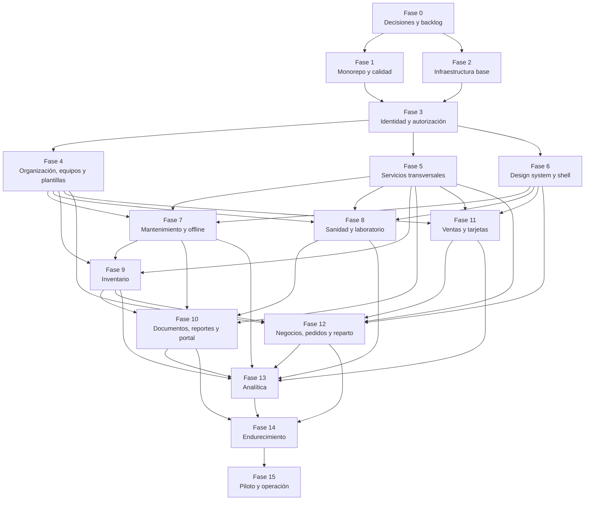

# ICE24 OS — Plan de Implementación

> **Confidencial.** Información propiedad intelectual de ICE24 MX. Su reproducción total o parcial requiere autorización escrita.

## Control del documento

| Campo | Valor |
|---|---|
| Proyecto | ICE24 OS |
| Documento | Plan de Implementación |
| Versión | 1.0 |
| Fecha | Agosto de 2026 |
| Estado | Propuesta técnica para validación y ejecución |
| Responsable propuesto | Tech Lead de ICE24 OS |
| Fuentes | PRD v1.0, TRD v1.0, `Architecture.md`, `Database.md`, `API.md`, `UI_UX.md` y `AppFlow.md` |
| Propósito | Ordenar la implementación completa del producto en fases verificables y ejecutables por un equipo humano asistido por IA o por agentes de implementación supervisados |

## 1. Propósito

Este plan traduce los documentos funcionales, técnicos, de arquitectura, datos, API, interfaz y flujos de ICE24 OS en una secuencia de implementación.

El plan busca que cada fase:

- tenga entradas y dependencias explícitas;
- produzca entregables verificables;
- limite el alcance que una IA puede interpretar libremente;
- mantenga contratos, modelo de datos, permisos y auditoría sincronizados;
- evite construir módulos posteriores antes de sus fundamentos;
- permita detenerse ante decisiones de negocio, sanitarias, legales o técnicas no resueltas;
- conserve la arquitectura de monolito modular con workers asíncronos definida en el TRD;
- termine con pruebas, documentación y criterios de salida, no solo con pantallas funcionales.

Este documento no sustituye al PRD ni al TRD. Ante contradicción:

1. el PRD gobierna alcance y reglas de negocio;
2. el TRD y `Architecture.md` gobiernan decisiones técnicas aprobadas;
3. `Database.md` gobierna el modelo lógico de datos;
4. `API.md` gobierna los contratos HTTP;
5. `UI_UX.md` y `AppFlow.md` gobiernan interacción, navegación y estados visibles;
6. una decisión nueva debe documentarse mediante un ADR y reflejarse en los documentos afectados.

## 2. Alcance del plan

El plan cubre la implementación integral documentada:

- plataforma privada PWA;
- portal público y rutas QR;
- API modular;
- workers generales y de PDF;
- identidad, cuentas, permisos y aislamiento multiempresa;
- sucursales, máquinas, plantillas, componentes y transferencias;
- suscripción, demo y modo lectura;
- mantenimiento, tickets, órdenes y operación offline;
- sanidad, bitácoras, laboratorio, no conformidades y restricciones;
- inventario, documentos, evidencias, reportes, exportaciones y publicación;
- ventas por Excel, tarjetas y movimientos administrativos;
- negocios, productos, pedidos, repartidores y entregas;
- analítica, indicadores, auditoría, logging y observabilidad;
- infraestructura, seguridad, respaldos, rendimiento, accesibilidad y lanzamiento.

Permanecen fuera de alcance, salvo cambio formal del PRD:

- control físico o remoto de las máquinas;
- integración con Brain;
- timbrado fiscal;
- pago de pedidos de hielo dentro de ICE24 OS;
- saldo real automático de tarjetas físicas;
- automatización inicial de alertas por WhatsApp;
- API automática con la aplicación original de la máquina;
- almacenamiento de video en la primera versión;
- sustitución del portal externo de capacitación.

## 3. Modelo de estimación

### 3.1 Unidad

Las estimaciones se expresan en **semanas-persona equivalentes de ingeniería**. Representan esfuerzo acumulado de análisis, implementación, pruebas, documentación y estabilización; no son una promesa de duración calendario.

Las estimaciones asumen:

- reutilización de los documentos existentes como especificación inicial;
- un Tech Lead o arquitecto disponible para decisiones y revisiones;
- participación de producto, diseño, QA, seguridad y responsables sanitario/técnico en los puntos de validación;
- uso disciplinado de IA para generación asistida, pruebas, documentación y revisión;
- infraestructura administrada y stack recomendado en el TRD;
- ausencia de migración masiva no documentada;
- disponibilidad oportuna de plantillas, catálogos, formatos Excel y reglas sanitarias.

### 3.2 Incertidumbre

| Nivel | Significado |
|---|---|
| Baja | El alcance y los contratos están suficientemente definidos. |
| Media | Existen decisiones menores o dependencias externas por cerrar. |
| Alta | Faltan reglas de negocio, datos reales, validación normativa o pruebas de campo. |

### 3.3 Resumen de esfuerzo

| Fase | Nombre | Estimación | Incertidumbre |
|---|---|---:|---|
| 0 | Cierre de decisiones y preparación ejecutiva | 3–5 | Alta |
| 1 | Monorepo, contratos, calidad y entorno local | 3–4 | Baja |
| 2 | Infraestructura, despliegue y observabilidad base | 4–6 | Media |
| 3 | Identidad, autenticación, multiempresa y autorización | 6–9 | Media |
| 4 | Cuentas, sucursales, usuarios, equipos y plantillas | 8–12 | Media |
| 5 | Suscripción, auditoría, archivos, jobs y notificaciones | 7–10 | Media |
| 6 | Sistema de diseño, shell privado y navegación | 5–8 | Media |
| 7 | Mantenimiento, tickets, órdenes y offline operativo | 10–14 | Alta |
| 8 | Control sanitario, laboratorio y restricciones | 10–15 | Alta |
| 9 | Inventario y ciclo de vida de componentes | 6–9 | Media |
| 10 | Documentos, reportes, PDF, portal público y QR | 10–15 | Alta |
| 11 | Ventas Excel, tarjetas y movimientos administrativos | 7–10 | Alta |
| 12 | Negocios, productos, pedidos, reparto y GPS | 12–18 | Alta |
| 13 | Analítica e indicadores | 7–11 | Alta |
| 14 | Endurecimiento, migración, accesibilidad y preparación productiva | 10–14 | Media |
| 15 | Piloto, despliegue gradual y operación | 4–6 | Alta |
| **Total indicativo** | Implementación integral | **112–166** | — |

El total no debe sumarse como duración lineal. Varias líneas de frontend, backend, infraestructura y QA pueden ejecutarse en paralelo después de completar sus dependencias. Para planeación calendario se requiere definir equipo, capacidad real, disponibilidad de revisores y MVP.

## 4. Principios obligatorios de implementación

1. **Contrato primero.** Antes de implementar un caso de uso se validan recurso, esquema, error, permiso, estado y evento de auditoría.
2. **Migración primero.** Toda modificación persistente comienza con el cambio controlado del modelo, restricciones e índice correspondiente.
3. **Dominio antes que interfaz.** Las reglas viven en Domain/Application; nunca exclusivamente en frontend o controlador.
4. **Módulos aislados.** Un módulo no consulta tablas internas de otro módulo sin contrato aprobado.
5. **Multiempresa por defecto.** Toda lectura o escritura privada valida cuenta, ámbito y permiso.
6. **Auditoría transaccional.** La acción sensible y su auditoría se confirman en la misma unidad de consistencia.
7. **Idempotencia.** Comandos críticos, webhooks, mensajes y sincronizaciones toleran reintentos sin duplicar efectos.
8. **No borrado histórico.** Se archiva, anula, revierte, retira o versiona según el dominio.
9. **Publicación separada.** Ningún estado completado o conforme implica publicación automática.
10. **Offline limitado.** Solo se habilitan operaciones expresamente definidas en PRD, TRD y AppFlow.
11. **Seguridad por diseño.** Archivos privados, secretos y datos sensibles nunca usan exposición pública permanente.
12. **Feature flags.** Los módulos incompletos permanecen deshabilitados por cuenta y entorno.
13. **Documentación viva.** Cada decisión o cambio contractual actualiza ADR, API, base de datos, flujo y pruebas afectados.
14. **IA sin invención.** Una IA no decide límites sanitarios, permisos, políticas legales, precios, retención o formatos externos ausentes.
15. **Evidencia de terminado.** Ninguna tarea se cierra sin pruebas y artefactos verificables.

## 5. Protocolo para implementación asistida por IA

### 5.1 Paquete de trabajo mínimo

Cada tarea entregada a una IA debe contener:

- ID de fase y tarea;
- objetivo concreto;
- documentos y secciones fuente;
- módulos y carpetas autorizados;
- entidades y tablas afectadas;
- endpoints y eventos afectados;
- permisos y estados aplicables;
- criterios de aceptación;
- pruebas obligatorias;
- archivos que no deben modificarse;
- decisiones abiertas o valores provisionales prohibidos;
- salida esperada y formato del reporte de cambios.

### 5.2 Orden obligatorio dentro de una tarea

1. Leer los documentos fuente indicados.
2. Identificar contradicciones, huecos o decisiones abiertas.
3. Detener la tarea cuando falte una decisión material; registrar bloqueo.
4. Actualizar o validar contratos y ADRs.
5. Definir cambio de datos y estrategia de reversión.
6. Implementar reglas de dominio y casos de uso.
7. Implementar adaptadores, persistencia y mensajes.
8. Implementar API o consumidor.
9. Implementar interfaz y estados visibles, cuando corresponda.
10. Agregar pruebas unitarias, integración, contrato, E2E y seguridad aplicables.
11. Ejecutar validaciones de aislamiento, auditoría e idempotencia.
12. Actualizar documentación, runbook y matriz de trazabilidad.
13. Entregar resumen de archivos, decisiones, pruebas, riesgos y deuda.

### 5.3 Prohibiciones para agentes de implementación

- No alterar el PRD para hacer coincidir una implementación incompleta.
- No inventar endpoints, tablas o campos cuando exista un contrato aprobado diferente.
- No usar entidades ORM como contratos del frontend.
- No omitir `account_id` o contexto equivalente en entidades privadas.
- No desactivar restricciones para “hacer pasar” una prueba.
- No registrar contraseñas, tokens, documentos o datos sensibles en logs.
- No usar `PATCH` genérico para transiciones críticas.
- No publicar documentos privados como solución temporal.
- No convertir errores de autorización en revelación de existencia de recursos.
- No agregar dependencias sin revisión de seguridad, licencia y mantenimiento.
- No implementar reglas regulatorias provisionales como definitivas.
- No cerrar una fase con pruebas pendientes marcadas para “después”.

### 5.4 Reporte de finalización por tarea

Toda IA o desarrollador debe informar:

- tareas completadas y no completadas;
- requisitos cubiertos;
- contratos modificados;
- migraciones y compatibilidad;
- pruebas ejecutadas y resultados;
- observaciones de seguridad;
- impacto en rendimiento;
- decisiones tomadas y ADR asociado;
- riesgos nuevos;
- deuda técnica explícita;
- pasos de validación manual.

## 6. Estrategia de ramas, integración y calidad

### 6.1 Integración

- rama principal protegida;
- cambios pequeños y verticales;
- pull request por paquete de trabajo coherente;
- revisión humana obligatoria para seguridad, permisos, migraciones, publicación, pagos y sanidad;
- actualización de contratos en el mismo cambio que su consumidor;
- feature flags para alcance no liberado;
- entornos de desarrollo, pruebas, staging y producción separados.

### 6.2 Quality gates globales

Todo cambio debe superar, según aplique:

- formato, lint y tipos;
- pruebas unitarias;
- pruebas de integración con PostgreSQL y dependencias efímeras;
- validación de migraciones hacia adelante y reversión operativa;
- pruebas de contrato OpenAPI;
- pruebas E2E de rutas críticas;
- pruebas de aislamiento entre cuentas;
- pruebas de autorización positiva y negativa;
- pruebas de auditoría;
- pruebas de idempotencia;
- análisis de dependencias y vulnerabilidades;
- escaneo de secretos;
- validación de accesibilidad en pantallas modificadas;
- validación de observabilidad y correlación;
- revisión de documentación.

## 7. Mapa de dependencias entre fases

## 8. Hitos de liberación propuestos

El PRD no define formalmente el MVP. Los siguientes hitos son una recomendación de implementación y requieren aprobación de producto.

| Hito | Fases requeridas | Uso propuesto |
|---|---|---|
| M0 — Plataforma técnica interna | 0–3 | Validar despliegue, identidad, aislamiento y proceso de entrega. |
| M1 — Administración de activos | 0–6 | Uso interno de ICE24 para cuentas, máquinas, plantillas, suscripción y auditoría. |
| M2 — Piloto técnico-sanitario | 0–10 | Piloto controlado con mantenimiento, sanidad, inventario, documentos, reportes y portal público. |
| M3 — Piloto comercial | 0–12 | Añadir ventas, tarjetas, negocios, pedidos y reparto. |
| M4 — General Availability | 0–15 | Producto endurecido, medido, soportado y preparado para operación productiva. |

---

# Fase 0 — Cierre de decisiones y preparación ejecutiva

## Objetivo

Convertir los documentos existentes en una línea base aprobada y resolver los bloqueos que impedirían implementar de forma determinista.

## Tareas

| ID | Tarea | Salida verificable |
|---|---|---|
| F0-01 | Nombrar responsables funcionales y técnicos por dominio. | Matriz RACI por módulo. |
| F0-02 | Definir el MVP o primer piloto utilizable. | Decisión de producto y alcance de release. |
| F0-03 | Priorizar las preguntas abiertas del PRD, TRD, UI/UX y AppFlow. | Registro de decisiones con estado, responsable y fecha objetivo. |
| F0-04 | Aprobar proveedor cloud, región y estrategia de entornos. | ADR de plataforma y diagrama de despliegue actualizado. |
| F0-05 | Aprobar objetivos iniciales de disponibilidad, RPO, RTO y retención. | SLO/SLI preliminares y política de continuidad. |
| F0-06 | Confirmar stack recomendado y elegir Vitest o Jest. | ADR de stack y política de versiones. |
| F0-07 | Aprobar estrategia de identidad: Keycloak, 2FA, recuperación y sesiones. | ADR de identidad y runbook de recuperación. |
| F0-08 | Aprobar la matriz base de roles, acciones, ámbitos y datos sensibles. | Matriz de autorización versionada. |
| F0-09 | Definir convenciones definitivas del Código ICE24 OS y folios. | Especificación de identificadores visibles. |
| F0-10 | Obtener formatos Excel reales y catalogarlos por modelo/versión. | Muestras anonimizadas y matriz de formatos. |
| F0-11 | Recopilar plantillas iniciales de mantenimiento y sanidad. | Catálogo versionado listo para datos semilla. |
| F0-12 | Validar parámetros, límites, reglas de publicación y leyendas con responsables sanitario y jurídico. | Documento de validación y fuentes autorizadas. |
| F0-13 | Definir proveedores de correo, mapas, antivirus y almacenamiento. | ADR por integración y presupuesto inicial. |
| F0-14 | Definir navegadores, dispositivos y condiciones de conectividad objetivo. | Matriz de soporte y escenarios de campo. |
| F0-15 | Establecer estrategia de soporte, severidades, guardias y comunicación de incidentes. | Runbook operativo inicial. |
| F0-16 | Convertir las fases en épicas, capacidades y paquetes de trabajo trazables. | Backlog inicial con IDs y criterios de aceptación. |

## Dependencias

- Disponibilidad de dirección de ICE24.
- Participación de responsables técnico, sanitario, legal, producto y operación.
- Acceso a manuales, formatos Excel, catálogos y evidencias disponibles.
- PRD, TRD y documentos derivados vigentes.

## Estimación

- **3–5 semanas-persona equivalentes.**
- Incertidumbre alta por decisiones externas y regulatorias.

## Riesgos

| Riesgo | Mitigación |
|---|---|
| No definir MVP | No comprometer fecha de lanzamiento; usar M2 solo como candidato de piloto. |
| Falta de plantillas reales | Construir motor declarativo, pero bloquear datos productivos y reglas finales. |
| Decisiones contradictorias | Registrar ADR y actualizar todos los documentos afectados. |
| Validación sanitaria o jurídica tardía | Separar configuración versionada de código y etiquetar contenido no aprobado. |
| Proveedores sin seleccionar | Definir puertos/adaptadores; no implementar SDK específico sin ADR. |

## Resultado esperado

- Línea base de alcance y arquitectura aprobada.
- Backlog ejecutable.
- Decisiones críticas cerradas o registradas como bloqueos.
- Criterios de release y responsables definidos.

## Criterio de salida

No iniciar módulos de negocio si siguen abiertas la matriz de permisos, la estrategia multiempresa, el proveedor de identidad, el modelo de auditoría o las reglas de identificadores.

---

# Fase 1 — Monorepo, contratos, calidad y entorno local

## Objetivo

Crear la estructura de ingeniería reproducible sobre la que se implementarán todos los módulos.

## Tareas

| ID | Tarea | Salida verificable |
|---|---|---|
| F1-01 | Crear el monorepo con pnpm workspaces y Turborepo. | Estructura raíz definida en el TRD. |
| F1-02 | Crear aplicaciones vacías para PWA privada, portal público, API, worker y PDF worker. | Cada aplicación compila y se ejecuta aisladamente. |
| F1-03 | Crear paquetes compartidos de contratos, UI, dominio, autorización, datos, offline, configuración, observabilidad y testing. | Dependencias internas explícitas y sin ciclos. |
| F1-04 | Configurar TypeScript estricto y convenciones de importación. | Compilación estricta en todo el repositorio. |
| F1-05 | Configurar formatter, lint, hooks y validación de commits. | Quality checks locales y en CI. |
| F1-06 | Definir versionado de API, eventos, formatos Excel y esquemas offline. | Política de compatibilidad documentada. |
| F1-07 | Incorporar los contratos iniciales de errores, paginación, identidad, contexto, idempotencia y concurrencia. | Paquete `contracts` consumible sin ORM. |
| F1-08 | Configurar Docker para dependencias locales: PostgreSQL/PostGIS, Keycloak y servicios simulados. | Arranque local documentado y repetible. |
| F1-09 | Configurar framework único de pruebas unitarias y Testcontainers. | Prueba de referencia unitaria e integración. |
| F1-10 | Crear pipeline inicial de CI. | Build, lint, tipos, tests y escaneo de secretos en cada PR. |
| F1-11 | Crear plantillas de ADR, runbook, threat model y documentación de módulo. | Documentación normalizada. |
| F1-12 | Definir fixtures y datos semilla no sensibles para desarrollo. | Dataset de prueba controlado. |

## Dependencias

- Decisiones de stack de Fase 0.
- Política de versiones y licencias.
- Acceso al repositorio y sistema CI.

## Estimación

- **3–4 semanas-persona equivalentes.**
- Incertidumbre baja.

## Riesgos

| Riesgo | Mitigación |
|---|---|
| Monorepo excesivamente acoplado | Aplicaciones desplegables por separado y reglas de dependencias. |
| Compartir entidades ORM | Prohibir exportarlas fuera de `packages/database`. |
| CI lento desde el inicio | Caché de Turborepo, pruebas por alcance y suite completa programada. |
| Divergencia de contratos | Contratos versionados y pruebas de compatibilidad. |

## Resultado esperado

- Repositorio reproducible.
- Aplicaciones y paquetes base compilables.
- CI obligatorio.
- Convenciones y documentación disponibles para agentes de IA.

## Criterio de salida

Un desarrollador o agente nuevo puede preparar el entorno, ejecutar pruebas y comprender la estructura sin instrucciones privadas adicionales.

---

# Fase 2 — Infraestructura, despliegue y observabilidad base

## Objetivo

Proveer ambientes aislados, despliegue repetible, secretos protegidos y telemetría desde el primer módulo funcional.

## Tareas

| ID | Tarea | Salida verificable |
|---|---|---|
| F2-01 | Modelar infraestructura como código para red, cómputo, base, objetos, colas, secretos y DNS. | Módulos Terraform versionados. |
| F2-02 | Crear ambientes `development`, `test`, `staging` y `production`. | Cuentas/proyectos y variables aisladas. |
| F2-03 | Configurar RDS PostgreSQL/PostGIS o equivalente administrado. | Instancia privada, cifrada y respaldada. |
| F2-04 | Configurar almacenamiento de objetos privado y ciclo de vida inicial. | Buckets separados por ambiente y clase de archivo. |
| F2-05 | Configurar cola general, cola PDF, DLQ y scheduler. | Mensajes de prueba con reintento y DLQ. |
| F2-06 | Desplegar Keycloak aislado con base y backup. | Endpoint OIDC funcional en entorno no productivo. |
| F2-07 | Configurar secretos, llaves de cifrado, certificados y rotación. | Ningún secreto almacenado en repositorio o imagen. |
| F2-08 | Configurar logs estructurados, métricas y trazas OpenTelemetry. | Correlación desde web/API a worker. |
| F2-09 | Definir health checks, readiness, liveness y dashboards básicos. | Estado de cada contenedor visible. |
| F2-10 | Crear pipeline de despliegue con promoción entre ambientes. | Despliegue reproducible y rollback documentado. |
| F2-11 | Configurar WAF/CDN para portal y controles perimetrales iniciales. | Reglas y rate limits de referencia. |
| F2-12 | Probar backup y restauración inicial de base y objetos. | Evidencia de recuperación en entorno de prueba. |

## Dependencias

- Fase 0: proveedor, región, RPO/RTO y dominios.
- Fase 1: aplicaciones contenedorizadas y CI.

## Estimación

- **4–6 semanas-persona equivalentes.**
- Incertidumbre media por proveedor y operación de Keycloak.

## Riesgos

| Riesgo | Mitigación |
|---|---|
| Costos prematuros | Ambientes escalables a cero o capacidad mínima donde sea posible. |
| Acoplamiento cloud | Adaptadores y recursos portables para datos, objetos y colas. |
| Keycloak no endurecido | Red privada, actualizaciones planificadas, backup y monitoreo. |
| Telemetría con datos sensibles | Lista de campos prohibidos y pruebas automáticas de sanitización. |
| Rollback de migraciones destructivas | Estrategia expand/contract y backups verificados. |

## Resultado esperado

- Ambientes seguros y reproducibles.
- Aplicaciones desplegables.
- Telemetría y recuperación mínimas operativas.

## Criterio de salida

Una versión vacía del sistema se despliega, observa y revierte sin intervención manual no documentada.

---

# Fase 3 — Identidad, autenticación, multiempresa y autorización

## Objetivo

Implementar una identidad única con sesiones seguras, múltiples contextos, aislamiento por cuenta y permisos RBAC/ABAC.

## Tareas

| ID | Tarea | Salida verificable |
|---|---|---|
| F3-01 | Configurar realm, clientes OIDC, flujos de primer acceso, recuperación y TOTP. | Flujos probados contra Keycloak. |
| F3-02 | Implementar perfil local de usuario y enlace con identidad externa. | Usuario único por subject/correo/username según reglas. |
| F3-03 | Implementar sesiones BFF seguras para la PWA privada. | Cookies seguras, rotación y protección CSRF. |
| F3-04 | Implementar creación de cuentas por ICE24 y propietario principal. | Alta privada sin registro público. |
| F3-05 | Implementar membresías, roles, ámbitos y asociaciones. | Usuario con múltiples cuentas y roles. |
| F3-06 | Implementar selector y sesión de contexto. | Cambio de cuenta/rol sin nuevo login. |
| F3-07 | Implementar paquete de autorización híbrida RBAC/ABAC. | Evaluación por organización, sucursal, máquina, módulo, acción y sensibilidad. |
| F3-08 | Incorporar guards y políticas en API y BFF. | Endpoints privados niegan acceso por defecto. |
| F3-09 | Implementar cierre de sesión individual, por usuario y global. | Revocación efectiva y auditada. |
| F3-10 | Implementar recuperación manual como proceso administrativo controlado. | Solicitud, evidencia, aprobación y auditoría. |
| F3-11 | Implementar protección de deep links y resolución de contexto. | 401/403/404 sin filtración de recursos. |
| F3-12 | Agregar auditoría de seguridad inicial. | Login, fallo, recuperación, 2FA y cierre registrados. |
| F3-13 | Crear pruebas de aislamiento multiempresa. | Suite negativa entre dos o más cuentas. |
| F3-14 | Implementar UI de acceso, primer ingreso, 2FA, selector y perfil. | Pantallas accesibles y responsive. |

## Dependencias

- Fases 1 y 2.
- Matriz de permisos aprobada.
- Política de 2FA y recuperación manual.

## Estimación

- **6–9 semanas-persona equivalentes.**
- Incertidumbre media.

## Riesgos

| Riesgo | Mitigación |
|---|---|
| Confusión entre identidad y autorización | Keycloak autentica; la aplicación conserva relaciones y permisos. |
| Escalada de privilegios | Denegación por defecto, pruebas negativas y revisión de políticas. |
| Enumeración de usuarios o recursos | Respuestas neutras y 404 contextual cuando corresponda. |
| Sesiones inconsistentes entre cuentas | Sesión de contexto versionada y recalculada al cambiar membresías. |
| Desactivación con datos offline | Política explícita y borrado local en Fase 7. |

## Resultado esperado

- Acceso seguro.
- Identidad única.
- Contextos multiempresa.
- Autorización reutilizable por todos los módulos.

## Criterio de salida

No existe endpoint privado accesible sin política; las pruebas demuestran que un usuario de una cuenta no puede descubrir ni modificar recursos de otra.

---

# Fase 4 — Cuentas, sucursales, usuarios, equipos y plantillas

## Objetivo

Construir el núcleo organizacional y el expediente permanente de cada máquina, incluyendo validación y configuración oficial versionada.

## Tareas

| ID | Tarea | Salida verificable |
|---|---|---|
| F4-01 | Implementar cuenta titular, datos de contacto, fiscales y configuración de módulos. | Cuenta persona física o moral administrable. |
| F4-02 | Implementar sucursales, dirección, coordenadas, zona horaria, horario y teléfonos. | CRUD controlado y archivado histórico. |
| F4-03 | Implementar usuarios, invitaciones/asociaciones y permisos delegados. | Relaciones globales sin duplicar identidad. |
| F4-04 | Implementar catálogo de fabricantes, modelos, sistemas, componentes y características. | Catálogos administrados por ICE24. |
| F4-05 | Implementar versiones de plantillas y sus definiciones declarativas. | Versiones inmutables publicables. |
| F4-06 | Implementar actividades, frecuencias, checklists, evidencia y escalamiento dentro de plantillas. | Plantilla completa validable antes de publicar. |
| F4-07 | Implementar solicitud de alta de máquina en borrador. | Captura progresiva con documentos y fotografías. |
| F4-08 | Implementar flujo de envío, revisión, información faltante, aprobación y rechazo. | Máquina no activa sin plantilla y validación. |
| F4-09 | Generar código permanente ICE24 OS y folios definidos. | Código único, inmutable y verificable. |
| F4-10 | Crear expediente de máquina con estados operativo, técnico, sanitario y publicación separados. | Vista integral y API coherente. |
| F4-11 | Implementar periodos de propiedad, ubicación y asignación de plantilla. | Historia sin solapamientos. |
| F4-12 | Implementar traslado, retiro y transferencia controlada. | Historia técnica obligatoria y comercial opcional. |
| F4-13 | Generar calendarios iniciales al activar máquina. | Actividades futuras ligadas a versión de plantilla. |
| F4-14 | Implementar aplicación de nueva versión a actividades futuras. | Históricos conservan definición original. |
| F4-15 | Crear paneles ICE24 de cuentas, validaciones y plantillas. | Operación central inicial. |
| F4-16 | Implementar pantallas de cuenta, sucursal, usuarios, máquinas y expediente. | Flujos definidos en UI/UX y AppFlow. |
| F4-17 | Probar transferencias, discrepancias de contexto y concurrencia. | Suite de integridad y auditoría. |

## Dependencias

- Fase 3.
- Código ICE24 OS definido.
- Evidencia mínima de alta y reglas de validación.
- Plantillas iniciales disponibles o dataset ficticio claramente marcado.

## Estimación

- **8–12 semanas-persona equivalentes.**
- Incertidumbre media.

## Riesgos

| Riesgo | Mitigación |
|---|---|
| Modelo de activo ligado al propietario actual | Periodos de propiedad y ubicación separados de la máquina. |
| Plantillas modifican historia | Versiones inmutables y snapshot de definición ejecutada. |
| Transferencia expone datos comerciales | Consentimiento documentado y selección explícita de alcance. |
| Reglas de equipo externo incompletas | Bloquear aprobación hasta validación ICE24. |
| Estados mezclados | Componentes y contratos separados para cada dimensión. |

## Resultado esperado

- Administración central de cuentas y activos.
- Expediente permanente por máquina.
- Plantillas versionadas.
- Flujos de alta, validación, traslado y transferencia.

## Criterio de salida

Una máquina puede solicitarse, validarse, activarse, trasladarse y transferirse sin perder su identidad ni su historial técnico/sanitario.

---

# Fase 5 — Suscripción, auditoría, archivos, jobs y notificaciones

## Objetivo

Implementar los servicios transversales requeridos por los módulos operativos y comerciales.

## Tareas

| ID | Tarea | Salida verificable |
|---|---|---|
| F5-01 | Implementar modelo de suscripción, demo y estados de acceso. | Demo, activa, pago rechazado, lectura, cancelada y reactivada. |
| F5-02 | Integrar Stripe Checkout/portal y webhooks idempotentes. | Estado conciliado con Stripe como fuente comercial. |
| F5-03 | Implementar modo lectura centralizado. | API y UI bloquean mutaciones sin impedir consulta permitida. |
| F5-04 | Implementar auditoría append-only y filtros globales/de cuenta. | Eventos sensibles consultables e inmutables. |
| F5-05 | Implementar patrón outbox en transacciones. | Eventos se publican sin ventana de pérdida. |
| F5-06 | Implementar workers, reintentos, DLQ e idempotencia de consumidor. | Jobs resistentes a duplicados y fallos temporales. |
| F5-07 | Implementar registro de trabajos asíncronos y centro de estado. | Pendiente, procesando, completado, error y reintento. |
| F5-08 | Implementar flujo de carga de archivos con preautorización. | Carga directa privada y confirmación de metadatos. |
| F5-09 | Implementar cuarentena, validación, escaneo y versiones de archivo. | Archivo no utilizable antes de validación. |
| F5-10 | Implementar URLs temporales y registro de descargas. | Descarga privada protegida y auditada. |
| F5-11 | Implementar centro de notificaciones y estados no leída/leída/enterado/en atención/resuelta. | Alertas persistentes. |
| F5-12 | Integrar correo transaccional con plantillas y tracking técnico. | Recuperación, alertas críticas y reportes soportados. |
| F5-13 | Implementar scheduler para vencimientos, reportes y reconciliaciones. | Ejecuciones idempotentes observables. |
| F5-14 | Implementar logs de integración con correlación. | Diagnóstico de Stripe, correo, objetos, cola y PDF. |
| F5-15 | Crear UI de suscripción, modo lectura, auditoría, archivos, notificaciones y jobs. | Estados y errores completos. |

## Dependencias

- Fases 2–4.
- Cuenta, usuario y autorización disponibles.
- Proveedores externos seleccionados.
- Políticas de retención y archivos.

## Estimación

- **7–10 semanas-persona equivalentes.**
- Incertidumbre media.

## Riesgos

| Riesgo | Mitigación |
|---|---|
| Webhooks fuera de orden | Persistir eventos, comparar timestamps/versiones y reconciliar. |
| Auditoría separada de transacción | Outbox/auditoría dentro de la misma transacción. |
| Archivos maliciosos | Cuarentena y escaneo antes de publicar o previsualizar. |
| Correos duplicados | Idempotencia por destinatario, plantilla y evento. |
| Modo lectura parcial | Guard común de mutación y pruebas por endpoint. |

## Resultado esperado

- Suscripción funcional.
- Auditoría transversal.
- Procesamiento asíncrono durable.
- Archivos protegidos.
- Notificaciones y correo disponibles para módulos posteriores.

## Criterio de salida

Una acción sensible produce auditoría y eventos; un pago rechazado cambia el acceso; un archivo privado no posee URL pública permanente; un job fallido puede diagnosticarse y reintentarse.

---

# Fase 6 — Sistema de diseño, shell privado y navegación

## Objetivo

Implementar la base visual y de navegación común para que todos los módulos mantengan consistencia, accesibilidad y responsive design.

## Tareas

| ID | Tarea | Salida verificable |
|---|---|---|
| F6-01 | Validar paleta propuesta contra la identidad ICE24. | Tokens de marca aprobados. |
| F6-02 | Implementar tokens semánticos de color, tipografía, espaciado, elevación y movimiento. | Tema consumible por aplicaciones. |
| F6-03 | Implementar componentes base accesibles. | Inputs, botones, tablas, cards, dialog, toast, banner, tabs y navegación. |
| F6-04 | Implementar componentes especializados. | Tríada de máquina, alerta crítica, comparador, sync, modo lectura y job status. |
| F6-05 | Crear catálogo de componentes y estados. | Documentación visual y pruebas. |
| F6-06 | Implementar shell privado responsive. | Sidebar, topbar, bottom navigation y breadcrumbs. |
| F6-07 | Implementar navegación basada en permisos y módulos habilitados. | Destinos no autorizados ausentes. |
| F6-08 | Implementar selector de contexto y persistencia segura. | Cuenta, rol, sucursal y máquina visibles. |
| F6-09 | Implementar layouts de lista, detalle, wizard, dashboard y pantalla móvil operativa. | Plantillas reutilizables. |
| F6-10 | Implementar estados globales de carga, vacío, error, offline y lectura. | Experiencia coherente. |
| F6-11 | Implementar manejo de deep links, regresar y cambios no guardados. | Flujos definidos en AppFlow. |
| F6-12 | Configurar pruebas automáticas de accesibilidad y visual regression. | Quality gate de componentes. |

## Dependencias

- Fase 3 para permisos y contexto.
- Decisión visual de marca.
- UI_UX.md y AppFlow.md.

## Estimación

- **5–8 semanas-persona equivalentes.**
- Incertidumbre media.

## Riesgos

| Riesgo | Mitigación |
|---|---|
| Diseñar componentes por pantalla | API de componentes y tokens semánticos reutilizables. |
| Navegación revela módulos | Generarla desde capacidades autorizadas. |
| Accesibilidad agregada al final | Pruebas desde el catálogo y cada PR. |
| Mobile tratado como reducción de desktop | Layouts móviles específicos para operación de campo. |

## Resultado esperado

- Design system usable.
- Navegación privada responsive.
- Estados globales coherentes.
- Base lista para módulos funcionales.

## Criterio de salida

Los flujos de autenticación, cambio de contexto, dashboard vacío y navegación por rol funcionan en móvil, tableta y escritorio con teclado y lector de pantalla básico.

---

# Fase 7 — Mantenimiento, tickets, órdenes y offline operativo

## Objetivo

Implementar el control técnico preventivo y correctivo con evidencia, componentes y trabajo offline controlado.

## Tareas

| ID | Tarea | Salida verificable |
|---|---|---|
| F7-01 | Implementar generación y recalculo de actividades programadas. | Próximas, vencidas y completadas sin borrar atrasos. |
| F7-02 | Implementar tickets con máquina, sistema, prioridad, descripción y evidencia. | Incidencia trazable. |
| F7-03 | Implementar asignación y orden de trabajo. | Responsable, checklist, procedimiento y piezas. |
| F7-04 | Implementar máquina de estados de mantenimiento y guardas. | Transiciones explícitas y auditadas. |
| F7-05 | Implementar ejecución, diagnóstico, pruebas, recomendación y evidencia. | Cierre solo con requisitos completos. |
| F7-06 | Implementar tipos de evidencia declarados por plantilla. | Antes/después, pieza, lectura, lote, firma. |
| F7-07 | Implementar revisión, observaciones, corrección, reapertura y anulación según permisos aprobados. | Versiones y motivos conservados. |
| F7-08 | Implementar asignación de responsable y bloqueo lógico de actividad descargada. | Un responsable activo por tarea offline. |
| F7-09 | Implementar esquema IndexedDB y cifrado/protección local factible. | Datos offline estructurados y versionados. |
| F7-10 | Implementar descarga explícita de órdenes autorizadas. | Paquete offline mínimo. |
| F7-11 | Implementar cola local, estados y reintentos. | Pendiente, sincronizando, cargada, error y conflicto. |
| F7-12 | Implementar API de sincronización con idempotencia y versión esperada. | Reintentos no duplican ejecuciones o archivos. |
| F7-13 | Implementar detección y registro de conflictos. | Ambas versiones preservadas. |
| F7-14 | Implementar UI móvil de órdenes y evidencia offline. | Flujo completo sin conectividad después de descarga. |
| F7-15 | Implementar centro de sincronización y resolución autorizada. | Comparación y decisión auditada. |
| F7-16 | Implementar borrado local al cerrar sesión, perder permiso o desactivar usuario. | Datos sensibles removidos. |
| F7-17 | Crear pruebas de pérdida de conexión, cierre inesperado, fotos pendientes y concurrencia. | Suite de campo automatizada y manual. |

## Dependencias

- Fases 4–6.
- Plantillas iniciales de mantenimiento.
- Política de evidencia y firma.
- Política de resolución de conflictos.

## Estimación

- **10–14 semanas-persona equivalentes.**
- Incertidumbre alta por offline y pruebas de campo.

## Riesgos

| Riesgo | Mitigación |
|---|---|
| Corrupción o pérdida local | Transacciones IndexedDB, estados visibles y reintentos. |
| Sobrescritura concurrente | Versiones esperadas y revisión explícita. |
| Archivos offline demasiado grandes | Compresión, cuotas y límites por actividad. |
| Usuario desactivado conserva datos | Revocación y limpieza local obligatoria al reconectar/abrir. |
| Calendarios incorrectos | Casos de prueba por zona horaria, instalación y nueva plantilla. |

## Resultado esperado

- Mantenimiento preventivo/correctivo.
- Tickets y órdenes.
- Evidencias.
- Operación offline de técnicos.
- Resolución de conflictos.

## Criterio de salida

Un técnico puede descargar una orden, completarla sin internet, adjuntar evidencia, sincronizarla, detectar un conflicto y obtener un cierre auditado sin duplicar actividades.

---

# Fase 8 — Control sanitario, laboratorio y restricciones

## Objetivo

Implementar bitácoras sanitarias dinámicas, análisis estructurados, no conformidades, acciones correctivas y restricciones técnicas/sanitarias.

## Tareas

| ID | Tarea | Salida verificable |
|---|---|---|
| F8-01 | Implementar plantillas dinámicas sanitarias con campos, unidades, límites, evidencia y frecuencia. | Formularios versionados no codificados rígidamente. |
| F8-02 | Implementar programación y ejecución de bitácoras. | Controles por modelo, componente y sucursal. |
| F8-03 | Implementar validación de respuestas, unidades y límites. | Resultado conforme, no conforme, pendiente o no evaluable. |
| F8-04 | Implementar corrección y anulación versionada. | Comparación entre original y vigente. |
| F8-05 | Implementar laboratorios, tipos de análisis, parámetros y puntos de muestreo. | Catálogos administrados por ICE24. |
| F8-06 | Implementar análisis con fechas, documento original y captura estructurada. | PDF y datos unidos. |
| F8-07 | Implementar resultados textuales, rangos y límites de cuantificación según reglas aprobadas. | Representación sin pérdida semántica. |
| F8-08 | Implementar detección de no conformidad. | Evento crítico y relación con parámetro. |
| F8-09 | Implementar creación automática de alerta, ticket y acción correctiva. | Cadena de atención trazable. |
| F8-10 | Implementar restricciones técnicas y sanitarias. | Bloqueo de pedidos sin bloquear documentación/mantenimiento permitido. |
| F8-11 | Implementar formulario de reactivación y aceptación de responsabilidad. | Evidencia, responsable, fechas y próximo análisis. |
| F8-12 | Implementar revisión o nueva restricción por ICE24. | Autoridad de plataforma conservada. |
| F8-13 | Implementar indicador sanitario versionado y explicación de factores. | Eventos críticos dominan el estado. |
| F8-14 | Implementar alertas, escalamiento y confirmación “Enterado”. | Persistencia hasta atención. |
| F8-15 | Implementar UI de bitácoras, análisis, no conformidad y reactivación. | Flujos responsive y accesibles. |
| F8-16 | Implementar offline para bitácoras autorizadas. | Captura local y sincronización con conflictos. |
| F8-17 | Crear pruebas regulatorias, de publicación negativa y de aislamiento. | No conformes nunca publicados automáticamente. |

## Dependencias

- Fases 4–7.
- Catálogo sanitario validado.
- Reglas de restricción y reactivación.
- Plantillas y límites aprobados.
- Validación jurídica de mensajes y leyendas.

## Estimación

- **10–15 semanas-persona equivalentes.**
- Incertidumbre alta.

## Riesgos

| Riesgo | Mitigación |
|---|---|
| Codificar normas cambiantes | Catálogos y fórmulas versionadas administradas. |
| “Sin datos” interpretado como cumplimiento | Estados y microcopy separados. |
| Reactivación ambigua | Guardas explícitas y decisión de negocio aprobada. |
| Captura no coincide con PDF | Flujo de revisión y vínculo inmutable al original. |
| Exposición de no conformidad | Proyección pública separada y pruebas negativas. |

## Resultado esperado

- Programa sanitario estructurado.
- Laboratorio y no conformidades.
- Restricciones y reactivación.
- Alertas críticas y estado sanitario calculado.

## Criterio de salida

Un resultado fuera de límite genera la cadena definida, bloquea lo requerido, conserva documento y datos, y no se publica sin acción deliberada autorizada.

---

# Fase 9 — Inventario y ciclo de vida de componentes

## Objetivo

Controlar existencias, costos autorizados, lotes, consumos y componentes instalados/retirados vinculados con servicios y máquinas.

## Tareas

| ID | Tarea | Salida verificable |
|---|---|---|
| F9-01 | Implementar catálogo de productos, categorías, unidades, compatibilidades y proveedores. | Catálogo inicial importable y versionado. |
| F9-02 | Implementar ubicaciones de inventario general y por sucursal. | Existencias separadas y autorizadas. |
| F9-03 | Implementar entradas, salidas, transferencias y ajustes. | Ledger de movimientos sin edición destructiva. |
| F9-04 | Implementar lotes, caducidad, mínimo, máximo y costo. | Consultas y alertas básicas. |
| F9-05 | Integrar consumo desde orden de trabajo. | Descuento y trazabilidad hacia máquina/actividad. |
| F9-06 | Implementar instalación de componente. | Pieza sale de stock y comienza historial activo. |
| F9-07 | Implementar retiro, condición, evidencia y disposición. | Historial de componente retirado. |
| F9-08 | Generar próxima actividad relacionada al instalar componente. | Calendario actualizado según plantilla. |
| F9-09 | Implementar solicitud de refacciones y folio. | Carrito y mensaje WhatsApp prellenado, sin pago interno. |
| F9-10 | Implementar permisos de costos, proveedores y ajustes. | Técnico ve solo información autorizada. |
| F9-11 | Implementar UI de almacenes, movimientos, faltantes y componentes. | Desktop y móvil. |
| F9-12 | Crear pruebas de consistencia, concurrencia y saldos negativos. | Inventario no queda inválido por carreras. |

## Dependencias

- Fases 4, 5 y 7.
- Catálogo inicial y reglas de unidad.
- Política de consumo sin existencia.

## Estimación

- **6–9 semanas-persona equivalentes.**
- Incertidumbre media.

## Riesgos

| Riesgo | Mitigación |
|---|---|
| Stock negativo por concurrencia | Bloqueo/transacción y restricciones. |
| Unidades incompatibles | Catálogo de unidades y conversiones explícitas. |
| Costos expuestos | Permisos de campo y DTOs específicos. |
| Ajustes usados para ocultar errores | Motivo obligatorio, autorización y auditoría. |

## Resultado esperado

- Inventario trazable.
- Integración con mantenimiento.
- Historial de piezas instaladas y retiradas.
- Solicitudes de refacciones documentadas.

## Criterio de salida

Toda pieza consumida puede rastrearse desde su entrada o ajuste hasta la orden y máquina donde fue instalada o retirada.

---

# Fase 10 — Documentos, reportes, PDF, portal público y QR

## Objetivo

Transformar registros y archivos en documentos versionados, reportes consistentes y publicación pública protegida.

## Tareas

| ID | Tarea | Salida verificable |
|---|---|---|
| F10-01 | Implementar registros documentales, metadatos, versiones y estados duales. | Expediente documental privado. |
| F10-02 | Implementar corrección, sustitución, anulación y retiro sin borrar versiones. | Historia completa. |
| F10-03 | Implementar generación de versión pública anonimizada. | Datos sensibles eliminados según política. |
| F10-04 | Implementar permisos de descarga original, con o sin marca de agua. | Acceso por tipo de documento. |
| F10-05 | Implementar plantillas de reporte predeterminadas. | Máquina, mantenimiento, sanidad, laboratorio, inventario y cuenta. |
| F10-06 | Implementar configuración de reportes personalizados dentro del alcance aprobado. | Periodo, secciones, anexos y privacidad. |
| F10-07 | Implementar fuente HTML única para vista previa y PDF. | Contenido equivalente. |
| F10-08 | Implementar PDF worker aislado, límites, reintentos y optimización. | Generación asíncrona observable. |
| F10-09 | Implementar reportes programados y envío a usuarios registrados. | Frecuencia y destinatarios auditados. |
| F10-10 | Implementar exportación completa por el propietario. | Paquete disponible siete días y descargas registradas. |
| F10-11 | Implementar proyección pública por máquina. | Solo datos deliberadamente publicados. |
| F10-12 | Implementar publicación, retiro y sustitución con auditoría. | Estado privado separado de publicación. |
| F10-13 | Implementar portal público separado y responsive. | Técnico y sanitario en una rama pública. |
| F10-14 | Implementar códigos QR permanentes y etiquetas lógicas. | QR válido tras traslado o transferencia. |
| F10-15 | Implementar folio, hash/verificación y marca de agua. | Autenticidad comprobable. |
| F10-16 | Implementar analítica pública mínima: escaneo, página y descarga. | Eventos agregables y legalmente permitidos. |
| F10-17 | Implementar UI de documentos, constructor, preview, publicaciones y portal. | Flujos de UI/UX completos. |
| F10-18 | Ejecutar pruebas de privacidad, PDF, enlaces temporales y contenido retirado. | Evidencia de no filtración. |

## Dependencias

- Fases 5, 7, 8 y 9.
- Reglas de anonimización y publicación.
- Leyendas legales aprobadas.
- Definición final de QR y etiquetas.

## Estimación

- **10–15 semanas-persona equivalentes.**
- Incertidumbre alta por PDF, publicación y privacidad.

## Riesgos

| Riesgo | Mitigación |
|---|---|
| Preview difiere del PDF | Una sola plantilla y pruebas visuales. |
| PDF agota recursos | Worker aislado, cuotas y límites. |
| Proyección pública filtra datos | Tablas/proyección separadas y allowlist. |
| Documentos grandes no caben en correo | Enlace temporal según política aprobada. |
| QR cambia por infraestructura | Código estable independiente de URL física. |

## Resultado esperado

- Gestión documental completa.
- Reportes y exportaciones.
- Portal público protegido.
- QR permanente y analítica mínima.

## Criterio de salida

La vista previa coincide con el PDF, los documentos privados no son públicos, una publicación retirada desaparece del portal sin perder historia y todas las descargas sensibles son auditables.

---

# Fase 11 — Ventas Excel, tarjetas y movimientos administrativos

## Objetivo

Importar ventas de la aplicación de máquina y documentar tarjetas físicas sin presentar datos administrativos como saldo real.

## Tareas

| ID | Tarea | Salida verificable |
|---|---|---|
| F11-01 | Definir adaptador versionado por formato Excel real. | Esquema, columnas y reglas por versión. |
| F11-02 | Implementar carga y validación de archivo. | Formato, columnas, periodo y máquina comprobados. |
| F11-03 | Implementar parser en worker y almacenamiento del original. | Resultado reproducible. |
| F11-04 | Implementar vista previa con nuevos, duplicados y errores. | Confirmación antes de persistir ventas. |
| F11-05 | Implementar deduplicación por transacción o llave compuesta aprobada. | Reimportación no duplica ingresos. |
| F11-06 | Implementar confirmación y anulación de importación. | Datos retirados de paneles, historial conservado. |
| F11-07 | Implementar agregaciones iniciales por día, hora, producto, máquina y método. | Consultas y reportes básicos. |
| F11-08 | Implementar tarjetas, folio, máquina exclusiva y titular histórico. | Una tarjeta no opera en dos máquinas. |
| F11-09 | Implementar recarga, retiro, bonificación, transferencia y reasignación. | Ledger administrativo auditado. |
| F11-10 | Implementar equivalencias y advertencia de estimación. | Nunca se etiqueta como saldo real. |
| F11-11 | Implementar permisos financieros y privacidad. | Datos visibles solo para perfiles autorizados. |
| F11-12 | Implementar UI de importación, errores, ventas, tarjetas y movimientos. | Flujos completos y responsive. |
| F11-13 | Crear pruebas con muestras reales, duplicados, zonas horarias y anulaciones. | Adaptadores validados. |

## Dependencias

- Fases 4–6 y 10 para reportes.
- Archivos Excel reales.
- Reglas de deduplicación y formatos.
- Definición de quién consulta datos financieros.

## Estimación

- **7–10 semanas-persona equivalentes.**
- Incertidumbre alta por formatos externos.

## Riesgos

| Riesgo | Mitigación |
|---|---|
| Formato Excel cambia | Adaptadores versionados y rechazo explicable. |
| Duplicados sin ID | Llave compuesta, vista previa y revisión. |
| Anulación rompe reportes | Proyección recalculable y evento de reverso. |
| Usuario interpreta saldo como real | Etiquetas y advertencias obligatorias. |

## Resultado esperado

- Importación segura de ventas.
- Paneles iniciales.
- Control administrativo de tarjetas y movimientos.

## Criterio de salida

El mismo archivo no se suma dos veces; una importación puede anularse sin borrar evidencia; el sistema nunca afirma conocer el saldo físico real.

---

# Fase 12 — Negocios, productos, pedidos, reparto y GPS

## Objetivo

Conectar negocios consumidores con máquinas y repartidores autorizados mediante pedidos trazables, sin procesar el pago del pedido.

## Tareas

| ID | Tarea | Salida verificable |
|---|---|---|
| F12-01 | Implementar negocio consumidor, sucursales, usuarios y datos fiscales. | Identidad única y privacidad entre propietarios. |
| F12-02 | Implementar asociación negocio–máquina con aprobación. | Solo máquinas autorizadas visibles. |
| F12-03 | Implementar catálogo de bolsas de hielo, presentaciones y disponibilidad. | Agua excluida de entrega. |
| F12-04 | Implementar precios por máquina y precio especial por cliente. | Reglas de visibilidad y vigencia. |
| F12-05 | Implementar zonas, tarifas fijas, por distancia, aproximadas o gratuitas. | Cálculo versionado. |
| F12-06 | Implementar relación repartidor–máquina y tarjeta exclusiva. | Elegibilidad completa. |
| F12-07 | Implementar estado y disponibilidad del repartidor. | Disponible, ocupado, temporal, fuera y vacaciones. |
| F12-08 | Implementar geolocalización consentida y zonas permitidas. | GPS del navegador como fuente principal. |
| F12-09 | Implementar recomendación de máquinas asociadas. | Cercanía, disponibilidad, producto, precio y repartidor. |
| F12-10 | Implementar creación y validación de pedido. | Solo con máquina/producto/repartidor elegible. |
| F12-11 | Implementar publicación del pedido a repartidores elegibles. | Bandeja filtrada. |
| F12-12 | Implementar toma atómica con idempotencia. | Un solo responsable. |
| F12-13 | Implementar estados de recolección, recogido, ruta, entrega y cierre. | Transiciones y evidencias obligatorias. |
| F12-14 | Implementar código de entrega, ubicación, nombre y evidencia. | Cierre verificable. |
| F12-15 | Implementar cancelación, liberación, parcial, no entregado e incidencia. | Flujos alternativos autorizados. |
| F12-16 | Implementar ejecución offline después de tomar el pedido. | No se permite toma offline. |
| F12-17 | Implementar venta externa opcional y privacidad. | Ganancia estimada sin utilidad contable falsa. |
| F12-18 | Implementar UI de negocio/restaurante y PWA de repartidor. | Nuevo pedido, seguimiento, toma y entrega. |
| F12-19 | Integrar notificaciones de pedido y cambios críticos. | Destinatarios correctos. |
| F12-20 | Crear pruebas de carreras, restricciones inmediatas, GPS, offline y cancelación. | Suite E2E de ciclo completo. |

## Dependencias

- Fases 4–7, 9 y 11.
- Proveedor de mapas y costos.
- Reglas de zonas, tarifas, cancelación y liberación.
- Política de ubicación y privacidad.

## Estimación

- **12–18 semanas-persona equivalentes.**
- Incertidumbre alta.

## Riesgos

| Riesgo | Mitigación |
|---|---|
| Dos repartidores toman el mismo pedido | Transacción, restricción única e idempotencia. |
| Restricción aplicada durante pedido activo | Regla de negocio explícita y estado de incidencia. |
| GPS negado o impreciso | Degradación controlada; IP solo aproximada. |
| Offline duplica pasos | Secuencia monotónica, idempotency key y revisión. |
| Fuga entre propietarios | Contexto de propietario en asociaciones y consultas. |
| Precios/tarifas cambian durante pedido | Snapshot de precios al confirmar. |

## Resultado esperado

- Negocios y asociaciones.
- Catálogo y precios.
- Pedidos end-to-end.
- Repartidores, GPS y offline de entrega.

## Criterio de salida

Un restaurante autorizado crea un pedido; un único repartidor elegible lo toma; la entrega se completa y audita, incluso con pérdida de conexión posterior a la toma.

---

# Fase 13 — Analítica e indicadores

## Objetivo

Consolidar datos técnicos, sanitarios, comerciales y operativos en indicadores explicables, versionados y aislados por permiso.

## Tareas

| ID | Tarea | Salida verificable |
|---|---|---|
| F13-01 | Definir catálogo y propietario funcional de cada indicador. | Fórmula, entradas, frecuencia y audiencia. |
| F13-02 | Implementar fórmulas versionadas y resultados históricos. | Reproducibilidad por versión. |
| F13-03 | Implementar estado técnico agregado. | Mantenimientos, tickets, componentes y downtime. |
| F13-04 | Implementar estado sanitario agregado. | Bitácoras, análisis, acciones y restricciones. |
| F13-05 | Implementar resumen global con prioridad de riesgo. | Eventos críticos no ocultados por promedios. |
| F13-06 | Implementar agregaciones de ventas e ingresos. | Periodos, sucursales, máquinas, productos y pagos. |
| F13-07 | Implementar métricas de inventario. | Consumo, costo, faltantes y caducidad. |
| F13-08 | Implementar métricas de pedidos y reparto. | Volumen, tiempos, cancelaciones y estimaciones. |
| F13-09 | Crear proyecciones o vistas materializadas donde se justifique. | Paneles sin cargar tablas transaccionales. |
| F13-10 | Implementar dashboards y explicaciones de factores. | Cada resultado es interpretable. |
| F13-11 | Implementar mapas de calor cuando exista historial suficiente. | Datos georreferenciados agregados. |
| F13-12 | Mantener predicción deshabilitada hasta cumplir criterios de datos. | Feature flag y mensaje de insuficiencia. |
| F13-13 | Implementar pruebas de fórmula, aislamiento, zonas horarias y reconciliación. | Resultados verificables. |

## Dependencias

- Fases 7–12 para datos fuente.
- Ponderaciones y fórmulas aprobadas.
- Volúmenes y objetivos de rendimiento.

## Estimación

- **7–11 semanas-persona equivalentes.**
- Incertidumbre alta.

## Riesgos

| Riesgo | Mitigación |
|---|---|
| Indicadores parecen certificación | Lenguaje cualitativo y leyenda obligatoria. |
| Fórmulas cambian sin trazabilidad | Versiones inmutables y recálculo controlado. |
| Consultas afectan operación | Proyecciones, jobs y réplica futura. |
| Datos insuficientes | Mostrar “sin datos” y no inferir cumplimiento o demanda. |
| Mapas exponen personas | Agregación, umbrales y control de permisos. |

## Resultado esperado

- Indicadores técnicos y sanitarios.
- Analítica comercial y operativa.
- Dashboards explicables.
- Base preparada para capacidades predictivas futuras.

## Criterio de salida

Cada indicador puede explicar sus datos, fórmula y versión; un usuario solo ve métricas de sus contextos autorizados; la falta de datos se expresa explícitamente.

---

# Fase 14 — Endurecimiento, migración, accesibilidad y preparación productiva

## Objetivo

Validar el sistema integral bajo condiciones reales de seguridad, carga, recuperación, accesibilidad y operación antes de un piloto o lanzamiento.

## Tareas

| ID | Tarea | Salida verificable |
|---|---|---|
| F14-01 | Ejecutar revisión de arquitectura y dependencias entre módulos. | Desviaciones y deuda priorizada. |
| F14-02 | Completar threat model por superficie privada, pública, archivos, offline e integraciones. | Riesgos y controles verificados. |
| F14-03 | Ejecutar pruebas de autorización y aislamiento a escala. | Sin rutas de escalada conocidas. |
| F14-04 | Ejecutar pruebas de seguridad de aplicación y dependencias. | Hallazgos críticos/c altos resueltos. |
| F14-05 | Ejecutar pruebas de carga según presupuestos del TRD. | Resultados, cuellos y capacidad documentada. |
| F14-06 | Optimizar consultas, índices, colas, imágenes y PDF. | Presupuestos aceptados o excepción aprobada. |
| F14-07 | Ejecutar pruebas completas de accesibilidad WCAG 2.2 AA objetivo. | Hallazgos prioritarios resueltos. |
| F14-08 | Ejecutar matriz de navegadores, dispositivos y conectividad. | Evidencia de compatibilidad. |
| F14-09 | Probar recuperación de backups y DR bajo RPO/RTO. | Simulacro documentado. |
| F14-10 | Definir y probar migración de datos existentes. | Importadores, validación y reconciliación. |
| F14-11 | Definir retención, archivo y eliminación legítima. | Jobs y políticas aplicadas. |
| F14-12 | Completar runbooks de incidentes, pagos, cola, PDF, correo, Keycloak y restauración. | Manual operativo. |
| F14-13 | Configurar alertas técnicas y de negocio. | On-call recibe eventos accionables. |
| F14-14 | Preparar datos semilla y cuenta demo de 14 días. | Demo reproducible con datos ficticios. |
| F14-15 | Ejecutar regresión E2E de los 20 flujos de AppFlow. | Evidencia de aceptación. |
| F14-16 | Ejecutar UAT con responsables de negocio, técnico, sanitario y operación. | Acta de aprobación o lista de bloqueos. |
| F14-17 | Congelar contratos de la primera liberación. | Versiones etiquetadas y changelog. |

## Dependencias

- Módulos incluidos en el release objetivo.
- RPO/RTO, SLO, matriz de soporte y datos de migración.
- Usuarios de UAT disponibles.

## Estimación

- **10–14 semanas-persona equivalentes.**
- Incertidumbre media.

## Riesgos

| Riesgo | Mitigación |
|---|---|
| Hardening se deja para el final | Quality gates previos; esta fase valida integración, no inicia seguridad. |
| Volumen real desconocido | Escenarios conservadores y telemetría del piloto. |
| Migración sucia | Dry runs, reconciliación, reportes de errores y rollback. |
| UAT encuentra reglas faltantes | Mantener buffer y bloquear release, no parchear sin PRD/ADR. |
| Accesibilidad incompleta | Priorizar flujos críticos y establecer gate de release. |

## Resultado esperado

- Release candidate segura, recuperable, accesible y operable.
- Migración y runbooks listos.
- Evidencia de calidad integral.

## Criterio de salida

No existen vulnerabilidades críticas abiertas, el backup se restaura, los flujos objetivo pasan UAT y E2E, y el equipo puede operar incidentes con runbooks aprobados.

---

# Fase 15 — Piloto, despliegue gradual y operación

## Objetivo

Liberar el producto a usuarios controlados, medir comportamiento real y estabilizarlo antes de ampliar el acceso.

## Tareas

| ID | Tarea | Salida verificable |
|---|---|---|
| F15-01 | Seleccionar cuentas, máquinas, roles y sucursales piloto. | Cohorte y responsables definidos. |
| F15-02 | Preparar datos, accesos, capacitación y soporte. | Usuarios habilitados sin credenciales compartidas. |
| F15-03 | Ejecutar despliegue gradual con feature flags. | Activación por módulo y cuenta. |
| F15-04 | Monitorear SLO, errores, colas, sincronización, archivos y experiencia. | Dashboard diario de piloto. |
| F15-05 | Medir métricas de UX y producto definidas. | Línea base real. |
| F15-06 | Operar canal de incidencias y clasificación de severidad. | Tiempos de respuesta y resolución registrados. |
| F15-07 | Corregir defectos con regresión y control de cambios. | Releases pequeños y auditables. |
| F15-08 | Reconciliar datos técnicos, sanitarios, inventario y comerciales. | Reporte de exactitud. |
| F15-09 | Realizar revisión de privacidad y contenido público después de uso real. | Publicaciones verificadas. |
| F15-10 | Ejecutar retrospectiva y decidir expansión, pausa o rollback. | Go/No-Go documentado. |
| F15-11 | Crear roadmap posterior con deuda y mejoras. | Backlog priorizado por evidencia. |

## Dependencias

- Fase 14 aprobada.
- Alcance de piloto definido.
- Soporte y responsables disponibles.
- Consentimientos, avisos y capacitación preparados.

## Estimación

- **4–6 semanas-persona equivalentes** de preparación y estabilización, además del periodo operativo del piloto que defina producto.
- Incertidumbre alta por comportamiento real y alcance de la cohorte.

## Riesgos

| Riesgo | Mitigación |
|---|---|
| Piloto demasiado amplio | Cohorte pequeña y módulos por feature flag. |
| Usuarios usan procesos paralelos | Plan de transición y reconciliación. |
| Defectos afectan información sanitaria | Bloqueo de publicación y revisión manual. |
| Soporte insuficiente | Horarios, severidades y responsables definidos antes de activar. |
| Métricas no instrumentadas | Validar eventos antes del primer usuario. |

## Resultado esperado

- Producto validado en operación real.
- Métricas de uso y confiabilidad.
- Lista priorizada de defectos y mejoras.
- Decisión informada de expansión.

## Criterio de salida

El Go/No-Go se basa en evidencia, no solo en percepción: integridad de datos, seguridad, estabilidad, éxito de flujos críticos, soporte y aceptación de usuarios.

---

## 9. Secuencia sugerida de paquetes verticales

Dentro de cada fase funcional, la IA debe trabajar en cortes verticales pequeños. Ejemplo general:

1. catálogo o entidad base;
2. creación en dominio y base de datos;
3. lectura/lista con autorización;
4. edición controlada y concurrencia;
5. transición crítica explícita;
6. auditoría y evento;
7. UI de lista/detalle/formulario;
8. errores y estados vacíos;
9. pruebas de aislamiento y E2E;
10. telemetría y documentación.

No se recomienda implementar primero “todas las tablas”, después “todos los endpoints” y al final “todas las pantallas”. Los cortes verticales reducen divergencia y permiten validar el modelo temprano.

## 10. Definición de Ready para una historia técnica

Una historia está lista cuando:

- tiene requisito PRD identificable;
- el flujo AppFlow y la pantalla UI/UX existen o se declara que no aplica;
- se conocen actores y permisos;
- se conocen precondiciones y estados;
- la tabla/campo o decisión de persistencia está definida;
- el endpoint o evento está definido;
- los errores esperados están enumerados;
- las decisiones abiertas materiales están resueltas;
- existen criterios de aceptación verificables;
- se conocen impactos de auditoría, offline, archivos y publicación.

## 11. Definición de Done para una historia técnica

Una historia termina cuando:

- dominio e invariantes están implementados;
- migración e índices están revisados;
- contrato está actualizado y validado;
- autorización y aislamiento están probados;
- auditoría requerida existe;
- idempotencia/concurrencia están cubiertas cuando aplican;
- interfaz incluye carga, vacío, error, éxito, lectura y offline aplicables;
- pruebas unitarias, integración, contrato y E2E requeridas pasan;
- telemetría y mensajes no exponen datos sensibles;
- documentación y trazabilidad están actualizadas;
- no quedan TODOs ocultos ni flags sin dueño;
- el responsable funcional acepta el comportamiento.

## 12. Matriz de validación por tipo de cambio

| Cambio | Validaciones mínimas |
|---|---|
| Nueva entidad privada | Cuenta/ámbito, PK/FK, índices, archivo lógico, auditoría, aislamiento. |
| Nueva transición | Precondiciones, permiso, motivo, idempotencia, evento, auditoría, UI de confirmación. |
| Nuevo archivo | Límite, MIME real, cuarentena, escaneo, acceso temporal, retención, versión pública. |
| Nuevo job | Outbox/origen, idempotencia, reintentos, DLQ, timeout, métricas, runbook. |
| Nuevo endpoint | OpenAPI, autorización, errores, paginación/concurrencia, pruebas de contrato. |
| Nueva pantalla | Permisos, responsive, teclado, lector de pantalla, carga, vacío, error y analytics. |
| Nuevo indicador | Fórmula/versionado, entradas, falta de datos, explicación, aislamiento. |
| Integración externa | Adapter, timeout, retry, circuit breaker cuando aplique, reconciliación y log seguro. |
| Cambio de plantilla | Versionado, impacto previo, históricos inmutables, recalculo futuro y auditoría. |
| Publicación | Allowlist de datos, anonimización, aprobación, retiro y prueba negativa. |

## 13. Estrategia de pruebas por fase

| Nivel | Objetivo |
|---|---|
| Unitarias | Invariantes, valores, fórmulas, transiciones y políticas puras. |
| Integración | Repositorios, restricciones, transacciones, PostGIS, outbox y servicios reales efímeros. |
| Contrato | OpenAPI, eventos, errores, compatibilidad y consumidores. |
| E2E | Flujos completos por actor y dispositivo. |
| Aislamiento | Acceso cruzado entre cuentas, sucursales y máquinas. |
| Seguridad | Autenticación, autorización, archivos, sesiones, inyección, exposición y dependencias. |
| Offline | Descarga, cierre inesperado, reintento, conflicto, pérdida de permiso y limpieza local. |
| PDF | Fidelidad de vista previa, paginación, marca, folio, imágenes y tamaño. |
| Rendimiento | Listas, dashboards, reportes, importaciones, trabajos y portal público. |
| Recuperación | Backups, restauración, DLQ, reconciliación y rollback. |
| Accesibilidad | Teclado, foco, contraste, semántica, lectores, zoom y reflow. |
| UAT | Validación del negocio por rol y procesos reales. |

## 14. Riesgos transversales del programa

| ID | Riesgo | Impacto | Respuesta |
|---|---|---|---|
| RP-01 | Alcance integral muy amplio | Retraso y dispersión | Releases por hitos y feature flags. |
| RP-02 | MVP no definido | Imposibilidad de comprometer calendario | Resolver en F0; usar M2 solo como candidato. |
| RP-03 | Reglas sanitarias incompletas | Riesgo funcional/legal | Configuración versionada y bloqueo de producción. |
| RP-04 | Permisos incompletos | Exposición de datos | Matriz aprobada y pruebas negativas. |
| RP-05 | Offline subestimado | Pérdida/conflicto | Limitar alcance, prototipo temprano y pruebas de campo. |
| RP-06 | Archivos y PDF crecen rápido | Costo/lentitud | Objetos, derivados, cuotas, lifecycle y worker. |
| RP-07 | Formatos externos cambian | Importaciones incorrectas | Adaptadores versionados y preview. |
| RP-08 | Dependencias externas fallan | Flujos interrumpidos | Colas, retry, reconciliación y degradación. |
| RP-09 | Datos públicos incorrectos | Riesgo reputacional | Proyección separada, aprobación y auditoría. |
| RP-10 | IA introduce inconsistencias | Deuda y defectos silenciosos | Paquetes pequeños, contratos, revisión y gates. |
| RP-11 | Migraciones destructivas | Pérdida o downtime | Expand/contract, backups y dry runs. |
| RP-12 | Falta de operación posterior | Incidentes prolongados | Runbooks, ownership, alertas y on-call. |

## 15. Métricas de ejecución recomendadas

### Entrega

- lead time por paquete de trabajo;
- porcentaje de PRs revertidos;
- defectos encontrados después de merge;
- deuda técnica abierta por fase;
- porcentaje de historias bloqueadas por decisión;
- cobertura de trazabilidad PRD → prueba.

### Calidad

- tasa de éxito de CI;
- defectos por flujo crítico;
- incidentes de autorización o aislamiento;
- conflictos offline por cada 100 sincronizaciones;
- tasa de jobs enviados a DLQ;
- tasa de generación PDF correcta;
- restauraciones probadas exitosamente;
- hallazgos de accesibilidad pendientes.

### Producto y operación

Las metas deben aprobarse en Fase 0. Como instrumentación mínima:

- activación y uso por rol;
- finalización de altas de máquina;
- actividades a tiempo y vencidas;
- tiempo de resolución de alertas críticas;
- éxito de sincronización;
- uso de reportes y portal público;
- pedidos creados, tomados, entregados y cancelados;
- errores por campo y abandono de formularios;
- tiempos de respuesta de pantallas clave.

## 16. Reglas para cambios de alcance

Un cambio de alcance requiere:

1. referencia al problema o requisito;
2. impacto en PRD y prioridad;
3. impacto en base de datos, API, UI, flujos y seguridad;
4. nueva estimación;
5. decisión de producto;
6. ADR cuando cambie arquitectura;
7. ajuste de fase, dependencias y pruebas;
8. actualización del changelog.

No debe introducirse una funcionalidad “aprovechando” otra tarea sin este proceso.

## 17. Checklist de inicio de cada fase

- [ ] La fase anterior cumple su criterio de salida.
- [ ] Las dependencias funcionales están disponibles en staging.
- [ ] Las decisiones abiertas materiales están cerradas.
- [ ] Los datos de prueba y catálogos necesarios existen.
- [ ] Las APIs y tablas afectadas están identificadas.
- [ ] Los permisos y actores están aprobados.
- [ ] Los riesgos y mitigaciones tienen dueño.
- [ ] Los paquetes de trabajo están ordenados verticalmente.
- [ ] QA conoce los criterios de aceptación.
- [ ] Observabilidad y feature flags están preparados.

## 18. Checklist de cierre de cada fase

- [ ] Todas las tareas obligatorias están terminadas o formalmente retiradas del alcance.
- [ ] No existen bloqueos ocultos.
- [ ] Migraciones y rollback fueron probados.
- [ ] Contratos están versionados.
- [ ] Pruebas requeridas pasan.
- [ ] Aislamiento y autorización fueron verificados.
- [ ] Auditoría y telemetría están activas.
- [ ] Documentación y runbooks están actualizados.
- [ ] UAT o revisión funcional fue completada.
- [ ] Feature flags y despliegue están documentados.
- [ ] Riesgos residuales tienen aceptación explícita.
- [ ] El criterio de salida de la fase está cumplido.

## 19. Próximos pasos inmediatos

1. Aprobar este Plan de Implementación como línea base.
2. Ejecutar Fase 0 y resolver la definición de MVP/piloto.
3. Crear la matriz RACI y el registro de decisiones.
4. Convertir Fases 1–3 en el primer backlog técnico detallado.
5. Establecer repositorio, CI, entornos y ownership antes de generar módulos funcionales.
6. Realizar una revisión de arquitectura al terminar Fase 3 y otra antes del piloto M2.

## 20. Documentos de referencia

- `ICE24_OS_PRD_v1.0.md`
- `ICE24_OS_TRD_v1.0.md`
- `Architecture.md`
- `Database.md`
- `API.md`
- `UI_UX.md`
- `AppFlow.md`

---

**ICE24 OS — Fin del Plan de Implementación v1.0**
