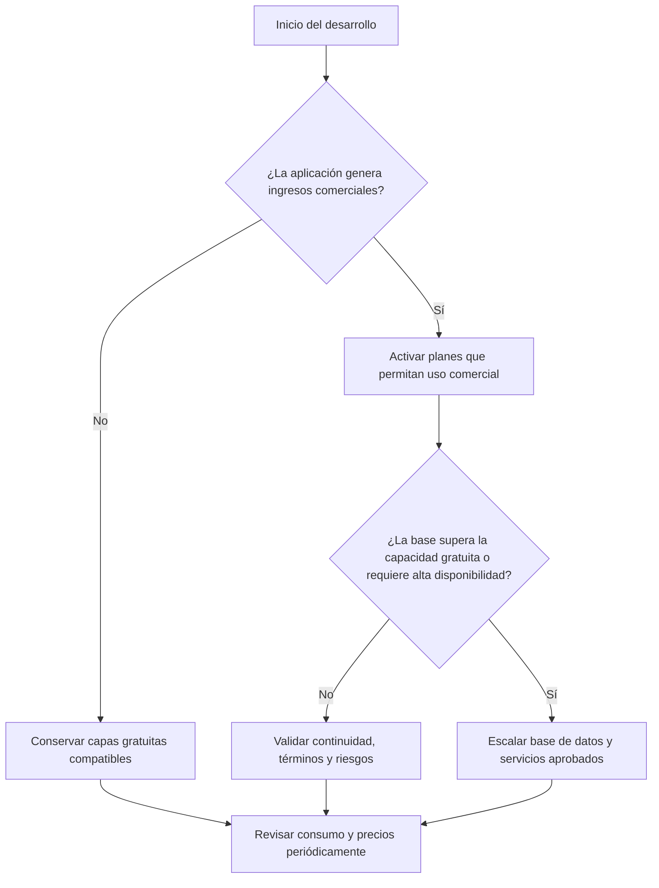

# ICE24 OS — Arquitectura SaaS y límites presupuestarios

> **Confidencial.** Información propiedad intelectual de ICE24 MX. Su reproducción total o parcial requiere autorización escrita.

## Control del documento

| Campo | Valor |
|---|---|
| Proyecto | ICE24 OS |
| Documento | Arquitectura SaaS y límites presupuestarios |
| Versión | 1.0 |
| Fecha | Agosto de 2026 |
| Propietario | ICE24 MX |
| Estado | Propuesta financiera y técnica para validación |
| Fuente | `SaaS_Budget_Limits_Architecture.md`, documento proporcionado por el propietario del proyecto |
| Mercado inicial | México |
| Moneda de referencia | Pesos mexicanos (MXN) y dólares estadounidenses (USD) |

## 1. Propósito

Este documento registra una propuesta de límites presupuestarios, arquitectura técnica, restricciones comerciales de proveedores y criterios de optimización de costos para el desarrollo y la operación de ICE24 OS.

Su contenido funciona como referencia de planeación y control financiero. No sustituye decisiones de arquitectura aceptadas, cotizaciones vigentes, términos comerciales de los proveedores ni aprobaciones de Dirección, Tech Lead, Seguridad/Privacidad u Operación.

## 2. Precedencia y relación con la línea base

- Los PRD, TRD, documentos de arquitectura y reglas del proyecto conservan su autoridad dentro del alcance que les corresponde.
- `ADR-015` adopta Vercel y Supabase como línea base de implementación y formaliza el presupuesto de este documento.
- Los precios, capacidades gratuitas y términos de uso deben verificarse con cada proveedor antes de contratar o desplegar.
- Cualquier cambio de proveedor, arquitectura o presupuesto requiere el proceso de decisión y aprobación aplicable.
- Este documento no constituye por sí mismo una instrucción ejecutable ni una autorización de gasto.

> **Decisión vigente:** Vercel es la plataforma de hosting y despliegue; Supabase proporciona PostgreSQL, Auth y Storage. El presupuesto operativo máximo aceptado es de $2,000 MXN al mes. `ADR-015` define los detalles de implementación y escalamiento.

## 3. Parámetros de la propuesta financiera

| Parámetro | Propuesta |
|---|---|
| Presupuesto máximo operativo | $2,000 MXN al mes (aproximadamente USD 115 al mes) |
| Estrategia FinOps | Maximizar capas gratuitas durante desarrollo e inicio de producción |
| Condición de escalamiento | Migrar a planes pagados al superar capacidad operativa o cuando lo exijan las licencias comerciales |

Los importes son estimaciones de referencia y no cotizaciones. Deben actualizarse con precios, impuestos, tipo de cambio, consumo previsto y condiciones comerciales vigentes.

## 4. Matriz de componentes y escalabilidad propuesta

| Componente o servicio | Proveedor propuesto | Prototipo o MVP | Producción comercial | Límite o restricción de referencia |
|---|---|---:|---:|---|
| Entorno de programación con IA | Claude Pro o Cursor | USD 20/mes (aprox. $350–$400 MXN) | USD 20/mes (aprox. $350–$400 MXN) | Uso del desarrollador para generación de código |
| Backend y base de datos | Supabase (PostgreSQL/Auth) | USD 0, Free Tier | USD 25/mes (aprox. $450 MXN) | Referencia fuente: 500 MB de base y 50,000 MAU; posible pausa por inactividad |
| Hosting y despliegue | Vercel | USD 0, Hobby | USD 20/mes (aprox. $350 MXN) | La fuente considera obligatorio migrar de Hobby al monetizar |
| Dominio y DNS | Cloudflare o Namecheap | USD 0, sin incluir registro | USD 12–15/año (aprox. $250 MXN/año) | Registro anual y DNS gratuito en Cloudflare según la fuente |
| Procesamiento de pagos | Stripe | Sin costo fijo | 3.6% + $3 MXN por transacción exitosa | Comisión variable; requiere integración mediante webhooks |
| Correo transaccional | Resend o SendGrid | USD 0, Free Tier | USD 0–20/mes | Referencia fuente: hasta 3,000 envíos/mes o 100 envíos/día en capa gratuita |
| Monitoreo y analítica | PostHog o Sentry | USD 0, Free Tier | USD 0 inicial | Sujeto a límites de eventos, retención y funcionalidades |

## 5. Criterios de optimización de costos

### 5.1 Datos y cómputo

1. Diseñar esquemas relacionales e índices de PostgreSQL con base en patrones de consulta y mediciones reales.
2. Mantener funciones y servicios de servidor ligeros, con tiempos de ejecución controlados.
3. Procesar trabajos pesados de forma asíncrona conforme a la arquitectura general de ICE24 OS.
4. Configurar presupuestos, alertas de consumo y observabilidad antes de operar ambientes pagados.

### 5.2 APIs y servicios de terceros

1. Separar el costo de herramientas de IA para desarrollo del consumo de APIs utilizado por usuarios finales.
2. Para LLM, almacenamiento vectorial u otras APIs variables, evaluar caché y límites de uso por cuenta o usuario.
3. No introducir Redis, Upstash, Pinecone u otro proveedor sin evaluación técnica, financiera, de seguridad y de licenciamiento.
4. Concentrar SDK y dependencias de proveedores en adaptadores sustituibles.

### 5.3 Licencias y capacidades comerciales

1. Verificar que cada plan permita el uso comercial previsto antes del despliegue.
2. No diseñar funcionalidades que dependan de capacidades Enterprise sin decisión y presupuesto aprobados.
3. Mantener la configuración por ambiente fuera del código y gestionar secretos mediante mecanismos autorizados.
4. Para Stripe, validar la firma de webhooks, asegurar idempotencia y manejar explícitamente los estados de suscripción definidos por el contrato aprobado.

## 6. Arquitectura contenida en la propuesta fuente

La fuente plantea la siguiente combinación para un escenario SaaS de bajo costo:

| Capa | Propuesta fuente |
|---|---|
| Frontend | Next.js con React o SvelteKit |
| Backend y datos | Supabase Auth y PostgreSQL con Row Level Security |
| Estilos | Tailwind CSS |
| API y estado | Server Actions o API Routes ligeras |

Esta combinación constituye la línea base financiera y de plataforma. `ADR-016` conserva Next.js para las superficies web y NestJS para la API; `ADR-015` define su despliegue en Vercel y la adopción de Supabase para datos, autenticación y archivos.

## 7. Árbol de decisión financiera propuesto

La selección concreta de proveedor y plan debe respetar los ADR vigentes y las aprobaciones presupuestarias. La generación de ingresos no es el único disparador posible: seguridad, disponibilidad, privacidad, soporte, capacidad o licenciamiento pueden exigir un cambio anterior.

## 8. Controles mínimos de seguimiento

- Registrar costos por ambiente, servicio y centro de responsabilidad.
- Definir alertas progresivas antes de alcanzar el tope mensual.
- Revisar mensualmente consumo, proyección, anomalías y capacidad.
- Documentar supuestos de tráfico, almacenamiento, correo, observabilidad y procesamiento.
- Someter cambios de proveedor o incrementos materiales a aprobación.
- Mantener un margen para impuestos, variación cambiaria y consumo extraordinario.

## 9. Decisiones pendientes

1. Precisar el tratamiento contable de impuestos, dominio y comisiones variables dentro de los reportes mensuales.
2. Verificar precios, límites gratuitos y condiciones de uso comercial en la fecha de contratación.
3. Definir responsables de seguimiento y respuesta ante excedentes.
4. Seleccionar una solución antimalware compatible con el presupuesto y los controles de cuarentena.

## 10. Historial de cambios

| Versión | Fecha | Cambio |
|---|---|---|
| 1.0 | Agosto de 2026 | Integración del documento fuente al contexto de ICE24 OS, normalización corporativa y registro de conflictos con la línea base vigente |
