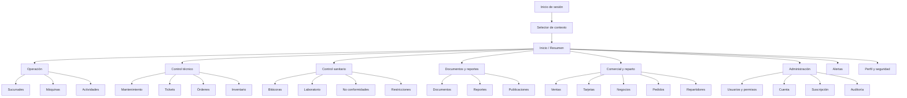

# ICE24 OS — UI/UX Specification

> **Confidencial.** Información propiedad intelectual de ICE24 MX. Su reproducción total o parcial requiere autorización escrita.

## Control del documento

| Campo | Valor |
|---|---|
| Proyecto | ICE24 OS |
| Documento | UI_UX.md — Especificación de interfaz y experiencia de usuario |
| Versión | 1.0 |
| Fecha | Agosto de 2026 |
| Propietario | ICE24 MX |
| Estado | Propuesta de diseño para validación de producto, negocio, UX/UI, accesibilidad e ingeniería |
| Fuente funcional | ICE24 OS — Product Requirements Document v1.0 |
| Mercado inicial | México |
| Idioma inicial | Español |
| Moneda | Pesos mexicanos (MXN) |
| Formato visible de fecha | DD/MM/AAAA |
| Plataformas | PWA privada, portal público y experiencia responsiva en teléfono, tableta y computadora |

## 1. Propósito

Este documento convierte los requisitos del PRD de ICE24 OS en una especificación integral de interfaz y experiencia de usuario. Define la arquitectura de información, navegación, sistema visual, componentes, layouts, patrones de interacción, comportamiento responsivo, estados de sistema, accesibilidad y wireframes de referencia.

La especificación cubre:

- la aplicación privada de ICE24 OS;
- la administración central para personal ICE24;
- las experiencias especializadas de propietarios, operadores, técnicos, responsables sanitarios, restaurantes y repartidores;
- la operación PWA y offline controlada;
- el portal público técnico y sanitario accesible mediante QR;
- el modo lectura derivado del estado de suscripción;
- la visualización consistente de estados operativos, técnicos, sanitarios, documentales y de sincronización.

Este documento no cambia el alcance funcional del PRD. Cuando una decisión visual o de interacción no está definida en el PRD, se identifica como **propuesta de diseño** y deberá validarse durante la Etapa 0.

## 2. Fuentes, límites y decisiones de diseño

### 2.1 Elementos confirmados por el PRD

- La aplicación es privada, excepto por el portal público asociado con códigos QR.
- Una persona utiliza una sola identidad y puede cambiar entre contextos autorizados.
- El acceso depende de cuenta, sucursal, máquina, módulo, acción y sensibilidad.
- El equipo es el eje del expediente técnico y sanitario.
- Los estados operativo, técnico y sanitario son independientes.
- La visibilidad pública es independiente del estado operativo de un registro.
- Las alertas críticas permanecen fijadas hasta que el responsable confirma estar enterado.
- Las actividades de campo pueden operar offline únicamente cuando fueron sincronizadas previamente.
- Tomar pedidos, crear usuarios, cambiar configuración, procesar Excel y generar reportes requiere conexión.
- Los conflictos offline deben conservar ambas versiones y requerir resolución explícita.
- El modo lectura permite consultar y descargar información existente, pero no crear ni modificar.
- La experiencia debe ser responsiva en teléfono, tableta y computadora.
- Los mensajes de validación, error, conflicto y estado deben ser comprensibles para usuarios no técnicos.
- El estándar y nivel de accesibilidad definitivo permanece abierto en el PRD.

### 2.2 Propuestas de diseño sujetas a validación

Los siguientes elementos son recomendaciones de UI/UX, no decisiones cerradas por el PRD:

- paleta cromática exacta;
- familia tipográfica;
- iconografía;
- escala de espaciado;
- radios, sombras y elevaciones;
- breakpoints responsivos;
- navegación lateral en escritorio y navegación inferior en móvil;
- objetivo recomendado de accesibilidad WCAG 2.2 nivel AA;
- densidad de tablas y estructura de tarjetas;
- orden exacto de los módulos dentro de la navegación;
- nombres finales de algunas etiquetas de interfaz.

### 2.3 Fuera de alcance de esta especificación

- Diseño visual del hardware o interfaz física de la máquina.
- Interfaz de la aplicación remota original del fabricante.
- Plataforma externa de capacitación.
- Plataforma Brain.
- Portal de timbrado fiscal.
- Flujo de cobro de pedidos de hielo.
- Automatización inicial de alertas por WhatsApp.
- Diseño de contenido de video, porque el PRD excluye video en la primera política de archivos.

## 3. Objetivos de experiencia

| ID | Objetivo UX | Criterio de diseño |
|---|---|---|
| UX-01 | Mostrar prioridades reales | Los riesgos críticos aparecen antes que métricas favorables o datos secundarios. |
| UX-02 | Reducir dependencia de memoria | Próximas actividades, vencimientos y acciones requeridas son visibles y accionables. |
| UX-03 | Mantener contexto | Cuenta, sucursal y máquina activas son visibles en todo momento. |
| UX-04 | Prevenir errores sensibles | Transiciones críticas utilizan confirmaciones, motivos, resumen de impacto y permisos explícitos. |
| UX-05 | Facilitar trabajo de campo | Formularios móviles priorizan lectura, checklist, fotografías, guardado progresivo y estado offline. |
| UX-06 | Explicar el estado del sistema | El usuario conoce si un dato está guardado, pendiente, sincronizando, en error, vencido o restringido. |
| UX-07 | Conservar trazabilidad sin abrumar | La actividad actual es clara; versiones, auditoría y valores anteriores permanecen disponibles bajo demanda. |
| UX-08 | Evitar falsa certeza | “Sin datos”, “Pendiente”, “No evaluable” y “No conforme” se distinguen visual y verbalmente. |
| UX-09 | Proteger información sensible | La interfaz no expone costos, documentos originales o datos personales sin permiso. |
| UX-10 | Mantener consistencia | Estados, botones, formularios, tablas y mensajes siguen patrones compartidos en todos los módulos. |
| UX-11 | Soportar usuarios no técnicos | El lenguaje utiliza términos operativos claros y evita mensajes internos de sistema. |
| UX-12 | Permitir crecimiento por etapas | Los patrones permiten añadir módulos sin rediseñar la navegación completa. |

## 4. Usuarios, contextos y prioridades de interfaz

### 4.1 Matriz de experiencias

| Perfil | Dispositivo probable | Frecuencia | Prioridades de interfaz |
|---|---|---:|---|
| Superadministrador ICE24 | Computadora, tableta | Alta | Gobierno global, validaciones, restricciones, auditoría, configuración y soporte. |
| Administrador técnico ICE24 | Computadora, tableta | Alta | Modelos, plantillas, componentes, mantenimientos, equipos afectados y restricciones. |
| Administrador sanitario ICE24 | Computadora, tableta | Alta | Plantillas sanitarias, análisis, no conformidades, acciones correctivas y publicación. |
| Personal ICE24 | Computadora | Media/alta | Búsqueda global, soporte, cuentas, solicitudes y seguimiento. |
| Propietario principal | Teléfono y computadora | Alta | Resumen, alertas, máquinas, sucursales, inventario, reportes, usuarios y suscripción. |
| Administrador del cliente | Teléfono y computadora | Alta | Operación delegada según permisos. |
| Encargado de sucursal | Teléfono y tableta | Alta | Estado de sucursal, actividades, incidencias y pendientes locales. |
| Operador | Teléfono | Muy alta | Bitácoras, mediciones, incidencias, fotografías y sincronización. |
| Técnico | Teléfono y tableta | Muy alta | Órdenes, checklist, diagnóstico, piezas, evidencias y trabajo offline. |
| Responsable sanitario | Teléfono y computadora | Alta | Bitácoras, análisis, alertas, acciones correctivas y documentos. |
| Repartidor | Teléfono | Muy alta | Disponibilidad, pedidos, ubicación, recolección, entrega y evidencia. |
| Administrador de negocio | Teléfono y computadora | Media | Usuarios, sucursales consumidoras, máquinas asociadas y pedidos. |
| Usuario de restaurante | Teléfono | Alta | Crear pedido, elegir máquina, consultar precio y seguimiento. |
| Auditor interno | Computadora | Media/baja | Lectura, filtros, documentos, reportes y auditoría autorizada. |
| Público | Teléfono | Eventual | Identificar equipo, consultar información publicada y descargar versiones públicas. |

### 4.2 Modos de uso

#### Modo operativo

Para propietarios, administradores, encargados y operadores. Prioriza alertas, estado de máquinas, actividades pendientes, formularios y ejecución.

#### Modo técnico

Para técnicos e ICE24 técnico. Prioriza órdenes, sistemas, componentes, diagnóstico, evidencia, inventario y mantenimiento.

#### Modo sanitario

Para responsables sanitarios e ICE24 sanitario. Prioriza bitácoras, análisis, límites, no conformidades, acciones correctivas y publicación.

#### Modo comercial

Para propietarios, restaurantes y repartidores. Prioriza productos, precios, pedidos, disponibilidad, tarjetas, recargas y entregas.

#### Modo gobierno ICE24

Prioriza cuentas, validaciones, plantillas oficiales, restricciones, suscripciones, auditoría global y soporte.

#### Modo público

Solo muestra proyecciones publicadas y protegidas. No reutiliza la navegación ni la sesión de la aplicación privada.

## 5. Principios de diseño de la interfaz

### 5.1 Jerarquía antes que decoración

La interfaz debe comunicar en este orden:

1. Riesgos y bloqueos.
2. Acción requerida.
3. Estado actual.
4. Próximos vencimientos.
5. Contexto y evidencia.
6. Tendencias e información secundaria.

### 5.2 Acción explícita para cambios sensibles

Las siguientes acciones nunca deben depender de un cambio silencioso en un selector:

- aprobar o rechazar un equipo;
- transferir una máquina;
- publicar o retirar contenido;
- aplicar o levantar una restricción;
- reactivar después de una no conformidad;
- corregir o anular un registro;
- ajustar inventario;
- cambiar roles o permisos;
- anular una importación;
- tomar un pedido;
- marcar producto recogido;
- cerrar una entrega;
- cancelar una suscripción;
- exportar todos los datos.

Se presentan como acciones con nombre, resumen, motivo y confirmación.

### 5.3 Estado y visibilidad no se mezclan

Cada registro que pueda publicarse debe mostrar por separado:

- **Estado operativo o documental:** borrador, pendiente, completado, no conforme, corregido, anulado, etc.
- **Visibilidad:** privado, pendiente de publicación, publicado, retirado o sustituido.

No se utilizará un único color o etiqueta para representar ambas dimensiones.

### 5.4 La ausencia de datos no es cumplimiento

La interfaz debe distinguir:

- Sin datos.
- Datos incompletos.
- Pendiente de captura.
- Pendiente de revisión.
- No evaluable.
- Conforme.
- No conforme.

### 5.5 Progresión visible

Los flujos extensos deben mostrar:

- paso actual;
- pasos completados;
- requisitos faltantes;
- posibilidad de guardar borrador;
- consecuencias de enviar o cerrar;
- estado de sincronización.

### 5.6 Divulgación progresiva

La pantalla principal muestra lo necesario para actuar. La información extensa —historial, versiones, auditoría, metadatos, fórmulas o detalles técnicos— se expande en pestañas, paneles laterales o secciones secundarias.

## 6. Paleta de colores

> **Nota:** El PRD no define colores corporativos exactos. Esta paleta es una propuesta funcional inspirada en hielo, agua, limpieza y operación industrial. Debe reconciliarse con el manual de marca de ICE24 antes de producción.

### 6.1 Paleta base propuesta

| Token | Valor propuesto | Uso principal |
|---|---:|---|
| `brand-900` | `#073B5C` | Encabezados de marca, navegación principal, fondos de alta jerarquía. |
| `brand-800` | `#0A4B73` | Hover oscuro, encabezados secundarios. |
| `brand-700` | `#0D5D8C` | Botones primarios oscuros y enlaces destacados. |
| `brand-600` | `#0F74AD` | Acción primaria. |
| `brand-500` | `#168AC9` | Elementos activos, gráficas y acentos. |
| `brand-400` | `#4AA9D8` | Estados suaves, iconos secundarios. |
| `brand-300` | `#86C9E8` | Fondos seleccionados y barras informativas. |
| `brand-200` | `#BCE3F3` | Bordes y superficies de información. |
| `brand-100` | `#E2F4FB` | Fondo informativo y selección tenue. |
| `brand-50` | `#F3FBFE` | Fondo de página o panel contextual. |

### 6.2 Neutros

| Token | Valor propuesto | Uso |
|---|---:|---|
| `neutral-950` | `#101820` | Texto de máxima jerarquía. |
| `neutral-900` | `#17212B` | Texto principal. |
| `neutral-800` | `#25313D` | Encabezados secundarios. |
| `neutral-700` | `#3A4754` | Texto secundario fuerte. |
| `neutral-600` | `#556270` | Texto auxiliar. |
| `neutral-500` | `#71808F` | Placeholder e iconos inactivos. |
| `neutral-400` | `#94A0AC` | Bordes fuertes o controles deshabilitados. |
| `neutral-300` | `#C2CAD2` | Bordes. |
| `neutral-200` | `#DDE2E7` | Divisores. |
| `neutral-100` | `#EDF0F3` | Superficie secundaria. |
| `neutral-50` | `#F7F9FA` | Fondo general. |
| `white` | `#FFFFFF` | Tarjetas y fondos. |

### 6.3 Colores semánticos

| Semántica | Base | Fondo suave | Borde | Uso |
|---|---:|---:|---:|---|
| Éxito / conforme | `#16794D` | `#E8F6EF` | `#A8DBC2` | Completado, conforme, disponible, activo. |
| Advertencia | `#A15C00` | `#FFF4DB` | `#F1CF89` | Próximo a vencer, atención preventiva, parcial. |
| Error / crítico | `#B42318` | `#FDECEA` | `#F5B7B1` | No conforme, restringido, pago rechazado, conflicto crítico. |
| Información | `#1769AA` | `#EAF4FC` | `#B5D7F0` | Ayuda, actualización, sincronización y datos de contexto. |
| Neutral / sin datos | `#59636E` | `#F1F3F5` | `#D3D8DE` | Sin datos, no evaluable, archivado. |
| Violeta / auditoría | `#6E46A5` | `#F3ECFA` | `#D7C3EB` | Versiones, auditoría, historial, fórmulas. |
| Cian / offline | `#007B83` | `#E4F6F7` | `#A8DCDD` | Trabajo local, descarga offline, sincronización. |

### 6.4 Aplicación por estado de máquina

Los tres estados de una máquina se muestran como chips separados:

| Dimensión | Ejemplo | Tratamiento recomendado |
|---|---|---|
| Operativo | Disponible | Icono de operación + etiqueta verde. |
| Técnico | Atención preventiva | Icono de herramienta + etiqueta ámbar. |
| Sanitario | Acción correctiva | Icono de escudo/gota + etiqueta roja. |

No se deben fusionar en una sola calificación. Un estado sanitario crítico domina la prioridad visual, pero los otros estados siguen visibles.

### 6.5 Reglas de contraste y color

- El color nunca será el único medio para comunicar un estado.
- Cada estado incluye texto e icono.
- Texto normal debe alcanzar contraste recomendado de 4.5:1.
- Texto grande debe alcanzar al menos 3:1.
- Los controles y límites visuales relevantes deben alcanzar 3:1 frente al fondo.
- Los colores de marca claros solo se usarán como fondo, no como texto principal.
- Los gráficos deben combinar color, patrón, etiqueta o forma cuando exista riesgo de confusión.

## 7. Tipografía

> **Propuesta:** `Inter` para interfaz, con fallback a `system-ui`, `Segoe UI`, `Roboto`, `Helvetica Neue`, `Arial`, sans-serif. La elección final deberá validarse con identidad de marca, licenciamiento, rendimiento y legibilidad.

### 7.1 Escala tipográfica

| Token | Tamaño / línea | Peso | Uso |
|---|---|---:|---|
| `display-lg` | 40 / 48 px | 700 | Portada pública o encabezado excepcional. |
| `display-sm` | 32 / 40 px | 700 | Encabezado principal de módulo en escritorio. |
| `heading-1` | 28 / 36 px | 700 | Título de página. |
| `heading-2` | 24 / 32 px | 650 | Sección principal. |
| `heading-3` | 20 / 28 px | 650 | Tarjeta o subsección. |
| `heading-4` | 18 / 26 px | 600 | Encabezado compacto. |
| `body-lg` | 18 / 28 px | 400 | Introducción o lectura pública. |
| `body-md` | 16 / 24 px | 400 | Texto principal y formularios. |
| `body-sm` | 14 / 20 px | 400 | Tablas, metadatos y ayudas. |
| `label-md` | 14 / 20 px | 600 | Etiquetas, botones y tabs. |
| `label-sm` | 12 / 16 px | 600 | Chips y metadatos compactos. |
| `caption` | 12 / 16 px | 400 | Tiempos, versión y texto auxiliar. |
| `mono` | 13 / 20 px | 500 | Código ICE24 OS, folios, hashes y IDs visibles. |

### 7.2 Reglas tipográficas

- No usar mayúsculas sostenidas en párrafos o acciones.
- Las etiquetas de campos usan oración normal: “Fecha de muestreo”.
- Los títulos de página son descriptivos: “Orden de trabajo OT-00241”.
- Códigos, folios y series pueden utilizar fuente monoespaciada.
- Máximo recomendado de 75 caracteres por línea en contenido de lectura.
- En móvil, el tamaño de texto de campos y controles no debe ser menor a 16 px para evitar zoom involuntario.
- Los números tabulares deben alinearse para facilitar comparación en tablas financieras y de inventario.

## 8. Sistema de diseño

### 8.1 Nombre de trabajo

**ICE24 Design System (IDS)**.

### 8.2 Principios

1. **Confiable:** el usuario comprende qué ocurrió y qué falta.
2. **Trazable:** los cambios sensibles muestran actor, fecha, motivo y versión.
3. **Operativo:** las acciones frecuentes son rápidas y visibles.
4. **Seguro:** los permisos y datos sensibles se reflejan en la interfaz.
5. **Consistente:** el mismo estado conserva nombre, icono y color.
6. **Adaptable:** componentes utilizables en escritorio y campo.
7. **Accesible:** teclado, lectores de pantalla, contraste y movimiento reducido.

### 8.3 Escala de espaciado

Basada en incrementos de 4 px:

| Token | Valor | Uso |
|---|---:|---|
| `space-0` | 0 | Sin espacio. |
| `space-1` | 4 px | Separación interna mínima. |
| `space-2` | 8 px | Icono-texto, chips. |
| `space-3` | 12 px | Controles compactos. |
| `space-4` | 16 px | Padding móvil y tarjetas compactas. |
| `space-5` | 20 px | Grupos de campos. |
| `space-6` | 24 px | Padding estándar de tarjeta. |
| `space-8` | 32 px | Separación de secciones. |
| `space-10` | 40 px | Encabezado y contenido. |
| `space-12` | 48 px | Secciones amplias. |
| `space-16` | 64 px | Portadas y grandes divisiones. |

### 8.4 Radios

| Token | Valor | Uso |
|---|---:|---|
| `radius-sm` | 4 px | Chips, pequeños indicadores. |
| `radius-md` | 8 px | Inputs, botones y tarjetas compactas. |
| `radius-lg` | 12 px | Tarjetas principales y paneles. |
| `radius-xl` | 16 px | Modales y hojas móviles. |
| `radius-pill` | 999 px | Chips y filtros seleccionados. |

### 8.5 Bordes y elevación

- Bordes estándar: 1 px `neutral-200`.
- Foco: anillo de 2–3 px visible y separado del borde.
- Las sombras se reservan para navegación flotante, menús, modales y superficies elevadas.
- No usar sombras como único indicador de separación.
- Las tarjetas dentro de un fondo blanco se diferencian mediante borde o fondo secundario.

### 8.6 Iconografía

- Estilo lineal consistente, 20 o 24 px.
- Trazo uniforme.
- Cada icono decorativo se oculta a lectores de pantalla.
- Iconos funcionales incluyen nombre accesible.
- Estados críticos no usan iconos ambiguos: alerta, bloqueo, herramienta, escudo, documento, sincronización y ubicación deben ser reconocibles.

### 8.7 Movimiento

- Duraciones entre 120 y 240 ms para transiciones de interfaz.
- No animar información crítica de forma continua.
- Respetar `prefers-reduced-motion`.
- Los estados de carga pueden usar skeleton sin movimiento agresivo.
- No usar parallax ni movimientos decorativos en formularios de campo.

### 8.8 Densidad

Se recomiendan dos densidades:

- **Cómoda:** predeterminada para móvil, formularios, portal público y usuarios de campo.
- **Compacta:** opcional en escritorio para tablas operativas, auditoría e inventario.

La densidad no cambia el tamaño mínimo de interacción.

## 9. Arquitectura de información

### 9.1 Objetos principales

La navegación y las páginas deben reflejar la jerarquía del producto:

```text
Cuenta titular
├── Sucursales
│   ├── Máquinas
│   │   ├── Sistemas
│   │   ├── Componentes
│   │   ├── Mantenimiento
│   │   ├── Sanidad
│   │   ├── Laboratorio
│   │   ├── Documentos
│   │   ├── Ventas
│   │   ├── Tarjetas
│   │   ├── Pedidos
│   │   ├── Reportes
│   │   └── Auditoría
│   └── Inventario local
├── Usuarios y permisos
├── Inventario general
├── Negocios asociados
├── Repartidores
├── Reportes globales
├── Suscripción
└── Configuración
```

### 9.2 Mapa general de navegación privada



### 9.3 Agrupación recomendada de navegación

La navegación no debe mostrar todos los módulos a todos los perfiles. Los grupos se renderizan conforme a permisos y módulos habilitados.

| Grupo | Destinos sugeridos |
|---|---|
| Inicio | Resumen, tareas, actividad reciente. |
| Operación | Sucursales, máquinas, calendario, incidencias. |
| Técnico | Mantenimientos, tickets, órdenes, componentes, inventario. |
| Sanidad | Bitácoras, análisis, no conformidades, acciones correctivas. |
| Documentos | Archivos, reportes, exportaciones, publicaciones, QR. |
| Comercial | Ventas, tarjetas, recargas, negocios, productos, pedidos, repartidores. |
| Analítica | Indicadores, tendencias, comparaciones y mapas autorizados. |
| Administración | Usuarios, permisos, cuenta, suscripción, configuración y auditoría. |

### 9.4 Navegación especializada por perfil

#### Técnico

```text
Inicio
Órdenes
Calendario
Máquinas
Inventario
Sincronización
Alertas
Perfil
```

#### Operador

```text
Inicio
Bitácoras
Actividades
Incidencias
Máquinas
Sincronización
Alertas
Perfil
```

#### Responsable sanitario

```text
Inicio
Bitácoras
Laboratorio
No conformidades
Acciones correctivas
Documentos
Alertas
Perfil
```

#### Repartidor

```text
Inicio
Pedidos disponibles
Pedido activo
Historial
Tarjetas
Ventas externas
Sincronización
Perfil
```

#### Restaurante

```text
Inicio
Nuevo pedido
Pedidos
Máquinas asociadas
Sucursales
Datos fiscales
Usuarios
Perfil
```

### 9.5 Selector de contexto

Cuando el usuario tenga múltiples relaciones, el encabezado muestra:

- cuenta activa;
- rol o relación activa;
- sucursal o máquina cuando se haya fijado un ámbito;
- opción “Cambiar contexto”.

El selector permite buscar y agrupar por cuenta. Cambiar de contexto:

1. advierte si existen cambios locales no sincronizados;
2. conserva filtros solo cuando son válidos en el nuevo contexto;
3. actualiza permisos y navegación;
4. registra actividad cuando corresponda;
5. no requiere un nuevo inicio de sesión.

## 10. Navegación

### 10.1 Escritorio

- Barra lateral persistente de 248–280 px.
- Puede colapsarse a 72 px conservando iconos y tooltips.
- Encabezado superior con contexto, búsqueda, sincronización, alertas y usuario.
- Breadcrumbs en páginas profundas.
- Acciones principales en encabezado de página.
- Tabs para dominios dentro de una entidad, no para navegación global.

### 10.2 Tableta

- Barra lateral colapsable sobre el contenido.
- Encabezado compacto.
- Paneles laterales pueden ocupar 40–60% del ancho.
- Tablas permiten columnas prioritarias y desplazamiento horizontal controlado.

### 10.3 Móvil

- Barra superior con contexto y alertas.
- Navegación inferior con un máximo de cinco destinos prioritarios por perfil.
- Destino “Más” abre el resto de módulos.
- Acciones primarias pueden ser fijas en la parte inferior cuando el flujo lo requiera.
- Los formularios usan una columna.
- Las tablas se transforman en tarjetas o listas de filas expandibles.

### 10.4 Breadcrumbs

Ejemplos:

```text
Máquinas / ICE24-000145 / Mantenimiento / OT-00241
Sanidad / No conformidades / NC-00039
Negocios / Restaurante Centro / Pedidos / PED-01922
```

En móvil, se reduce a botón de regreso y título actual; la ruta completa queda disponible en menú contextual.

### 10.5 Búsqueda

La búsqueda global es una propuesta para perfiles autorizados y se limita a objetos que el usuario puede consultar:

- código ICE24 OS;
- serie;
- máquina;
- sucursal;
- usuario;
- folio de ticket, orden, documento, reporte o pedido;
- negocio asociado.

No debe revelar coincidencias de otras cuentas ni existencia de recursos no autorizados.

## 11. Layouts

### 11.1 Shell privado de escritorio

```text
┌──────────────────────────────────────────────────────────────────────────────┐
│ ICE24 OS │ Contexto: Cuenta Norte ▾ │ Buscar... │ Sync ✓ │ Alertas 4 │ ER ▾ │
├──────────┬───────────────────────────────────────────────────────────────────┤
│ Inicio   │ Breadcrumbs                                                     │
│ Operación│ Título de página                             [Acción secundaria] │
│ Técnico  │ Descripción breve                                  [Primaria]    │
│ Sanidad  ├───────────────────────────────────────────────────────────────────┤
│ Docs     │ Filtros / tabs / resumen                                         │
│ Comercial│                                                                   │
│ Analítica│ Contenido principal                                               │
│ Admin    │                                                                   │
│          │                                                                   │
│ Ayuda    │                                                                   │
└──────────┴───────────────────────────────────────────────────────────────────┘
```

### 11.2 Shell móvil

```text
┌──────────────────────────────┐
│ ☰  Cuenta Norte ▾       🔔 4 │
├──────────────────────────────┤
│ Título de página             │
│ Contexto / estado            │
├──────────────────────────────┤
│                              │
│ Contenido desplazable        │
│                              │
│                              │
├──────────────────────────────┤
│ Inicio │ Tareas │ Máquinas   │
│ Alertas│ Más                 │
└──────────────────────────────┘
```

### 11.3 Página de lista

- Encabezado de página.
- Resumen opcional con 2–5 métricas.
- Barra de filtros.
- Vista tabla en escritorio y tarjetas/lista en móvil.
- Selección múltiple solo si existe una acción permitida y segura.
- Paginación o carga progresiva.
- Estado vacío contextual.

### 11.4 Página de detalle

- Encabezado con identidad, folio y estados.
- Acciones según permisos.
- Resumen principal.
- Tabs o secciones: Resumen, Actividad, Documentos, Historial/Auditoría.
- Panel lateral opcional para metadatos y próximos eventos.

### 11.5 Formulario

- Título, propósito y entidad afectada.
- Indicador de borrador.
- Campos agrupados por tarea, no por estructura de base de datos.
- Ayuda contextual.
- Resumen de errores al enviar.
- Acciones: Cancelar, Guardar borrador, Continuar/Enviar.
- En móvil, acción primaria fija si no oculta contenido.

### 11.6 Flujo por pasos

Usar para:

- alta de equipo;
- validación de equipo;
- reactivación;
- creación de reporte personalizado;
- importación de Excel;
- transferencia de máquina;
- exportación completa;
- configuración compleja de plantillas.

Patrón recomendado:

```text
1. Datos básicos  ✓
2. Ubicación      ✓
3. Configuración  ●
4. Documentos     ○
5. Revisión       ○
```

### 11.7 Panel de acción lateral

Usar para acciones de alcance limitado:

- asignar técnico;
- cambiar prioridad;
- añadir comentario;
- publicar un documento;
- consultar metadatos;
- revisar una versión;
- marcar “Enterado”.

No usar panel lateral para transferencias, restricciones, anulaciones o acciones que requieran gran contexto; estas usan página o modal de confirmación amplio.

## 12. Inventario de pantallas

### 12.1 Acceso y cuenta

| ID | Pantalla | Perfiles |
|---|---|---|
| UI-AUTH-01 | Inicio de sesión | Usuarios privados |
| UI-AUTH-02 | Cambio obligatorio de contraseña | Usuario nuevo |
| UI-AUTH-03 | Recuperar contraseña | Usuario |
| UI-AUTH-04 | Verificación 2FA | Usuario con 2FA |
| UI-AUTH-05 | Selector de contexto | Usuario multi-contexto |
| UI-AUTH-06 | Sesiones y seguridad | Usuario / propietario / ICE24 |
| UI-AUTH-07 | Acceso revocado o sesión expirada | Usuario |

### 12.2 Inicio y alertas

| ID | Pantalla | Perfiles |
|---|---|---|
| UI-HOME-01 | Resumen de propietario | Propietario / administrador |
| UI-HOME-02 | Resumen ICE24 global | Personal ICE24 |
| UI-HOME-03 | Inicio técnico | Técnico |
| UI-HOME-04 | Inicio operador | Operador |
| UI-HOME-05 | Inicio sanitario | Responsable sanitario |
| UI-HOME-06 | Inicio repartidor | Repartidor |
| UI-HOME-07 | Inicio restaurante | Usuario de negocio |
| UI-ALT-01 | Centro de alertas | Todos según permisos |
| UI-ALT-02 | Detalle de alerta | Responsable |
| UI-ALT-03 | Configuración de avisos permitidos | Propietario / ICE24 |

### 12.3 Cuentas, sucursales y equipos

| ID | Pantalla | Función |
|---|---|---|
| UI-ACC-01 | Datos de cuenta | Identidad, contacto, zona horaria y datos fiscales. |
| UI-BRA-01 | Lista de sucursales | Estado y máquinas por ubicación. |
| UI-BRA-02 | Detalle de sucursal | Datos, máquinas, almacén y actividad. |
| UI-BRA-03 | Crear/editar sucursal | Campos autorizados. |
| UI-MAC-01 | Lista de máquinas | Estados independientes y filtros. |
| UI-MAC-02 | Detalle de máquina | Expediente central. |
| UI-MAC-03 | Solicitud de alta | Flujo por pasos. |
| UI-MAC-04 | Validación ICE24 | Documentos, faltantes y resolución. |
| UI-MAC-05 | Historial de ubicaciones | Línea de tiempo. |
| UI-MAC-06 | Transferencia | Alcance técnico/sanitario y comercial opcional. |
| UI-MAC-07 | Etiquetas y QR | Vista previa y generación. |

### 12.4 Plantillas y componentes

| ID | Pantalla | Función |
|---|---|---|
| UI-TPL-01 | Catálogo de modelos | Versiones y vigencia. |
| UI-TPL-02 | Detalle de plantilla | Sistemas, componentes y actividades. |
| UI-TPL-03 | Editor de plantilla | Configuración ICE24. |
| UI-TPL-04 | Comparar versiones | Diferencias y máquinas afectadas. |
| UI-CMP-01 | Catálogo de componentes | Compatibilidad, vida útil y mantenimiento. |

### 12.5 Mantenimiento y tickets

| ID | Pantalla | Función |
|---|---|---|
| UI-MNT-01 | Calendario de mantenimiento | Programado, próximo, vencido y crítico. |
| UI-MNT-02 | Lista de actividades | Filtros por estado y responsable. |
| UI-TKT-01 | Crear ticket | Máquina, sistema, prioridad y evidencia. |
| UI-TKT-02 | Detalle de ticket | Diagnóstico, asignación y seguimiento. |
| UI-WO-01 | Lista de órdenes | Asignadas, descargadas y pendientes. |
| UI-WO-02 | Ejecutar orden | Checklist, diagnóstico, piezas y evidencia. |
| UI-WO-03 | Cierre de orden | Resumen y confirmación. |
| UI-WO-04 | Corrección/anulación | Motivo y comparación versionada. |

### 12.6 Sanidad y laboratorio

| ID | Pantalla | Función |
|---|---|---|
| UI-SAN-01 | Resumen sanitario | Estado, vencimientos y controles. |
| UI-SAN-02 | Lista de bitácoras | Pendientes, vencidas y completas. |
| UI-SAN-03 | Capturar bitácora dinámica | Campos según plantilla. |
| UI-LAB-01 | Lista de análisis | Vigencia y resultado. |
| UI-LAB-02 | Registrar análisis | Datos, parámetros y documento. |
| UI-LAB-03 | Detalle de análisis | Resultado, parámetros y seguimiento. |
| UI-NC-01 | No conformidades | Alertas y estado de atención. |
| UI-NC-02 | Acción correctiva | Responsable, evidencia y cierre. |
| UI-RES-01 | Restricción | Aplicación, impacto y levantamiento. |
| UI-REA-01 | Reactivación | Formulario y aceptación. |

### 12.7 Inventario y documentos

| ID | Pantalla | Función |
|---|---|---|
| UI-INV-01 | Resumen de inventario | Existencias, mínimos y caducidades. |
| UI-INV-02 | Producto de inventario | Lotes, movimientos y compatibilidad. |
| UI-INV-03 | Registrar movimiento | Entrada, salida, transferencia o ajuste. |
| UI-INV-04 | Pieza instalada/retirada | Historial en máquina. |
| UI-INV-05 | Solicitud de refacciones | Carrito y mensaje WhatsApp. |
| UI-DOC-01 | Repositorio de documentos | Filtros y visibilidad. |
| UI-DOC-02 | Cargar documento | Metadatos, archivo y relación. |
| UI-DOC-03 | Detalle y versiones | Original, pública, historial y descargas. |
| UI-DOC-04 | Publicar/retirar | Protección y confirmación. |

### 12.8 Reportes, portal y analítica

| ID | Pantalla | Función |
|---|---|---|
| UI-RPT-01 | Catálogo de reportes | Predeterminados y personalizados. |
| UI-RPT-02 | Constructor de reporte | Periodo, ámbito, secciones y privacidad. |
| UI-RPT-03 | Vista previa | Misma plantilla que el PDF. |
| UI-RPT-04 | Historial de generaciones | Estado, archivo y descarga. |
| UI-RPT-05 | Programaciones | Frecuencia y destinatarios registrados. |
| UI-EXP-01 | Exportación completa | Solicitud y descarga temporal. |
| UI-PUB-01 | Gestión de publicación | Contenido visible por equipo. |
| UI-ANA-01 | Panel de indicadores | Técnico, sanitario, operativo y comercial. |

### 12.9 Ventas, tarjetas y comercial

| ID | Pantalla | Función |
|---|---|---|
| UI-SAL-01 | Importaciones de ventas | Estado y archivos. |
| UI-SAL-02 | Cargar Excel | Máquina y archivo. |
| UI-SAL-03 | Vista previa de importación | Nuevos, duplicados y errores. |
| UI-SAL-04 | Panel de ventas | Día, hora, producto, máquina y pago. |
| UI-CARD-01 | Tarjetas | Folio, máquina y titular. |
| UI-CARD-02 | Detalle de tarjeta | Movimientos administrativos. |
| UI-CARD-03 | Registrar recarga/retiro | Evidencia y advertencia de saldo. |
| UI-BIZ-01 | Negocios consumidores | Asociaciones. |
| UI-BIZ-02 | Detalle de negocio | Sucursales, usuarios y máquinas. |
| UI-PROD-01 | Productos y precios | Disponibilidad por máquina. |
| UI-ORD-01 | Pedidos | Estados y responsables. |
| UI-ORD-02 | Crear pedido | Máquina, producto, entrega y total. |
| UI-DRV-01 | Repartidores | Estado y asociaciones. |
| UI-DRV-02 | Pedido disponible | Evaluación antes de tomar. |
| UI-DRV-03 | Ejecución de entrega | Recolección, ruta y entrega. |

### 12.10 Administración y gobierno ICE24

| ID | Pantalla | Función |
|---|---|---|
| UI-ADM-01 | Panel global | Cuentas, demos, equipos, pagos y riesgos. |
| UI-ADM-02 | Validaciones | Solicitudes y faltantes. |
| UI-ADM-03 | Restricciones globales | Técnicas y sanitarias. |
| UI-ADM-04 | Suscripciones | Stripe, rechazos y reactivaciones. |
| UI-USR-01 | Usuarios | Asociaciones, roles y estado. |
| UI-PER-01 | Matriz de permisos | Ámbito, módulo, acción y sensibilidad. |
| UI-AUD-01 | Auditoría | Filtros y detalle de evento. |
| UI-SYNC-01 | Conflictos offline | Comparación y resolución. |

## 13. Componentes

### 13.1 Acciones

#### Botón

Variantes:

- Primario.
- Secundario.
- Terciario/texto.
- Destructivo.
- Destructivo suave.
- Icono.
- Dividido con menú.

Estados:

- Predeterminado.
- Hover.
- Foco.
- Presionado.
- Cargando.
- Deshabilitado.

Reglas:

- Una sola acción primaria por región visual.
- Los botones usan verbos: “Guardar borrador”, “Enviar a validación”, “Publicar”.
- No usar “Aceptar” cuando puede especificarse la acción.
- Acciones destructivas explican el efecto y requieren motivo cuando el PRD lo exige.
- El estado cargando evita doble envío y conserva el texto o contexto de la acción.

#### Menú de acciones

Las acciones frecuentes se muestran directamente. Las secundarias se agrupan en “Más acciones”. Nunca ocultar una acción crítica necesaria para completar el flujo dentro de un menú desconocido.

### 13.2 Formularios

#### Campo de texto

Incluye etiqueta visible, valor, ayuda opcional, indicador de obligatoriedad y error. El placeholder no sustituye a la etiqueta.

#### Campo numérico

- Muestra unidad junto al control.
- Valida rango y precisión.
- No elimina ceros o separadores mientras el usuario escribe de forma confusa.
- Para dinero, muestra MXN y separadores visibles.

#### Fecha y hora

- Fecha visible DD/MM/AAAA.
- Hora visible en la zona horaria del contexto.
- Cuando una actividad cruza zonas, se muestra la zona explícitamente.
- Fecha de negocio y marca de tiempo técnica se diferencian cuando sea necesario.

#### Selector

- Búsqueda cuando existan muchas opciones.
- No permite seleccionar elementos fuera del ámbito autorizado.
- Estados deshabilitados explican por qué no están disponibles.

#### Checklist

- Área de toque mínima de 44 × 44 px.
- Permite campos condicionales o evidencia cuando la plantilla lo exige.
- Muestra progreso: 8 de 12 completados.
- Las opciones críticas requieren texto claro, no solo “Sí/No”.

#### Formulario dinámico

Para bitácoras y plantillas:

- renderiza tipos de campo configurados por ICE24;
- muestra unidad, límites y obligatoriedad;
- conserva versión de plantilla visible en detalles;
- marca valores fuera de límite sin alterar el dato capturado;
- permite guardar borrador cuando corresponda;
- requiere motivo para correcciones posteriores.

### 13.3 Datos y visualización

#### Tarjeta de estado

Contenido:

- nombre de dimensión;
- estado textual;
- icono;
- razón principal;
- fecha de actualización;
- acción relacionada.

#### KPI

- Etiqueta.
- Valor.
- Periodo.
- Contexto.
- Fuente/estado de datos.
- Tendencia solo si existe comparación válida.

Un KPI con datos incompletos muestra “Sin datos” o “Datos parciales”, no cero.

#### Tabla

Capacidades:

- encabezado fijo en listas extensas;
- ordenamiento indicado;
- filtros persistentes dentro del contexto;
- densidad cómoda/compacta;
- selección múltiple solo cuando aplique;
- columnas ocultables en escritorio como propuesta;
- acciones por fila accesibles con teclado;
- filas críticas incluyen etiqueta e icono, no solo fondo rojo.

#### Lista móvil

Cada fila se convierte en tarjeta compacta con:

- identidad;
- estado principal;
- metadatos prioritarios;
- acción principal;
- expansión para detalles secundarios.

#### Línea de tiempo

Usos:

- historial de máquina;
- cambio de ubicación;
- transferencia;
- ticket y orden;
- no conformidad;
- publicación y retiro;
- pedido;
- auditoría simplificada.

#### Gráficas

- Mostrar título, periodo, unidad y fuente.
- Evitar gráficos 3D.
- No depender solo de color.
- Permitir tabla de datos accesible.
- Mostrar “Datos insuficientes” cuando no existe base válida.
- Un evento crítico no debe ocultarse por un promedio favorable.

### 13.4 Estados y feedback

#### Chip de estado

Tipos:

- operativo;
- técnico;
- sanitario;
- documental;
- visibilidad;
- suscripción;
- sincronización;
- pedido;
- alerta.

Cada familia tiene iconografía y texto; no se reutiliza una etiqueta genérica sin dimensión.

#### Banner

Prioridades:

- Crítico persistente.
- Advertencia.
- Información.
- Éxito temporal.
- Modo lectura.
- Offline.
- Actualización disponible.

#### Toast

Para confirmaciones no críticas y reversibles. No se usa como único canal para errores que requieren acción o para alertas críticas.

#### Skeleton

Se utiliza mientras se carga estructura conocida. No reemplaza un error o estado vacío.

#### Progress

Tipos:

- progreso de pasos;
- carga de archivo;
- sincronización;
- generación asíncrona;
- importación;
- exportación.

### 13.5 Archivos y evidencia

#### Cargador de archivo

- Selección desde dispositivo y cámara cuando aplique.
- Tipo y tamaño permitido visibles antes de cargar.
- Progreso individual por archivo.
- Estado pendiente, cargando, procesando, completado o error.
- Reintento sin duplicar.
- Posibilidad de añadir descripción o tipo de evidencia.
- En offline, muestra “Guardado en este dispositivo” hasta sincronizar.

#### Galería de evidencia

- Miniatura.
- Tipo: antes, después, pieza retirada, instalada, lectura, lote, firma.
- Fecha y autor.
- Estado local/sincronizado.
- Vista completa protegida según permiso.

#### Visor de documentos

- Metadatos.
- Versión actual.
- Historial.
- Estado y visibilidad.
- Descarga según permiso.
- Acción publicar/retirar separada.
- Aviso cuando se muestra una versión pública y no el original.

### 13.6 Navegación y overlays

- Tabs.
- Breadcrumbs.
- Pagination.
- Drawer/hoja móvil.
- Modal de confirmación.
- Popover.
- Tooltip.
- Command/search menu, sujeto a validación.

Los modales no se apilan. Si una acción requiere un flujo adicional, se cierra el modal actual o se navega a una página dedicada.

### 13.7 Componentes especializados

#### Selector de contexto

Muestra cuenta, rol, sucursal y máquina. Incluye búsqueda y estados de asociación.

#### Tríada de estado de máquina

```text
Operación: Disponible
Técnico: Atención preventiva
Sanitario: Acción correctiva
```

#### Indicador de sincronización

Estados:

- Disponible offline.
- Guardado localmente.
- Pendiente de sincronizar.
- Sincronizando.
- Sincronizado.
- Error reintentable.
- Conflicto.

#### Comparador de versiones

Muestra lado a lado:

- valor anterior;
- valor propuesto/vigente;
- campos modificados;
- autor, fecha y motivo;
- evidencia relacionada.

#### Confirmación de acción sensible

Incluye:

- entidad afectada;
- acción;
- consecuencias;
- datos que permanecerán o se transferirán;
- motivo obligatorio cuando aplica;
- checkbox de responsabilidad cuando el PRD lo exige;
- botón específico.

#### Tarjeta de alerta crítica

Incluye prioridad, máquina/sucursal, condición, tiempo transcurrido, responsable, escalamiento, acciones “Marcar enterado” y “Atender”. Leerla no la elimina.

#### Barra de modo lectura

Permanece visible en toda la aplicación:

```text
Cuenta en modo lectura. Puedes consultar y descargar información existente,
pero no crear ni modificar registros. [Ver suscripción]
```

#### Estado de tarea asíncrona

Para PDF, exportación, importación o correo:

- Solicitada.
- Preparando.
- Procesando.
- Disponible.
- Error reintentable.
- Expirada.

## 14. Wireframes ASCII

### 14.1 Inicio de sesión

```text
┌──────────────────────────────────────────────────────────┐
│                         ICE24 OS                         │
│       Gestión operativa, técnica y sanitaria            │
│                                                          │
│  Usuario o correo                                        │
│  ┌────────────────────────────────────────────────────┐  │
│  │                                                    │  │
│  └────────────────────────────────────────────────────┘  │
│                                                          │
│  Contraseña                                              │
│  ┌───────────────────────────────────────────────┬────┐  │
│  │                                               │ 👁  │  │
│  └───────────────────────────────────────────────┴────┘  │
│                                                          │
│  [ ] Recordar este dispositivo*                          │
│                                                          │
│  [                Iniciar sesión                     ]   │
│                                                          │
│  ¿Olvidaste tu contraseña?                               │
│                                                          │
│  *Sujeto a la política de seguridad definida.            │
└──────────────────────────────────────────────────────────┘
```

No incluye registro libre.

### 14.2 Selector de contexto

```text
┌─────────────────────────────────────────────────────────────┐
│ Selecciona dónde trabajar                                   │
│ Una identidad puede tener diferentes relaciones.            │
│                                                             │
│ Buscar cuenta, sucursal o máquina                           │
│ ┌─────────────────────────────────────────────────────────┐ │
│ │ 🔍                                                      │ │
│ └─────────────────────────────────────────────────────────┘ │
│                                                             │
│ ICE24 MX                                                    │
│ ┌─────────────────────────────────────────────────────────┐ │
│ │ Administración central                    Superadmin  → │ │
│ └─────────────────────────────────────────────────────────┘ │
│                                                             │
│ Cuenta Norte                                                │
│ ┌─────────────────────────────────────────────────────────┐ │
│ │ Todas las sucursales                       Propietario → │ │
│ ├─────────────────────────────────────────────────────────┤ │
│ │ Sucursal Centro                         Administrador → │ │
│ └─────────────────────────────────────────────────────────┘ │
└─────────────────────────────────────────────────────────────┘
```

### 14.3 Dashboard del propietario — escritorio

```text
┌────────────────────────────────────────────────────────────────────────────┐
│ Cuenta Norte ▾    Buscar...        Sync ✓      🔔 4       Eduardo ▾        │
├───────────────┬────────────────────────────────────────────────────────────┤
│ Inicio        │ Resumen                                                    │
│ Sucursales    │ Miércoles 05/08/2026 · Hora local de la cuenta             │
│ Máquinas      │                                                            │
│ Técnico       │ ┌────────────────────────────────────────────────────────┐ │
│ Sanidad       │ │ 🔴 2 alertas críticas requieren confirmación          │ │
│ Inventario    │ │ [Revisar alertas]                                      │ │
│ Documentos    │ └────────────────────────────────────────────────────────┘ │
│ Reportes      │                                                            │
│ Comercial     │ ┌────────────┐ ┌────────────┐ ┌────────────┐ ┌──────────┐ │
│ Analítica     │ │ 6 máquinas │ │ 3 próximas │ │ 1 vencida  │ │ 2 faltas │ │
│ Administración│ │ 5 operando │ │ actividades│ │ crítica    │ │ invent.  │ │
│               │ └────────────┘ └────────────┘ └────────────┘ └──────────┘ │
│               │                                                            │
│               │ Estado de máquinas                                         │
│               │ ┌────────────────────────────────────────────────────────┐ │
│               │ │ ICE24-00145 · Centro                                  │ │
│               │ │ Operación: Disponible │ Técnico: Preventivo            │ │
│               │ │ Sanitario: Acción correctiva            [Ver máquina] │ │
│               │ ├────────────────────────────────────────────────────────┤ │
│               │ │ ICE24-00181 · Norte                                   │ │
│               │ │ Operación: Disponible │ Técnico: Óptimo                │ │
│               │ │ Sanitario: Al día                     [Ver máquina]    │ │
│               │ └────────────────────────────────────────────────────────┘ │
│               │                                                            │
│               │ Próximas acciones              Actividad reciente          │
│               │ • Bitácora de limpieza hoy     • Reporte generado          │
│               │ • Cambio de filtro en 3 días   • Orden OT-241 cerrada      │
└───────────────┴────────────────────────────────────────────────────────────┘
```

### 14.4 Dashboard móvil del operador

```text
┌──────────────────────────────┐
│ Cuenta Norte ▾      🔔 2  ☁✓ │
├──────────────────────────────┤
│ Buenos días, Ana             │
│ Sucursal Centro              │
│                              │
│ ┌──────────────────────────┐ │
│ │ 🔴 1 alerta crítica      │ │
│ │ Requiere confirmar       │ │
│ │ [Revisar]                │ │
│ └──────────────────────────┘ │
│                              │
│ Tareas de hoy                │
│ ┌──────────────────────────┐ │
│ │ Limpieza de área         │ │
│ │ ICE24-00145 · 09:00      │ │
│ │ Pendiente       [Iniciar]│ │
│ ├──────────────────────────┤ │
│ │ Lectura de proceso       │ │
│ │ ICE24-00145 · 13:00      │ │
│ │ Descargada offline       │ │
│ └──────────────────────────┘ │
│                              │
│ [ + Registrar incidencia ]  │
├──────────────────────────────┤
│ Inicio │ Tareas │ Máquinas  │
│ Alertas│ Más                │
└──────────────────────────────┘
```

### 14.5 Lista de máquinas

```text
┌───────────────────────────────────────────────────────────────────────────┐
│ Máquinas                                             [+ Solicitar alta]   │
│ 6 equipos · 5 disponibles · 1 restringido                               │
│                                                                           │
│ Buscar [____________]  Sucursal [Todas ▾]  Estado [Todos ▾]  [Filtros]   │
│                                                                           │
│ Código       Máquina/Sucursal  Operativo   Técnico      Sanitario  Acción │
│ ───────────────────────────────────────────────────────────────────────── │
│ ICE24-00145  450 kg / Centro   Disponible  Preventivo   Correctiva  Ver → │
│ ICE24-00181  900 kg / Norte    Disponible  Óptimo       Al día      Ver → │
│ ICE24-00201  450+A / Plaza     Suspendida  Crítico      Restringido Ver → │
└───────────────────────────────────────────────────────────────────────────┘
```

### 14.6 Expediente de máquina

```text
┌─────────────────────────────────────────────────────────────────────────────┐
│ Máquinas / ICE24-00145                                                      │
│ ICE24 450 kg · Serie FAB-44910 · Sucursal Centro          [Más acciones ▾] │
│                                                                             │
│ [Disponible]   [Atención preventiva]   [Acción correctiva]   [Publicado]   │
│                                                                             │
│ Resumen │ Técnico │ Sanidad │ Componentes │ Documentos │ Comercial │ Hist. │
├─────────────────────────────────────────────────────────────────────────────┤
│ ┌──────────────────────────────┐  ┌───────────────────────────────────────┐ │
│ │ Próximas actividades         │  │ Alertas                              │ │
│ │ Cambio filtro · 3 días       │  │ 🔴 Análisis no conforme             │ │
│ │ Limpieza · hoy               │  │ Responsable: María · 7 h            │ │
│ │ [Ver calendario]             │  │ [Marcar enterado] [Atender]         │ │
│ └──────────────────────────────┘  └───────────────────────────────────────┘ │
│                                                                             │
│ Estado técnico                    Estado sanitario                          │
│ 8 de 9 actividades al día         Acción correctiva AC-0032                 │
│ 1 vencida                         Próximo análisis: 08/08/2026              │
│                                                                             │
│ Identidad y ubicación             Actividad reciente                        │
│ Código: ICE24-00145               • Documento publicado                     │
│ Modelo: 450 kg                    • Pieza instalada                         │
│ Sucursal: Centro                  • Bitácora corregida                      │
└─────────────────────────────────────────────────────────────────────────────┘
```

### 14.7 Solicitud de alta de equipo

```text
┌──────────────────────────────────────────────────────────────────────┐
│ Solicitar alta de equipo                                             │
│ Borrador guardado 19:22                                              │
│                                                                      │
│ 1 Datos ✓ ─ 2 Ubicación ✓ ─ 3 Configuración ● ─ 4 Documentos ○ ─ 5 ○│
│                                                                      │
│ Configuración                                                        │
│ Fabricante       [________________________]                           │
│ Modelo declarado [________________________]                           │
│ Capacidad        [________] kg                                       │
│ Tamaño de cubo   [Seleccionar ▾]                                     │
│ Sistema de pago  [Seleccionar ▾]                                     │
│ Accesorios       [ ] Cámara  [ ] Otro permitido                      │
│                                                                      │
│ Nota: ICE24 asignará la plantilla oficial durante la validación.     │
│                                                                      │
│ [Cancelar]                     [Guardar borrador] [Continuar]         │
└──────────────────────────────────────────────────────────────────────┘
```

### 14.8 Orden de trabajo móvil con offline

```text
┌──────────────────────────────┐
│ ← OT-00241             ⋮     │
│ ICE24-00145 · Preventivo     │
│ 🟦 Disponible offline        │
├──────────────────────────────┤
│ Progreso 6 de 9              │
│ ████████████░░░░░░           │
│                              │
│ Checklist                    │
│ ☑ Desconectar alimentación   │
│ ☑ Revisar filtro             │
│ ☑ Fotografiar pieza retirada │
│ ☐ Instalar pieza nueva       │
│ ☐ Registrar lote             │
│ ☐ Prueba final               │
│                              │
│ Diagnóstico                  │
│ ┌──────────────────────────┐ │
│ │                          │ │
│ └──────────────────────────┘ │
│                              │
│ Evidencias 2/3 requeridas    │
│ [📷 Antes] [📷 Pieza] [+]    │
│                              │
│ Piezas utilizadas            │
│ [+ Agregar pieza]            │
├──────────────────────────────┤
│ [Guardar localmente]         │
│ [Completar cuando haya red]  │
└──────────────────────────────┘
```

El cierre se deshabilita si falta evidencia requerida. El guardado local permanece disponible.

### 14.9 Bitácora sanitaria dinámica

```text
┌──────────────────────────────────────────────────────────────────┐
│ Bitácora de limpieza y sanitización                              │
│ Máquina ICE24-00145 · Plantilla SAN-04 v3                        │
│                                                                  │
│ Área                    [Zona de dispensado ▾]                    │
│ Fecha y hora            [05/08/2026] [19:30]                     │
│ Producto utilizado      [________________________]                │
│ Concentración           [_____] ppm   Rango: 100–200 ppm          │
│ Responsable             Ana López                                 │
│                                                                  │
│ Procedimiento                                                    │
│ ☑ Retiro de residuos                                             │
│ ☑ Aplicación de producto                                         │
│ ☐ Tiempo de contacto completo                                    │
│                                                                  │
│ Evidencia obligatoria                                            │
│ [Subir fotografía]                                               │
│                                                                  │
│ [ ] Confirmo que la información corresponde a la actividad real. │
│                                                                  │
│ [Guardar borrador]                                  [Completar]  │
└──────────────────────────────────────────────────────────────────┘
```

### 14.10 Análisis no conforme

```text
┌──────────────────────────────────────────────────────────────────────────┐
│ Análisis LAB-00841 · Hielo terminado                                    │
│ [No conforme] [Privado]                                                  │
│                                                                          │
│ Resultado crítico                                                        │
│ ┌──────────────────────────────────────────────────────────────────────┐ │
│ │ Parámetro: Microbiológico X                                         │ │
│ │ Resultado: 14 UFC     Límite: ≤ 10 UFC                              │ │
│ │ 🔴 Fuera del criterio                                               │ │
│ └──────────────────────────────────────────────────────────────────────┘ │
│                                                                          │
│ Acciones generadas                                                       │
│ ✓ Alerta crítica ALT-101                                                 │
│ ✓ Ticket TKT-210                                                         │
│ ✓ Acción correctiva AC-032                                               │
│ ✓ Restricción sanitaria activa                                          │
│                                                                          │
│ Documento original [Ver PDF]                                             │
│                                                                          │
│ [Marcar enterado] [Abrir acción correctiva]                              │
│                                                                          │
│ Este resultado no se publicará automáticamente.                          │
└──────────────────────────────────────────────────────────────────────────┘
```

### 14.11 Acción correctiva y reactivación

```text
┌─────────────────────────────────────────────────────────────────────┐
│ Reactivar máquina ICE24-00145                                       │
│ Restricción sanitaria RES-0039                                      │
│                                                                     │
│ Acción realizada *                                                  │
│ ┌─────────────────────────────────────────────────────────────────┐ │
│ │                                                                 │ │
│ └─────────────────────────────────────────────────────────────────┘ │
│ Responsable *       [Seleccionar ▾]                                 │
│ Fecha de ejecución *[05/08/2026]                                   │
│ Próximo análisis *  [08/08/2026]                                   │
│ Evidencia *         [Subir archivos]                                │
│                                                                     │
│ [ ] Acepto la responsabilidad sobre la información registrada.      │
│                                                                     │
│ Impacto: la máquina se reactivará en ICE24 OS. ICE24 recibirá una   │
│ alerta y podrá volver a restringirla.                               │
│                                                                     │
│ [Cancelar]                                  [Solicitar reactivación]│
└─────────────────────────────────────────────────────────────────────┘
```

### 14.12 Inventario

```text
┌──────────────────────────────────────────────────────────────────────────┐
│ Inventario                                            [+ Movimiento]     │
│ Existencias por almacén                                                  │
│                                                                          │
│ [Almacén general ▾] [Categoría ▾] [Bajo mínimo] [Próximo a caducar]     │
│                                                                          │
│ Producto        Disponible  Mínimo  Lote próximo  Compatibilidad Acción │
│ Filtro 10”      8           5       12/2026       450/450+A      Ver →  │
│ Membrana RO     2           3       —             450+A          Ver →  │
│ Bomba X         1           1       —             900            Ver →  │
│                                                                          │
│ ⚠ Membrana RO está debajo del mínimo. [Crear solicitud]                 │
└──────────────────────────────────────────────────────────────────────────┘
```

### 14.13 Documento y publicación

```text
┌────────────────────────────────────────────────────────────────────────┐
│ Documento DOC-01092                                                    │
│ Análisis de laboratorio · Versión 3                                   │
│ [Completado]          Visibilidad: [Privado]                            │
│                                                                        │
│ ┌────────────────────────────┐ ┌──────────────────────────────────────┐ │
│ │ Vista previa              │ │ Metadatos                            │ │
│ │                            │ │ Emisor: Laboratorio ABC              │ │
│ │        [ PDF ]             │ │ Folio: LAB-9821                      │ │
│ │                            │ │ Vigencia: 30/09/2026                 │ │
│ └────────────────────────────┘ │ Hash: verificado                     │ │
│                                └──────────────────────────────────────┘ │
│                                                                        │
│ Versiones: v1 · v2 sustituida · v3 actual                              │
│ Descargas: 4 privadas · 0 públicas                                     │
│                                                                        │
│ [Descargar original] [Crear/ver versión pública] [Publicar]            │
└────────────────────────────────────────────────────────────────────────┘
```

### 14.14 Constructor de reportes

```text
┌────────────────────────────────────────────────────────────────────────┐
│ Crear reporte personalizado                                            │
│                                                                        │
│ 1 Alcance ✓ ─ 2 Contenido ● ─ 3 Privacidad ○ ─ 4 Vista previa ○       │
│                                                                        │
│ Secciones                                                              │
│ ☑ Resumen de máquina                                                   │
│ ☑ Mantenimiento                                                        │
│ ☑ Control sanitario                                                    │
│ ☑ Análisis de laboratorio                                              │
│ ☐ Inventario                                                           │
│ ☐ Ventas                                                               │
│                                                                        │
│ Anexos                                                                 │
│ [ ] Incluir fotografías   [ ] Incluir documentos                       │
│                                                                        │
│ Orden                                                                  │
│ 1. Resumen             ↕                                               │
│ 2. Mantenimiento       ↕                                               │
│ 3. Sanidad             ↕                                               │
│                                                                        │
│ [Atrás]                               [Guardar borrador] [Continuar]    │
└────────────────────────────────────────────────────────────────────────┘
```

### 14.15 Vista previa de reporte

```text
┌──────────────────────────────────────────────────────────────────────────┐
│ Vista previa                                      [Volver] [Generar PDF] │
│ Privado · Con marca ICE24 OS · Datos financieros ocultos                 │
├───────────────────────┬──────────────────────────────────────────────────┤
│ Secciones             │ Página 1 de 14                                  │
│ ✓ Portada             │ ┌──────────────────────────────────────────────┐ │
│ ✓ Resumen             │ │                ICE24 OS                     │ │
│ ✓ Mantenimiento       │ │          Reporte de máquina                 │ │
│ ✓ Sanidad             │ │          ICE24-00145                       │ │
│ ✓ Laboratorio         │ │                                              │ │
│                       │ │ Documento de gestión; no certificación.     │ │
│                       │ └──────────────────────────────────────────────┘ │
└───────────────────────┴──────────────────────────────────────────────────┘
```

### 14.16 Importación de Excel

```text
┌───────────────────────────────────────────────────────────────────────┐
│ Importar ventas                                                       │
│ 1 Archivo ✓ ─ 2 Validación ● ─ 3 Confirmación ○                       │
│                                                                       │
│ Archivo: ventas_julio.xlsx     Máquina: ICE24-00145                   │
│ Periodo detectado: 01/07/2026–31/07/2026                              │
│                                                                       │
│ ┌──────────────┐ ┌──────────────┐ ┌──────────────┐                    │
│ │ 1,842 nuevos │ │ 21 duplicados│ │ 4 errores    │                    │
│ └──────────────┘ └──────────────┘ └──────────────┘                    │
│                                                                       │
│ Fila  Estado      Detalle                                             │
│ 221   Duplicado   Coincide con transacción existente                  │
│ 409   Error       Importe no válido                                   │
│                                                                       │
│ No se importará información hasta confirmar.                          │
│ [Cancelar] [Descargar errores]                         [Confirmar]    │
└───────────────────────────────────────────────────────────────────────┘
```

### 14.17 Centro de alertas

```text
┌────────────────────────────────────────────────────────────────────────┐
│ Alertas                                                                │
│ 2 críticas · 3 en atención · 8 resueltas                               │
│                                                                        │
│ [Todas] [Críticas] [No enteradas] [En atención] [Resueltas]           │
│                                                                        │
│ ┌────────────────────────────────────────────────────────────────────┐ │
│ │ 🔴 No conformidad sanitaria                           hace 7 h     │ │
│ │ ICE24-00145 · Responsable: María                                  │ │
│ │ Escala en 17 h a administradores                                  │ │
│ │ [Marcar enterado] [Atender]                                       │ │
│ ├────────────────────────────────────────────────────────────────────┤ │
│ │ 🟠 Mantenimiento vencido                              hace 2 días  │ │
│ │ ICE24-00181 · Responsable: Técnico A                               │ │
│ │ [Ver orden]                                                        │ │
│ └────────────────────────────────────────────────────────────────────┘ │
└────────────────────────────────────────────────────────────────────────┘
```

### 14.18 Resolución de conflicto offline

```text
┌──────────────────────────────────────────────────────────────────────────┐
│ Conflicto de sincronización SYNC-0038                                   │
│ Bitácora SAN-102 · ICE24-00145                                          │
│                                                                          │
│ Versión del servidor                 Versión del dispositivo             │
│ Actualizada 19:14 por Luis           Capturada 19:02 por Ana             │
│ ┌───────────────────────────────┐    ┌────────────────────────────────┐  │
│ │ Concentración: 150 ppm        │    │ Concentración: 140 ppm         │  │
│ │ Evidencia: foto_servidor.jpg  │    │ Evidencia: foto_local.jpg      │  │
│ └───────────────────────────────┘    └────────────────────────────────┘  │
│                                                                          │
│ Diferencias: concentración, evidencia                                    │
│                                                                          │
│ Resolución                                                               │
│ ( ) Conservar versión del servidor                                       │
│ ( ) Usar versión del dispositivo                                         │
│ ( ) Crear corrección combinada                                           │
│ Motivo * [___________________________________________________________]   │
│                                                                          │
│ Ninguna versión se eliminará de la auditoría.              [Resolver]    │
└──────────────────────────────────────────────────────────────────────────┘
```

### 14.19 Pedido de restaurante

```text
┌──────────────────────────────┐
│ ← Nuevo pedido               │
│ Restaurante Centro           │
├──────────────────────────────┤
│ Máquinas disponibles         │
│                              │
│ ┌──────────────────────────┐ │
│ │ ICE24-00145 · 1.2 km     │ │
│ │ Bolsa 3 kg · $45         │ │
│ │ Entrega $20              │ │
│ │ Repartidores disponibles │ │
│ │ [Seleccionar]            │ │
│ └──────────────────────────┘ │
│                              │
│ Producto                     │
│ Bolsa de hielo 3 kg          │
│ Cantidad [-] 4 [+]           │
│                              │
│ Producto             $180    │
│ Entrega               $20    │
│ Total                 $200   │
│                              │
│ [Confirmar pedido]           │
└──────────────────────────────┘
```

No se muestran máquinas no asociadas al restaurante.

### 14.20 Pedido disponible para repartidor

```text
┌──────────────────────────────┐
│ Pedido disponible            │
│ PED-01922                    │
├──────────────────────────────┤
│ Restaurante Centro           │
│ Dirección completa           │
│ Av. Ejemplo 120, Centro      │
│                              │
│ Máquina ICE24-00145          │
│ Distancia a máquina: 0.8 km  │
│ Distancia de entrega: 2.1 km │
│                              │
│ 4 × Bolsa de 3 kg            │
│ Tarifa de entrega: $20       │
│ Tarjeta asignada: TAR-0182   │
│                              │
│ Requiere conexión para tomar │
│                              │
│ [Tomar pedido]               │
└──────────────────────────────┘
```

### 14.21 Ejecución de entrega

```text
┌──────────────────────────────┐
│ PED-01922          🟦 Offline│
│ En ruta                      │
├──────────────────────────────┤
│ ✓ Pedido tomado              │
│ ✓ Inicio de recolección      │
│ ✓ Producto recogido          │
│ ● En ruta                    │
│ ○ Entregado                  │
│                              │
│ Destino                      │
│ Restaurante Centro           │
│ Av. Ejemplo 120              │
│                              │
│ [Abrir navegación]           │
│                              │
│ Al entregar                  │
│ Nombre receptor [__________] │
│ Código entrega  [__________] │
│ Evidencia       [📷 Tomar]   │
│ Ubicación       Capturar     │
│                              │
│ [Completar entrega]          │
└──────────────────────────────┘
```

### 14.22 Panel global ICE24

```text
┌────────────────────────────────────────────────────────────────────────────┐
│ Administración global                                                     │
│                                                                            │
│ ┌─────────────┐ ┌─────────────┐ ┌─────────────┐ ┌──────────────────────┐ │
│ │ 84 cuentas  │ │ 6 demos     │ │ 142 equipos │ │ 3 restricciones crít.│ │
│ └─────────────┘ └─────────────┘ └─────────────┘ └──────────────────────┘ │
│                                                                            │
│ Validaciones pendientes             Suscripciones                          │
│ • 8 altas de equipo                 • 4 pagos rechazados                   │
│ • 3 con información faltante        • 2 cancelaciones programadas          │
│                                                                            │
│ Alertas globales                    Plantillas                              │
│ 🔴 3 no conformidades               • 1 versión pendiente de publicar      │
│ 🟠 7 mantenimientos críticos        • 12 máquinas afectadas                │
│                                                                            │
│ [Abrir validaciones] [Ver auditoría] [Gestionar restricciones]            │
└────────────────────────────────────────────────────────────────────────────┘
```

### 14.23 Portal público móvil

```text
┌──────────────────────────────┐
│          ICE24 OS            │
│ Expediente público           │
├──────────────────────────────┤
│ ICE24-00145                  │
│ Máquina de hielo 450 kg      │
│ Marca comercial: Ejemplo     │
│ Actualizado: 05/08/2026      │
│                              │
│ Estado visible               │
│ [Información publicada]      │
│                              │
│ Mantenimiento                │
│ Última actividad publicada   │
│ 02/08/2026                   │
│ [Ver historial]              │
│                              │
│ Control sanitario            │
│ Información publicada        │
│ Laboratorio: ABC             │
│ [Ver documentos]             │
│                              │
│ [Contactar por WhatsApp]     │
│                              │
│ Documento de gestión. No es  │
│ certificación ni autorización│
└──────────────────────────────┘
```

## 15. Pantallas y patrones por dominio

### 15.1 Dashboard

El dashboard debe responder tres preguntas:

1. ¿Existe algo crítico?
2. ¿Qué debo hacer ahora?
3. ¿Cuál es el estado general de mis activos autorizados?

Orden recomendado:

1. Banner crítico.
2. Tareas y vencimientos.
3. Estado de máquinas.
4. Resumen de inventario o pedidos según rol.
5. Indicadores.
6. Actividad reciente.

### 15.2 Máquinas

La máquina funciona como “expediente”. El encabezado debe conservar:

- código ICE24 OS;
- nombre/modelo;
- sucursal actual;
- tres estados independientes;
- estado de publicación;
- acciones autorizadas.

Los cambios de sucursal o propietario no sustituyen la información histórica.

### 15.3 Mantenimiento

- Vista calendario y lista.
- Filtros por fecha, máquina, tipo, estado y responsable.
- Vencidos permanecen visibles aunque se reprograme una actividad futura.
- Una orden muestra requisitos de cierre antes de iniciar.
- Las piezas utilizadas están integradas al flujo y no como formulario separado sin contexto.

### 15.4 Sanidad

- El estado sanitario se presenta separado de mantenimiento técnico.
- Los valores fuera de límite se destacan en el nivel del campo y en el resumen.
- Una no conformidad muestra las acciones generadas.
- El usuario debe comprender que “Enterado” no significa “Resuelto”.
- La publicación se mantiene separada y nunca ocurre automáticamente para un resultado no conforme.

### 15.5 Inventario

- Mostrar existencias por ubicación.
- Costos solo para perfiles autorizados.
- Los técnicos pueden consultar y consumir dentro de una orden, pero no ajustar costos.
- Las piezas instaladas dejan de aparecer como existencia y pasan al historial del equipo.
- Las piezas retiradas muestran condición y disposición.

### 15.6 Documentos

- El archivo se presenta junto con sus metadatos.
- Distinguir original, versión pública y versiones sustituidas.
- Las descargas sensibles no requieren interrupción, pero la interfaz puede indicar que son auditadas cuando sea necesario por transparencia.
- Una URL temporal expirada debe permitir solicitar otra sin perder contexto.

### 15.7 Reportes

- El constructor usa pasos.
- Vista previa y PDF comparten composición.
- Los datos no disponibles muestran mensajes definidos por el PRD.
- La generación es asíncrona y conserva estado.
- Los destinatarios de programaciones se seleccionan solo entre usuarios registrados.
- La exportación completa muestra fecha de expiración y descargas.

### 15.8 Ventas importadas

- No confirmar automáticamente.
- Resumen de nuevos, duplicados y errores.
- Permitir revisar filas problemáticas.
- La anulación explica que retira datos de paneles, pero conserva archivo e historial.
- Los paneles declaran el periodo y la fecha de última importación.

### 15.9 Tarjetas

La interfaz utiliza siempre:

- “saldo administrativo registrado”;
- “movimientos registrados”;
- “ganancia estimada”.

Nunca utiliza “saldo real” sin advertencia. Debe mostrar de forma persistente que el dispositivo físico no se integra automáticamente.

### 15.10 Pedidos

- Un restaurante solo ve máquinas asociadas.
- El precio, tarifa y total aparecen antes de confirmar.
- Se explica cuando no hay repartidor elegible.
- La toma de pedido requiere conexión.
- Después de tomarlo, la ejecución puede continuar offline.
- Las cancelaciones cambian según el estado “Producto recogido”.

### 15.11 Auditoría

- Predeterminada para lectura.
- Filtros por usuario, cuenta, sucursal, máquina, fecha y tipo.
- La fila muestra acción, entidad, actor, hora y resultado.
- El detalle muestra valores anterior/nuevo de forma segura.
- El usuario no puede editar ni eliminar eventos.

## 16. Responsive Design

### 16.1 Breakpoints propuestos

| Nombre | Rango propuesto | Uso |
|---|---:|---|
| `xs` | 0–479 px | Teléfonos pequeños. |
| `sm` | 480–767 px | Teléfonos grandes. |
| `md` | 768–1023 px | Tabletas. |
| `lg` | 1024–1439 px | Laptop y escritorio. |
| `xl` | 1440 px o más | Escritorio amplio. |

Los componentes deben responder por espacio disponible, no únicamente por tipo de dispositivo.

### 16.2 Reglas generales

- Contenido centrado con máximo recomendado de 1440 px en páginas generales.
- Tablas operativas pueden utilizar ancho completo.
- Padding horizontal: 16 px móvil, 24 px tableta, 32 px escritorio.
- Rejilla: 4 columnas móvil, 8 tableta, 12 escritorio.
- Área mínima de toque: 44 × 44 px.
- Acciones principales no deben quedar fuera de la primera pantalla en flujos de campo.
- Los paneles de dos columnas se apilan en móvil.
- Los tabs extensos permiten scroll horizontal con indicador.
- No ocultar campos obligatorios por breakpoint.

### 16.3 Transformación de tablas

| Escritorio | Móvil |
|---|---|
| Tabla con columnas | Lista de tarjetas. |
| Acciones al final de fila | Acción principal visible y menú secundario. |
| Filtros en barra | Botón “Filtros” abre hoja inferior. |
| Ordenamiento en encabezado | Selector de ordenamiento. |
| Selección múltiple | Solo cuando el caso de uso móvil lo justifique. |

### 16.4 Formularios móviles

- Una columna.
- Teclado adecuado por tipo de dato.
- Cámara como opción principal para evidencia.
- Campos condicionales aparecen después de la decisión que los activa.
- Guardado progresivo y recuperación de borrador.
- Resumen de errores al inicio y mensajes junto a campos.
- Confirmación visible de guardado local o remoto.

### 16.5 Mapas

- El mapa no reemplaza la dirección textual.
- En móvil, el mapa puede colapsarse.
- Si el proveedor no responde, se conserva dirección y coordenadas manuales.
- La geolocalización requiere permiso y explica su uso.

### 16.6 Portal público

- Diseñado primero para móvil por el uso de QR.
- Contenido máximo de una columna.
- Botones de descarga y contacto de tamaño táctil.
- No requiere menús complejos.
- Presenta código de equipo y fecha de actualización cerca del inicio.

## 17. Estados vacíos

### 17.1 Principios

Un estado vacío debe explicar:

1. qué contenido aparecerá;
2. por qué no existe todavía;
3. qué puede hacer el usuario;
4. si carece de permiso o el módulo está deshabilitado.

No todos los estados vacíos deben mostrar una acción.

### 17.2 Catálogo de estados vacíos

| Contexto | Mensaje propuesto | Acción |
|---|---|---|
| Sin máquinas | “Aún no hay máquinas activas en esta cuenta.” | “Solicitar alta de equipo” si tiene permiso. |
| Sin sucursales | “Crea una sucursal para organizar ubicación, máquinas y usuarios.” | “Crear sucursal”. |
| Sin mantenimiento | “No hay actividades para este periodo.” | Cambiar periodo o revisar plantilla. |
| Sin órdenes asignadas | “No tienes órdenes asignadas.” | Sin acción o “Ver calendario”. |
| Sin bitácoras pendientes | “No hay bitácoras pendientes en este contexto.” | Ver completadas. |
| Sin análisis | “Todavía no se han registrado análisis de laboratorio.” | “Registrar análisis” si tiene permiso. |
| Sin documentos | “No hay documentos relacionados con esta entidad.” | “Cargar documento”. |
| Sin inventario | “No hay productos registrados en este almacén.” | “Registrar entrada”. |
| Ventas activas sin datos | “Sin datos disponibles todavía.” | “Importar Excel”. |
| Módulo ventas deshabilitado | “Módulo de ventas no habilitado.” | Ver configuración si tiene permiso. |
| Sin negocios asociados | “No hay negocios asociados a tus máquinas.” | “Crear negocio”. |
| Sin repartidores elegibles | “No hay repartidores disponibles para esta máquina y zona.” | Revisar asociaciones o intentar después. |
| Sin pedidos | “No hay pedidos en este periodo.” | “Nuevo pedido” para restaurante. |
| Sin alertas | “No tienes alertas pendientes.” | Ver historial resuelto. |
| Sin auditoría en filtro | “No hay eventos que coincidan con los filtros.” | Limpiar filtros. |
| Sin publicaciones | “No existe contenido público para este equipo.” | Gestionar publicación. |
| Portal público sin datos publicados | “No hay información publicada disponible.” | Contacto si está autorizado. |
| Sin resultados de búsqueda | “No encontramos resultados dentro de tu acceso.” | Cambiar términos. |
| Sin conexión y recurso no descargado | “Este contenido no está disponible offline.” | Reconectar. |

### 17.3 Diferenciación obligatoria

- **Sin datos:** nunca se ha capturado o importado información.
- **No aplica:** la actividad no corresponde a ese modelo o contexto.
- **No evaluable:** existen datos, pero no permiten determinar resultado.
- **Pendiente:** la actividad existe y requiere acción.
- **Oculto por permisos:** el usuario no debe recibir detalles sobre el contenido protegido.

## 18. Estados de error

### 18.1 Anatomía del mensaje

- Título comprensible.
- Qué ocurrió.
- Impacto.
- Qué puede hacer el usuario.
- Identificador de referencia cuando soporte lo necesite.
- Acción de reintento solo si es segura.

### 18.2 Errores de campo

Ejemplo:

```text
Concentración
[ 250 ] ppm
⚠ El valor está fuera del rango definido de 100 a 200 ppm.
Puedes guardar el dato, pero el resultado se registrará fuera de criterio.
```

No todos los valores fuera de límite son errores de captura; pueden ser datos reales que activan una no conformidad.

### 18.3 Errores de página

| Caso | Mensaje / comportamiento |
|---|---|
| Sin permiso | “No tienes permiso para consultar este recurso.” Sin revelar contenido. |
| Recurso no encontrado | “No encontramos el recurso o ya no está disponible.” |
| Sesión expirada | Conservar borrador local seguro cuando corresponda y solicitar ingreso. |
| Cuenta en modo lectura | Mostrar contenido, bloquear edición y explicar suscripción. |
| Pago rechazado | Banner persistente y acceso a gestión de suscripción. |
| Restricción técnica/sanitaria | Explicar qué acciones se bloquean y qué acciones siguen disponibles. |
| Conflicto de versión | No sobrescribir; abrir comparación. |
| Error de archivo | Conservar otros archivos y permitir reintentar solo el afectado. |
| Error de PDF | Reporte en estado “Error reintentable”; no bloquear el resto de la API. |
| Error de correo | Mostrar “Envío pendiente” o “No entregado”; conservar el reporte. |
| Error de mapas | Permitir dirección y coordenadas manuales. |
| Excel no reconocido | Conservar archivo y mostrar campos/filas que no pudieron interpretarse. |
| Error desconocido | Mensaje seguro con ID de referencia; no mostrar detalles técnicos. |

### 18.4 Error de conexión

```text
Sin conexión
Tus cambios se guardaron en este dispositivo y se sincronizarán cuando vuelva la red.
[Ver pendientes]
```

Si la acción requiere conexión:

```text
Necesitas conexión para tomar este pedido.
No se realizó ningún cambio.
[Reintentar]
```

### 18.5 Errores parciales

Cuando una operación contiene varios elementos:

- indicar cuántos se completaron;
- listar elementos fallidos;
- no repetir elementos ya completados al reintentar;
- conservar un identificador de operación;
- evitar mensajes genéricos de éxito cuando existen fallos parciales.

### 18.6 Páginas de error global

- 401 — Sesión no válida.
- 403 — Acceso no autorizado.
- 404 — Recurso no encontrado.
- 409 — Conflicto de estado o versión.
- 413 — Archivo demasiado grande.
- 422 — Datos válidos sintácticamente, pero incumplen reglas de negocio.
- 429 — Demasiadas solicitudes.
- 500 — Error inesperado.
- 503 — Servicio temporalmente no disponible.

La interfaz puede utilizar estos códigos internamente, pero el texto visible se expresa en lenguaje operativo.

## 19. Estados de carga, éxito y progreso

### 19.1 Carga inicial

- Skeleton para estructura conocida.
- Indicador simple para acciones cortas.
- Progreso por etapas para tareas largas.
- Evitar bloquear toda la aplicación por una tarea asíncrona.

### 19.2 Guardado

Estados visibles:

```text
Sin cambios
Cambios sin guardar
Guardando…
Guardado 19:42
Guardado en este dispositivo
Pendiente de sincronizar
Error al guardar
```

### 19.3 Éxito

- Confirmación inline o toast.
- Mostrar siguiente acción útil.
- Para acciones sensibles, mostrar resumen y folio.

Ejemplo:

```text
Orden completada
OT-00241 se cerró con 3 evidencias y 1 pieza instalada.
[Ver resumen]
```

### 19.4 Tareas asíncronas

La pantalla debe permitir salir sin perder seguimiento. El centro de tareas o historial muestra:

- generación de PDF;
- exportación completa;
- procesamiento de Excel;
- envío de correo;
- optimización de archivos.

## 20. Offline y sincronización

### 20.1 Indicador global

El encabezado muestra uno de los siguientes estados:

- En línea y sincronizado.
- En línea con pendientes.
- Sin conexión.
- Sincronizando.
- Error.
- Conflictos pendientes.

### 20.2 Descarga de tarea

Antes de operar offline, el usuario ve:

- datos que se descargarán;
- fecha de última sincronización;
- tamaño aproximado cuando sea posible;
- evidencia requerida;
- advertencia de que algunas acciones necesitan red.

### 20.3 Operaciones permitidas offline

| Perfil | Operaciones |
|---|---|
| Técnico | Consultar orden sincronizada, checklist, diagnóstico, piezas, fotos y firma. |
| Operador | Bitácoras descargadas, mediciones, fotos e incidencias. |
| Repartidor | Pedido ya tomado, recolección, ruta, entrega y evidencia. |

### 20.4 Operaciones bloqueadas offline

- Tomar pedido.
- Crear usuarios.
- Cambiar configuración.
- Procesar Excel.
- Generar reportes.
- Acciones que requieran validación actual de permisos o estado crítico.

### 20.5 Cola local

Cada elemento muestra:

- entidad;
- hora local;
- estado;
- número de intento;
- archivos pendientes;
- acción “Reintentar” o “Resolver”.

### 20.6 Conflictos

- No se decide automáticamente una versión ganadora.
- Se conservan ambas.
- La interfaz muestra diferencias.
- Solo perfiles autorizados resuelven.
- El motivo es obligatorio.
- La resolución queda auditada.

### 20.7 Eliminación local

Al cerrar sesión, ser desactivado o cambiar de dispositivo, los datos offline protegidos deben eliminarse. La interfaz debe advertir antes de cerrar sesión si existen cambios no sincronizados:

```text
Tienes 3 cambios sin sincronizar.
Cerrar sesión eliminará los datos locales de este dispositivo.
[Volver y sincronizar] [Cerrar sesión y eliminar]
```

## 21. Accesibilidad

> El PRD deja abierto el estándar definitivo. Se recomienda adoptar **WCAG 2.2 nivel AA** como objetivo de producto, sujeto a validación formal durante la Etapa 0.

### 21.1 Perceptible

- Contraste conforme a los objetivos indicados.
- Texto redimensionable hasta 200% sin pérdida de contenido esencial.
- Estados acompañados por texto e iconos.
- Alternativas textuales para imágenes informativas y evidencias cuando sean necesarias.
- Subtítulos y transcripciones se definirán si el video se incorpora en el futuro.
- Gráficas con tabla o resumen textual equivalente.

### 21.2 Operable

- Toda función de escritorio operable con teclado.
- Orden de foco lógico.
- Foco visible.
- Skip link al contenido principal.
- Modales contienen el foco y lo devuelven al control de origen.
- No hay trampas de teclado.
- Áreas táctiles mínimas de 44 × 44 px.
- Tiempos de sesión o formularios advierten antes de expirar cuando aplique.

### 21.3 Comprensible

- Español claro y consistente.
- Etiquetas visibles.
- Errores asociados con campos y resumen al inicio.
- No cambiar contexto o estado de forma inesperada al enfocar un control.
- Confirmar acciones irreversibles o sensibles.
- Ayudas explican términos como no conformidad, saldo administrativo y versión pública.

### 21.4 Robusto

- HTML semántico.
- Nombres accesibles para controles.
- Roles ARIA solo cuando el elemento nativo no sea suficiente.
- Mensajes de estado anunciados mediante regiones vivas con prioridad adecuada.
- Tablas con encabezados y relaciones correctas.
- Componentes probados con lectores de pantalla y navegación por teclado.

### 21.5 Formularios accesibles

- Los campos obligatorios se indican con texto, no solo asterisco.
- Los límites se anuncian antes de capturar.
- El error no desaparece mientras siga vigente.
- Los checklists permiten navegar y conocer progreso.
- Los uploads anuncian progreso y resultado.

### 21.6 Alertas críticas

- No depender de parpadeo o animación.
- Deben anunciarse al entrar a la pantalla sin interrumpir cada interacción.
- “Enterado” y “Resuelto” se explican y diferencian.

### 21.7 Pruebas recomendadas

- Navegación solo teclado.
- Lector de pantalla en escritorio y móvil.
- Zoom 200% y reflow 320 CSS px.
- Contraste y modo alto contraste.
- Reducción de movimiento.
- Pruebas con usuarios de campo y condiciones de luz exterior.
- Pruebas de captura con guantes o interacción limitada cuando sea relevante.

## 22. Contenido, etiquetas y microcopy

### 22.1 Tono

- Directo.
- Profesional.
- Tranquilo ante errores.
- Específico sobre acciones.
- Sin culpar al usuario.
- Sin prometer cumplimiento sanitario oficial.

### 22.2 Verbos recomendados

| Evitar | Preferir |
|---|---|
| Aceptar | Guardar, enviar, publicar, cerrar, tomar pedido. |
| Sí / No ambiguo | “Confirmo que…” / “No corresponde”. |
| Borrar | Archivar, anular, retirar o desactivar según la regla real. |
| Saldo real | Saldo administrativo registrado. |
| Certificado | Reporte, evidencia o documento de gestión. |
| Aprobar cumplimiento | Publicar información / validar registro, según el caso. |

### 22.3 Fechas y zonas horarias

- Mostrar DD/MM/AAAA.
- Mostrar hora y zona cuando pueda existir ambigüedad.
- Usar términos absolutos junto a relativos en eventos críticos: “Venció hace 2 días · 03/08/2026”.

### 22.4 Mensajes críticos

Ejemplo:

```text
Esta máquina tiene una restricción sanitaria activa.
Los pedidos están bloqueados. El mantenimiento y la carga de evidencia siguen disponibles.
```

### 22.5 Leyenda pública obligatoria

> Documento generado mediante ICE24 OS, plataforma de gestión operativa, mantenimiento y control documental. La información mostrada corresponde a registros proporcionados y gestionados por el responsable del equipo. Este documento no constituye una certificación, autorización ni dictamen emitido por una autoridad sanitaria.

La versión completa puede mostrarse en reportes y el portal. En tarjetas pequeñas se usa una versión breve con enlace “Conocer alcance”.

## 23. Seguridad y privacidad reflejadas en UI

### 23.1 Permisos

- Ocultar acciones que el usuario nunca puede realizar.
- Mostrar deshabilitada una acción solo cuando explicar la condición le ayude a completar el flujo.
- No revelar existencia de datos de otras cuentas.
- Marcar secciones sensibles: costos, ingresos, documentos originales, datos personales y auditoría.

### 23.2 Datos sensibles

- Enmascarar datos cuando no se necesita el valor completo.
- Confirmar descargas de documentos originales solo cuando el riesgo lo justifique.
- La versión pública tiene un indicador visible.
- Las URLs temporales expiradas se regeneran mediante una acción autenticada.

### 23.3 Sesiones

- Perfil muestra dispositivos/sesiones cuando el alcance técnico lo permita.
- Propietario puede cerrar acceso dentro de su cuenta.
- ICE24 puede cerrar sesiones globalmente.
- La interfaz debe distinguir ambas acciones si se adopta la sesión de contexto propuesta por el TRD.

### 23.4 Acciones auditadas

En acciones sensibles puede mostrarse una nota discreta:

```text
Esta acción registrará usuario, fecha, motivo y cambios realizados.
```

No debe repetirse en cada acción cotidiana si genera ruido.

## 24. Diseño del portal público

### 24.1 Objetivos

- Confirmar identidad del equipo.
- Mostrar únicamente información publicada.
- Facilitar consulta técnica y sanitaria por separado dentro de una sola rama pública.
- Permitir descargar versiones públicas protegidas.
- Facilitar contacto con la sucursal o propietario cuando esté autorizado.
- Evitar apariencia de certificación oficial.

### 24.2 Estructura

1. Marca ICE24 OS.
2. Código permanente del equipo.
3. Modelo general y marca comercial.
4. Fecha de actualización.
5. Resumen publicado.
6. Acceso “Mantenimiento”.
7. Acceso “Control sanitario”.
8. Documentos publicados.
9. Historial autorizado de hasta 24 meses.
10. Contacto/WhatsApp.
11. Leyenda legal.
12. Verificación de folio o autenticidad cuando se defina el mecanismo.

### 24.3 Restricciones visuales

- No usar sellos, medallas o lenguaje que sugiera certificación.
- No mostrar una puntuación sanitaria como calificación oficial.
- No exponer nombres personales, firmas, costos o comentarios internos.
- Una acción correctiva cerrada puede publicarse solo cuando haya sido autorizada.
- Un documento retirado desaparece del portal, pero no del expediente privado.

## 25. Diseño del modo lectura

### 25.1 Comportamiento

- La navegación de consulta sigue disponible.
- Los botones de crear, editar, completar, importar o generar quedan ocultos o deshabilitados con explicación.
- Las descargas existentes siguen disponibles según permiso.
- No se genera un reporte nuevo.
- Un banner persistente explica el motivo y permite ir a suscripción.

### 25.2 Prevención de frustración

- No permitir que el usuario complete un formulario y descubra al final que no puede guardar.
- Bloquear la entrada al flujo de edición desde el inicio.
- Preservar acceso a soporte y datos de suscripción.

## 26. Diseño de notificaciones y alertas

### 26.1 Centro de notificaciones

Agrupa por prioridad y estado:

- Críticas no enteradas.
- En atención.
- Próximas.
- Informativas.
- Resueltas.

### 26.2 Campana

- Badge con número de alertas relevantes, no con todos los eventos históricos.
- Las críticas pueden tener prioridad sobre avisos informativos.
- Abrir una alerta la marca “Leída”, no “Enterado”.

### 26.3 Confirmación “Enterado”

- Acción explícita.
- Puede solicitar comentario si la plantilla lo requiere.
- Registra fecha y usuario.
- No cambia el estado a resuelto.

### 26.4 Escalamiento

El detalle muestra:

- próximo nivel;
- tiempo restante;
- destinatarios;
- condición para detener el escalamiento.

## 27. Diseño de permisos

### 27.1 Matriz

La interfaz de permisos debe permitir comprender cuatro dimensiones:

- ámbito;
- módulo;
- acción;
- datos sensibles.

Wireframe conceptual:

```text
Usuario: Laura Pérez
Rol base: Administrador del cliente
Ámbito: Sucursal Centro + Máquina ICE24-00145

Módulo             Ver  Crear  Editar  Corregir  Publicar  Descargar
Mantenimiento       ✓     ✓      ✓        —          —          ✓
Sanidad              ✓     ✓      —        —          —          ✓
Reportes             ✓     —      —        —          —          ✓
Costos inventario    —     —      —        —          —          —
```

### 27.2 Reglas UX

- Iniciar desde rol base.
- Mostrar cambios individuales como excepciones.
- Explicar límites impuestos por ICE24.
- Vista previa de acceso efectivo.
- Advertir impacto antes de reducir permisos de una persona con tareas activas.

## 28. Diseño para demo

- La cuenta demo muestra indicador visible “Datos ficticios”.
- No se mezcla con cuenta productiva.
- Muestra días restantes.
- Al contratar, se explica que se crea una cuenta productiva limpia.
- Los reportes demo deben incluir marca visible de datos ficticios.

## 29. Consistencia entre interfaz y PDF

- Vista previa y PDF utilizan la misma jerarquía, etiquetas y contenido.
- La interfaz de configuración debe indicar qué aparecerá en el PDF.
- La paginación puede diferir visualmente durante la edición, pero la vista previa final representa los saltos reales.
- Marcas de agua, folio, versión y leyenda deben verse antes de generar.
- Las fotografías muestran recorte o ajuste final.

## 30. Métricas de UX recomendadas para validación

El PRD no define metas cuantitativas. Se recomienda medir durante pruebas y operación:

- tasa de finalización de alta de equipo;
- tiempo para localizar una alerta crítica;
- tiempo para completar una orden móvil;
- porcentaje de formularios abandonados;
- errores por campo y por plantilla;
- éxito de sincronización;
- conflictos por cada 100 actividades offline;
- tiempo para resolver conflicto;
- tasa de generación correcta de reportes;
- uso de búsqueda y filtros;
- intentos de acciones bloqueadas por permisos o modo lectura;
- porcentaje de pedidos tomados y completados;
- éxito de escaneo y navegación del portal público;
- resultados de pruebas de accesibilidad.

Las metas deben definirse después de prototipos y pruebas de campo.

## 31. Criterios de aceptación de UI/UX

### 31.1 Globales

- La interfaz es utilizable en teléfono, tableta y computadora.
- Cuenta, rol y contexto activo son identificables.
- La navegación se adapta a permisos y módulos habilitados.
- Los tres estados de máquina se muestran por separado.
- El estado de visibilidad pública no se confunde con el estado documental.
- Los mensajes “Sin datos”, “No evaluable”, “Pendiente” y “No conforme” son distintos.
- Las acciones sensibles explican impacto y solicitan motivo cuando corresponde.
- Las alertas críticas permanecen visibles después de leerlas.
- El modo lectura bloquea edición antes de iniciar un flujo.
- El estado offline y de sincronización es visible.
- Los conflictos preservan y comparan ambas versiones.
- El portal público solo muestra contenido publicado y protegido.
- La leyenda de no certificación aparece donde corresponde.

### 31.2 Formularios

- Todas las etiquetas permanecen visibles.
- Los errores se muestran junto al campo y en resumen.
- Los límites y unidades se presentan antes de enviar.
- Se puede guardar borrador cuando el proceso lo permita.
- El cierre de una actividad no es posible si faltan requisitos obligatorios.
- Las evidencias muestran estado local, de carga y sincronización.

### 31.3 Accesibilidad

- Todas las funciones críticas pueden operarse con teclado.
- El foco es visible.
- Contraste validado.
- Lectores de pantalla anuncian errores, progreso y estados.
- La interfaz funciona con zoom al 200% y reflow móvil.
- La reducción de movimiento es respetada.

### 31.4 Portal público

- Código y fecha de actualización son visibles.
- No se muestran datos privados.
- Los documentos públicos indican versión y marca de agua.
- Un resultado no conforme no aparece automáticamente.
- El portal no utiliza lenguaje o símbolos de certificación oficial.

## 32. Plan recomendado de diseño y validación

### Fase UX-0 — Fundamentos

- Validar mapa de navegación.
- Confirmar roles y destinos prioritarios.
- Reconciliar paleta con marca ICE24.
- Definir estándar de accesibilidad.
- Crear tokens y componentes base.
- Prototipar shell privado y portal público.

### Fase UX-1 — Fundamentos del producto

- Acceso y selector de contexto.
- Dashboard base.
- Cuentas, sucursales, máquinas y validaciones.
- Usuarios, permisos y suscripción.
- PWA, modo lectura, alertas y auditoría básica.

### Fase UX-2 — Control principal

- Calendario, tickets y órdenes.
- Formularios dinámicos y bitácoras.
- Laboratorio, no conformidades y reactivación.
- Inventario, documentos y offline.

### Fase UX-3 — Resultados públicos

- Constructor de reportes.
- Vista previa/PDF.
- Programaciones y exportación.
- Publicación, QR y portal público.

### Fase UX-4 y UX-5 — Comercial

- Importación y paneles de ventas.
- Tarjetas y recargas.
- Negocios, productos, pedidos y reparto.

### Fase UX-6 — Analítica

- Indicadores.
- Tendencias.
- Mapas y demanda cuando existan datos suficientes.

### Fase UX-7 — Endurecimiento

- Pruebas de accesibilidad.
- Rendimiento percibido.
- Pruebas de campo offline.
- Internacionalización futura.
- Soporte y documentación.

## 33. Riesgos de UI/UX y mitigaciones

| Riesgo | Impacto | Mitigación |
|---|---|---|
| Navegación con demasiados módulos | Sobrecarga y dificultad para encontrar tareas. | Navegación por permisos, agrupación por dominio y experiencias por perfil. |
| Estados múltiples confundidos | Decisiones incorrectas. | Chips separados y taxonomía consistente. |
| Formularios dinámicos extensos | Abandono y errores. | Secciones, progreso, borradores y validación contextual. |
| Exceso de alertas | Fatiga y omisión de riesgos reales. | Prioridad, agrupación, escalamiento y distinción entre leído/enterado/resuelto. |
| Offline poco visible | Pérdida percibida o duplicados. | Indicador global, cola local y estados por registro. |
| Acciones sensibles demasiado fáciles | Publicación, anulación o transferencia accidental. | Confirmación con resumen, motivo e impacto. |
| Tablas densas en móvil | Baja usabilidad en campo. | Transformación a tarjetas y acciones prioritarias. |
| Color como único indicador | Barrera de accesibilidad. | Texto, icono y estructura. |
| Portal con apariencia de certificación | Riesgo legal y reputacional. | Leyenda, lenguaje cualitativo y ausencia de sellos oficiales. |
| Modo lectura descubierto tarde | Frustración y pérdida de trabajo. | Banner persistente y bloqueo antes de editar. |
| Datos ficticios confundidos | Decisiones incorrectas. | Marca visible de demo y producción separada. |
| Permisos complejos | Configuración insegura. | Rol base, excepciones visibles y vista previa de acceso efectivo. |
| Fotografías pesadas | Lentitud y fallos móviles. | Compresión, progreso, reintentos y carga diferida. |
| Falta de catálogo final | Wireframes no representan formularios reales. | Validar plantillas, campos y evidencia antes de UI detallada. |

## 34. Preguntas abiertas de UI/UX

1. ¿Cuál es la paleta oficial y qué colores corporativos son obligatorios?
2. ¿Existe una tipografía de marca que deba conservarse?
3. ¿Qué logotipo se utiliza en aplicación privada, portal público, PWA y reportes?
4. ¿El nombre visible será siempre “ICE24 OS” o existirán variantes por marca privada?
5. ¿Qué módulos deben aparecer en la navegación de la primera liberación comercial?
6. ¿Cuál es el MVP funcional y de pantallas, dado que el PRD solo define etapas?
7. ¿Qué estándar y nivel de accesibilidad se adoptará formalmente?
8. ¿La interfaz deberá incluir modo oscuro?
9. ¿Se permitirá que el usuario elija densidad cómoda o compacta?
10. ¿Qué campos exactos formarán cada plantilla dinámica de mantenimiento y sanidad?
11. ¿Qué evidencia será obligatoria por actividad y modelo?
12. ¿Cuántas tareas y días offline debe soportar la interfaz por dispositivo?
13. ¿Qué dispositivos y navegadores son prioritarios para técnicos, operadores y repartidores?
14. ¿La firma se captura como trazo, nombre confirmado o proveedor externo?
15. ¿Qué acciones requieren una segunda confirmación o reautenticación?
16. ¿Qué datos son suficientemente sensibles para ocultarse por defecto?
17. ¿Qué métricas exactas aparecen en el dashboard inicial de cada perfil?
18. ¿Qué reglas definen el resumen cualitativo del portal público?
19. ¿Qué mecanismo visual y técnico verificará autenticidad de reportes?
20. ¿Cómo se mostrará la ubicación aproximada pública si se decide conservar esa analítica?
21. ¿Qué niveles de personalización de reportes estarán disponibles inicialmente?
22. ¿Se incluirá búsqueda global desde la primera etapa?
23. ¿Se permitirá personalizar columnas, filtros guardados o vistas?
24. ¿Cómo se notificará una nueva versión de la PWA y cuándo se fuerza actualización?
25. ¿Qué flujo exacto se utilizará cuando el usuario pierde acceso al correo o 2FA?
26. ¿El propietario cierra una sesión de contexto o toda la identidad del usuario?
27. ¿Qué información de la dirección y contacto ve el repartidor antes y después de tomar el pedido?
28. ¿Qué datos privados conserva una venta externa del repartidor?
29. ¿Qué estado visual se usa cuando una integración tiene datos antiguos pero no está disponible?
30. ¿Cuál será el contenido y orden definitivo del portal público?
31. ¿Se ofrecerá ayuda contextual, centro de soporte o recorridos guiados?
32. ¿Qué términos requieren glosario visible para usuarios operativos?
33. ¿Las etiquetas y QR se diseñan dentro de la aplicación o solo se generan con plantillas fijas?
34. ¿Cuál es el proceso de aprobación final de prototipos por negocio, operación y responsables sanitarios?

## 35. Entregables posteriores recomendados

- Mapa de experiencia por perfil.
- User flows detallados por caso de uso.
- Inventario priorizado de pantallas por etapa.
- Matriz de roles, permisos y visibilidad por pantalla.
- Prototipo de baja fidelidad.
- Prototipo interactivo de alta fidelidad.
- Librería de componentes y tokens.
- Especificación de contenido y mensajes.
- Casos de accesibilidad.
- Plan de pruebas con usuarios.
- Matriz de estados por entidad.
- Especificación detallada de formularios dinámicos.
- Redlines y handoff para desarrollo.

---

**Fin de UI_UX.md — ICE24 OS v1.0**
