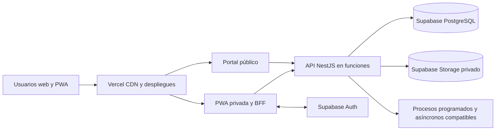

# ADR-015 — Vercel, Supabase y estrategia de entornos

- Estado: aceptada para implementación.
- Fecha: 18/08/2026.
- Responsable: Tech Lead; aprueban Dirección ICE24, Seguridad/Privacidad y Operación.

## Decisión

Adoptar **Vercel** como plataforma de hosting y despliegue y **Supabase** como plataforma administrada para PostgreSQL, autenticación y almacenamiento de objetos. El límite operativo aceptado es de **$2,000 MXN al mes** (aproximadamente USD 115 al mes), incluidas las herramientas de desarrollo contempladas por la propuesta financiera.

Las superficies web usarán Next.js en Vercel. La API NestJS se desplegará mediante funciones compatibles con Vercel, conservando REST/OpenAPI y los límites del monolito modular. Los procesos asíncronos deberán diseñarse dentro de los límites de ejecución de la plataforma; cualquier cola, worker persistente o servicio adicional requiere evaluación presupuestaria y un ADR antes de incorporarse.

Supabase proporcionará PostgreSQL, Auth, Row Level Security y Storage. PostgreSQL continúa como fuente de verdad; las reglas de negocio y la autorización por objeto permanecen en servidor y RLS funciona como defensa adicional, no como sustituto de la capa de aplicación.

## Entornos

| Entorno | Propósito | Datos | Aislamiento |
|---|---|---|---|
| Local | Desarrollo | Sintéticos | Servicios locales y proyecto de desarrollo controlado |
| CI | Pruebas efímeras | Fábricas y sintéticos | Dependencias efímeras cuando aplique |
| Preview | Validación por cambio | Sintéticos | Preview Deployment de Vercel; sin secretos productivos |
| Staging | Pruebas de release | Anonimizados o sintéticos | Proyecto Vercel y proyecto Supabase no productivos |
| Production | Piloto y operación | Reales | Proyectos Vercel y Supabase productivos con mínimo privilegio |

Producción y no producción utilizan proyectos separados. Los secretos se administran mediante variables protegidas de cada plataforma y nunca se almacenan en Git. Las migraciones de base de datos se versionan y se promueven mediante CI con revisión humana.

## Presupuesto aceptado

| Concepto | Prototipo o MVP | Producción comercial |
|---|---:|---:|
| Herramienta de programación con IA | USD 20/mes | USD 20/mes |
| Vercel | Hobby, USD 0 mientras sea compatible | Pro, USD 20/mes |
| Supabase | Free, USD 0 mientras sea compatible | Pro, USD 25/mes cuando capacidad o continuidad lo exijan |
| Dominio y DNS | Aproximadamente USD 12–15/año | Aproximadamente USD 12–15/año |
| Correo, monitoreo y analítica | Capas gratuitas | Escalamiento sólo con aprobación dentro del remanente |
| Tope operativo total | **$2,000 MXN/mes** | **$2,000 MXN/mes** |

Stripe conserva costo variable por transacción y debe reportarse por separado del gasto fijo, sin ocultar su impacto financiero. Los precios, impuestos, tipo de cambio, límites y términos comerciales deben verificarse antes de contratar.

Se configurarán alertas al 50%, 80% y 100% del tope. Ningún servicio podrá escalar automáticamente a un plan que exceda el presupuesto autorizado.

## Reglas de escalamiento

- Vercel Hobby sólo se utiliza mientras sus términos permitan el uso previsto; al monetizar se migra a Pro.
- Supabase Free se conserva mientras capacidad, continuidad, seguridad y términos sean suficientes; se activa Pro cuando cualquiera de esos criterios lo exija.
- Un nuevo proveedor o plan pagado requiere estimación del costo mensual total y confirmación de que cabe dentro del tope.
- Si el consumo proyectado supera $2,000 MXN al mes, se requiere aprobación presupuestaria antes de ampliar capacidad.
- Caché, rate limiting y optimización se aplican con medición y sin debilitar seguridad, integridad ni auditoría.

## Alternativas descartadas

- AWS: mayor complejidad operativa y costo fijo para el piloto.
- Render o DigitalOcean: no corresponden a la propuesta presupuestaria aprobada.
- Kubernetes: complejidad operativa prematura.
- Una VM única: mezcla fallos, despliegues, escalado y seguridad.

## Consecuencias y riesgos

- Existe dependencia de Vercel y Supabase, mitigada mediante PostgreSQL estándar, REST/OpenAPI y adaptadores para servicios externos.
- Los límites de funciones pueden afectar PDF, importaciones y trabajos largos; deberán probarse antes de cada fase que los requiera.
- Las capas gratuitas pueden pausar, limitar o cambiar capacidad; producción requiere monitoreo y un plan de transición.
- La residencia y transferencia internacional de datos requieren revisión de Seguridad/Privacidad y Legal.
- Las capacidades comerciales y precios deben verificarse con documentación vigente antes del alta.

Fuentes: TRD 18–20 y 80; Architecture 50 y 59; `context/SaaS_Budget_Limits_Architecture.md`.
