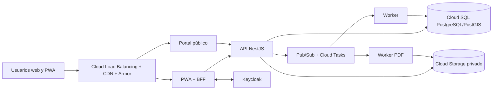

# ADR-015 — Google Cloud, región y entornos

- Estado: propuesta aceptada como línea base de implementación; pendiente presupuesto y privacidad.
- Fecha: 17/08/2026.
- Responsable: Tech Lead; aprueban Dirección ICE24, Seguridad/Privacidad y Operación.

## Decisión

Usar Google Cloud como proveedor y `northamerica-south1` (México) como región primaria. Google publica Cloud Run en México y ofrece en la región los servicios base necesarios, incluidos Cloud SQL, Cloud Storage, KMS, Secret Manager y red privada. Cloud Run cobra por uso y puede escalar a cero, reduciendo el costo fijo del piloto.

Desplegables: PWA+BFF, portal público y API como servicios Cloud Run; workers generales y PDF como Cloud Run Jobs o servicios activados por eventos; Keycloak como servicio Cloud Run con una instancia mínima. Datos en Cloud SQL PostgreSQL/PostGIS; binarios privados en Cloud Storage; mensajería con Pub/Sub y Cloud Tasks; programación con Cloud Scheduler; imágenes en Artifact Registry; borde mediante HTTPS Load Balancing, Cloud CDN y Cloud Armor; telemetría OpenTelemetry hacia Cloud Logging, Monitoring y Trace.

## Entornos

| Entorno | Propósito | Datos | Aislamiento |
|---|---|---|---|
| Local | desarrollo | sintéticos | Docker Compose |
| CI | pruebas efímeras | fábricas/sintéticos | Testcontainers |
| Development | integración continua accesible por URL | sintéticos | proyecto GCP no productivo |
| Staging | réplica funcional y pruebas de release | anonimizados/sintéticos | proyecto GCP no productivo, recursos separados |
| Production | piloto y operación | reales | proyecto GCP productivo, mínimo privilegio y Cloud SQL HA |

Producción y no producción estarán en proyectos GCP distintos bajo una organización y cuenta de facturación controladas. Terraform será la única vía normal de crear infraestructura; CI promoverá una misma imagen inmutable desde Artifact Registry. Development y staging usarán escala a cero donde sea seguro. Ningún secreto vive en Git.

Dominios candidatos, sujetos a compra: `app.<dominio>`, `api.<dominio>`, `public.<dominio>`, `auth.<dominio>` y `files.<dominio>`. Los enlaces de archivo siempre serán temporales.

## Presupuesto de control

Para piloto se adopta un tope provisional de **USD 400/mes** en producción y **USD 150/mes** combinados para development/staging, excluyendo soporte empresarial, impuestos y crecimiento extraordinario. El objetivo operativo es mantenerse entre USD 100 y 300 mensuales durante el piloto. Antes de aprovisionar se requiere una estimación en Google Cloud Pricing Calculator y presupuestos con alertas al 50%, 80% y 100%. No es una cotización.

## Alternativas descartadas

- AWS México: arquitectura sólida, pero ECS/Fargate, balanceadores y red introducen mayor costo fijo y operación para el piloto.
- Render/DigitalOcean: simples para una demo, pero con menor integración regional para colas, secretos, observabilidad, IAM e infraestructura reproducible.
- Vercel más servicios dispersos: fragmenta API, workers, Keycloak, red privada e IaC.
- Kubernetes/GKE: complejidad operativa prematura.
- Una VM única: barata, pero mezcla fallos, despliegues, escalado y seguridad.

## Consecuencias y riesgos

- Existe dependencia GCP, mitigada con contenedores, PostgreSQL, OpenTelemetry y adaptadores.
- Cloud SQL y la instancia mínima de Keycloak representan la mayor parte del costo persistente.
- El escalado a cero puede añadir latencia al primer request; API y portal se ajustarán según mediciones.
- Se debe validar disponibilidad, cuota y precio regional de cada servicio antes de Fase 2.
- Google Cloud no aporta correo transaccional ni escaneo de objetos como servicio equivalente; ADR-019 define proveedores portables.

Fuentes: TRD 18–20 y 80; Architecture 50 y 59; [ubicaciones de Google Cloud](https://cloud.google.com/about/locations); [precios y escalado de Cloud Run](https://cloud.google.com/run/pricing); [PostGIS en Cloud SQL](https://docs.cloud.google.com/sql/docs/postgres/extensions).
