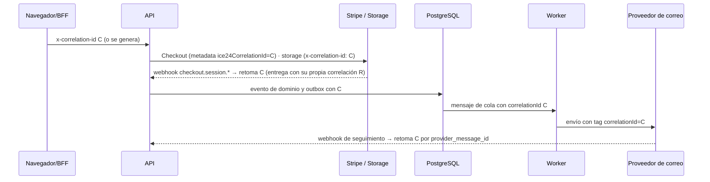

# Logs de integración con correlación (F5-14)

Ownership: plataforma. Fuentes: TASKS F5-14; PRD RF-ADM-009 (ICE24 consulta logs de integraciones), RF-AUD-004 (correlación entre servicios), RF-AUD-008 y RNF-PER-005 (retención configurable), RNF-OBS-002 y RNF-OBS-003 (correlación común; investigar Stripe, correo, almacenamiento y PDF), RSK-13; TRD 52.2 (logs técnicos, distintos de la auditoría), 53 (campos) y 54 (datos prohibidos). Operación en el [runbook de observabilidad](../runbooks/observability.md); reporte en [F5-14](../tasks/task-f5-14.md).

## Correlación de extremo a extremo

- **API:** `CorrelationMiddleware` acepta un `x-correlation-id` UUID válido o genera uno, lo devuelve en la respuesta y abre el contexto de integración de la petición (`withIntegrationContext`). Los adaptadores lo leen sin parámetros nuevos.
- **Encabezados salientes:** `correlationHeaders()` agrega `x-correlation-id` a las llamadas HTTP a Supabase Storage. El SDK de Stripe no admite encabezados propios; la correlación viaja en la metadata de la sesión de Checkout (`ice24CorrelationId`), **no** en la de la suscripción, porque las renovaciones posteriores no forman parte de esa petición.
- **Mensajes:** el outbox ya guardaba la correlación del productor. Los mensajes de `domain_events`, `email_deliveries`, `file_scans` y `scheduled_tasks` llevan `correlationId`. Cada procesador del worker ejecuta la entrega dentro de su contexto (correlación, cuenta, intento = `read_ct`, trabajo).
- **Webhooks de vuelta:** un evento `checkout.session.*` firmado retoma la correlación de la metadata, que queda en el recibo, la reconciliación, la auditoría y el outbox. Los demás eventos de Stripe conservan la correlación de su primera entrega. El seguimiento de correo retoma la correlación del mensaje enviado (`email.messages.correlation_id` por `provider_message_id`). La correlación de la entrega HTTP se guarda como `request_correlation_id`, y la consulta por correlación encuentra ambas.

## Almacén

Migración aditiva `20261006000100_phase5_integration_logs.sql`, tabla `infra.integration_logs`:

| Campo                                                              | Contenido                                                                                                                                                                                                                                            |
| ------------------------------------------------------------------ | ---------------------------------------------------------------------------------------------------------------------------------------------------------------------------------------------------------------------------------------------------- |
| `integration`                                                      | `stripe`, `email`, `object_storage`, `queue`, `antimalware`, `pdf` (sin adaptador todavía; F10-08 debe usar el mismo wrapper)                                                                                                                        |
| `operation`, `direction`, `provider`                               | p. ej. `checkout.session.create` / `OUTBOUND` / `stripe`; `webhook.receive` / `INBOUND`; `message.consume` / `pgmq`                                                                                                                                  |
| `status`, `latency_ms`, `response_code`, `error_code`, `retryable` | Resultado; estado HTTP o código del proveedor (`200`, `500`, `card_declined`, `INFECTED`); código diagnóstico obligatorio si falla                                                                                                                   |
| `attempt`, `effect_key`                                            | Intento (lectura de cola, entregas del webhook) y efecto (clave de idempotencia, id de mensaje o evento, objeto). `unique (integration, operation, effect_key, attempt)`: un reintento es una fila nueva y la repetición del mismo intento se ignora |
| `correlation_id`, `request_correlation_id`, `account_id`, `job_id` | Trazabilidad. `job_id` enlaza con el Centro de trabajos para reprocesar (INT-004)                                                                                                                                                                    |
| `details`                                                          | Escalares redactados, como máximo 20 claves (cola, bucket, tipo de evento, plantilla, tamaño, resultado)                                                                                                                                             |

Es append-only (triggers `55000`) salvo la purga de retención. No es auditoría de negocio: las acciones auditables siguen en `audit.events`.

**Privacidad (TRD 54).** La redacción ocurre dos veces:

1. `redactIntegrationDetails` en `@ice24/observability` descarta las claves prohibidas (autorización, cookies, contraseñas, secretos, tokens, correo, teléfono, tarjeta, firma, contenido, cuerpo, payload, URL, dirección) y los valores anidados. En los textos reemplaza URLs, rutas firmadas, tokens Bearer y JWT, llaves de Stripe, números que pasan Luhn (dejando intactos los UUID) y direcciones de correo.
2. La restricción `integration_logs_no_sensitive` rechaza (`23514`) cualquier URL, ruta `/object/sign`, llave `sk_`/`rk_`/`pk_`/`whsec_`, Bearer o JWT en `details` o `effect_key`, además de cualquier objeto o arreglo anidado.

Nunca se guardan URLs firmadas ni públicas, contenido de archivos, cuerpos de correo, direcciones ni datos de tarjeta. El código de error es un identificador, nunca un mensaje.

## Wrapper común

`createIntegrationTracer({ service, environment, sink })` en `@ice24/observability`:

- `trace(call, work)` mide la llamada, registra éxito o fallo (con `onSuccess` y `onError` para el código de respuesta y el código diagnóstico) y devuelve o relanza el resultado original.
- `record(call)` registra entradas cuyo resultado ya se conoce: webhooks y entregas de cola.
- Métricas: `ice24.integration.calls` {integration, operation, status} e `ice24.integration.duration` (ms). Los fallos además dejan un log `integration_call_failed`.
- Un fallo del almacén nunca rompe la integración: se cuenta en `ice24.integration.log_failures` y deja el log `INTEGRATION_LOG_UNAVAILABLE`.
- `createSqlIntegrationLogSink(client)` escribe con `infra.record_integration_log` usando cualquier cliente compatible con `pg`.

| Adaptador                      | Dónde                                                                                 | Operaciones                                                                                                                                     |
| ------------------------------ | ------------------------------------------------------------------------------------- | ----------------------------------------------------------------------------------------------------------------------------------------------- |
| Stripe (API)                   | `StripeSubscriptionGateway.call`                                                      | `checkout.session.create`, `portal.session.create`, `subscription.retrieve`, `subscription.cancellation.update`; efecto = clave de idempotencia |
| Webhook Stripe                 | `WebhooksService`                                                                     | `webhook.receive` INBOUND; efecto = id del evento; intento = entregas                                                                           |
| Storage (API)                  | `SupabaseObjectStorage`                                                               | `upload.sign`, `object.stat`, `read.sign`; cuenta = primer segmento de la llave                                                                 |
| Storage y antimalware (worker) | `tracedScanStorage`, `tracedScanner`                                                  | `object.download`, `object.upload`, `object.remove`, `file.scan` (veredicto, sin firma de amenaza)                                              |
| Correo (worker)                | `tracedEmailProvider`                                                                 | `message.send`; efecto = id del mensaje (la misma clave de idempotencia del proveedor)                                                          |
| Webhook de correo              | `EmailWebhooksService`                                                                | `webhook.receive` INBOUND; efecto = proveedor + id del evento                                                                                   |
| Cola                           | `observeDelivery` en `domain-events`, `file-scans`, `email-deliveries` y el scheduler | `message.consume`; efecto = cola + id del mensaje; intento = `read_ct`                                                                          |
| Stripe (reconciliación F5-13)  | `tracedObservationSource`                                                             | `subscription.retrieve` (fuente falsa hasta validar el adaptador remoto)                                                                        |
| PDF                            | Pendiente (F10-08)                                                                    | Debe envolver su adaptador con `tracer.trace({ integration: "pdf", ... })`                                                                      |

En la API, `IntegrationLogsModule` es global y provee `INTEGRATION_TRACER`. Sin `DATABASE_URL` conserva métricas y logs. Los adaptadores construidos fuera de Nest usan `metricsOnlyTracer()`. En el worker, `main.ts` crea el tracer con el pool y decora los adaptadores en la raíz de composición.

## Consulta de diagnóstico

`GET /api/v1/admin/integration-logs` admite los filtros `correlationId`, `integration`, `status`, `direction`, `accountId`, `from`, `to`, `cursor` y `limit` (1–100). Ordena por `occurredAt` descendente y pagina por cursor.

- Permiso `integration-logs.read` (clasificación RESTRICTED, solo rol IA) con MFA, revalidado en el servicio.
- Con ámbito de cuenta completo (`accountWide`), ICE24 consulta todas las cuentas. Con cualquier otro ámbito solo ve la cuenta del contexto activo, y los filtros nunca amplían ese ámbito.
- Respuesta `no-store`, errores normalizados con correlación (400, 401, 403) y proyección explícita de columnas redactadas.

El PRD no pide mostrar diagnóstico en `/subscription` (RF-ADM-009 es una capacidad de ICE24), así que `apps/private-web/src/features/subscription` no cambia. La pantalla administrativa corresponde a F5-15.

## Retención y alertas

- `infra.purge_integration_logs(dias, lote)` borra por lotes las filas más antiguas que el periodo.
- La tarea `observability.integration-log-retention` (diaria a las 04:30 en America/Mexico_City) solo se registra si `INTEGRATION_LOG_RETENTION_DAYS` está entre 1 y 3650. La provee `infra/terraform/modules/observability` (`integration_log_retention_days`, por defecto `null`). No se asume ningún periodo: la pregunta 92 del PRD y DEC-008 siguen abiertas.
- Alertas portables (`integration_alerts` y `infra/observability/dashboard.json`): `integration-failures-elevated` (más de 5 % de fallos en 15 min), `stripe-webhook-failing` y `integration-log-store-failing`. Son umbrales técnicos iniciales hasta aprobar los SLO (DEC-007).
