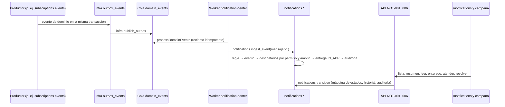

# Centro de notificaciones y alertas persistentes

Ownership: plataforma. Fuente de requisitos: TASK-F5-11; PRD RF-ALT-001, RF-ALT-005 a RF-ALT-007, RF-ALT-011 y RF-ALT-012; Database `notification_events`, `notification_recipients` y `notification_delivery_attempts`; API `Notification` y NOT-001 a NOT-006; UI/UX 14.17, 21.6 y 26. Operación en el [runbook de notificaciones](../runbooks/notifications.md).

## Flujo



1. **Reglas.** `notifications.event_rules` (espejo de `NOTIFICATION_EVENT_RULES` en `@ice24/contracts`) define qué eventos de dominio crean alertas, su tipo estable, prioridad, texto fijo y seguro (nunca se copia el payload), permiso de audiencia, condición vinculada y enlace de acción.

   | Evento de dominio         | Tipo                          | Prioridad | Audiencia                       | Condición             |
   | ------------------------- | ----------------------------- | --------- | ------------------------------- | --------------------- |
   | `PaymentFailed`           | `subscription.payment_failed` | CRITICAL  | `notifications.billing-alerts`  | Pago pendiente        |
   | `EnterReadOnly`           | `subscription.read_only`      | CRITICAL  | `notifications.billing-alerts`  | Pago pendiente        |
   | `FileSecurityAlertRaised` | `files.security_alert`        | HIGH      | `notifications.security-alerts` | Bytes aún no purgados |

2. **Ingesta (worker).** El consumidor `notification-center` (registrado en `apps/worker/src/consumers/index.ts`) llama `notifications.ingest_event` dentro de la transacción de reclamo de F5-06. La función es idempotente por evento de origen (`origin_event_id` único): una entrega repetida no duplica alertas.
3. **Destinatarios.** Usuarios activos con membresía activa en la cuenta, permiso de audiencia efectivo (ALLOW por rol o excepción y ningún DENY vigente) y ámbito que cubra el evento: los eventos de cuenta requieren ámbito de cuenta; los de sucursal o máquina (alertas de archivo heredan el vínculo del archivo) también llegan a usuarios con ese ámbito. Cada destinatario recibe su propio estado y un intento `IN_APP` `DELIVERED`. Se audita `NotificationCreated` (actor `SYSTEM`, origen `WORKER`) con el número de destinatarios, incluso si es cero.
4. **Estados por destinatario.**

   ```mermaid
   stateDiagram-v2
     [*] --> UNREAD
     UNREAD --> READ: leer
     UNREAD --> ACKNOWLEDGED: enterado
     READ --> ACKNOWLEDGED: enterado
     UNREAD --> IN_PROGRESS: atender
     READ --> IN_PROGRESS: atender
     ACKNOWLEDGED --> IN_PROGRESS: atender
     ACKNOWLEDGED --> RESOLVED: resolver (condición cerrada)
     IN_PROGRESS --> RESOLVED: resolver (condición cerrada)
   ```

   - Leer nunca marca enterado; las críticas siguen fijadas (`pinned`) hasta «Enterado» (RF-ALT-006).
   - Enterado nunca resuelve (RF-ALT-007). Atender implica enterado y exige vincular un recurso de la misma cuenta.
   - Resolver exige estado enterado o en atención, un `resolutionResource` de la misma cuenta y la condición vinculada cerrada; si sigue abierta responde 409 `RELATED_CONDITION_NOT_RESOLVED` (RF-ALT-012).
   - Repetir «leer» o «enterado» sobre un estado ya alcanzado no registra nada; la misma `Idempotency-Key` devuelve el mismo resultado y reutilizarla para otra acción responde 409 `IDEMPOTENCY_CONFLICT`.
   - Cada cambio queda en `notifications.recipient_transitions` (acción, estados, actor, contexto, recurso, clave, correlación) y en `audit.events` (`NotificationRead`, `NotificationAcknowledged`, `NotificationAttentionStarted`, `NotificationResolved`) (RF-ALT-011).

## Datos

| Tabla                                          | Contenido                                                                                                                                                                    |
| ---------------------------------------------- | ---------------------------------------------------------------------------------------------------------------------------------------------------------------------------- |
| `notifications.event_rules`                    | Catálogo de reglas (arriba).                                                                                                                                                 |
| `notifications.notification_events`            | Database `notification_events` más `origin_event_id`/`origin_event_type`, `condition_kind` y correlación. Inmutable.                                                         |
| `notifications.notification_recipients`        | Database `notification_recipients` más cuenta, recursos de atención y resolución, `updated_by` y `row_version`. Trigger de avance único; restricciones atan estado y fechas. |
| `notifications.recipient_transitions`          | Historial append-only por destinatario, único por (`recipient_id`, `idempotency_key`).                                                                                       |
| `notifications.notification_delivery_attempts` | Database `notification_delivery_attempts` por canal. F5-11 registra `IN_APP`; correo (F5-12) y navegador agregan filas.                                                      |

Recursos vinculables (`relatedResource`, `resolutionResource`): `subscription`, `file`, `job`, `branch` y `machine`, siempre validados contra la cuenta activa. Órdenes, tickets y acciones correctivas se agregarán al enum cuando existan sus módulos.

## API y permisos

| Ruta                                              | Permiso                | Respuesta y errores                                                                                                       |
| ------------------------------------------------- | ---------------------- | ------------------------------------------------------------------------------------------------------------------------- |
| `GET /api/v1/notifications`                       | `notifications.read`   | 200 `CursorPage<Notification>`. Filtros `status`, `priority`, `type`, `pinned`, `unacknowledged`, `cursor`, `limit`. 400. |
| `GET /api/v1/notifications/summary`               | `notifications.read`   | 200 `{badge, unread, pinned, acknowledged, inProgress, resolved}` (aditivo).                                              |
| `GET /api/v1/notifications/{id}`                  | `notifications.read`   | 200 `Notification` (no marca leída). 404 si no es propia o de otra cuenta.                                                |
| `POST /api/v1/notifications/{id}/read`            | `notifications.attend` | 200. 409 `IDEMPOTENCY_CONFLICT`.                                                                                          |
| `POST /api/v1/notifications/{id}/acknowledge`     | `notifications.attend` | 200. 409 `STATE_TRANSITION_INVALID`.                                                                                      |
| `POST /api/v1/notifications/{id}/start-attention` | `notifications.attend` | 200 con `{relatedResource}`. 400 recurso inválido o ajeno. 409.                                                           |
| `POST /api/v1/notifications/{id}/resolve`         | `notifications.attend` | 200 con `{resolutionResource}`. 409 `RELATED_CONDITION_NOT_RESOLVED` o `STATE_TRANSITION_INVALID`.                        |

- El destinatario siempre es el usuario autenticado y la cuenta, la del contexto activo; nunca vienen del cliente. Lo ajeno responde 404.
- Todas las transiciones exigen `Idempotency-Key`.
- `notifications.read` y `notifications.attend`: IA, IO, OW, TC, OP, SA y AU. Audiencias: `notifications.billing-alerts` y `notifications.security-alerts` para IA y OW; se amplían o restringen por excepción de membresía.
- **Modo solo lectura.** Las transiciones cambian sólo el estado propio del aviso, no registros de la cuenta: se autorizan como operación `READ` del permiso `notifications.attend` y se permiten con `AllowReadOnlyOperation("notification-attention")`. Así la alerta «Cuenta en modo solo lectura» puede marcarse enterado. En cuentas suspendidas se rechazan.
- `Notification` agrega (aditivo a API.md) `action`, `occurredAt`, fechas de cada estado, `attentionResource`, `resolutionResource` y `conditionOpen`. `audit.createdBy` usa la identidad técnica `SYSTEM_ACTOR_ID`; `escalationLevel` es 0 hasta F8-14.

## Interfaz

- `/notifications` (UI-ALT-01 «Centro de alertas»): resumen «N críticas sin enterado · N en atención · N resueltas», sección fija «Críticas sin enterado», filtros Todas, Críticas, No enteradas, En atención y Resueltas, tarjetas con prioridad y estado escritos (no sólo color), tiempo transcurrido, «Ver detalle» (marca leída, nunca enterado), «Marcar enterado», «Atender», «Marcar resuelta» (deshabilitada con explicación mientras la causa siga abierta) y enlace de acción. Explica la diferencia entre «Enterado» y «Resuelta».
- Campana en el espacio de trabajo: el badge cuenta alertas relevantes (no leídas más críticas fijadas), no el historial.
- Indicadores en vivo: el resumen y las listas se actualizan cada 30 s mientras la pestaña está visible y al volver a ella. Push del navegador y SSE quedan fuera de F5-11.
- BFF `/api/notifications` (lista o `view=summary`) y `/api/notifications/{id}/{read|acknowledge|start-attention|resolve}` con sesión, contexto de pestaña, CSRF e `Idempotency-Key`; mensajes en español por código, sin eco del upstream.

## Agregar una regla

Migración que inserte en `notifications.event_rules` (con su permiso de audiencia y, si aplica, un `condition_kind` implementado en `notifications.condition_open`), la entrada en `NOTIFICATION_EVENT_RULES` y la actualización de pgTAP y de esta tabla en el mismo cambio. El consumidor se suscribe automáticamente a las claves del catálogo.
