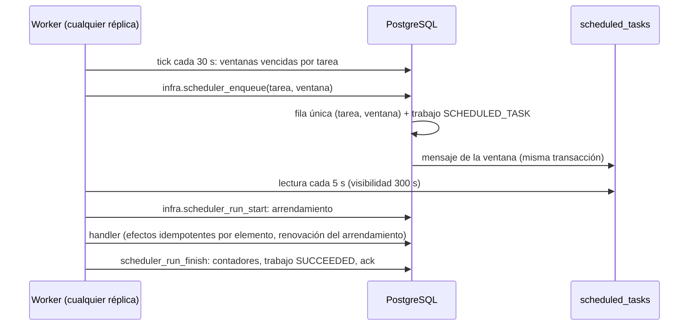

# Scheduler — vencimientos, periodos de reporte y reconciliaciones (F5-13)

Ownership: plataforma; las tareas de suscripción pertenecen al módulo de [suscripciones](subscriptions.md). Fuentes: TASKS F5-13, TRD «Scheduler» (disparar reportes programados, expiraciones y reconciliaciones), Architecture §§ 262, 814 y 1016 («ejecución observable e idempotente»), PRD RF-SUB-006/007/012, RF-RPT-003/004, RF-INT-008 y RNF-OBS-001. Operación en el [runbook](../runbooks/scheduler.md); reporte en [F5-13](../tasks/task-f5-13.md).

## Modelo

- **Registro declarativo** (`apps/worker/src/processors/scheduler/tasks.ts`): cada tarea declara nombre (`modulo.tarea`), programación cron de cinco campos o intervalo fijo, zona IANA explícita, límite de recuperación (`catchUpWindows`) y handler. Se valida al arrancar: nombres únicos, zona conocida (nunca la del servidor) y cron que dispara.
- **Ventana**: periodo `[inicio, fin)` que se cierra en una hora de disparo; su clave es el instante UTC de cierre. Los intervalos se alinean a la época Unix; el cron se evalúa en la zona de la tarea, salta horas inexistentes por cambio de horario y toma la primera de una hora repetida.
- **Idempotencia por ventana**: `infra.scheduler_windows` tiene `unique (task_name, window_key)`. Si varios workers ejecutan el tick a la vez, solo uno crea la ventana, su trabajo y su mensaje (`ENQUEUED`); los demás reciben `EXISTS`.
- **Exclusión mutua**: el arrendamiento (`lease_owner`, `lease_expires_at`) se toma con bloqueo de fila. Con un arrendamiento vigente de otro worker, `run_start` responde `BUSY` y el mensaje se deja. La visibilidad de la cola (300 s) coincide con el arrendamiento; el handler lo renueva entre lotes con `heartbeat()`.
- **Recuperación tras caída**: si el worker muere, el arrendamiento vence y la cola vuelve a entregar el mensaje. Otro worker toma la ventana (`recovered_count + 1` y transición `RUNNING` con código `LEASE_EXPIRED`). Los efectos ya confirmados no se repiten porque cada handler revalida el estado por elemento. El worker anterior ya no puede renovar ni registrar resultado (`LEASE_LOST`).
- **Ventanas omitidas**: tras una caída o una pausa se ejecutan solo las `catchUpWindows` más recientes. Las anteriores se cuentan en la métrica `ice24.scheduler.windows.skipped` y el log `scheduled_windows_skipped`; nunca se descartan en silencio. La primera ejecución de una tarea empieza en la última ventana cerrada, sin retroactivos.

Estados de ventana: `QUEUED → RUNNING → SUCCEEDED`, `RUNNING → RETRY_WAIT → RUNNING` y `RUNNING → FAILED` (DLQ). Una ventana `SUCCEEDED` no vuelve a ejecutarse (trigger `IC409`); no se borra (trigger `55000`).

## Integración con el registro de trabajos (F5-07)

Cada ventana tiene un trabajo `job_type = SCHEDULED_TASK`, `source_type = ScheduledWindow`, `event_type = <tarea>` y la correlación de la ventana. Sus transiciones quedan en `infra.async_job_transitions`. Un fallo usa `infra.fail_job` (backoff de 15 s × 2ⁿ con tope de 15 min, 5 intentos) y, al agotarse, pasa a `scheduled_tasks_dlq`, con la ventana en `FAILED` y el trabajo en `DEAD_LETTER`. Soporte lo ve en el Centro de trabajos y lo reencola con motivo auditado (INT-004). La ventana vuelve a ejecutarse con el mismo identificador, y por eso los efectos no se duplican.

## Tareas

| Tarea                                 | Programación y zona                     | Recuperación | Efecto                                                                                                                                                                 |
| ------------------------------------- | --------------------------------------- | ------------ | ---------------------------------------------------------------------------------------------------------------------------------------------------------------------- |
| `subscriptions.expirations`           | cada 5 min, UTC                         | 1            | `subscriptions.expire_due`: demo vencida → `read_only` (`DEMO_EXPIRED`); cancelación programada con periodo pagado terminado → `cancelled` (`SUBSCRIPTION_CANCELLED`). |
| `reports.weekly-period`               | `0 0 * * 1`, America/Mexico_City        | 4            | Publica `ReportPeriodClosed` (`WEEKLY`).                                                                                                                               |
| `reports.monthly-period`              | `0 0 1 * *`, America/Mexico_City        | 3            | Publica `ReportPeriodClosed` (`MONTHLY`).                                                                                                                              |
| `reports.quarterly-period`            | `0 0 1 1,4,7,10 *`, America/Mexico_City | 2            | Publica `ReportPeriodClosed` (`QUARTERLY`).                                                                                                                            |
| `reports.yearly-period`               | `0 0 1 1 *`, America/Mexico_City        | 1            | Publica `ReportPeriodClosed` (`YEARLY`).                                                                                                                               |
| `subscriptions.stripe-reconciliation` | `0 3 * * *`, America/Mexico_City        | 1            | Compara con el proveedor y registra hallazgos. **No registrada** hasta validar el adaptador Stripe (ver abajo).                                                        |

**Vencimientos.** `subscriptions.effective_access` ya restringe por reloj (F5-01/F5-03); la tarea materializa estado, historial, auditoría central y outbox con las reglas del comando `expire` del dominio. Cada fila se bloquea (`for update skip locked`) y se revalida su estado previo. Las suscripciones activas, las demos vigentes y las cancelaciones con periodo pagado vigente no se tocan. El actor es `SYSTEM` (sin usuario ni contexto) y la auditoría central registra origen `WORKER`. Los eventos `DemoExpired` y `SubscriptionCancelled` no tienen regla de aviso y, por tanto, no generan notificaciones ni correos. No hay periodo de gracia, borrado ni plazo de retención (DEC-017, DEC-008).

**Periodos de reporte.** RF-RPT-003 pide reportes semanales, mensuales, trimestrales o anuales. La tarea solo cierra el periodo y publica `ReportPeriodClosed` en el outbox con el id de la ventana como id del evento, para que un reintento no lo publique dos veces. El payload es `{frequency, periodStart, periodEnd, timeZone, task}`, sin cuenta ni destinatarios. La elección de reportes, cuentas y destinatarios y la generación del PDF pertenecen a TASK-F10-09, que consumirá el evento y pedirá el envío con `email.request` (F5-12, solo usuarios registrados). Hoy ningún consumidor está suscrito y el evento se confirma sin efecto. La zona es la predeterminada de identidad (`America/Mexico_City`); las zonas por cuenta corresponden a F10-09.

**Reconciliación con Stripe.** El puerto `SubscriptionObservationSource` devuelve observaciones con la forma de `ProviderSubscriptionSnapshot` (F5-02). `compareSubscription` contrasta estado, cancelación al fin del periodo, fin del periodo e importe, y detecta suscripciones ajenas o inexistentes. Los hallazgos (`REMOTE_NOT_FOUND`, `OWNERSHIP_MISMATCH`, `STATUS_MISMATCH`, `PERIOD_MISMATCH`, `CANCELLATION_MISMATCH`, `PRICE_MISMATCH`) se guardan en `subscriptions.reconciliation_findings`, append-only y únicos por ventana, suscripción y tipo, solo con campos comerciales normalizados. La tarea **no corrige**: los webhooks verificados siguen siendo la única vía que aplica el estado del proveedor (ADR-024). Procesa hasta 200 suscripciones por ventana, empezando por las revisadas hace más tiempo (`subscriptions.reconciliation_checks`). Si el proveedor no responde, la ventana falla con `STRIPE_UNAVAILABLE` y el reintento continúa con las que faltan. El adaptador real es `StripeSubscriptionGateway` de la API, cuya validación remota sigue pendiente (F5-02 AC-10). Por eso el worker no selecciona fuente desde el entorno, registra `stripe_reconciliation_disabled` y la tarea queda fuera del registro. Las pruebas usan `FakeSubscriptionObservationSource`.

## Persistencia

Migración aditiva `20261005000100_phase5_scheduler.sql`:

| Objeto                                                                                                                 | Descripción                                                                                                                                                                                              |
| ---------------------------------------------------------------------------------------------------------------------- | -------------------------------------------------------------------------------------------------------------------------------------------------------------------------------------------------------- |
| `infra.scheduler_windows`                                                                                              | Ventana, estado, arrendamiento, intentos, recuperaciones, código de error, contadores del handler, trabajo y correlación. Identidad inmutable; sin borrado.                                              |
| `infra.scheduler_task_controls`, `infra.scheduler_control_changes`                                                     | Pausa por tarea e historial append-only con motivo y solicitante (ticket o rol).                                                                                                                         |
| Cola `scheduled_tasks` / `scheduled_tasks_dlq`                                                                         | Política: visibilidad de 300 s y 5 intentos.                                                                                                                                                             |
| `infra.scheduler_*`                                                                                                    | `enqueue`, `run_start`, `renew_lease`, `run_finish`, `run_fail`, `set_paused`, `emit_report_period` y `record_task_scheduler_heartbeat` (latido `ice24_task_scheduler` en `infra.scheduler_heartbeats`). |
| `subscriptions.expire_due`, `state_json`                                                                               | Transiciones validadas e historial con el contrato `Subscription`.                                                                                                                                       |
| `subscriptions.reconciliation_checks`, `reconciliation_findings`, `reconciliation_candidates`, `record_reconciliation` | Avance y hallazgos de la reconciliación.                                                                                                                                                                 |
| Cambios compatibles                                                                                                    | `subscription_event_actor` admite `SYSTEM` (sin actor, contexto ni evento de proveedor); `audit.capture_domain_event` registra origen `WORKER` para eventos `SYSTEM` de suscripción.                     |

Todas las tablas tienen RLS y no conceden acceso a roles del navegador. El runtime solo lee y llama funciones `security definer` con `search_path` vacío.

## Observabilidad

`@ice24/observability` `createSchedulerObserver` registra estas métricas, cuyos atributos son solo nombres de tarea y códigos:

- `ice24.scheduler.runs` {task, outcome}
- `ice24.scheduler.failures` {task, error_code}
- `ice24.scheduler.run.duration` (ms) {task, outcome}
- `ice24.scheduler.windows.skipped` {task}

Logs del módulo `scheduler`: `scheduled_task_run` (resultado, duración, correlación, `recovered`), `scheduled_windows_skipped`, `scheduler_tick` (resumen con ventanas encoladas o pausadas), `SCHEDULER_TICK_FAILED`, `QUEUE_UNAVAILABLE` y `stripe_reconciliation_disabled`. Ni las métricas ni los logs incluyen payloads ni datos personales.
